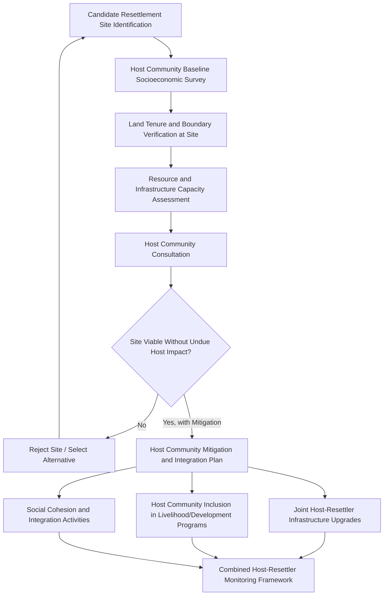

## Host Community Impacts and Integration

### Overview

Host communities are the populations residing at or near a resettlement site who are not themselves project-affected persons (PAPs) in the direct compensation sense, but who experience material impacts from the in-migration of a resettled population into or near their existing settlement. Host community impacts are among the most under-assessed dimensions of resettlement practice, because impact identification and entitlement frameworks are naturally oriented toward the displaced population — the group with a documented, quantifiable loss — while host communities' impacts are diffuse, indirect, and easy to omit from a Detailed Measurement Survey scoped around the acquisition footprint. Leading resettlement standards explicitly require host community consideration precisely because this omission is a well-documented, recurring failure mode.

This topic addresses why host communities require dedicated assessment, the categories of impact they typically experience, and the integration strategies used to manage social cohesion risk between resettled and host populations.

---

### Why Host Communities Require Dedicated Treatment

**Key Points**

- Host communities did not choose to receive an incoming population and do not directly benefit from project compensation, yet may bear real costs — competition for land, water, employment, and public services; strain on local infrastructure; and social/cultural friction with an unfamiliar incoming group.
- Because host community impacts arise from *someone else's* displacement rather than from direct project land acquisition, they fall outside the standard entitlement matrix logic built around the census/cut-off date of affected persons, requiring a separate, purpose-built assessment.
- Unmanaged host-resettler tension is a documented driver of resettlement program failure even when the resettled population's own entitlements are well designed and delivered — the success of resettlement depends on the receiving social system, not only on the displaced population's compensation package.

---

### Categories of Host Community Impact

**1. Resource Competition**

- Increased demand on land, water sources, grazing areas, forest products, and fishing grounds shared between host and resettled populations, potentially reducing per-capita resource availability for the host community.

**2. Infrastructure and Service Strain**

- Schools, health facilities, water supply systems, and roads sized for the pre-existing host population may become inadequate once the resettled population is added, with the host community bearing reduced service quality without having received compensation for the impact.

**3. Labor Market Effects**

- Both positive (increased local labor pool, new economic activity) and negative (increased competition for existing wage labor or market opportunities) effects, depending on local economic structure and the skill/livelihood profile of the resettled population.

**4. Land Tenure and Boundary Disputes**

- Where resettlement sites are developed on land with unclear or contested tenure, host community members with customary or informal claims to that land may experience their own uncompensated economic or access displacement — effectively creating a *secondary* resettlement impact that must itself be screened for under the physical/economic displacement framework covered earlier in this chapter.

**5. Social and Cultural Friction**

- Differences in ethnicity, religion, livelihood practices, or social norms between host and resettled populations can generate tension, particularly where the in-migrating population is perceived as receiving preferential treatment (new housing, compensation, program support) unavailable to the host community.

**6. Price and Market Effects**

- Localized inflation in land prices, rental rates, and basic goods driven by increased demand from the resettled population, disproportionately affecting host community members who are net buyers/renters rather than sellers.

---

### Host Community Impact Assessment Process

**Key Points**

- Host community baseline assessment should occur *before* site selection is finalized, functioning as one of the site selection criteria rather than a post-hoc mitigation exercise — this mirrors the avoidance-and-minimization principle from the foundational resettlement principles, applied to the receiving site rather than the source site.
- Where a candidate site would impose disproportionate, unmitigable host community impact, site rejection should be treated as a live option, not merely a theoretical one.

---

### Integration and Mitigation Strategies

**1. Infrastructure Upgrading Proportional to Combined Population**

- Water systems, schools, health facilities, and roads at the resettlement site should be sized (or upgraded) for the combined host-plus-resettled population, not merely the incoming resettled population, ensuring host community service levels are maintained or improved rather than diluted.

**2. Inclusion of Host Community in Development/Livelihood Programs**

- Where livelihood restoration or community development programs are established for resettled persons, extending eligibility (or an equivalent parallel program) to host community members reduces the perception of unequal treatment that commonly drives tension.

**3. Joint Consultation and Governance Structures**

- Including host community representatives in resettlement site planning committees and monitoring bodies (alongside the mechanisms established under institutional roles), giving the host population a formal voice rather than treating them as passive recipients of a decision made elsewhere.

**4. Social Cohesion Programming**

- Structured intercommunity activities, joint resource-management arrangements (e.g., shared water point committees), and clear, jointly-understood rules for shared resource access, designed to reduce friction during the adjustment period.

**5. Land Tenure Resolution Before Site Development**

- Formal verification and, where necessary, compensation or negotiated resolution of any host community customary/informal claims to resettlement site land *before* construction begins — treating this as its own mini-resettlement-principles application (eligibility regardless of title, compensation before displacement of use).

---

### Host Community Consideration in Site Selection Criteria

| Site Selection Criterion | Host Community Consideration |
| --- | --- |
| Land availability | Verify absence of unresolved host community tenure claims |
| Resource capacity | Assess water, land, and natural resource capacity for combined population, not just incoming population |
| Service infrastructure | Assess existing school/health/road capacity against combined population needs |
| Social compatibility | Consider ethnic, religious, and livelihood compatibility or planned integration measures where differences exist |
| Local economic structure | Assess labor market absorption capacity and potential price/wage effects |

---

### Monitoring Host Community Outcomes

- Host community monitoring indicators should mirror categories used for resettled populations where relevant (access to services, income trends, resource access) to allow direct before/after and host/resettler comparison, rather than treating host community monitoring as an afterthought with different, less rigorous metrics.
- Grievance mechanism access (established under the broader resettlement grievance framework) should be explicitly extended to host community members, not limited to registered project-affected persons, since host community grievances are a leading indicator of emerging social cohesion problems.

**Example**

A resettlement program relocates 400 households to a site adjacent to an existing host village of 150 households. The program includes a livelihood restoration package and new water infrastructure for the resettled population but does not extend water access improvements to the host village, whose existing single water point now serves a effectively larger combined population without added capacity. Within a year, disputes over water access between host and resettled households escalate to a level requiring external mediation — a conflict that traces directly to a site planning decision that sized infrastructure for the incoming population only, rather than the combined community the resettlement site actually created.

---

### Common Host Community Failure Modes

- **Treating host communities as outside the impact assessment boundary entirely**, since they are not "acquired" land or asset holders under the standard census/DMS process.
- **Sizing resettlement site infrastructure for the incoming population only**, degrading service levels for the pre-existing host population.
- **Excluding host communities from livelihood/development program eligibility**, generating a visible disparity between newly-arrived and long-standing residents.
- **Failing to resolve host community land tenure claims before site development**, effectively creating a second, unaddressed displacement impact.
- **No host community-specific grievance access or monitoring**, leaving emerging tension undetected until it escalates.

---

**Next Steps**

- Resettlement site selection and development standards
- Livelihood restoration planning and income restoration strategies
- Resettlement grievance redress mechanism design
- Land tenure and customary rights assessment methodology
- Institutional roles and responsibility for combined host-resettler program implementation
- Social cohesion and community relations monitoring frameworks