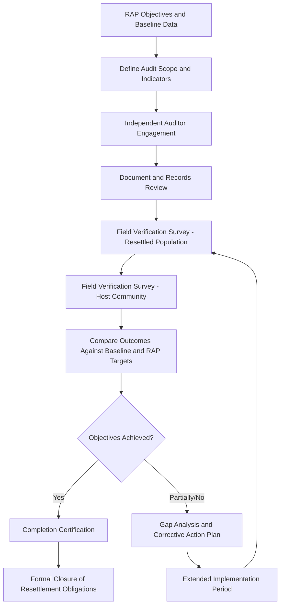
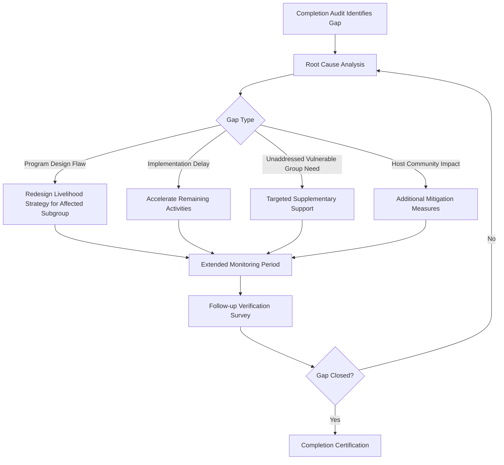

## Resettlement Completion Audits

### Overview

A resettlement completion audit is the formal, independent verification process that determines whether a Resettlement Action Plan has achieved its intended objectives — not merely whether its activities were carried out, but whether displaced persons' livelihoods and living standards have been restored, and whether host communities remain unharmed. It is the terminal instrument in the resettlement implementation chain established across this chapter: principles set the standard, the RAP operationalizes it, compensation and livelihood restoration deliver it, and the completion audit verifies it was actually achieved. Regulatory approving authorities and international lenders typically treat a satisfactory completion audit as the condition for formally closing out resettlement-related compliance obligations and, in project finance contexts, for releasing associated loan covenants or guarantee funds.

This topic covers when completion audits are triggered, their methodological requirements, the distinction between completion and closure, and how audit findings feed back into corrective action.

---

### Purpose and Distinguishing Features

**Key Points**

- A completion audit differs fundamentally from routine internal or Multi-Partite Monitoring Team (MMT) monitoring: monitoring is ongoing and largely process/output-focused (was compensation paid, was housing constructed), while a completion audit is a discrete, outcome-focused verification exercise conducted by an independent party at a defined point once implementation activities are substantially complete.
- The core audit question is not "were the RAP's activities implemented" but "were the RAP's *objectives* achieved" — specifically, whether affected persons' livelihoods and living standards have been restored to at least pre-displacement levels, consistent with the no-net-loss principle established at the start of this chapter.
- A completion audit is inherently retrospective and evidence-based, requiring comparison against the socioeconomic baseline established during the original RAP census — making baseline data quality (covered under RAP development) a direct determinant of audit reliability.

---

### When Completion Audits Are Triggered

- Typically conducted once physical resettlement (relocation, compensation disbursement, resettlement site infrastructure) is complete **and** a sufficient post-resettlement period has elapsed to allow livelihood restoration outcomes to be meaningfully assessed — not immediately upon physical relocation, since income restoration is a multi-year process as established under livelihood restoration planning.
- [Inference] A post-resettlement observation period of roughly two to five years before a completion audit is commonly used in leading practice to allow livelihood trends to stabilize and be reliably measured, though the specific interval is project- and standard-dependent and should be confirmed against the applicable lender or regulatory requirement.
- May be required as an explicit condition in the original RAP approval, a lender covenant, or a national regulatory closure requirement (e.g., before an Environmental Compliance Certificate's resettlement-related conditions can be considered discharged).

---

### Completion Audit Process

---

### Core Audit Components

**1. Document and Records Review**

- Verification of compensation payment records, disbursement documentation, grievance case logs, and monitoring reports against the RAP's committed activities and budget.

**2. Compliance Verification**

- Confirmation that resettlement was implemented in accordance with the approved RAP, applicable national law, and lender safeguard requirements — including verification that the sequencing principle (compensation and site readiness before displacement) was actually followed in practice, not just committed to on paper.

**3. Household-Level Outcome Survey**

- A statistically representative (ideally full-coverage where feasible) survey of resettled households, re-measuring the same socioeconomic indicators captured in the original baseline census: income, asset ownership, housing adequacy, access to services, food security.
- Requires the audit survey instrument to be methodologically comparable to the baseline instrument — using different indicators or measurement methods between baseline and audit undermines the validity of the before/after comparison.

**4. Livelihood Restoration Verification**

- Specific assessment of whether livelihood restoration strategies (per the Livelihood Restoration Plan) have achieved their income restoration objectives, disaggregated by livelihood strategy type and by vulnerable group, since aggregate restoration figures can mask systematic under-performance for specific subgroups.

**5. Vulnerable Group Outcome Assessment**

- Distinct analysis of outcomes for groups identified as vulnerable during RAP preparation (female-headed households, elderly, indigenous peoples, landless laborers), since these groups are documented to be at higher risk of incomplete restoration even where aggregate program indicators appear satisfactory.

**6. Host Community Impact Verification**

- Assessment of whether host community impacts (per the host community impacts framework) were adequately mitigated, and whether host-resettler social cohesion has stabilized — an often-omitted audit component that mirrors the frequent omission of host communities from impact identification in the first place.

**7. Grievance Resolution Review**

- Analysis of grievance case logs: volume, resolution rate, resolution timeliness, and whether unresolved or recurring grievance patterns indicate systemic (rather than isolated) implementation shortfalls.

**8. Stakeholder Consultation**

- Direct engagement with affected persons, host community representatives, and local government during the audit process — not relying solely on quantitative survey data, since qualitative feedback often surfaces implementation issues not captured in structured indicators.

---

### Completion Criteria Framework

| Dimension | Completion Indicator |
| --- | --- |
| Compensation | 100% of eligible affected persons compensated at full replacement cost, verified by payment records |
| Physical Relocation | All physically displaced households occupying adequate replacement housing with functioning infrastructure |
| Livelihood Restoration | Household income at or above baseline (real terms) for a defined threshold proportion of affected households |
| Vulnerable Groups | No systematic gap in restoration outcomes between vulnerable and non-vulnerable households |
| Host Community | No unmitigated material adverse impact on host community relative to baseline |
| Grievances | No unresolved grievances of a scale/severity indicating unaddressed systemic issues |

**Key Points**

- Completion should not be certified based on activity completion alone (e.g., "100% of households relocated") while livelihood restoration indicators remain unmet — this is one of the most common ways completion audits are weakened into a compliance formality rather than a genuine outcome verification.
- Where full restoration has not been achieved for an identifiable subset of households, good practice is a documented corrective action plan and extended monitoring period for that subset, rather than either (a) certifying overall completion despite known gaps, or (b) withholding closure indefinitely for the entire program over a bounded subset of unresolved cases.

---

### Independence and Audit Governance

- Completion audits should be conducted by a party independent of the entity responsible for implementation — typically a third-party specialist consultant, and for internationally financed projects, often subject to lender review or a designated independent panel, mirroring the independence principle applied to valuation and monitoring elsewhere in this chapter.
- Audit findings and methodology should be disclosed (subject to standard privacy protections for individual household data) to maintain the same transparency standard applied to RAP disclosure and consultation.

**Example**

A resettlement program's internal monitoring reports 100% compensation disbursement and 100% housing completion at the 18-month mark, and the proponent proposes closing out resettlement obligations on that basis. An independent completion audit conducted at month 36, however, finds that while physical relocation metrics are indeed fully met, approximately 25% of resettled households — concentrated among those previously dependent on agricultural land now lost — have household incomes still below 80% of their pre-displacement baseline, with the shortfall most pronounced among elderly-headed households. The audit declines full completion certification, instead recommending a targeted 18-month corrective action extension focused on the under-performing subgroup, with a follow-up verification survey at the end of that period.

---

### Feedback Loop: Corrective Action

---

### Common Completion Audit Failure Modes

- **Auditing only activity completion, not outcome achievement:** Certifying completion based on disbursement/construction metrics while livelihood restoration remains unverified.
- **Non-comparable baseline and audit methodology:** Using different survey instruments or indicators between the original census and the completion audit, undermining valid before/after comparison.
- **Premature timing:** Conducting the audit before sufficient time has elapsed for livelihood restoration trends to be meaningfully observable.
- **Aggregate-only analysis:** Reporting program-wide averages that mask systematic under-performance for vulnerable subgroups or specific livelihood categories.
- **Omitting host community verification:** Treating the audit as concerned solely with the resettled population, consistent with the broader pattern of host community omission addressed in the prior topic.
- **Lack of independence:** Conducting the "independent" audit using the same team or entity responsible for implementation, undermining findings' credibility.

---

**Next Steps**

- Livelihood restoration planning and income restoration verification methodology
- Resettlement grievance redress mechanism design and case management
- Institutional roles and responsibility for post-resettlement corrective action
- Host community impacts and integration monitoring
- Monitoring and evaluation indicator frameworks across the broader SIMP
- Vulnerable group identification and differentiated assistance design