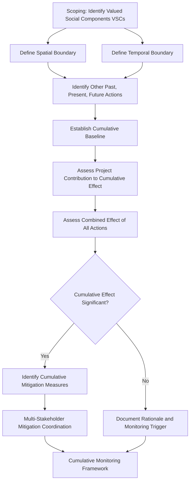

## Cumulative Impact Assessment Methodology

### Overview

Cumulative impact assessment (CIA) examines the combined effect of a proposed project's impacts *together with* the impacts of other past, present, and reasonably foreseeable future actions — rather than assessing the project's impacts in isolation, as a standard project-level SIA typically does. This distinction matters because a project's individual impact on, for example, local water resources or community services may be assessed as minor or manageable in isolation, while the same impact combined with two other nearby developments drawing on the same resource base may produce a significant, even severe, cumulative effect that no single project-level assessment would capture. Cumulative impact assessment is therefore not an extension of project-level SIA methodology applied more broadly — it requires a distinct analytical frame, spatial and temporal boundary-setting, and often a different set of responsible actors than a single proponent can address alone.

This topic establishes the methodological foundation for cumulative assessment, which subsequent items in this chapter (baseline synthesis, thresholds, multi-stakeholder mitigation) build upon.

---

### Core Definitional Distinctions

- **Direct Impact:** Effect caused solely by the project under assessment, occurring at the same time and place as the project activity.
- **Induced Impact:** Secondary effect resulting from project-induced changes (e.g., in-migration to a project area drawn by employment opportunities, itself generating new demand on services).
- **Cumulative Impact:** The incremental impact of the project when added to other past, present, and reasonably foreseeable future actions, regardless of what agency or person undertakes those other actions — the defining feature is that cumulative impact is assessed at the level of the receiving environment or community, not at the level of any single project.

**Key Points**

- A cumulative impact can arise even where each contributing project's individual impact is assessed as insignificant — this is precisely the scenario CIA is designed to detect, and why cumulative assessment cannot simply aggregate the "significant impacts" identified in each project's individual SIA.
- Cumulative impacts are not limited to environmental/biophysical receptors; social cumulative impacts (service capacity strain, in-migration pressure, cultural change, cost-of-living escalation) are equally within CIA's scope and are frequently the most severe cumulative effects in areas experiencing multiple concurrent developments.

---

### Why Project-Level SIA Is Insufficient for Cumulative Effects

- A single proponent's SIA is naturally bounded by that proponent's project footprint and control — it has neither the mandate nor typically the data access to assess impacts arising from other developers' projects.
- Regulatory review of individual project SIAs proceeds project-by-project, creating a structural risk that a region absorbing multiple concurrent developments experiences severity of impact that no single approval decision was positioned to evaluate.
- [Inference] This structural gap is widely recognized as a core justification for regional or strategic-level cumulative assessment mechanisms, distinct from project EIA/SIA requirements, though the specific institutional mechanism used to close this gap varies significantly by jurisdiction.

---

### Cumulative Impact Assessment Methodology Framework

---

### Step 1: Scoping and Valued Social Components (VSCs)

- CIA begins by identifying **Valued Social Components** — the specific social receptors (community services, livelihoods, cultural sites, social cohesion, housing/land markets) that stakeholders and technical assessment agree warrant cumulative examination, rather than attempting to assess cumulative effects across every conceivable social dimension.
- VSC selection should be informed by community consultation, since communities are frequently better positioned than external assessors to identify which cumulative pressures (e.g., housing cost escalation, water access, road safety from combined traffic) are most acutely felt.

**Key Points**

- Scoping should explicitly draw on the impacts already identified in the project-specific baseline and impact identification processes covered earlier in the SIA process, using them as a starting point for which VSCs are plausibly subject to cumulative pressure — not as a substitute for the separate cumulative analysis itself.

---

### Step 2: Spatial and Temporal Boundary Setting

**Spatial Boundaries**

- Should be defined by the geographic extent over which the VSC is actually affected (e.g., a watershed for water-resource-dependent livelihoods, a labor catchment area for employment/in-migration effects, an administrative service-delivery area for health/education capacity), not simply the project's own footprint.
- Different VSCs frequently require different spatial boundaries within the same CIA — service capacity effects may be bounded by a municipality, while livelihood/resource effects may be bounded by a watershed or ecological unit.

**Temporal Boundaries**

- Must extend backward far enough to capture relevant historical baseline trends (to distinguish project-attributable change from pre-existing trajectories) and forward far enough to capture reasonably foreseeable future actions across the combined operational lives of the project and other identified developments.
- "Reasonably foreseeable future actions" is a bounded standard — it includes projects with a credible development trajectory (permitted, under active planning/financing) but does not require speculative inclusion of any conceivable future development with no concrete basis.

---

### Step 3: Identifying Other Actions

| Action Category | Examples |
| --- | --- |
| Past Actions | Prior developments that have shaped current baseline conditions (relevant to establishing what the true "pre-cumulative" baseline actually was) |
| Present Actions | Concurrently operating projects/developments in the defined spatial boundary |
| Reasonably Foreseeable Future Actions | Permitted but not-yet-operational projects; projects in active regulatory review; credible planned developments with public/documented basis |

**Key Points**

- Identification of other actions typically requires engagement with the regulatory approving authority (which holds visibility across multiple project applications in a region) and LGU development planning offices, since no single proponent has full visibility into other developers' pipelines.
- This is a primary reason cumulative assessment is difficult to execute well at the individual project level and is increasingly addressed through regional/strategic assessment mechanisms coordinated by government rather than left entirely to individual proponents.

---

### Step 4: Establishing the Cumulative Baseline

- The cumulative baseline captures the condition of each VSC as shaped by past and present actions combined — distinct from the project-specific SIA baseline, which typically isolates the pre-project condition against which only *this* project's incremental impact is measured.
- Requires synthesizing baseline data across multiple sources (other projects' published SIAs, government statistics, community-held knowledge) rather than relying solely on the current project's own baseline survey.

---

### Step 5: Assessing Project Contribution and Combined Effect

- Two distinct analytical outputs are required: (a) the incremental contribution of the specific project under assessment to the cumulative effect, and (b) the total combined effect of all identified actions together on the VSC.
- This distinction matters for both regulatory decision-making (is this specific project's incremental contribution to an already-severe cumulative pressure acceptable) and for mitigation responsibility allocation (which actor bears responsibility for which share of a combined effect).

**Example**

Three separate agribusiness developments are established over a five-year period along the same river system, each individually assessed (in isolation) as having a "minor" water abstraction impact relative to river flow. A cumulative assessment conducted at the time of the third project's SIA determines that combined abstraction from all three developments, added to existing agricultural and domestic use, now approaches a threshold materially affecting downstream communities' water access during dry season — a finding no single project's individual SIA identified because each was scoped only to its own abstraction volume against total river flow, not to the combined trajectory of abstraction across the watershed.

---

### Step 6: Significance Determination for Cumulative Effects

- Significance thresholds for cumulative effects should ideally be established with reference to the carrying capacity or absorptive capacity of the affected system (a service system, resource system, or community), rather than solely by extrapolating the significance criteria used for single-project impact assessment.
- [Unverified] Specific quantitative thresholds (e.g., percentage of water resource abstracted, service capacity utilization percentage) are context- and sector-dependent and should be established with relevant technical/regulatory guidance for the specific VSC and jurisdiction rather than assumed universal.

---

### Methodological Approaches Commonly Used

| Approach | Application |
| --- | --- |
| Trend Analysis | Extrapolating historical baseline trends forward to project future cumulative condition absent additional intervention |
| Carrying Capacity Analysis | Assessing combined demand against the absorptive/service capacity of the affected system |
| Scenario Analysis | Modeling combined effects under different combinations of reasonably foreseeable future actions |
| Network/Interaction Analysis | Mapping how impacts from different actions interact (additively, synergistically) rather than assuming simple summation |
| Stakeholder-Based Assessment | Structured community and institutional consultation to identify and validate cumulative pressures not captured in quantitative data |

**Key Points**

- Cumulative effects are not always simply additive — some combinations of impacts interact synergistically (producing an effect greater than the sum of individual contributions) or in some cases can partially offset one another, requiring the methodology to examine interaction effects rather than defaulting to linear summation.

---

### Institutional and Coordination Challenges

- Effective cumulative mitigation frequently requires action beyond any single proponent's control (e.g., regional service capacity investment, watershed-level resource management), linking directly to the multi-stakeholder mitigation coordination mechanisms covered later in this chapter.
- Regulatory frameworks vary in whether they impose a *legal* obligation on individual proponents to assess cumulative effects, a *government-led* obligation to conduct regional/strategic cumulative assessment, or some hybrid — [Unverified] the specific institutional and legal obligation structure should be verified against the applicable jurisdiction's EIA/SIA regulatory framework, as this varies materially between jurisdictions and is a frequent point of regulatory evolution.

---

### Common Methodological Failure Modes

- **Treating cumulative assessment as an extension of project-level significance criteria**, rather than assessing significance against the capacity of the receiving system.
- **Spatial/temporal boundaries set to match the project footprint** rather than the actual extent over which the VSC is affected.
- **Simple additive assumption** where interaction effects (synergistic or offsetting) are methodologically more appropriate.
- **Reliance solely on the current project's own baseline data**, omitting synthesis of other projects' published assessments and government data sources.
- **No engagement with regulatory authority or LGU planning offices** to identify other reasonably foreseeable actions, resulting in an incomplete action inventory.

---

**Next Steps**

- Establishing cumulative social baseline conditions
- Significance thresholds for cumulative social effects
- Multi-stakeholder and regional mitigation coordination mechanisms
- Cumulative impact monitoring and adaptive management frameworks
- Regional/strategic environmental and social assessment approaches
- In-migration and induced development impact assessment