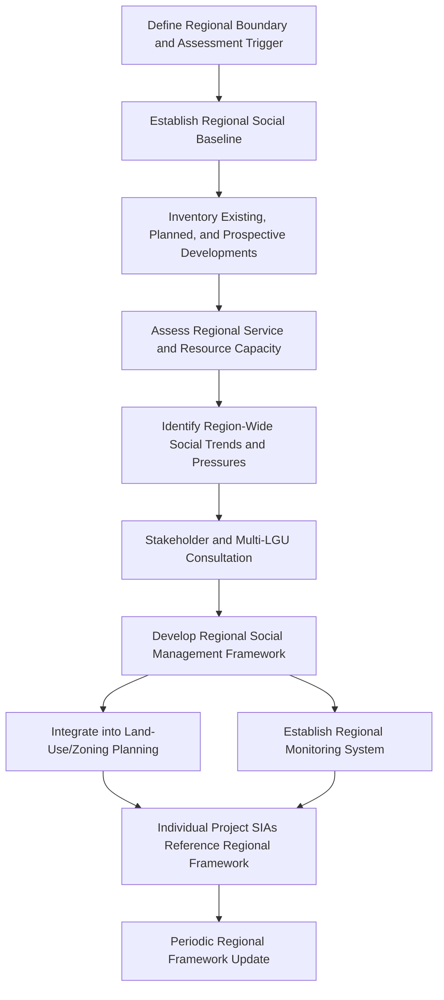
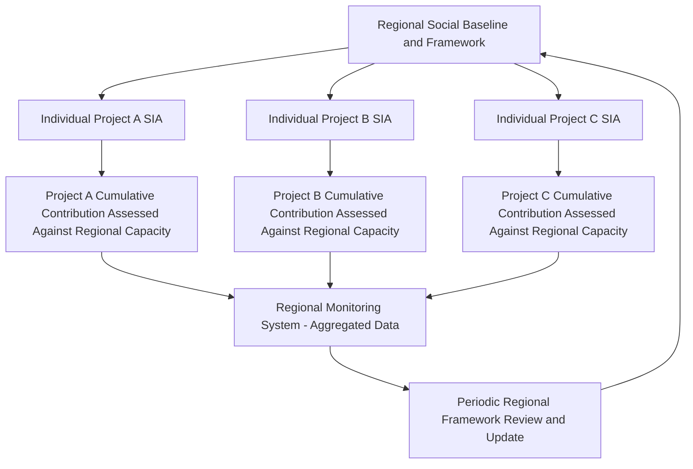

## Regional and Area-Based Social Assessment

### Overview

Regional and area-based social assessment (sometimes termed strategic social assessment or regional SIA) shifts the unit of analysis from a single project to a defined geographic area — a region, watershed, industrial corridor, or development zone — examining the combined social trajectory of that area independent of any one proponent's boundaries. Where cumulative impact assessment (the prior item in this chapter) typically originates from a specific project's obligation to consider its contribution to combined effects, regional and area-based assessment inverts the starting point: it begins with the area itself and asks what social trajectory that area is on, or should be planned for, given the full set of development pressures affecting it — existing, planned, and prospective. This makes it the natural institutional complement to project-level cumulative assessment, addressing the coordination and data-access gaps that project-level CIA alone cannot close.

This topic covers when regional assessment is used, its methodological differences from project-level SIA, the institutional arrangements required to conduct it, and how it interfaces with individual project approvals.

---

### Distinguishing Regional Assessment from Project-Level and Cumulative Assessment

| Dimension | Project-Level SIA | Cumulative Impact Assessment | Regional/Area-Based Assessment |
| --- | --- | --- | --- |
| Unit of Analysis | Single project | Single project's contribution to combined effects | Defined geographic area/region |
| Typical Trigger | Individual project regulatory approval | Individual project regulatory approval (assessing that project's cumulative contribution) | Government/regional planning initiative, sector-wide development program, or strategic land-use planning |
| Responsible Party | Individual proponent | Individual proponent (often with regulatory data support) | Government agency, regional planning body, or multi-proponent consortium |
| Timing Relative to Projects | Concurrent with specific project approval | Concurrent with specific project approval | Can precede individual project proposals (ex-ante), informing where/how development should occur |
| Primary Output | Project-specific SMP/SIMP | Project-specific cumulative mitigation commitments | Regional development strategy, zoning/land-use guidance, area-wide social infrastructure investment plan |

**Key Points**

- Regional assessment is the mechanism best positioned to close the institutional gap identified under cumulative impact assessment methodology — no single proponent has the mandate or data access to plan region-wide social infrastructure capacity, but a regional planning body does.
- Regional assessment can function proactively (informing land-use planning and development zoning *before* individual projects are proposed) or reactively (assessing an area already experiencing multiple concurrent developments) — the proactive application is generally considered the stronger practice, since it allows social infrastructure and mitigation planning to be built into area development from the outset rather than retrofitted.

---

### When Regional Assessment Is Used

- **Sector-wide development programs:** Where multiple similar projects are anticipated in a region (e.g., a mining district, an industrial estate, a hydropower cascade on a single river system), regional assessment establishes shared baseline and capacity data applicable across the individual project SIAs that follow.
- **Strategic land-use and zoning planning:** LGU or national government land-use plans increasingly incorporate social assessment to guide where development should be directed, informed by existing service capacity and community characteristics.
- **High-pressure development corridors:** Areas already experiencing multiple concurrent developments (transport corridors, special economic zones, resource extraction regions) where reactive regional assessment is used to establish coordinated mitigation and monitoring across projects with different proponents and timelines.
- **Donor/lender-driven regional programs:** International financing institutions increasingly require regional or strategic-level assessment as a precondition for financing programmatic or multi-project lending, rather than assessing each sub-project in isolation.

---

### Regional Assessment Process

---

### Core Methodological Components

**1. Regional Social Baseline**

- Establishes socioeconomic, demographic, service capacity, and livelihood baseline conditions across the full defined region, synthesized from multiple sources — census/government statistics, LGU development plans, prior project SIAs, and primary survey data where gaps exist.
- Distinct from a project-level baseline in that it must be maintained and periodically updated as a standing regional resource, rather than serving a single project's approval timeline.

**2. Development Inventory and Trajectory Mapping**

- Comprehensive mapping of existing, permitted, and reasonably foreseeable developments across the region — the same "other actions" identification step required under cumulative impact assessment, but conducted proactively at the regional level rather than reactively by an individual proponent.

**3. Regional Capacity Assessment**

- Assessment of service delivery systems (health, education, water, housing), labor markets, and resource systems (land, water) against combined current and projected demand across the region's development trajectory — establishing the carrying-capacity reference point that individual project cumulative assessments can then draw upon rather than each independently attempting to establish.

**4. Social Infrastructure Gap Analysis**

- Identifies where regional infrastructure and services are already at or approaching capacity limits, informing both public investment planning and the mitigation obligations reasonably placed on individual developments within the region.

**5. Regional Social Management Framework**

- A framework-level output (distinct from a project-specific SIMP) establishing shared standards, thresholds, and coordination mechanisms that individual project SIAs within the region are expected to align with — functioning similarly to a Resettlement Policy Framework's relationship to site-specific RAPs, but applied to the broader social assessment context.

---

### Institutional Arrangements

**Key Points**

- Regional assessment requires an institutional convener with authority or mandate spanning multiple individual projects and proponents — typically a national or regional government planning/regulatory agency, a provincial or multi-LGU coordination body, or, for donor-financed regional programs, a designated program management entity.
- Because no single proponent can be expected to fund region-wide baseline and capacity assessment alone, financing mechanisms often involve pooled contributions from multiple developers operating in the region, government budget allocation, or donor/lender program funding — a materially different financing model than the proponent-funded project-level SIMP budgeting covered earlier in this course.
- Where multiple proponents operate within an assessed region, coordination mechanisms (data sharing, joint monitoring, shared mitigation infrastructure investment) are needed to translate the regional framework into consistent practice across otherwise independent projects — directly setting up the multi-stakeholder mitigation coordination topic that follows later in this chapter.

---

### Interface with Individual Project SIAs

- Where a regional assessment and framework already exists, individual project SIAs can reference the established regional baseline and capacity thresholds rather than each independently attempting to construct a defensible cumulative picture from scratch — significantly strengthening the methodological rigor of project-level cumulative impact assessment described in the prior item.
- Individual project monitoring data can feed back into the regional monitoring system, allowing the regional framework to be updated as actual development trajectories unfold rather than remaining static.

---

### Case Illustration

**Example**

A provincial government anticipates significant renewable energy development activity across a river basin over the next decade, with several project proposals already in early planning. Rather than allowing each project's SIA to independently and inconsistently assess cumulative water, land, and service-capacity effects, the province commissions a regional social and environmental assessment covering the full basin, establishing a shared baseline, water allocation capacity analysis, and social infrastructure gap assessment. Subsequent individual project SIAs reference this regional framework directly for their cumulative impact sections, and developers jointly fund an expanded regional monitoring system rather than each establishing independent, non-comparable monitoring programs. When a fourth project proposal is submitted, the regional capacity analysis — updated with monitoring data from the first three approved projects — indicates the basin is approaching its assessed social/resource carrying capacity, providing the provincial government a substantive basis for evaluating whether and how the fourth project can proceed, a determination no single project SIA could have supported alone.

---

### Comparative Strengths and Limitations

**Key Points**

- **Strength:** Provides the institutional capacity and mandate that individual project-level cumulative assessment structurally lacks, particularly for region-wide service capacity and resource carrying-capacity questions.
- **Strength:** Enables proactive land-use and infrastructure planning aligned to anticipated development trajectories, rather than reactive mitigation after capacity constraints are already binding.
- **Limitation:** Requires sustained institutional commitment and funding beyond any single project's timeline, which is frequently harder to secure and maintain than project-specific SIMP budgets tied to a defined proponent and regulatory approval.
- **Limitation:** [Inference] Regional frameworks can become outdated relative to the actual pace of regional development if periodic update mechanisms are not institutionalized and resourced, undermining their value as a live reference point for subsequent project SIAs — though the specific update cadence required depends on the pace of development in the specific region.

---

### Common Failure Modes

- **No institutional convener with cross-project mandate**, leaving regional assessment aspirational rather than operationalized.
- **One-time assessment with no update mechanism**, becoming stale as the region's actual development trajectory diverges from what was originally projected.
- **Regional framework not referenced or incorporated into individual project SIAs**, duplicating effort and producing inconsistent cumulative assessments across projects in the same region.
- **Funding structured around a single early developer**, creating disproportionate financial burden on the first mover and weak incentive for later entrants to contribute to a framework they benefit from.
- **Regional assessment treated as a data-collection exercise only**, without translating findings into actual land-use, zoning, or capacity investment decisions.

---

**Next Steps**

- Cumulative impact assessment methodology and significance thresholds
- Multi-stakeholder and regional mitigation coordination mechanisms
- Regional monitoring and adaptive management frameworks
- Land-use and zoning integration of social assessment findings
- In-migration and induced development impact assessment
- Sector-wide and programmatic environmental and social assessment approaches