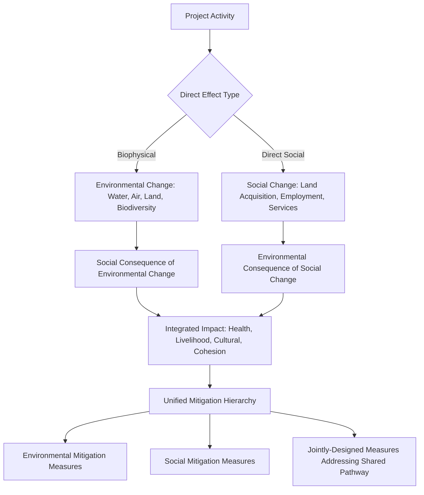

## Integrating Social Impact Assessment with Environmental Impact Assessment

### Overview

Social Impact Assessment (SIA) and Environmental Impact Assessment (EIA) are frequently conducted under a single regulatory instrument — often termed an Environmental and Social Impact Assessment (ESIA) — yet the two disciplines have historically developed distinct methodologies, data traditions, and professional communities, creating a persistent risk that "integration" in practice means little more than two separate reports bound together under one cover. Genuine integration requires methodological and procedural linkage at each stage of the assessment process: shared baseline data collection where receptors overlap, joint identification of interacting impact pathways (where a biophysical change drives a social consequence, or vice versa), and a unified mitigation hierarchy rather than parallel, uncoordinated environmental and social mitigation plans. This is the discipline's response to a well-documented failure pattern: environmental and social impacts frequently share the same causal pathway, and assessing them in isolation misses precisely the interactions that produce the most severe combined effects.

This topic addresses why integration matters, where social and environmental assessment methodologically diverge and converge, the mechanics of impact pathway analysis across the two disciplines, and institutional/team structures that support genuine integration.

---

### Why Environmental and Social Impacts Are Structurally Linked

**Key Points**

- Many of the most significant social impacts are *mediated through* environmental change: water pollution affecting community health and fishing livelihoods, deforestation affecting forest-dependent income, air quality affecting respiratory health and agricultural productivity, and hydrological change affecting irrigation-dependent farming communities.
- Conversely, social responses to a project can drive environmental outcomes: in-migration induced by project employment opportunities can accelerate land conversion, resource extraction, or informal settlement expansion well beyond the project's own physical footprint — an environmental effect with a fundamentally social cause.
- Treating environmental and social assessment as parallel, non-interacting tracks risks missing the **impact pathway** — the causal chain linking a biophysical change to a social consequence, or a social change to a biophysical consequence — which is often where the most policy-relevant and mitigation-relevant insight lies.

---

### Impact Pathway Analysis: The Core Integration Mechanism

**Key Points**

- An impact pathway approach requires assessment teams to explicitly trace *how* a biophysical change translates into a social outcome (e.g., "reduced downstream water flow → reduced irrigation water availability → reduced agricultural yield → reduced household income → increased food insecurity"), rather than assessing "water impact" and "livelihood impact" as separately scoped chapters authored by different specialists with limited cross-reference.
- The most effective mitigation measures for pathway-linked impacts often address the pathway itself (e.g., flow management to protect irrigation supply) rather than only the downstream social symptom (e.g., livelihood compensation after yield loss has already occurred) — integration therefore shapes not just impact identification but mitigation hierarchy design, reinforcing the avoidance-and-minimization principle applied earlier to resettlement.

---

### Where Methodologies Converge and Diverge

| Dimension | Environmental Impact Assessment | Social Impact Assessment | Integration Point |
| --- | --- | --- | --- |
| Baseline Data | Biophysical surveys, water/air/soil sampling, biodiversity inventory | Socioeconomic survey, census, livelihood/cultural mapping | Shared study area definition; environmental baseline informs livelihood-dependency mapping |
| Significance Criteria | Often standard-based (water quality standards, emission limits) | Often context/perception-based (community-defined significance, vulnerability) | Environmental threshold breaches should trigger corresponding social pathway analysis |
| Stakeholder Engagement | Often narrower, technical/regulatory-focused | Central methodological requirement — meaningful consultation | Joint consultation processes reduce stakeholder fatigue and improve data quality for both disciplines |
| Impact Prediction Method | Modeling (dispersion, hydrological, ecological) | Baseline trend extrapolation, comparative case analysis, participatory assessment | Environmental models should feed as inputs into social impact prediction where a pathway exists |
| Mitigation Hierarchy | Avoid-minimize-restore-offset (well-established biophysical framework) | Avoid-minimize-restore-compensate-enhance (established earlier in this course) | Unified hierarchy applied across both, avoiding parallel/conflicting mitigation logic |

---

### Institutional and Team Structures Supporting Integration

**1. Joint Scoping**

- A single scoping exercise identifying both environmental and social Valued Components (Valued Environmental Components and Valued Social Components) together, explicitly mapping where they interact, rather than two independent scoping processes conducted by separate teams.

**2. Shared Baseline Study Area and Timing**

- Environmental and social baseline data collection conducted within a consistent (though not necessarily identical) spatial and temporal frame, enabling later pathway analysis to draw on baseline data collected under comparable conditions rather than mismatched survey periods.

**3. Cross-Disciplinary Review Points**

- Structured checkpoints in the assessment process where environmental and social specialists jointly review draft findings specifically to identify pathway linkages — for example, a health/social specialist reviewing air quality modeling outputs specifically for respiratory health and agricultural livelihood implications, rather than the environmental team's air quality chapter and the social team's health/livelihood chapter being drafted independently.

**4. Unified Impact Register**

- A single consolidated impact register (rather than separate environmental and social impact lists) that explicitly tags impacts by pathway type (direct environmental, direct social, environmental-mediated social, social-mediated environmental), supporting the unified mitigation hierarchy and avoiding duplicated or conflicting mitigation commitments for the same underlying impact.

**5. Joint Consultation Design**

- Combined stakeholder engagement processes that gather both environmental and social input in the same sessions where feasible, reducing consultation fatigue for affected communities and improving the quality of pathway-relevant feedback (communities are often best positioned to describe how an environmental change actually affects their livelihood or wellbeing in practice).

---

### Common Integration Points by Impact Category

| Environmental Driver | Social Consequence Pathway |
| --- | --- |
| Water abstraction/diversion | Reduced irrigation supply → agricultural livelihood loss; reduced domestic water access → health and time-burden impacts (often disproportionately on women) |
| Air emissions/dust | Respiratory health impacts; reduced agricultural yield from particulate deposition; reduced property/land value |
| Noise and vibration | Sleep disruption and stress-related health impacts; livestock/agricultural productivity effects |
| Land clearing/habitat loss | Loss of forest-dependent livelihoods; loss of access to culturally significant sites; loss of non-timber forest product income |
| Waste and effluent discharge | Contamination of fishing grounds/food sources; health impacts from contaminated water use |
| In-migration (social driver) | Accelerated land conversion; increased pressure on natural resources and protected areas; informal settlement expansion |

**Example**

An EIA's hydrological modeling for a hydropower project predicts altered downstream flow timing and reduced dry-season flow volume — presented, in a poorly integrated assessment, purely as a water resources chapter finding with standard biophysical mitigation (minimum environmental flow requirements). A properly integrated assessment traces the same finding through to its social pathway: reduced dry-season flow affects downstream irrigation-dependent rice farming communities' planting schedules and yields, which in turn affects household income and, for the most water-dependent households, food security. This pathway analysis changes the mitigation response from a standalone environmental flow commitment to a combined measure — environmental flow management *specifically calibrated* to the critical irrigation timing windows identified through the social/livelihood assessment, rather than a generic minimum-flow standard that may not actually protect the specific agricultural dependency at stake.

---

### Reconciling Divergent Significance Criteria

**Key Points**

- Environmental significance is frequently anchored to regulatory or scientific thresholds (a water quality parameter exceeding a legal limit), while social significance is more often anchored to community-defined values and vulnerability context (the same water quality change may be "insignificant" against a generic regulatory threshold but highly significant to a specific community whose livelihood or cultural practice depends on that water body).
- Integrated assessment should not force social significance determinations to be justified solely in environmental-threshold terms, nor allow environmental threshold compliance to be treated as evidence that no significant social impact exists — the two significance frameworks should operate in parallel and be reconciled explicitly where they diverge, not collapsed into a single (typically environmentally-anchored) standard.

---

### Regulatory and Documentation Structures

- Where the governing regulatory framework requires a combined ESIA document (as is increasingly standard, including in lender safeguard frameworks such as IFC Performance Standards and World Bank ESS), the document structure itself should reflect integration — organized around impact pathways or Valued Components where interaction exists, rather than a rigid environmental-chapters-then-social-chapters structure that leaves integration entirely to the reader.
- Even where national regulation still requires or defaults to separate EIA and SIA documents, leading practice is to conduct the underlying assessment process in an integrated manner and cross-reference findings explicitly between the two final documents.

---

### Common Integration Failure Modes

- **Parallel, non-communicating teams:** Environmental and social specialists working independently with limited structured interaction, producing two internally consistent but externally disconnected assessments.
- **Mitigation hierarchy applied separately:** Environmental avoidance/minimization measures finalized without assessing their social pathway implications, and vice versa — potentially producing an environmentally sound but socially harmful mitigation choice, or the reverse.
- **Significance criteria collapse:** Treating environmental regulatory compliance as a proxy for social impact insignificance, missing community-specific dependency and vulnerability context.
- **Baseline timing mismatch:** Environmental and social baseline data collected in different seasons/periods, undermining the validity of pathway analysis that assumes comparable baseline conditions.
- **Consultation fatigue from duplicated engagement:** Separate environmental and social consultation processes over-burdening the same communities without commensurate improvement in data quality.
- **Missing the social-to-environmental pathway:** Focusing integration efforts solely on environmental-to-social pathways (the more commonly assessed direction) while under-assessing social drivers of environmental change, particularly in-migration-induced impacts.

---

**Next Steps**

- Cumulative impact assessment methodology and significance thresholds
- In-migration and induced development impact assessment
- Regional and area-based social assessment
- Health impact assessment integration within SIA
- Unified mitigation hierarchy design across environmental and social measures
- Multi-stakeholder and regional mitigation coordination mechanisms