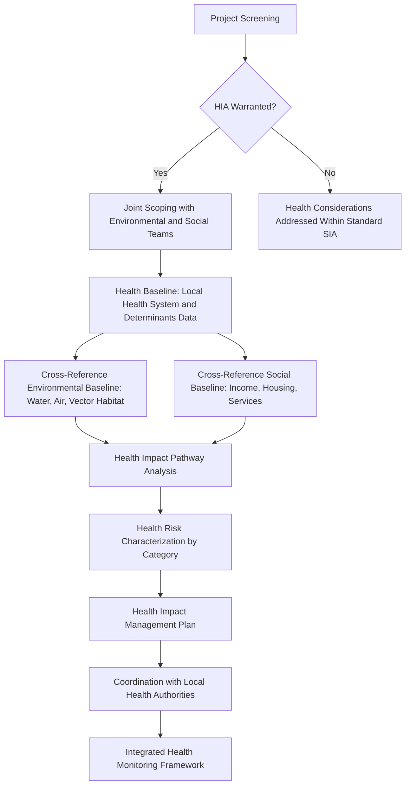

## Health Impact Assessment Integration

### Overview

Health Impact Assessment (HIA) is a structured methodology for predicting and managing the health effects of a proposed project — encompassing physical health (disease, injury), mental health and wellbeing, and the broader social determinants of health (income, housing, food security, social cohesion) that shape population health outcomes over time. Integration of HIA into SIA practice follows the same logic established for environmental-social integration in the prior item: health outcomes are frequently the endpoint of impact pathways that originate in both environmental change (water/air quality, vector habitat) and social change (income loss, in-migration, altered social structures), making health assessment a natural convergence point rather than a standalone technical add-on. Where HIA is conducted as an isolated exercise disconnected from the broader SIA, it risks duplicating baseline effort and, more consequentially, missing the socioeconomic and environmental pathways that actually drive most project-related health outcomes.

This topic covers HIA methodology, its integration points with the broader SIA/ESIA process, key health determinant categories specific to development projects, and the institutional arrangements needed for genuine integration rather than parallel assessment.

---

### Core HIA Methodology Steps

**1. Screening**

- Determines whether a formal HIA is warranted based on the scale, nature, and location of the project — projects involving significant population in-migration, water/air quality change, or operations in areas with limited existing health system capacity typically warrant HIA regardless of overall project scale.

**2. Scoping**

- Identifies the specific health determinants and receptor populations relevant to the project, establishing the geographic and temporal boundaries for health baseline data collection — methodologically parallel to VSC/VEC scoping in the broader SIA/EIA process.

**3. Health Baseline Assessment**

- Establishes existing community health status, disease prevalence, health system capacity (facilities, staffing, referral pathways), and social determinants of health (income, housing quality, food security, water/sanitation access) prior to project commencement.

**4. Impact Identification and Pathway Analysis**

- Identifies how specific project activities translate into health outcomes through defined pathways — the same impact pathway logic established for environmental-social integration, applied specifically to health endpoints.

**5. Health Risk Assessment**

- Characterizes the likelihood and severity of identified health impacts, often distinguishing communicable disease risk, non-communicable disease/chronic exposure risk, injury risk, and mental health/psychosocial risk as distinct assessment tracks given their different causal mechanisms and mitigation approaches.

**6. Mitigation and Health Management Planning**

- Develops health-specific mitigation measures, often formalized in a Health Impact Management Plan or as a health-specific component of the broader Social Management Plan.

**7. Monitoring and Evaluation**

- Establishes health indicators for ongoing monitoring, ideally coordinated with local health system data (health facility records, disease surveillance) rather than parallel proponent-run health data collection disconnected from the public health system.

---

### HIA Integration Process

---

### Health Determinant Categories in Development Projects

**1. Communicable Disease**

- In-migration-associated disease transmission (including sexually transmitted infections, often elevated during construction phases with transient workforces), vector-borne disease risk from altered water bodies or land use (e.g., stagnant water creating mosquito breeding habitat), and workforce-community disease transmission risk.

**2. Non-Communicable Disease and Environmental Exposure**

- Respiratory conditions linked to air quality/dust; exposure to project-related hazardous substances; long-term health effects of altered environmental conditions (water contamination, soil contamination) — directly linked to the environmental-social pathway analysis established in the environmental-social integration item.

**3. Injury and Occupational/Public Safety**

- Traffic-related injury from increased project vehicle movement; construction-related public safety risk; occupational health and safety for both direct workforce and, where relevant, community members with project site proximity/access.

**4. Nutrition and Food Security**

- Health effects mediated through economic displacement's impact on food-producing livelihoods (directly linking to the physical/economic displacement and livelihood restoration topics from the resettlement chapter); changes in dietary patterns associated with income change or altered access to traditional food sources.

**5. Mental Health and Psychosocial Wellbeing**

- Stress and anxiety associated with resettlement, uncertainty during project development phases, loss of social networks, and altered community/family structures — frequently under-assessed relative to physical health outcomes despite substantial evidence of psychosocial impact from displacement and rapid community change.

**6. Health System Capacity**

- Strain on local health facilities and health workforce from population in-migration, distinct from but related to the broader service capacity strain addressed under host community impacts and cumulative/regional assessment.

**7. Water, Sanitation, and Hygiene (WASH)**

- Health effects mediated through project impacts on water quality/quantity and sanitation infrastructure — a direct convergence point with environmental baseline data on water resources.

---

### Integration Points with the Broader SIA/ESIA Process

| Health Determinant | Integration Point |
| --- | --- |
| Water-related disease/exposure | Environmental water quality baseline and modeling |
| Air quality-related respiratory effects | Environmental air quality baseline and dispersion modeling |
| Nutrition/food security | Livelihood and economic displacement assessment |
| Mental health/psychosocial | Resettlement planning, social cohesion, and cultural heritage assessment |
| In-migration-associated disease | Cumulative and induced impact assessment (in-migration modeling) |
| Health system capacity | Host community impact assessment and regional/area-based service capacity analysis |
| Occupational/traffic safety | Environmental and social impact identification for construction/operational phase activities |

**Key Points**

- A genuinely integrated HIA does not duplicate baseline data collection already occurring under the environmental and social assessment tracks — it draws on and extends that baseline specifically toward health endpoints, consistent with the shared-baseline integration principle established in the environmental-social integration item.
- Health system capacity assessment should be coordinated with, not conducted in isolation from, the broader service capacity analysis used in cumulative and regional assessment, since health facilities are one specific category within the broader service infrastructure strain question.

---

### Institutional Coordination for Health Integration

- Effective HIA integration typically requires engagement with local/regional health authorities (Department of Health regional offices, LGU health units) both as a data source for existing health system baseline and capacity, and as a coordination partner for monitoring and health service strengthening measures.
- Where project-related health risks include communicable disease transmission risk between workforce and community, coordination with public health authorities on surveillance and response protocols is standard practice, distinct from the proponent's own internal occupational health management.
- Health Impact Management Plan implementation responsibility should be assigned within the same institutional roles and responsibility framework established earlier in this course, typically involving both an internal Health, Safety, and Environment (HSE) function and the Community Relations/Social Development unit, given health impacts span both occupational and community dimensions.

---

### Case Illustration

**Example**

A large infrastructure project's environmental assessment identifies that construction will require a temporary workforce camp housing several thousand workers over a 30-month construction period, with predicted in-migration of additional informal workers and service providers to the surrounding area. Assessed only through an environmental lens, this generates a water/sanitation infrastructure sizing question. Assessed only through a social lens, it generates a host community service-capacity and social cohesion question. An integrated HIA traces the combined pathway: workforce and in-migrant population growth increases demand on the area's single primary health facility beyond its current staffing and capacity, while simultaneously elevating communicable disease transmission risk associated with a transient population — two distinct but related health outcomes that neither the environmental nor social assessment alone would have fully characterized or connected to a coordinated mitigation response (temporary health facility capacity support, workforce health screening protocols, and community health outreach), which is what the integrated HIA actually recommends.

---

### Common Health Integration Failure Modes

- **HIA conducted as a fully separate, parallel exercise** with its own baseline survey disconnected from environmental and social baseline data already collected, duplicating effort and risking methodological inconsistency.
- **Physical health assessed while mental health/psychosocial impacts are omitted**, despite substantial documented psychosocial impact from resettlement and rapid community change.
- **No coordination with local health authorities**, resulting in health baseline and monitoring data disconnected from the public health system's own surveillance and service planning.
- **In-migration health risk under-assessed**, missing the connection between induced demographic change (a cumulative/social impact) and communicable disease or health system capacity outcomes.
- **Health monitoring treated as a one-off baseline exercise** rather than an ongoing indicator set integrated into the broader SIMP monitoring framework.

---

**Next Steps**

- Integrating social impact assessment with environmental impact assessment
- In-migration and induced development impact assessment
- Host community impacts and integration
- Cumulative impact assessment methodology
- Monitoring and evaluation indicator frameworks across the broader SIMP
- Occupational and community safety management planning