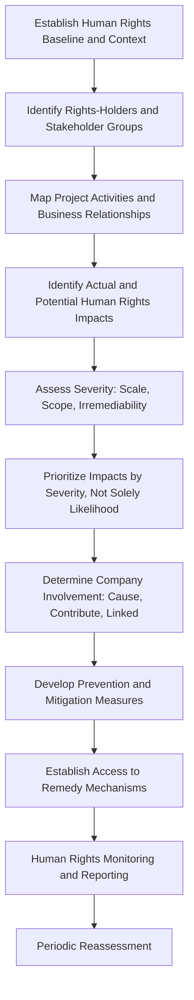

## Human Rights Impact Assessment Methodology

### Overview

Human Rights Impact Assessment (HRIA) applies an internationally recognized human rights framework — rooted primarily in the United Nations Guiding Principles on Business and Human Rights (UNGPs) — to identify, prevent, and account for a project's actual and potential adverse effects on the human rights of individuals and communities. Where standard SIA methodology assesses impact significance against baseline conditions, community values, and vulnerability context, HRIA anchors assessment specifically to a defined set of internationally recognized rights (civil, political, economic, social, and cultural), providing a distinct — and in some respects more legally and normatively rigorous — analytical frame. HRIA is increasingly integrated into or run alongside broader SIA/ESIA processes rather than conducted as a wholly separate exercise, since many rights-relevant impacts (land rights, labor conditions, indigenous peoples' rights, non-discrimination) overlap substantially with impacts already within SIA's scope — but the rights-based frame adds analytical elements standard SIA does not automatically capture: a duty/responsibility structure, a severity-based prioritization logic distinct from conventional significance criteria, and an explicit remedy standard.

This topic covers the human rights framework underpinning HRIA, its distinct methodological steps, how it differs from and complements standard SIA, and the institutional responsibility structure the UNGPs establish.

---

### The Foundational Framework: UN Guiding Principles on Business and Human Rights

**Key Points**

- The UNGPs rest on three pillars: the **State duty to protect** human rights, the **corporate responsibility to respect** human rights, and **access to remedy** for those whose rights are adversely affected — HRIA in a project context operationally implements the corporate responsibility to respect pillar.
- "Respect" under the UNGPs means avoiding causing or contributing to adverse human rights impacts through the company's own activities, and addressing such impacts when they occur — as well as seeking to prevent or mitigate impacts directly linked to the company's operations, products, or services through business relationships, even where the company did not itself cause the impact (e.g., impacts caused by a contractor or supplier).
- This creates a broader responsibility scope than conventional SIA typically applies, since it extends to impacts occurring through the value chain and business relationships, not solely the proponent's own direct project activities.

---

### Human Rights Categories Relevant to Development Projects

| Rights Category | Example Project-Relevant Issues |
| --- | --- |
| Right to Property and Land | Land acquisition without due process, inadequate compensation, forced eviction |
| Right to an Adequate Standard of Living | Livelihood loss, food security, housing adequacy post-resettlement |
| Right to Health | Environmental health impacts, health system access |
| Right to Water | Water resource access and quality impacts |
| Rights of Indigenous Peoples | Free, Prior and Informed Consent (FPIC), cultural rights, ancestral domain rights |
| Labor Rights | Working conditions, freedom of association, child labor, forced labor, non-discrimination in the project workforce and supply chain |
| Right to Non-Discrimination | Differential impact or benefit distribution across gender, ethnicity, or other status |
| Right to Participation | Meaningful consultation and access to information |
| Right to Remedy | Access to effective grievance mechanisms and judicial/non-judicial remedy |
| Security and Human Rights | Human rights conduct of project security personnel (public or private) |

---

### HRIA Methodology Steps

---

### Step 1: Human Rights Baseline and Context Analysis

- Establishes the human rights context of the operating environment — the domestic legal and institutional human rights protection framework, documented human rights concerns in the region/sector, and the specific vulnerabilities of rights-holders likely to be affected.
- Draws on international and domestic human rights reporting (government, UN treaty body reviews, credible civil society reporting) as a baseline input distinct from, though complementary to, the socioeconomic baseline used in standard SIA.

### Step 2: Rights-Holder Identification

- Identifies rights-holders with particular attention to groups facing heightened risk of rights violations or reduced capacity to claim remedy — indigenous peoples, women, children, persons with disabilities, migrant workers, and human rights defenders, mirroring but extending the vulnerable group identification already established under resettlement and livelihood planning.

### Step 3: Business Relationship and Value Chain Mapping

- Maps the project's activities, contractors, suppliers, joint venture partners, and security arrangements to determine where human rights impacts might arise not only from the proponent's own direct actions but through relationships the proponent is linked to — a scope extension distinct from standard SIA's typical focus on the proponent's direct project footprint.

### Step 4: Impact Identification Against Rights Categories

- Systematically assesses potential impacts against the defined rights categories (land, labor, indigenous peoples, health, non-discrimination, security, remedy), rather than the more open-ended impact identification process typical of standard SIA.

### Step 5: Severity-Based Assessment

**Key Points**

- The UNGP framework directs that human rights impacts be prioritized for response first and foremost by **severity** — assessed through scale (gravity of the impact), scope (number of individuals affected), and irremediability (difficulty of restoring those affected to their prior situation) — rather than by likelihood or probability, which is the more typical driver of conventional risk-based significance ranking.
- This is a meaningful methodological distinction from standard SIA significance criteria: a low-probability but high-severity and highly irremediable impact (e.g., forced eviction without due process, serious injury from inadequate security conduct) should be prioritized ahead of a high-probability but low-severity, easily remediable impact — a prioritization logic not always reflected in conventional probability-weighted significance matrices.

### Step 6: Determining the Nature of Company Involvement

- HRIA distinguishes three modes of company involvement in an adverse impact, each carrying different responsibility implications under the UNGPs:
  - **Cause:** The company's own activities directly produce the adverse impact.
  - **Contribute:** The company's activities, in combination with other actors, contribute to the impact.
  - **Directly Linked:** The impact is caused solely by another entity (e.g., a supplier, contractor, or joint venture partner) but is directly linked to the company's operations, products, or services through a business relationship.
- This distinction determines the appropriate response: cause/contribute generally requires the company to cease or prevent the impact and provide or cooperate in remedy; directly-linked-only situations generally require the company to use its leverage to prevent or mitigate the impact, even without a direct remediation obligation of its own.

### Step 7: Access to Remedy

- HRIA explicitly requires assessment of whether affected rights-holders have access to effective remedy — both company-level, non-judicial grievance mechanisms and, where relevant, access to judicial or other state-based remedy — distinct from (though often implemented through) the grievance redress mechanisms already established under resettlement and broader SIMP practice.
- Effectiveness criteria for company-level grievance mechanisms under the UNGPs include legitimacy, accessibility, predictability, equitability, transparency, rights-compatibility, and being a source of continuous learning — a more specific effectiveness standard than is always applied to generic project grievance mechanisms.

---

### Relationship Between HRIA and Standard SIA

| Dimension | Standard SIA | Human Rights Impact Assessment |
| --- | --- | --- |
| Analytical Anchor | Baseline conditions, community values, vulnerability | Internationally recognized human rights standards |
| Prioritization Logic | Significance (often probability × consequence) | Severity (scale, scope, irremediability) — prioritized ahead of likelihood |
| Scope of Responsibility | Typically proponent's direct project footprint | Extends to impacts "directly linked" through business relationships (contractors, suppliers, security, joint ventures) |
| Remedy Standard | Grievance mechanism as one mitigation component | Explicit, UNGP-defined access to remedy as a distinct assessment requirement |
| Legal/Normative Basis | Varies by jurisdiction and lender standard | Anchored in international human rights law and the UNGPs specifically |

**Key Points**

- HRIA is best understood as complementary to, not a replacement for, standard SIA — many data sources and impact categories overlap substantially (land, livelihood, indigenous peoples, consultation), and leading practice integrates HRIA analytical steps into the broader ESIA process rather than commissioning a fully separate report, mirroring the environmental-social integration principle established earlier in this chapter.
- Where a project has already conducted resettlement, indigenous peoples, and labor-related assessments under standard SIA/ESIA practice, HRIA adds the severity-based prioritization lens, the extended business-relationship scope, and the explicit remedy-effectiveness standard, rather than requiring the underlying impact identification to be redone from scratch.

---

### Case Illustration

**Example**

A standard SIA for an agribusiness project identifies land acquisition impacts on smallholder farmers as significant but assesses the associated grievance mechanism as adequate based on its existence and documented case volume. An HRIA conducted alongside it applies the UNGP effectiveness criteria specifically and finds the mechanism, while procedurally functioning, is not genuinely accessible to a subset of affected farmers who are non-literate and located far from the single grievance intake point — a finding the standard SIA's more general "grievance mechanism established" assessment did not surface. Separately, the HRIA's business-relationship mapping identifies that security services at the project's land boundary are provided by a third-party contractor with a documented history of human rights concerns in the region — a "directly linked" impact scenario outside the proponent's own direct operations, but within its UNGP responsibility to use leverage to address, and outside what a standard SIA scoped to the proponent's direct footprint would typically capture.

---

### Institutional Implications

- HRIA findings should feed into the same institutional roles and responsibility framework established earlier in this course, but with specific attention to functions HRIA distinctly surfaces: security and human rights training/protocols, supply chain and contractor human rights due diligence, and grievance mechanism effectiveness review against the UNGP criteria specifically.
- Because HRIA's business-relationship scope extends to contractors, suppliers, and joint venture partners, institutional responsibility structures often require contractual mechanisms (human rights clauses in contractor agreements, supplier codes of conduct) in addition to the proponent's own internal implementation units.

---

### Common HRIA Methodological Failure Modes

- **Treating HRIA as a rebranding of existing SIA content** without applying the distinct severity-based prioritization or business-relationship scope extension that differentiates it methodologically.
- **Omitting business relationship/value chain mapping**, missing "directly linked" impacts occurring through contractors, suppliers, or security arrangements.
- **Prioritizing by likelihood rather than severity**, understating high-severity, low-probability, hard-to-remedy impacts relative to the UNGP-directed prioritization logic.
- **Grievance mechanism assessed for existence rather than effectiveness** against the specific UNGP criteria (accessibility, legitimacy, equitability, and the remainder of the standard).
- **No distinction between cause, contribute, and directly-linked involvement**, applying a uniform remediation obligation regardless of the company's actual relationship to the impact.

---

**Next Steps**

- Integrating social impact assessment with environmental impact assessment
- Indigenous Peoples' rights and Free, Prior and Informed Consent (FPIC) processes
- Grievance redress mechanism design and effectiveness standards
- Labor rights and supply chain due diligence in project contexts
- Security arrangements and human rights conduct standards
- Access to remedy mechanisms and judicial/non-judicial pathways