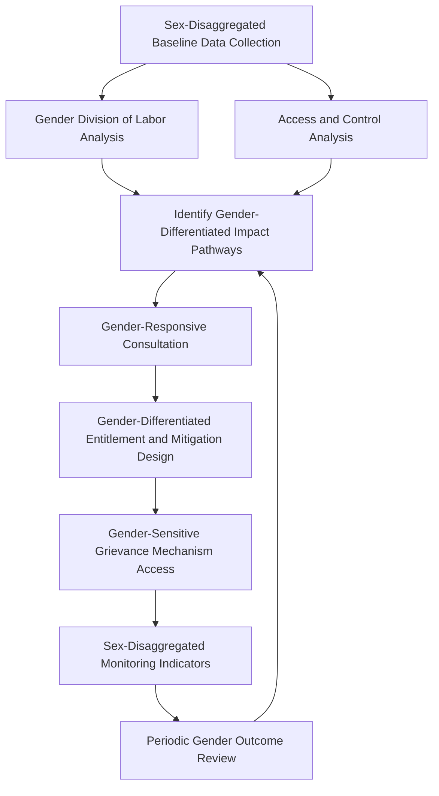

## Gender Impact Assessment Approaches

### Overview

Gender impact assessment is the systematic analysis of how a project's impacts, risks, and benefits are distributed differently across genders, and why — grounded in the recognition that development projects do not affect all members of a household or community uniformly, and that gender-blind assessment methodologies systematically under-identify impacts falling disproportionately on women and gender minorities. Gender impact assessment is not a standalone chapter appended to an otherwise gender-neutral SIA; properly practiced, it is a cross-cutting analytical lens applied throughout baseline data collection, impact identification, consultation design, entitlement frameworks, and monitoring — directly extending the vulnerable-group differentiation principles already established under resettlement, livelihood restoration, and human rights impact assessment in this course, with gender treated as a primary axis of differentiated impact rather than one item on a vulnerability checklist.

This topic covers why gender-differentiated analysis is methodologically necessary, the core analytical tools used, integration points across the SIA process, and the specific project impact domains where gender differentiation is most consequential.

---

### Why Gender-Blind Assessment Systematically Misses Impacts

**Key Points**

- Standard household-level data collection frequently captures the household head's (often male) response as representative of the household, obscuring intra-household differences in asset control, labor allocation, income access, and decision-making authority — a methodological gap that gender impact assessment is specifically designed to close.
- Formal land title, compensation eligibility, and consultation access frequently default to male household heads under prevailing customary or legal systems, meaning gender-blind entitlement frameworks can systematically exclude women from compensation and resettlement benefits even where they are significant contributors to household livelihood or bear a disproportionate share of resettlement-related burden (e.g., unpaid domestic and care labor during transition periods).
- Project impacts themselves are frequently gender-differentiated in ways a gender-blind assessment would not surface: women are often more dependent on common property resources (water sources, firewood, non-timber forest products) for unpaid household provisioning, meaning access restriction impacts fall disproportionately on women's labor burden even when the underlying asset (e.g., communal land) is nominally accessed by the household as a unit.

---

### Core Analytical Tools

**1. Sex-Disaggregated Data Collection**

- Baseline and monitoring data collected and reported separately by sex (and, where relevant, other gender identities) at every stage — census, socioeconomic survey, livelihood assessment, consultation attendance — rather than aggregated household-level data that obscures intra-household variation.
- Foundational and non-negotiable: without disaggregated data at collection stage, gender analysis cannot be meaningfully retrofitted later, mirroring the same point made regarding vulnerability disaggregation under resettlement action plan development.

**2. Gender Division of Labor Analysis**

- Maps productive (income-generating), reproductive (domestic/care), and community-management labor roles by gender within affected households, identifying which activities and time burdens are disproportionately borne by women and how project impacts affect each labor category differently.

**3. Access and Control Analysis**

- Distinguishes *access* to a resource (who is permitted to use it) from *control* over a resource (who decides how it is used, sold, or allocated) — a standard gender analysis framework revealing that women may have access to but not control over land, income, or compensation payments, with direct implications for compensation modality design (a lump-sum cash payment to a male household head does not guarantee equitable benefit to female household members).

**4. Gender-Differentiated Vulnerability Assessment**

- Identifies specific circumstances elevating gender-related vulnerability: female-headed households, women's differential land tenure security, pregnancy/lactation-related health considerations, and gender-based violence risk — extending the general vulnerable group framework with gender-specific analytical depth rather than treating "women" as a single undifferentiated vulnerable category.

**5. Gender-Responsive Consultation Design**

- Structured consultation methodologies specifically designed to capture women's perspectives, recognizing that mixed-gender or male-dominated consultation formats frequently under-represent women's input due to social norms, time constraints (competing with domestic/care responsibilities), or direct exclusion — addressed through separate women's focus groups, appropriately timed sessions, and, where relevant, female facilitators.

---

### Gender Impact Assessment Process

---

### Key Impact Domains Requiring Gender Differentiation

| Domain | Gender-Differentiated Consideration |
| --- | --- |
| Land and Asset Compensation | Formal title/entitlement often defaults to male household head; women's customary or secondary rights may be uncompensated without explicit entitlement matrix provision |
| Resettlement and Housing | Women's mobility, safety, and access to services (water, health, schools) at resettlement sites; involvement in site/housing design decisions |
| Livelihood Restoration | Training and enterprise programs must match women's actual time availability and existing skill base, not assume interchangeability with male-oriented program design |
| Employment | Project employment opportunities frequently skew toward male-dominated roles (construction, technical trades) unless deliberate inclusion measures are designed |
| Common Property Resource Access | Water, firewood, and forest product access impacts disproportionately affect women's unpaid labor burden |
| Health | Reproductive health considerations, gender-based violence risk associated with workforce influx, and differential health service access |
| Consultation and Grievance | Structural barriers to women's participation in standard consultation and grievance processes |
| Cash Compensation Payment | Payment modality and recipient designation affecting whether compensation benefits reach women within the household |

---

### Integration with Resettlement and Livelihood Frameworks

**Key Points**

- The entitlement matrix established under Resettlement Action Plan development should explicitly address joint titling of replacement land/housing (both spouses named, rather than defaulting to the male household head alone) and provisions for women with secondary or customary — rather than formal — rights to compensated assets.
- Livelihood restoration strategies, per the livelihood restoration planning framework, require gender-specific labor market and skills assessment, since a training program well-matched to male household members' existing skills and time availability may be poorly matched to female household members' circumstances, even within the same household.
- Compensation payment mechanisms should consider joint bank accounts or payment structures that support equitable within-household benefit distribution, directly addressing the access-versus-control distinction where cash compensation paid solely to a male household head does not guarantee benefit reaches female household members.

---

### Gender-Based Violence Risk Assessment

- A specific and increasingly standard component of gender impact assessment for projects involving significant workforce influx (particularly transient construction workforces), given documented association between large-scale labor in-migration and elevated gender-based violence risk in host communities.
- Requires assessment of existing local GBV prevalence and service availability (baseline), risk factors specific to the project (workforce camp proximity to communities, alcohol availability, power/economic imbalances between workforce and local population), and mitigation measures (codes of conduct, workforce training, community awareness, referral pathways to support services) — often formalized in a dedicated Gender-Based Violence Action Plan or Prevention and Response Plan for higher-risk projects.
- [Unverified] The specific threshold or project characteristics that trigger a dedicated GBV risk assessment and action plan vary by lender safeguard policy and jurisdiction and should be confirmed against the applicable governing standard for the specific project.

---

### Case Illustration

**Example**

A RAP's initial entitlement matrix, drafted based on household-level census data with the (predominantly male) household head as respondent, provides land-for-land replacement titled solely in the household head's name and cash compensation paid to the same individual. A subsequent gender analysis, conducted using disaggregated data and separate women's consultation sessions, identifies that in a significant proportion of affected households, women held customary cultivation rights to specific plots distinct from the household head's formally titled land, and that these customary rights — the primary basis for several women's independent income — were not captured in the original title-based entitlement framework at all. The RAP is revised to include a supplementary entitlement category recognizing women's customary cultivation rights independently, and replacement land titling is revised to joint spousal registration, changes that would not have been identified without gender-specific data collection and consultation methodology applied from the outset rather than retrofitted after standard assessment was already complete.

---

### Monitoring and Indicators

| Indicator Category | Sex-Disaggregated Metric |
| --- | --- |
| Compensation | Proportion of compensation payments made to or jointly with women, by eligibility category |
| Livelihood Restoration | Income restoration outcomes disaggregated by sex of primary income earner within household |
| Consultation Participation | Attendance and documented input by sex across consultation events |
| Grievance Access | Grievance case submission and resolution rates disaggregated by sex of complainant |
| Employment | Project workforce composition by sex and role category |
| Land/Asset Titling | Proportion of replacement land/housing titled jointly or to women independently |

---

### Common Gender Impact Assessment Failure Modes

- **Household-level data collection without sex disaggregation**, obscuring intra-household differences that drive the most consequential gender-differentiated impacts.
- **Treating "women" as a single undifferentiated vulnerable category** rather than applying access/control and division-of-labor analysis specific to the project context.
- **Compensation and titling defaulting to male household head** without explicit joint-titling or customary-rights recognition provisions.
- **Gender-neutral consultation methodology** that structurally under-represents women's participation and input.
- **No gender-based violence risk assessment for workforce influx projects**, despite documented association between labor in-migration and elevated GBV risk.
- **Gender analysis conducted as a standalone chapter** disconnected from entitlement matrix design, livelihood restoration programming, and grievance mechanism design, rather than integrated as a cross-cutting lens throughout.

---

**Next Steps**

- Entitlement matrix design and eligibility categories
- Livelihood restoration planning and income restoration strategies
- Human rights impact assessment methodology
- Vulnerable group identification and differentiated assistance frameworks
- Grievance redress mechanism design and accessibility standards
- Workforce influx management and community health/safety planning