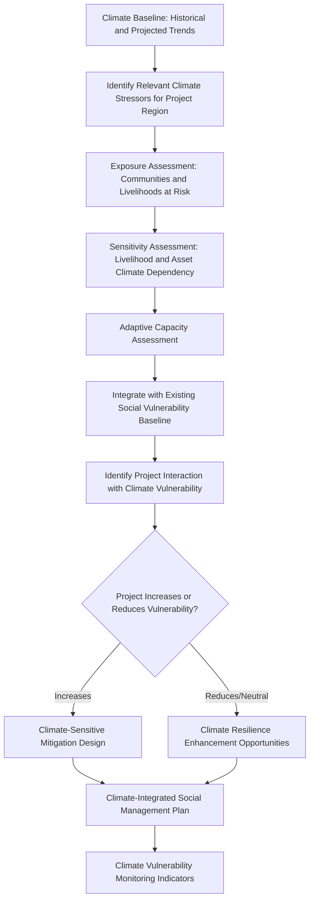

## Climate Vulnerability and Social Risk Assessment

### Overview

Climate vulnerability and social risk assessment examines two related but distinct analytical questions within the SIA process: how climate change will alter the physical and social context in which a project operates over its lifetime (climate risk *to* the project and the communities around it), and how the project itself may increase or reduce affected communities' capacity to cope with climate-related stress (the project's contribution to or reduction of social climate vulnerability). This is a comparatively recent addition to mainstream SIA practice relative to the resettlement, cumulative, and human rights frameworks covered earlier in this chapter, and its methodology draws heavily on the climate adaptation and disaster risk reduction fields rather than originating within social assessment practice itself. Integration into SIA matters because climate vulnerability is not evenly distributed — the same communities frequently identified as socially vulnerable under standard SIA criteria (resource-dependent livelihoods, limited asset base, marginalized tenure status) are frequently also those with the least adaptive capacity to climate stress, meaning climate risk and social vulnerability compound rather than operate as independent assessment tracks.

This topic covers the distinction between climate risk to the project and climate vulnerability of affected communities, core assessment methodology, integration with existing SIA vulnerability frameworks, and the resulting implications for mitigation and adaptation planning.

---

### Two Distinct Analytical Questions

**Key Points**

- **Physical climate risk to the project:** How changing climate conditions (temperature, precipitation patterns, extreme weather frequency/intensity, sea level rise where relevant) may affect the project's own infrastructure, operations, and the communities within its area of influence over the project's operational lifetime — an engineering/physical risk question with social dimensions.
- **Social climate vulnerability of affected communities:** The pre-existing and project-influenced capacity of communities to anticipate, cope with, and recover from climate-related stresses and shocks — a social capacity question examining whether the project increases or decreases community resilience, independent of whether the project's own infrastructure is physically climate-resilient.
- These two questions are related (a project vulnerable to climate impacts may fail to deliver intended community benefits, or may generate secondary community impacts if project infrastructure fails during a climate event) but require distinct assessment approaches and should not be conflated into a single undifferentiated "climate risk" analysis.

---

### Climate Vulnerability Assessment Framework

The standard vulnerability framework used across climate adaptation and disaster risk literature decomposes vulnerability into three components, directly applicable to social risk assessment:

$$\text{Vulnerability} = f(\text{Exposure}, \text{Sensitivity}, \text{Adaptive Capacity})$$

- **Exposure:** The degree to which a community or system is subject to climate stressors (e.g., a coastal community's exposure to sea level rise and storm surge; an agricultural community's exposure to altered precipitation patterns and drought frequency).
- **Sensitivity:** The degree to which a community's wellbeing or livelihood is affected by a given climate stressor, given its existing characteristics (e.g., a community whose livelihood is entirely rain-fed agriculture is more sensitive to precipitation variability than one with diversified, less climate-dependent income sources).
- **Adaptive Capacity:** The ability of a community to adjust, cope with, or recover from climate stress — shaped by asset base, access to information and services, social capital/networks, institutional support, and diversification of livelihood strategies.

**Key Points**

- Vulnerability is high where exposure and sensitivity are high and adaptive capacity is low — the same three-factor structure that underlies standard vulnerable-group identification in resettlement and livelihood planning, applied specifically to climate stress rather than project-displacement stress, which is why these two vulnerability lenses should be integrated rather than run as entirely separate assessment tracks.

---

### Assessment Process

---

### Step 1: Climate Baseline and Stressor Identification

- Establishes historical climate trends and available climate projections (temperature, precipitation, extreme event frequency, sea level rise where relevant) for the project region and timeframe, typically drawing on national meteorological services, regional climate models, and, where available, downscaled projections specific to the project area.
- Identifies which climate stressors are most relevant to the project context — a coastal project's relevant stressor set differs substantially from an upland agricultural region's, requiring context-specific rather than generic climate risk screening.

### Step 2: Exposure Assessment

- Maps which affected communities, livelihoods, and assets are physically exposed to identified climate stressors — drawing on the same geographic and household-level baseline data established under standard SIA socioeconomic assessment, extended specifically to climate exposure mapping (flood zones, drought-prone areas, heat exposure).

### Step 3: Sensitivity Assessment

- Assesses the degree to which affected communities' livelihoods and wellbeing are dependent on climate-sensitive factors — directly building on the livelihood assessment work already conducted for the broader SIA (agricultural dependency, water-resource-dependent livelihoods, forest-dependent livelihoods) rather than requiring a wholly separate livelihood inventory.

### Step 4: Adaptive Capacity Assessment

- Examines the factors shaping communities' capacity to cope with and recover from climate stress: asset diversification, access to financial services and social protection, social network strength, access to climate information/early warning systems, and institutional/governmental support capacity.
- **Key Points:** Adaptive capacity assessment overlaps substantially with the vulnerability factors already identified for resettlement and livelihood restoration purposes (asset base, livelihood diversification, institutional support access), reinforcing that climate vulnerability assessment should be integrated with, not duplicative of, existing SIA vulnerability analysis.

---

### Integration with Existing SIA Vulnerability Frameworks

| Existing SIA Vulnerability Factor | Climate Vulnerability Relevance |
| --- | --- |
| Land-dependent livelihoods (resettlement/livelihood chapter) | High sensitivity to precipitation/temperature variability affecting agricultural productivity |
| Female-headed households (gender impact assessment) | Often lower asset base and access to formal financial/institutional support, reducing adaptive capacity |
| Indigenous Peoples and customary resource users | Traditional knowledge systems may provide adaptive capacity, but formal institutional support access is often more limited |
| Landless laborers | High sensitivity to climate-driven agricultural livelihood disruption with minimal asset buffer |
| Communities dependent on common property resources | High exposure to climate-driven resource degradation (water scarcity, forest resource decline) |

**Key Points**

- Rather than treating climate vulnerability as an entirely new vulnerability category requiring separate identification, leading practice overlays climate exposure and sensitivity analysis onto the vulnerable groups already identified through standard SIA processes, since the populations facing compounding vulnerability (socially vulnerable *and* climate vulnerable) require the most attention in mitigation design.

---

### Project Interaction with Community Climate Vulnerability

A project can affect community climate vulnerability in either direction, independent of the project's own physical climate resilience:

**Increasing Vulnerability**

- Resettlement to sites with higher climate exposure (e.g., flood-prone or water-scarce replacement land) than the original location — a direct interaction with the resettlement site selection standards covered earlier in this course, which should explicitly incorporate climate exposure as a site selection criterion.
- Loss of climate-adaptive livelihood strategies (e.g., diversified agroforestry systems) replaced with less climate-resilient alternatives through economic displacement.
- Reduced access to natural resources that previously served as a climate buffer or coping mechanism (e.g., forest products providing income diversification during agricultural stress periods).

**Reducing Vulnerability / Enhancing Resilience**

- Livelihood restoration programs deliberately designed toward more climate-resilient livelihood diversification rather than replicating a climate-sensitive pre-project livelihood profile.
- Infrastructure investments (water systems, roads) that incidentally or deliberately improve community climate resilience alongside their primary project purpose.
- Community development/enhancement measures explicitly targeting climate adaptive capacity (early warning system access, climate-resilient agricultural training).

**Example**

A resettlement site selection process for a hydropower project evaluates candidate sites primarily against standard criteria — land availability, proximity to services, host community capacity — without an explicit climate exposure screen. The selected site, while satisfactory against those criteria, sits in a location projected to experience significantly increased flood frequency under regional climate projections, a factor the original site selection process did not examine. A climate-integrated site selection process, applying exposure assessment as an explicit criterion alongside the standard set, would have identified this risk before construction, either prompting site reconsideration or triggering climate-resilient site infrastructure design (elevated construction, drainage capacity) as a deliberate mitigation measure rather than an unaddressed latent risk discovered only after resettlement is complete.

---

### Mitigation and Adaptation Integration

- Climate vulnerability findings should be integrated into the same Social Management Plan structure established earlier in this course, rather than producing a standalone climate adaptation plan disconnected from resettlement, livelihood restoration, and host community mitigation measures.
- Resettlement site selection criteria (established earlier in this chapter) should explicitly incorporate climate exposure assessment as a standard criterion, not an optional add-on.
- Livelihood restoration strategy selection should weigh climate resilience of the proposed replacement livelihood against the climate sensitivity of the original livelihood — an opportunity to reduce, rather than replicate, pre-existing climate vulnerability where feasible.

---

### Monitoring Considerations

| Indicator Category | Example Metric |
| --- | --- |
| Exposure | Proportion of affected/resettled population in identified climate-exposed zones |
| Sensitivity | Proportion of household income derived from climate-sensitive livelihood sources |
| Adaptive Capacity | Access to climate information/early warning systems; livelihood diversification index; access to financial/social protection services |
| Project Interaction | Change in community climate vulnerability profile pre- versus post-project (drawing on the same before/after comparison logic used in resettlement completion audits) |

[Unverified] Specific climate vulnerability indicator frameworks and thresholds vary by sector, lender requirement, and regional climate context, and should be confirmed against applicable current guidance for the specific project location and financing structure, given this is an actively evolving area of assessment practice.

---

### Common Climate Vulnerability Assessment Failure Modes

- **Conflating physical climate risk to project infrastructure with social climate vulnerability of communities**, producing an engineering-focused climate risk assessment that omits the community capacity dimension entirely.
- **Treating climate vulnerability as an entirely separate assessment disconnected from existing SIA vulnerability findings**, duplicating effort and missing compounding vulnerability patterns.
- **Resettlement site selection without explicit climate exposure screening**, replicating or increasing climate risk exposure through relocation decisions made against non-climate criteria alone.
- **Livelihood restoration replicating climate-sensitive pre-project livelihoods** without considering climate-resilient diversification opportunities.
- **No monitoring of climate vulnerability trends post-implementation**, treating climate assessment as a one-time baseline exercise rather than an ongoing consideration given the multi-decade operational life of most major projects.

---

**Next Steps**

- Resettlement site selection and development standards
- Livelihood restoration planning and income restoration strategies
- Cumulative impact assessment methodology
- Regional and area-based social assessment
- Disaster risk reduction integration within social management planning
- Monitoring and evaluation indicator frameworks across the broader SIMP