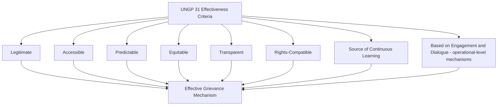

## UN Guiding Principle 31 Effectiveness Criteria

### Overview

UN Guiding Principle 31 (UNGP 31), part of the United Nations Guiding Principles on Business and Human Rights, sets out eight criteria that non-judicial grievance mechanisms — including company-level, project-based grievance mechanisms — should meet to be effective in practice. Where the earlier chapter on Human Rights Impact Assessment methodology established access to remedy as a distinct UNGP-derived assessment requirement, UNGP 31 supplies the specific, operational standard against which any grievance mechanism's effectiveness is actually measured. This makes UNGP 31 the single most widely referenced benchmark in SIA and ESIA practice for designing and auditing project-level Grievance Redress Mechanisms (GRMs) — referenced not only in human rights-specific assessment but as the default effectiveness standard applied to resettlement grievance mechanisms, community GRMs, and broader SIMP-level complaint-handling systems covered elsewhere in this course.

This topic sets out each of the eight UNGP 31 criteria in operational detail, how they interrelate, and how they are applied to assess and design grievance mechanisms in project contexts.

---

### Origin and Status of UNGP 31

**Key Points**

- UNGP 31 sits within Pillar III of the UN Guiding Principles (Access to Remedy), operationalizing what "effective" means for the non-judicial, operational-level grievance mechanisms that Pillar III calls on business enterprises to establish or participate in.
- The criteria are explicitly framed as a *benchmark for designing, revising, or assessing* a non-judicial grievance mechanism to ensure its effectiveness in practice — they are not merely aspirational principles but a structured diagnostic tool intended for direct application.
- UNGP 31 applies to state-based non-judicial mechanisms and company-level/operational mechanisms alike, though in project SIA practice it is most commonly applied to the latter — the grievance mechanisms proponents establish at project or resettlement level.

---

### The Eight Effectiveness Criteria

**1. Legitimate**

- The mechanism must enable trust from the stakeholder groups for whose use it is intended, and be accountable for the fair conduct of grievance processes.
- Operationally: stakeholders must perceive the mechanism as genuinely impartial and not merely a tool controlled entirely by the party whose conduct is being grieved — often requiring some form of independent oversight, community representation in mechanism governance, or third-party monitoring involvement (e.g., the Multi-Partite Monitoring Team structures established under institutional roles earlier in this course).

**2. Accessible**

- The mechanism must be known to all stakeholder groups for whose use it is intended, and provide adequate assistance for those who may face particular barriers to access.
- Operationally: multiple accessible intake channels (in-person, phone, written, third-party submission), materials and processes in local language(s) and appropriate literacy levels, no cost barrier to stakeholders, and specific accommodation for groups facing structural access barriers — directly linking to the gender-responsive and vulnerability-differentiated design principles established under gender impact assessment and vulnerable group identification earlier in this course.

**3. Predictable**

- The mechanism must provide a clear and known procedure with an indicative time frame for each stage, clarity on the types of process and outcome available, and a means of monitoring implementation of any outcome.
- Operationally: a published, step-by-step grievance procedure (intake, acknowledgment, investigation, decision, appeal, closure) with defined timelines at each stage, so complainants know what to expect and when — a standard frequently weaker in practice than in mechanism design documents, since actual adherence to stated timelines is what predictability requires, not merely the existence of a documented procedure.

**4. Equitable**

- The mechanism must seek to ensure aggrieved parties have reasonable access to the sources of information, advice, and expertise necessary to engage in a grievance process on fair, informed, and respectful terms.
- Operationally: addressing the inherent power imbalance between an individual complainant and a project proponent — for example, ensuring complainants have access to independent information or advice (not solely information provided by the party they are grieving against) and are not required to navigate a complex process without support.

**5. Transparent**

- The mechanism must keep parties to a grievance informed about its progress, and provide sufficient information about the mechanism's performance to build confidence in its effectiveness and meet any public interest at stake.
- Operationally: individual complainants receive status updates on their own case, and the mechanism as a whole publishes aggregate performance data (case volume, resolution rates, average resolution time, common grievance categories) — the latter directly feeding into the grievance resolution review component of resettlement completion audits established earlier in this course.

**6. Rights-Compatible**

- Outcomes and remedies must accord with internationally recognized human rights standards.
- Operationally: this is the criterion most distinctly derived from the human rights framework rather than general grievance-handling best practice — a mechanism could theoretically be legitimate, accessible, predictable, equitable, and transparent while still producing outcomes inconsistent with human rights standards (e.g., a remedy that does not actually restore what was lost, or a process that pressures complainants to waive rights as a condition of resolution); rights-compatibility requires an independent check against this substantive standard, not merely procedural fairness.

**7. A Source of Continuous Learning**

- The mechanism should draw on relevant measures to identify lessons for improving the mechanism and preventing future grievances and harms.
- Operationally: grievance data should feed back into project design and mitigation planning — a recurring grievance pattern (e.g., repeated disputes over a specific compensation category) should trigger review of the underlying entitlement matrix or valuation methodology, not simply repeated case-by-case resolution of the same systemic issue, directly linking the grievance mechanism to the adaptive management and monitoring feedback loops established under resettlement completion audits.

**8. Based on Engagement and Dialogue (Operational-Level Mechanisms)**

- Applicable specifically to operational-level (company/project) mechanisms: consulting the stakeholder groups for whose use the mechanism is intended on its design and performance, and focusing on dialogue as the means to address and resolve grievances.
- Operationally: the mechanism's design should itself be a product of consultation with affected communities (not solely designed by the proponent and presented as a fait accompli), and the mechanism's operating approach should favor dialogue-based resolution over purely adversarial or unilateral proponent decision-making — this criterion distinguishes operational-level mechanisms from state-based judicial mechanisms, for which it does not apply in the same way.

---

### Applying the Criteria: Diagnostic Use

| Criterion | Diagnostic Question |
| --- | --- |
| Legitimate | Do affected stakeholders trust the mechanism, or do they perceive it as controlled by the party being grieved against? |
| Accessible | Can all stakeholder groups — including those with literacy, language, mobility, or gender-related access barriers — actually use the mechanism? |
| Predictable | Is there a published procedure with defined timelines, and is it actually followed in practice? |
| Equitable | Do complainants have fair access to information and advice, or are they structurally disadvantaged relative to the proponent? |
| Transparent | Are individual complainants kept informed of case progress, and is aggregate performance data publicly available? |
| Rights-Compatible | Do outcomes actually accord with human rights standards, independent of whether the process itself was procedurally fair? |
| Continuous Learning | Does grievance data feed back into project design and mitigation improvement, or only resolve individual cases in isolation? |
| Engagement and Dialogue | Was the mechanism's design itself consulted on with affected stakeholders, and does it favor dialogue over unilateral decision-making? |

**Key Points**

- The eight criteria are interdependent, not independently sufficient — a mechanism can satisfy several criteria while failing others, and UNGP commentary is explicit that all criteria should be considered together rather than treating strong performance on some as compensating for weakness on others.
- In practice, "Accessible" and "Legitimate" are the criteria most frequently found deficient in project grievance mechanism audits — mechanisms often exist on paper and meet predictability/transparency documentation standards while remaining functionally inaccessible or distrusted by the populations they are meant to serve.

---

### Case Illustration

**Example**

A resettlement grievance mechanism is documented in the RAP with a clear procedural flowchart, defined 30-day resolution timelines, and a published annual case-summary report — satisfying predictability and transparency on paper. An independent audit, however, finds that the sole intake point is a single office located in the project's administrative headquarters, several hours' travel from the resettlement site, with no phone or written-submission option and materials available only in the national language rather than the local dialect spoken by a significant proportion of affected households. The mechanism also lacks any community representation in its oversight, with case decisions made solely by proponent staff. Assessed against the full UNGP 31 criteria set, the mechanism fails on Accessibility (physical and language barriers) and Legitimacy (no independent oversight or community trust-building mechanism) despite performing adequately on Predictability and Transparency — illustrating why effectiveness assessment must apply all eight criteria rather than relying on the subset most easily verified through documentation review alone.

---

### Relationship to Broader SIA Grievance Practice

- UNGP 31 provides the effectiveness benchmark against which the resettlement-specific grievance mechanisms, GRM offices established under institutional roles and responsibility, and human rights impact assessment's access-to-remedy component (all covered earlier in this course) should be designed and periodically audited — it is the unifying standard rather than a separate, parallel grievance framework.
- Lender safeguard standards (IFC Performance Standards, World Bank ESS) that require project-level grievance mechanisms typically reference or closely mirror the UNGP 31 criteria as their operative effectiveness standard, making UNGP 31 the de facto cross-framework benchmark regardless of which specific lender or regulatory instrument governs a given project.

---

### Common UNGP 31 Application Failure Modes

- **Documentation-only compliance:** A grievance mechanism designed and documented to satisfy the criteria on paper without field verification of actual accessibility, timeline adherence, or stakeholder trust.
- **Treating predictability and transparency as sufficient**, while accessibility and legitimacy — the criteria requiring genuine stakeholder-facing verification rather than internal process documentation — remain unassessed.
- **No mechanism design consultation**, violating the engagement-and-dialogue criterion by presenting a proponent-designed mechanism to communities without their input into its structure.
- **No feedback loop from grievance data to project design**, satisfying individual case resolution while failing the continuous-learning criterion by allowing systemic issues to recur unaddressed.
- **Rights-compatibility unassessed:** Procedural fairness criteria evaluated while outcomes are never independently checked against substantive human rights standards.

---

**Next Steps**

- Grievance mechanism design and institutional placement
- Access to remedy mechanisms and judicial/non-judicial pathways
- Human rights impact assessment methodology
- Resettlement completion audits and grievance resolution review
- Gender-responsive grievance mechanism design
- Multi-Partite Monitoring Team composition and independent oversight structures