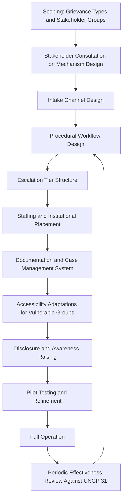
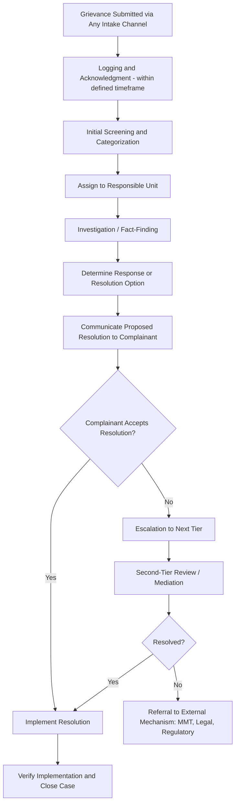

## Designing Operational-Level Grievance Mechanisms

### Overview

An operational-level Grievance Redress Mechanism (GRM) is the standing, project-controlled system through which affected persons and communities can raise concerns, complaints, or disputes related to a project and have them addressed. Where the prior item established UN Guiding Principle 31's eight effectiveness criteria as the benchmark against which any grievance mechanism should be judged, this topic addresses the practical design process: how to translate those criteria into an actual operating system — intake channels, procedural workflow, staffing, escalation tiers, documentation, and closure standards. A GRM designed without deliberate attention to each design decision's effect on legitimacy, accessibility, predictability, and the remaining UNGP 31 criteria tends to default toward whatever is administratively convenient for the proponent, which is precisely the pattern that produces the accessibility and legitimacy failures most commonly identified in grievance mechanism audits.

This topic covers the design process end-to-end: scoping, intake channel design, procedural workflow, escalation structure, staffing and institutional placement, documentation systems, and the specific design adaptations required for different stakeholder groups.

---

### Design Process Overview

---

### Step 1: Scoping — Grievance Types and Stakeholder Groups

- Defines the scope of issues the mechanism will address: resettlement/compensation disputes, environmental impact complaints (dust, noise, water), labor-related grievances from the project workforce, community health and safety concerns, and broader social impact complaints — scope should be broad enough to capture the full range of impacts identified across the SIA process (resettlement, livelihood, health, cumulative, gender-differentiated impacts) rather than narrowly limited to compensation disputes alone.
- Identifies the full range of stakeholder groups the mechanism must serve: directly affected persons, host communities (per the host community impacts framework established earlier), project workforce, and — depending on project type — downstream or indirectly affected populations identified through cumulative impact assessment.

**Key Points**

- A common scoping error is designing the GRM around resettlement/compensation grievances alone, since that is often the most visible and anticipated impact category, while leaving other significant grievance sources (environmental nuisance, health concerns, gender-based violence, labor disputes) without a clear pathway into the same system — fragmenting grievance handling across multiple ad hoc channels rather than one accessible, known mechanism.

---

### Step 2: Stakeholder Consultation on Mechanism Design

- Directly implementing the UNGP 31 "engagement and dialogue" criterion: the mechanism's design — intake channels, procedural steps, escalation structure — should be developed with input from the stakeholder groups intended to use it, not designed solely by the proponent and presented as a finished system.
- Consultation should specifically probe how communities currently raise and resolve disputes (existing customary or community-based dispute resolution practices), since an effective GRM design often incorporates rather than replaces trusted existing mechanisms, particularly in contexts with established traditional or community-level conflict resolution structures.

---

### Step 3: Intake Channel Design

| Channel Type | Accessibility Consideration |
| --- | --- |
| In-person (field office, community liaison) | Physical proximity to affected communities; avoid single centralized location requiring significant travel |
| Phone / SMS / hotline | Requires phone access and literacy considerations; useful for low-mobility or geographically dispersed stakeholders |
| Written submission (suggestion box, letter) | Requires literacy; should not be the sole channel given literacy barriers common in many affected communities |
| Third-party submission | Via community leader, local NGO, or peoples' organization — important for stakeholders facing direct-engagement barriers (fear of retaliation, mobility, language) |
| Community liaison/field staff | Proactive collection during routine field presence, capturing grievances from those unlikely to initiate formal submission themselves |
| Digital/app-based (where appropriate) | Only where genuinely accessible to the target population; risk of excluding lower-connectivity or lower-literacy groups if treated as a primary rather than supplementary channel |

**Key Points**

- Multiple, redundant intake channels are standard design practice — no single channel is accessible to all stakeholder groups, and a mechanism relying on one channel (commonly a single physical office) is a leading cause of the accessibility failures identified under UNGP 31 assessment.
- Channels should allow anonymous or confidential submission as an option, particularly important for grievances involving sensitive issues (gender-based violence, labor rights violations, complaints against project security personnel) where identified submission carries retaliation risk.

---

### Step 4: Procedural Workflow Design

**Core Workflow Stages**

1. **Logging and Acknowledgment:** Every grievance is logged with a unique case identifier and acknowledged to the complainant within a defined, published timeframe (commonly a matter of days) — satisfying the predictability criterion from UNGP 31.
2. **Screening and Categorization:** Grievances are categorized by type (compensation, environmental, labor, health, safety, other) and routed to the appropriate responsible unit, consistent with the institutional roles framework established earlier in this course.
3. **Investigation:** Fact-finding proportionate to the grievance's complexity and severity — a straightforward administrative error may require minimal investigation, while a contested compensation valuation dispute may require field verification and specialist input.
4. **Resolution and Communication:** A proposed resolution is communicated clearly to the complainant, with the reasoning explained — not merely a decision delivered without justification.
5. **Verification and Closure:** Where a resolution involves a commitment (payment, corrective action), closure requires verified implementation, not merely proponent assertion that the matter is resolved — directly linking to the transparency and continuous-learning criteria under UNGP 31.

---

### Step 5: Escalation Tier Structure

- Standard GRM design uses a tiered escalation structure: **Tier 1** (field/community-level resolution, handled by community liaison or site-level staff for straightforward matters), **Tier 2** (project/proponent management-level review for unresolved or more complex grievances), and **Tier 3** (external referral — Multi-Partite Monitoring Team, independent mediation, regulatory authority, or formal legal recourse for grievances unresolved at the project level or involving matters outside the proponent's authority to resolve).
- Escalation must be genuinely available to complainants dissatisfied with a lower-tier resolution, and the GRM must not require complainants to exhaust its internal tiers before accessing external or judicial remedy — consistent with the UNGP principle that operational-level mechanisms should not preclude access to other remedy pathways.

**Key Points**

- Tier 3 external referral pathways should be established and functioning *before* the GRM begins accepting grievances, not developed reactively once an internal resolution attempt fails — an escalation pathway that exists only in theory undermines both predictability and legitimacy.

---

### Step 6: Staffing and Institutional Placement

- Directly builds on the institutional roles and responsibility framework established earlier in this course: a designated Grievance Officer or GRM unit with clear reporting lines, adequate staffing relative to anticipated case volume, and sufficient seniority/authority to escalate matters requiring management-level decision or budget commitment.
- Staff should receive specific training in grievance handling, conflict resolution, and — for projects with known gender-based violence or sensitive-issue risk — trauma-informed and confidential handling protocols.
- Institutional placement should support, not undermine, the legitimacy criterion: a GRM staffed entirely by personnel with no accountability beyond the proponent's own management chain, with no community or independent oversight role, is structurally more vulnerable to legitimacy challenges than one incorporating some independent or community-representative oversight function.

---

### Step 7: Documentation and Case Management

| System Component | Purpose |
| --- | --- |
| Case registry/log | Unique identifier, date, category, status for every grievance received |
| Case files | Investigation records, correspondence, resolution documentation per case |
| Aggregate reporting | Periodic (e.g., quarterly) summary statistics: volume by category, resolution rate, average resolution time |
| Trend analysis | Identification of recurring grievance patterns feeding back into project design review — the continuous-learning function under UNGP 31 |

**Key Points**

- Case management should support disaggregated reporting (by sex, by grievance category, by resolution outcome) consistent with the gender-responsive and vulnerability-differentiated monitoring principles established earlier in this course, enabling identification of whether specific stakeholder groups experience systematically different access or resolution outcomes.

---

### Accessibility Adaptations for Specific Stakeholder Groups

- **Low-literacy populations:** Oral/verbal submission channels, pictorial or verbally-explained procedural information, community liaison-mediated submission.
- **Women:** Female intake staff availability, confidential submission options particularly for gender-based violence-related grievances, timing/location of intake points sensitive to women's mobility and time constraints — directly implementing the gender-responsive design principles from the gender impact assessment framework.
- **Indigenous Peoples:** Incorporation of or coordination with customary dispute resolution mechanisms where appropriate and where affected communities express this preference, materials in relevant indigenous languages.
- **Geographically dispersed or remote populations:** Mobile/outreach intake (periodic field visits by GRM staff) supplementing fixed intake points.
- **Vulnerable/marginalized groups generally:** Third-party or advocate-assisted submission options for those facing direct-engagement barriers.

---

### Case Illustration

**Example**

A project initially designs its GRM around a single field office intake point with written-submission-only procedures, reflecting standard administrative practice but not stakeholder input. Early case data shows near-zero grievance submissions despite ongoing informal community complaints observed by field staff during routine site visits — a strong signal that the mechanism, however procedurally sound on paper, is not functionally accessible. A design revision, informed by community consultation, adds a phone hotline, verbal submission via community liaison officers during routine field visits, and a confidential channel for gender-based violence-related concerns, along with materials translated into the local dialect. Grievance volume increases substantially following the revision — not because underlying issues increased, but because the redesigned intake channels finally made the existing grievances visible and addressable, illustrating that low reported grievance volume is not reliable evidence of low actual grievance incidence when intake design carries structural accessibility barriers.

---

### Design Checklist Against UNGP 31 Criteria

| UNGP 31 Criterion | Design Decision Addressing It |
| --- | --- |
| Legitimate | Independent/community oversight role; stakeholder consultation on design |
| Accessible | Multiple intake channels; language/literacy accommodation; no cost barrier |
| Predictable | Published procedure with defined timelines at each stage; adherence tracked |
| Equitable | Complainant access to independent information/advice; support through the process |
| Transparent | Case status updates to individual complainants; published aggregate performance data |
| Rights-Compatible | Outcomes reviewed against human rights standards, not solely procedural compliance |
| Continuous Learning | Trend analysis feeding back into project design and mitigation review |
| Engagement and Dialogue | Design consulted on with stakeholders; dialogue-based resolution approach favored over unilateral decision |

---

### Common Design Failure Modes

- **Single intake channel**, systematically excluding stakeholder groups unable to use that specific channel.
- **Compensation-only scope**, leaving environmental, health, labor, and gender-related grievances without a clear pathway.
- **No stakeholder consultation on mechanism design**, violating the engagement-and-dialogue criterion from the outset.
- **Undefined or unenforced timelines**, undermining predictability even where a procedure is nominally documented.
- **No functioning external escalation pathway**, leaving Tier 3 referral theoretical rather than operational.
- **No disaggregated case data**, preventing identification of systematically underserved stakeholder groups.
- **Treating low grievance volume as evidence of low impact severity**, rather than testing whether it reflects an accessibility barrier.

---

**Next Steps**

- UN Guiding Principle 31 effectiveness criteria
- Access to remedy mechanisms and judicial/non-judicial pathways
- Resettlement grievance redress mechanism design and case management
- Gender-based violence-sensitive grievance handling protocols
- Institutional roles and responsibility for implementation
- Resettlement completion audits and grievance resolution review