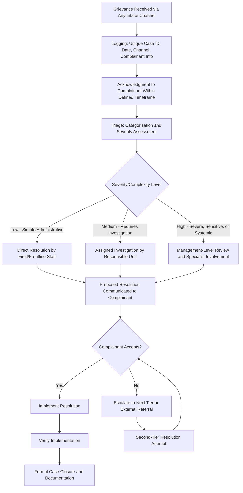
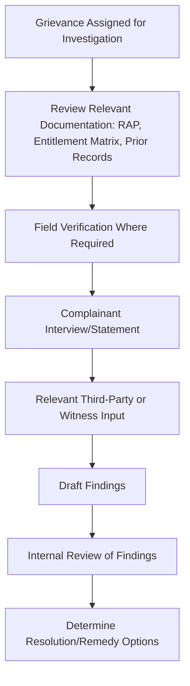

## Grievance Intake, Triage, and Resolution Workflows

### Overview

Grievance intake, triage, and resolution workflows are the operational core of a Grievance Redress Mechanism — the specific, step-by-step processes that determine what actually happens from the moment a complaint is received to the moment it is verifiably closed. Where the prior item covered GRM design at the architectural level (intake channels, escalation tiers, staffing, institutional placement), this topic goes one level deeper into the workflow mechanics themselves: how grievances are logged and classified, how severity and complexity determine the resolution pathway, how investigation and decision-making are structured, and how case closure is verified rather than merely declared. Workflow design quality is where the UN Guiding Principle 31 criteria of predictability, equitability, and transparency are either delivered in practice or quietly undermined by inconsistent, ad hoc case handling — a mechanism can have excellent architectural design and still fail stakeholders through inconsistent day-to-day workflow execution.

This topic covers the intake-to-closure workflow in operational detail: logging standards, triage/categorization logic, differentiated resolution pathways by grievance type and severity, decision documentation, and closure verification.

---

### End-to-End Workflow

---

### Stage 1: Intake and Logging

- Every grievance, regardless of intake channel (in-person, phone, written, third-party, field-collected), must be logged into a single, centralized case management system with a unique case identifier — fragmentation across multiple untracked logs (a notebook at one field office, a separate spreadsheet for phone complaints) is a common and preventable source of lost or unaddressed grievances.
- Minimum logging fields typically include: unique case ID, date and channel of receipt, complainant identity (or anonymous/confidential flag), grievance description in the complainant's own words, initial category, and assigned responsible staff member.

**Key Points**

- Logging should occur at the point of intake, not retrospectively batched — a grievance raised verbally to a field liaison officer during a site visit must be logged with the same rigor and timeliness as one submitted through a formal office channel, or the mechanism systematically under-captures grievances from stakeholders using less formal channels, directly undermining the accessibility gains from the multi-channel design covered in the prior item.

---

### Stage 2: Acknowledgment

- A defined, published acknowledgment timeframe (commonly within a matter of days of receipt) confirms to the complainant that their grievance has been received and provides the case identifier for future reference — satisfying the predictability criterion under UNGP 31 from the very first interaction.
- Acknowledgment should include a plain-language explanation of what happens next and an estimated timeframe for initial response, calibrated to the complexity tier the grievance is likely to fall into (even before formal triage is complete, a rough expectation can be set).

---

### Stage 3: Triage — Categorization and Severity Assessment

**Categorization**

- Grievances are sorted into defined categories aligned with the GRM's scope established under mechanism design: compensation/valuation disputes, resettlement/relocation issues, environmental nuisance (dust, noise, water), health and safety concerns, labor-related complaints, gender-based violence or sensitive personal-safety matters, and general project conduct/community relations issues.
- Categorization determines routing to the appropriate responsible unit under the institutional roles framework — a compensation dispute routes differently than an environmental nuisance complaint or a gender-based violence disclosure, each requiring different specialist involvement.

**Severity Assessment**

- Triage should assess severity independent of and prior to full investigation, using indicative criteria: potential for harm (physical, financial, psychosocial), number of people affected, urgency (ongoing versus historical harm), and sensitivity (personal safety, gender-based violence, security-related).
- **Key Points:** This severity-first triage logic mirrors the severity-based prioritization principle established under Human Rights Impact Assessment methodology earlier in this course — grievances should not be queued purely in order of receipt or by administrative convenience, since a high-severity grievance received later should generally receive faster attention than a low-severity grievance received earlier.

---

### Differentiated Resolution Pathways by Complexity Tier

| Tier | Characteristics | Resolution Pathway | Typical Timeframe |
| --- | --- | --- | --- |
| Low Complexity | Administrative error, straightforward factual dispute, single clear remedy | Direct resolution by frontline/field staff with limited escalation | Days |
| Medium Complexity | Requires fact-finding, valuation review, or coordination across units | Assigned investigation by responsible technical unit, documented findings | Weeks |
| High Complexity / High Severity | Systemic issue, disputed facts, significant financial/physical/psychosocial stakes, sensitive subject matter (e.g., gender-based violence, security-related) | Management-level review, specialist involvement (legal, technical, psychosocial support as relevant), potential external referral | Weeks to months, with interim support measures where harm is ongoing |

**Key Points**

- Sensitive-issue grievances (gender-based violence, security misconduct, other personal-safety matters) should never be routed through a standard administrative workflow regardless of apparent severity classification — these require specialized, confidential, survivor-centered handling protocols distinct from the general workflow, consistent with the gender-based violence risk considerations established under gender impact assessment approaches.
- A tiered pathway prevents two common failure patterns: over-processing simple grievances through unnecessarily bureaucratic investigation (delaying resolution and frustrating complainants), and under-processing complex or severe grievances through an inappropriately abbreviated review.

---

### Investigation and Fact-Finding

- Investigation proportionate to complexity: a disputed compensation calculation may require re-verification against the Detailed Measurement Survey and valuation schedule established under compensation frameworks earlier in this course; an environmental nuisance complaint may require field monitoring data review.
- Complainants should have opportunity to present their account and supporting information as part of the investigation — consistent with the equitable-access criterion under UNGP 31 — rather than investigation proceeding solely on the basis of proponent-held records.

---

### Resolution, Communication, and Complainant Response

- Proposed resolutions should be communicated to complainants with clear reasoning — not a bare outcome statement — enabling the complainant to understand the basis for the decision and meaningfully evaluate whether to accept it.
- Where the complainant does not accept the proposed resolution, the workflow must provide a genuine escalation pathway (per the tiered escalation structure established under GRM design) rather than treating the initial resolution as final by default.

**Example**

A farmer submits a grievance disputing the compensation calculated for a lost fruit tree, asserting the tree was more mature and productive than the valuation schedule's assumed category. Triage classifies this as a medium-complexity valuation dispute, routed to the resettlement/compensation unit rather than resolved administratively at first contact. Investigation includes a field re-verification of the tree's condition and a review against the crop/tree valuation methodology established under compensation frameworks and asset valuation. The re-assessment confirms the farmer's claim, and the resolution — a revised, documented valuation and supplementary payment — is communicated with the specific basis for the revision explained. The case is closed only once the supplementary payment is verified as disbursed and acknowledged by the complainant, not simply once the revised determination is made.

---

### Case Closure and Verification

**Key Points**

- Closure requires *verified implementation* of any committed resolution (payment disbursed and acknowledged, corrective action completed and confirmed), not merely a determination or promise recorded as the case outcome — a gap between "resolution decided" and "resolution delivered" is a common point where case management systems overstate actual resolution rates.
- Where a resolution involves an ongoing commitment (e.g., a monitoring period, phased corrective action), the case should remain open or flagged for follow-up verification rather than closed prematurely on the basis of the initial commitment alone.
- Closed cases should retain complete documentation (investigation findings, communication record, verification evidence) supporting both individual case audit and the aggregate trend analysis feeding into the continuous-learning function established under UNGP 31.

---

### Workflow Performance Monitoring

| Metric | Purpose |
| --- | --- |
| Time to acknowledgment | Predictability adherence |
| Time to resolution, by complexity tier | Identifies bottlenecks and whether tiered pathways are functioning as designed |
| Resolution acceptance rate | Indicates whether resolutions are perceived as fair (low acceptance may signal equity or legitimacy issues) |
| Escalation rate | Proportion of cases requiring escalation beyond initial resolution attempt |
| Case reopening rate | Indicates whether "closed" cases were genuinely resolved or prematurely closed |
| Category and severity distribution trends | Feeds continuous-learning function — recurring categories signal systemic issues requiring upstream project design review |

**Key Points**

- Disaggregating these metrics by stakeholder group (sex, vulnerability status, grievance category) — consistent with the disaggregated monitoring principle established throughout this course — allows identification of whether specific groups experience systematically slower resolution, lower acceptance rates, or higher escalation rates, which would indicate an equity problem in workflow execution even where the documented procedure appears neutral on its face.

---

### Common Workflow Failure Modes

- **Fragmented, untracked logging** across multiple informal channels, causing grievances raised informally (e.g., to field staff) to be lost rather than entering the formal workflow.
- **Uniform processing regardless of severity**, either over-bureaucratizing simple cases or under-resourcing severe/sensitive cases routed through a standard administrative pathway.
- **Sensitive-issue grievances processed through the general workflow** without specialized, confidential handling protocols.
- **Resolution communicated without reasoning**, undermining the complainant's ability to meaningfully evaluate or contest the outcome.
- **Closure declared on decision rather than verified delivery**, overstating actual resolution performance in aggregate reporting.
- **No disaggregated performance monitoring**, masking differential workflow performance across stakeholder groups.
- **No feedback loop from recurring grievance patterns to upstream project design**, resolving the same systemic issue repeatedly on a case-by-case basis rather than addressing its root cause.

---

**Next Steps**

- UN Guiding Principle 31 effectiveness criteria
- Designing operational-level grievance mechanisms
- Gender-based violence-sensitive grievance handling protocols
- Resettlement completion audits and grievance resolution review
- Access to remedy mechanisms and judicial/non-judicial pathways
- Institutional roles and responsibility for implementation