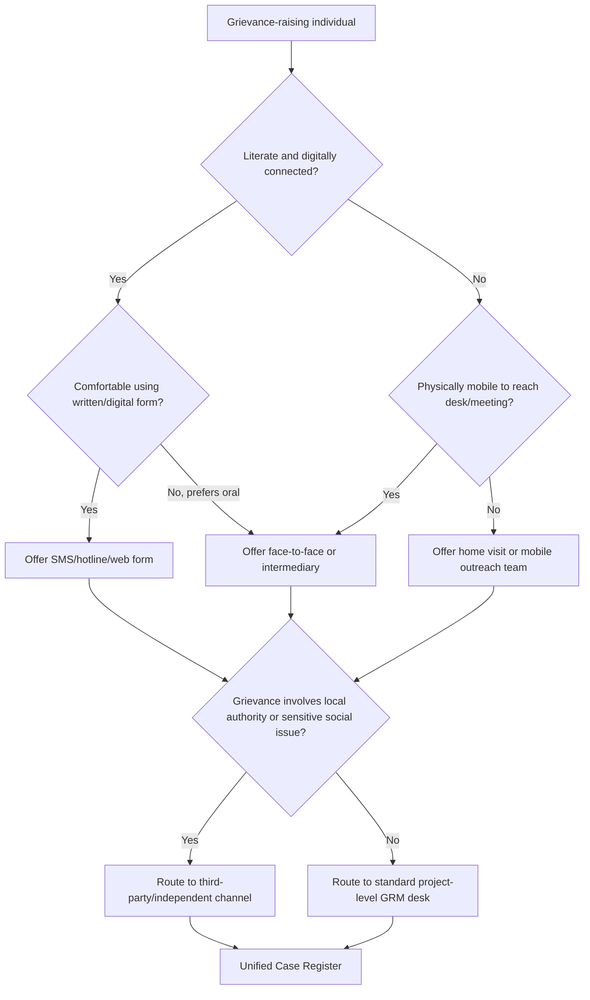

## Culturally Appropriate Grievance Channels

### Definition and Scope

A culturally appropriate grievance channel is a feedback and complaint-handling pathway designed to match the language, communication norms, power structures, gender dynamics, and trust patterns of the specific community it serves, rather than imposing a single standardized intake format across all affected populations. Within a Grievance Redress Mechanism (GRM), this concept governs *how* people access the system — not merely that a system exists.

The underlying premise is that a technically well-designed GRM can still fail if the intake channel itself is inaccessible, intimidating, or socially inappropriate for the intended users. A written online form, for example, may be functionally useless for an indigenous community with low literacy, limited internet access, and a strong oral tradition, even if the backend case-management system is excellent.

### Core Design Principles

**Key Points**

- **Multiplicity over uniformity**: Offer several parallel channels (verbal, written, digital, third-party) so no single access barrier excludes a subgroup.
- **Proximity**: Channels should be physically or socially close to where affected people already gather (markets, places of worship, community centers, local leaders' homes).
- **Anonymity gradient**: Provide a spectrum from fully identified to fully anonymous submission, since fear of retaliation varies by grievance type and social position.
- **Power-sensitivity**: Channels must not route sensitive complaints (e.g., against a chief, employer, or local official) through that same person's authority.
- **Language and literacy match**: Support oral/verbal intake, local dialects, and non-text formats (icons, symbols, audio) alongside written forms.
- **Gender and social stratification awareness**: Separate intake options for women, youth, or marginalized castes/ethnic groups where cultural norms restrict cross-group disclosure (e.g., women unable to speak candidly to male officials).

### Common Channel Types and Their Cultural Fit

| Channel Type | Best Fit Context | Cultural Limitation |
| --- | --- | --- |
| Suggestion boxes | Literate, low-retaliation-fear settings | Excludes illiterate/oral-tradition users; assumes trust in box confidentiality |
| Community meetings (public) | Contexts valuing collective deliberation | Poor for sensitive/personal grievances; dominated by powerful voices |
| Hotline/SMS/USSD | High mobile penetration areas | Requires phone access, literacy or IVR in local language, airtime |
| Trusted intermediary (elder, women's group leader, NGO worker) | Hierarchical or kinship-based societies | Intermediary may have own biases or conflicts of interest |
| Face-to-face desk at project site | Communities preferring in-person accountability | Requires travel; visible complainants risk exposure |
| Third-party/independent ombudsperson | Contexts with distrust of project proponent | Higher cost; needs perceived neutrality |
| Religious or traditional leader referral | Societies where such leaders hold dispute-resolution legitimacy | May reinforce existing power imbalances (e.g., patriarchal norms) |

### Cultural Assessment Process

Before designing channels, practitioners typically conduct a **Communication and Access Mapping** exercise as part of the broader Social Impact Assessment (SIA):

1. **Stakeholder segmentation**: Disaggregate the affected population by language group, literacy level, gender, age, disability status, caste/ethnicity, and physical accessibility to identify distinct sub-audiences.
2. **Existing conflict-resolution mapping**: Document how the community *already* resolves disputes (customary courts, elder councils, religious mediation) — new channels should complement, not bypass or contradict, these unless they are found to violate rights.
3. **Trust and legitimacy assessment**: Identify which institutions or individuals the community already trusts to handle sensitive information; distrust of project staff or local government often necessitates a third-party channel.
4. **Access barrier identification**: Map physical distance, mobile/internet coverage, seasonal mobility (e.g., pastoralist or migrant populations), and literacy rates.
5. **Gender-differentiated access analysis**: Assess whether women, in particular, have independent access to any proposed channel without requiring permission or accompaniment from male relatives.

[Inference] The specific weighting of these five factors will vary by project type and jurisdiction; some SIA frameworks (e.g., IFC Performance Standard 1) treat gender-differentiated access as a mandatory minimum rather than one factor among several.

### Multi-Channel Architecture (Illustration)

<svg xmlns="http://www.w3.org/2000/svg" viewBox="0 0 900 560" font-family="Helvetica, Arial, sans-serif">
<text x="450" y="30" font-size="20" font-weight="bold" text-anchor="middle" fill="#1a1a1a">Culturally Appropriate Grievance Intake Architecture (svg_diagram)</text>

<rect x="40" y="60" width="820" height="80" rx="10" fill="#eef5ff" stroke="#4a7fc9" stroke-width="1.5" />
<text x="60" y="85" font-size="14" font-weight="bold" fill="#2c4f7c">Affected Community (segmented)</text>
<text x="60" y="108" font-size="12" fill="#333">Literate adults | Illiterate/elderly | Women (restricted mobility) | Youth | Migrant/pastoralist groups | Persons with disabilities</text>
<text x="60" y="128" font-size="12" fill="#333">Language groups A, B, C (including non-dominant dialects)</text>

<line x1="450" y1="140" x2="450" y2="170" stroke="#888" stroke-width="2" marker-end="url(#arrow)" />

<rect x="40" y="175" width="180" height="110" rx="8" fill="#fff7e6" stroke="#c98a1e" stroke-width="1.5" />
<text x="130" y="198" font-size="13" font-weight="bold" text-anchor="middle" fill="#7a530f">Oral/Verbal</text>
<text x="55" y="218" font-size="11" fill="#333">Face-to-face desk</text>
<text x="55" y="235" font-size="11" fill="#333">Community meetings</text>
<text x="55" y="252" font-size="11" fill="#333">Trusted intermediary</text>
<text x="55" y="269" font-size="11" fill="#333">Home visits (women)</text>
<rect x="240" y="175" width="180" height="110" rx="8" fill="#eafaf0" stroke="#2f9e5c" stroke-width="1.5" />
<text x="330" y="198" font-size="13" font-weight="bold" text-anchor="middle" fill="#1c6b3c">Written/Physical</text>
<text x="255" y="218" font-size="11" fill="#333">Suggestion boxes</text>
<text x="255" y="235" font-size="11" fill="#333">Local-language forms</text>
<text x="255" y="252" font-size="11" fill="#333">Pictorial/symbol forms</text>
<text x="255" y="269" font-size="11" fill="#333">Letters via local leader</text>
<rect x="440" y="175" width="180" height="110" rx="8" fill="#fdeaea" stroke="#c94a4a" stroke-width="1.5" />
<text x="530" y="198" font-size="13" font-weight="bold" text-anchor="middle" fill="#8a2323">Digital/Remote</text>
<text x="455" y="218" font-size="11" fill="#333">SMS / USSD short code</text>
<text x="455" y="235" font-size="11" fill="#333">Toll-free hotline (IVR)</text>
<text x="455" y="252" font-size="11" fill="#333">WhatsApp/social media</text>
<text x="455" y="269" font-size="11" fill="#333">Web form (secondary)</text>
<rect x="640" y="175" width="180" height="110" rx="8" fill="#f0eaff" stroke="#7a4fc9" stroke-width="1.5" />
<text x="730" y="198" font-size="13" font-weight="bold" text-anchor="middle" fill="#4c2c8a">Third-Party/Independent</text>
<text x="655" y="218" font-size="11" fill="#333">NGO/CBO liaison</text>
<text x="655" y="235" font-size="11" fill="#333">Ombudsperson</text>
<text x="655" y="252" font-size="11" fill="#333">Religious/customary body</text>
<text x="655" y="269" font-size="11" fill="#333">Independent monitor</text>

<line x1="130" y1="285" x2="450" y2="330" stroke="#888" stroke-width="1.5" />
<line x1="330" y1="285" x2="450" y2="330" stroke="#888" stroke-width="1.5" />
<line x1="530" y1="285" x2="450" y2="330" stroke="#888" stroke-width="1.5" />
<line x1="730" y1="285" x2="450" y2="330" stroke="#888" stroke-width="1.5" />

<rect x="290" y="335" width="320" height="60" rx="8" fill="#e6f0fa" stroke="#2c4f7c" stroke-width="2" />
<text x="450" y="360" font-size="13" font-weight="bold" text-anchor="middle" fill="#1a1a1a">Unified Grievance Log / Case Register</text>
<text x="450" y="380" font-size="11" text-anchor="middle" fill="#333">(single database, multiple entry points)</text>
<line x1="450" y1="395" x2="450" y2="425" stroke="#888" stroke-width="2" marker-end="url(#arrow)" />

<rect x="300" y="430" width="300" height="55" rx="8" fill="#fff2e0" stroke="#c98a1e" stroke-width="1.5" />
<text x="450" y="453" font-size="13" font-weight="bold" text-anchor="middle" fill="#7a530f">Triage &amp; Categorization</text>
<text x="450" y="472" font-size="11" text-anchor="middle" fill="#333">Sensitivity screen, routing, anonymity check</text>
<line x1="450" y1="485" x2="450" y2="510" stroke="#888" stroke-width="2" marker-end="url(#arrow)" />
<rect x="250" y="515" width="400" height="35" rx="8" fill="#eafaf0" stroke="#2f9e5c" stroke-width="1.5" />
<text x="450" y="537" font-size="12" font-weight="bold" text-anchor="middle" fill="#1c6b3c">Investigation, Resolution &amp; Feedback Loop</text>
</svg>

### Channel Selection Decision Logic

### Gender-Responsive Design Considerations

In many project contexts, women face compounded barriers: restricted mobility outside the household, social sanctions against speaking to unrelated men, lower literacy rates, and less phone ownership or airtime autonomy. Common mitigations include:

- **Female-staffed intake points**: Ensuring at least one female-run channel (a women's group focal point, a female field officer conducting home visits) so gender norms do not require women to route grievances through male intermediaries.
- **Timing and location adjustments**: Scheduling intake during hours and at venues women can access without special permission (e.g., during women's market days rather than mixed community assemblies).
- **Separate reporting lines for GBV-related grievances**: Sexual exploitation, abuse, and harassment (SEA/SH) complaints generally require a dedicated, highly confidential sub-channel distinct from routine project grievances, per international safeguard practice (e.g., World Bank ESF, IFC PS2).

[Unverified] Specific staffing ratios or quotas for female intake officers are not universally standardized; requirements vary by financier, national law, and project risk classification, so any numeric target should be confirmed against the applicable safeguard framework.

### Indigenous and Customary Context Adaptations

For projects affecting indigenous peoples or communities governed substantially by customary law:

- **Free, Prior, and Informed Consent (FPIC) alignment**: Grievance channels should not undermine or bypass the community's own consent and dispute-resolution processes; parallel project-level channels are typically designed to supplement, not supersede, customary mechanisms unless those mechanisms fail to provide remedy or violate fundamental rights.
- **Oral documentation with audio/video recording**: Where written record-keeping is culturally unfamiliar or a matter of distrust (e.g., fear that written records could be used against the community), verbal statements may be recorded with consent and transcribed by project staff, with the transcription read back for confirmation.
- **Ceremonial or seasonal timing**: Some communities may only convene relevant decision-making bodies at specific times of year; grievance escalation timelines should build in flexibility rather than rigid fixed-day deadlines when working with such structures. [Inference] This flexibility must be balanced against the project's own regulatory reporting deadlines, which may not be adjustable.

### Example: Multi-Channel Design for a Rural Infrastructure Project

**Example**

A road-rehabilitation project affecting three ethnolinguistic groups (one with high literacy, two with predominantly oral traditions and limited network coverage) might implement:

1. A **toll-free IVR hotline** with menu options recorded in all three local languages (not just the national language).
2. **Weekly staffed desks** rotating between village markets, timed to align with existing market days.
3. A **women's focal point network**, recruited from local women's savings groups, trained to receive and forward grievances confidentially.
4. A **suggestion box** at the literate community's cooperative office, checked weekly by a designated (rotating) committee member to reduce single-point control.
5. A **third-party NGO liaison** for grievances involving alleged misconduct by project contractors or local officials, ensuring complainants are not required to report to the very party they are complaining about.
6. All channels feed into a **single case register** maintained by the project's Social Safeguards Officer, ensuring consistent tracking regardless of entry point.

### Monitoring Cultural Effectiveness

Standard indicators used to evaluate whether grievance channels are functioning as culturally appropriate include:

- Disaggregated uptake rates (grievances received per channel, cross-tabulated by gender, ethnicity, age)
- Ratio of grievances raised via intermediary vs. direct channels (a very high intermediary reliance may indicate direct channels are perceived as inaccessible or unsafe)
- Time-to-first-response by channel type (channels with systematically slower response may signal under-resourcing or lower institutional priority)
- Qualitative feedback from focus group discussions on trust, comfort, and perceived confidentiality of each channel
- Complaint withdrawal or non-follow-through rates (can indicate fear of retaliation, especially if concentrated among specific demographic groups)

[Inference] A disproportionately low grievance volume from an identifiable subgroup, relative to their expected exposure to project impacts, is commonly interpreted by practitioners as evidence of an access barrier rather than genuine absence of grievances, though this interpretation should be triangulated with qualitative data before acting on it.

### Common Pitfalls

- Treating a single "hotline + suggestion box" combination as sufficient without assessing actual community literacy, phone ownership, or trust in anonymity.
- Placing intake points under the direct control of the party most likely to be the subject of complaints (e.g., site foremen collecting boxes at their own worksite).
- Assuming translation of forms into a local language resolves access, without addressing underlying illiteracy or oral-tradition preferences.
- Failing to provide a distinct, more confidential pathway for sensitive grievances (SEA/SH, threats, land disputes involving powerful actors).
- Designing channels once at project start-up without periodic re-assessment as demographics, trust levels, or technology access change over the project lifecycle.

**Related Topics**

- Grievance intake, categorization, and triage procedures
- Confidentiality and anonymity safeguards in GRM design
- SEA/SH-specific reporting and referral pathways
- Free, Prior, and Informed Consent (FPIC) processes
- Grievance mechanism monitoring and reporting indicators
- Third-party/independent grievance mechanism design
- Stakeholder mapping and engagement planning in SIA