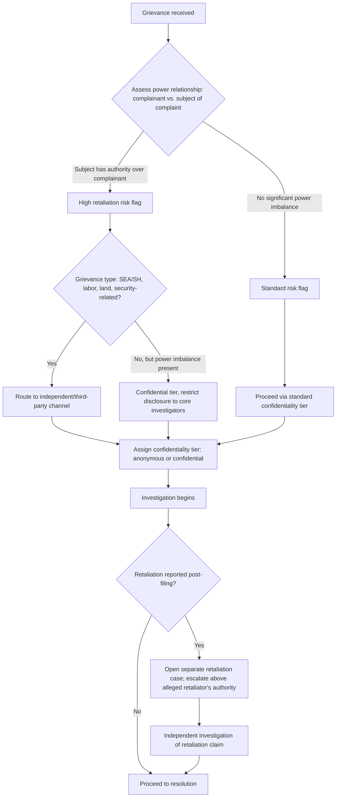

## Non-Retaliation and Confidentiality Safeguards

### Definition and Purpose

Non-retaliation and confidentiality safeguards are the structural, procedural, and cultural protections built into a Grievance Redress Mechanism (GRM) to ensure that a person who raises a grievance suffers no adverse consequence for doing so, and that information about who filed a complaint (or what was disclosed) is restricted to those with a legitimate need to know. These two safeguards are treated as a linked pair in social impact practice: weak confidentiality is one of the primary pathways through which retaliation becomes possible, since retaliation generally requires the retaliator to know (or infer) who complained.

Without credible protection on both fronts, a GRM's other design features — accessible channels, clear timelines, fair investigation procedures — become largely irrelevant, because affected people will simply not use a system they believe puts them at risk.

### Why This Matters: The Underreporting Mechanism

**Key Points**

- Fear of retaliation is consistently identified in safeguard literature as one of the leading causes of grievance underreporting, particularly for complaints involving power imbalances (employer–worker, official–citizen, security personnel–community member).
- Underreporting does not mean the underlying harm is absent; it means the GRM is failing to surface it, which creates a false impression of project performance ("no complaints" is misread as "no problems").
- Retaliation risk is not uniform across grievance types — labor grievances, sexual exploitation and abuse (SEA) complaints, and grievances against politically powerful actors typically carry substantially higher retaliation risk than routine service-delivery complaints (e.g., a delayed compensation payment).
- [Inference] Because retaliation risk varies by grievance type, a single uniform confidentiality protocol applied identically to all complaint categories is likely to under-protect high-risk categories while potentially over-engineering low-risk ones.

### Core Components of Non-Retaliation Protection

1. **Explicit non-retaliation policy**: A written commitment, communicated to both complainants and the parties who might be subject to complaints (staff, contractors, officials), stating that raising a grievance in good faith will not result in punitive action.
2. **Defined prohibited retaliatory acts**: Termination, demotion, harassment, exclusion from project benefits, threats, physical intimidation, and social ostracism orchestrated or condoned by a party with authority over the complainant.
3. **Protection extending to witnesses and supporters**: Not only the complainant but anyone who provides testimony, evidence, or support in an investigation should fall under the same protection, since witness intimidation is a common secondary retaliation vector.
4. **Monitoring for retaliation as a distinct case type**: Retaliation allegations should be logged and tracked separately from the original grievance, since they represent a new, often more serious, violation.
5. **Escalation path independent of the alleged retaliator**: If the person accused of retaliation holds authority over the standard GRM channel (e.g., a site manager overseeing the local complaints desk), the case must be escalated to an independent or higher-level authority.

### Core Components of Confidentiality Protection

1. **Need-to-know data handling**: Complainant identity and case details are shared only with personnel directly involved in investigation and resolution, not broadcast to general staff or community meetings.
2. **Secure record-keeping**: Physical files locked and access-controlled; digital case management systems use role-based access controls and, where appropriate, encryption.
3. **De-identification in reporting**: Aggregate GRM reports (e.g., monthly summaries to funders or oversight bodies) present case counts and categories without names or identifying details.
4. **Anonymous submission option**: At least one channel allows fully anonymous reporting, accepting the trade-off that anonymous cases are harder to investigate and cannot be followed up directly with the complainant.
5. **Consent-based disclosure**: Any sharing of the complainant's identity beyond the minimum investigative team (e.g., informing the accused party who filed the complaint) should require the complainant's informed consent, except where legally mandated disclosure applies (see limits below).

### Confidentiality Levels: A Practical Framework

| Level | Description | Typical Use Case |
| --- | --- | --- |
| Fully anonymous | No identifying information collected at all | Fear of severe retaliation; SEA/SH-adjacent concerns; complaints against powerful actors |
| Confidential (identity known, not disclosed) | Complainant identity recorded internally but withheld from the respondent/accused party | Most standard grievances involving a power imbalance |
| Semi-open | Identity known to investigators and disclosed to respondent only as required for due process (e.g., right to respond to specific allegations) | Cases requiring formal investigation with procedural fairness obligations to the accused |
| Open/public | Complainant identity known to all parties, often used in community mediation | Low-risk, non-sensitive disputes (e.g., minor property boundary disagreement) where the complainant is comfortable and mediation benefits from transparency |

[Unverified] The specific terminology for these tiers is not standardized across institutions; different GRM frameworks (World Bank, IFC, national ombudsman offices) use varying labels for functionally similar tiers, so the above framework should be treated as a synthesized practical model rather than a codified industry standard.

### Limits to Confidentiality

Confidentiality is not absolute. Practitioners generally disclose these limits upfront so complainants can make informed decisions about what to share:

- **Mandatory reporting obligations**: Many jurisdictions and institutional policies require reporting of child abuse, credible threats of serious violence, or criminal conduct to appropriate authorities regardless of the complainant's wish for confidentiality.
- **Due process requirements**: If a case proceeds to formal disciplinary or legal action against an accused party, some level of disclosure to that party is typically unavoidable to satisfy fair-process standards (the accused generally has a right to know and respond to specific allegations, though not necessarily the complainant's identity).
- **Aggregate reporting**: While individual identities are protected, the existence and general nature of a grievance category may still be reported in de-identified form to oversight bodies or funders.

**Design Question**: Should the GRM's non-retaliation and confidentiality policy explicitly enumerate these limits in the same document the community sees, or communicate them only during intake to avoid discouraging use of the mechanism? [Inference] Enumerating limits transparently upfront is more consistent with informed-consent principles, but may reduce willingness to report highly sensitive matters if complainants perceive the disclosure exceptions as too broad; this is a genuine design trade-off rather than a settled best practice, and different institutions resolve it differently. A recommended approach is a brief, plain-language limits statement given verbally at first contact, with full detail available on request.

### Retaliation Risk Assessment Architecture

### Data Handling and Access Control Model

<svg xmlns="http://www.w3.org/2000/svg" viewBox="0 0 880 480" font-family="Helvetica, Arial, sans-serif">
<text x="440" y="28" font-size="19" font-weight="bold" text-anchor="middle" fill="#1a1a1a">Confidentiality Access Control Tiers (svg_diagram)</text>

<circle cx="440" cy="270" r="200" fill="#f5f8fc" stroke="#a9c2e0" stroke-width="1.5" />
<text x="440" y="90" font-size="12" text-anchor="middle" fill="#4a6a8a">General public / community (no case details)</text>

<circle cx="440" cy="280" r="145" fill="#eaf2fb" stroke="#6b93c0" stroke-width="1.5" />
<text x="440" y="150" font-size="12" text-anchor="middle" fill="#2c4f7c">Project staff (aggregate/de-identified data only)</text>

<circle cx="440" cy="290" r="90" fill="#dcebff" stroke="#3f6fa8" stroke-width="1.5" />
<text x="440" y="215" font-size="11" text-anchor="middle" fill="#1e3a5f">Investigation team (case details, restricted identity)</text>

<circle cx="440" cy="300" r="45" fill="#b9d4f2" stroke="#1e3a5f" stroke-width="2" />
<text x="440" y="296" font-size="11" font-weight="bold" text-anchor="middle" fill="#0d1f33">Case handler</text>
<text x="440" y="312" font-size="11" font-weight="bold" text-anchor="middle" fill="#0d1f33">+ Complainant</text>

<rect x="40" y="400" width="800" height="65" rx="6" fill="#fff7e6" stroke="#c98a1e" stroke-width="1" />
<text x="55" y="420" font-size="12" font-weight="bold" fill="#7a530f">Access Rule:</text>
<text x="55" y="438" font-size="11" fill="#333">Full identity + narrative detail: innermost ring only. Restricted narrative (no identity): investigation team.</text>
<text x="55" y="453" font-size="11" fill="#333">Aggregate counts/categories only: staff and public reporting layers.</text>
</svg>

### Institutional Mechanisms to Operationalize Non-Retaliation

- **Whistleblower-style protection clauses** embedded in codes of conduct for staff and contractors, explicitly naming grievance-related retaliation as a disciplinable offense.
- **Independent hotlines or third-party ombudspersons** for cases where the internal chain of command itself poses the retaliation risk (e.g., a worker complaining about a direct supervisor).
- **Random or periodic follow-up contact** with past complainants (with consent and using safe contact methods) to check for delayed or indirect retaliation that may not surface through standard channels.
- **Retaliation-specific training** for managers and community liaison staff, since retaliatory behavior is not always intentional or overt — it can include subtle exclusion or informal social sanctioning that is harder to document than direct punitive action.
- **Contractual obligations passed to third parties**: On projects involving contractors or subcontractors, the non-retaliation obligation is typically written into contract terms so it is enforceable against parties outside direct project employment.

### Example: Applying Safeguards to a Labor Grievance

**Example**

A construction worker on an infrastructure project reports unsafe working conditions and unpaid overtime, implicating their direct site supervisor.

1. **Intake**: The worker uses a third-party hotline (not the site-level suggestion box, which the supervisor controls) and requests confidentiality but not full anonymity, since some follow-up will be needed.
2. **Confidentiality tier assignment**: Classified as "confidential" — identity is known to the independent investigator but withheld from the supervisor during initial fact-finding.
3. **Investigation design**: Interviews are structured to include multiple workers (not just the complainant) so the supervisor cannot infer who specifically reported the issue from interview patterns alone.
4. **Non-retaliation monitoring**: The complainant's assignment, shift patterns, and any disciplinary notices are monitored for 90 days post-complaint by an HR focal point independent of the site supervisor's reporting line.
5. **Resolution communication**: Feedback to the complainant is delivered through the same independent channel used for intake, avoiding a visible in-person meeting at the worksite that could signal to others who complained.

### Common Failure Modes

- **De-identification theater**: Removing names from a report while leaving enough contextual detail (job role, shift, specific incident date, unique circumstances) that the complainant is still identifiable to a small group.
- **Retaliation blindness**: Treating the original grievance as "closed" once resolved, without any mechanism to detect retaliation that occurs afterward.
- **Single point of control**: Routing all grievances, including those against a specific authority figure, through a channel that the same authority figure administers.
- **Verbal-only assurances**: Providing non-retaliation and confidentiality commitments informally rather than in a documented, referenceable policy that can be cited if a violation occurs.
- **Assuming anonymity equals safety**: Anonymous submission does not prevent retaliation if the grievance content itself is specific enough to identify the likely source (e.g., only one person had access to the information described).

### Related Topics

- Grievance intake channel design and culturally appropriate access
- Independent/third-party grievance mechanism structures
- SEA/SH-specific reporting, referral, and survivor-centered response protocols
- Whistleblower protection policy design
- Data protection and case management system access controls
- Grievance mechanism monitoring, evaluation, and retaliation-tracking indicators
- Contractor and supply-chain grievance obligations