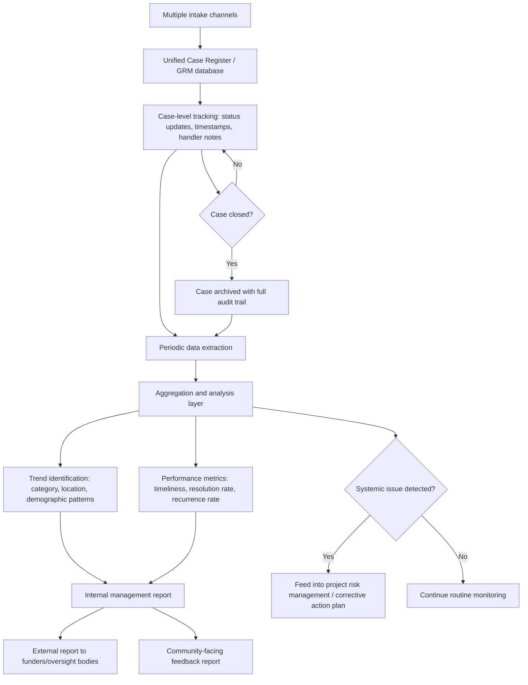

## Tracking, Analyzing, and Reporting Grievance Data

### Definition and Scope

Tracking, analyzing, and reporting grievance data refers to the systematic processes by which a Grievance Redress Mechanism (GRM) captures every case as a structured record, transforms accumulated case records into meaningful patterns and trends, and communicates those findings to internal management, oversight bodies, funders, and affected communities. This function converts the GRM from a case-by-case service into a management information system that can detect systemic problems, demonstrate accountability, and inform project decision-making.

Three distinct but interdependent functions are involved:

- **Tracking**: The operational, case-level logging of grievances from receipt through resolution.
- **Analysis**: The aggregation and interpretation of tracked data to identify patterns, root causes, and performance trends.
- **Reporting**: The structured communication of analyzed findings to defined audiences at defined intervals.

### Core Data Fields for Grievance Tracking

**Key Points**

A functional tracking system captures, at minimum, the following field categories for every case:

| Field Category | Example Fields |
| --- | --- |
| Identification | Unique case ID, date received, intake channel used |
| Complainant metadata | Demographic category (gender, age bracket, location), anonymity status |
| Grievance content | Category/type, subcategory, brief description, severity/risk flag |
| Routing | Assigned handler, department/entity responsible, escalation level |
| Process milestones | Date acknowledged, date investigation started, date resolved, date closed |
| Resolution | Outcome type (upheld, not upheld, partially upheld, withdrawn), remedy provided |
| Satisfaction | Complainant feedback on resolution (if collected) |
| Recurrence flag | Whether this grievance relates to a previously logged issue or pattern |

[Inference] The exact field set will vary by sector and funder requirement; safeguard-heavy sectors (extractives, large infrastructure) and financiers with formal Environmental and Social Framework requirements typically mandate more granular fields (e.g., separate SEA/SH flags, land-related sub-categories) than smaller community-level projects.

### Case Lifecycle and Status Taxonomy

A standard case lifecycle uses a controlled vocabulary of statuses to allow consistent tracking across handlers and over time:

1. **Received** — logged into the system, unique ID assigned
2. **Acknowledged** — complainant notified their grievance was received (often within a defined SLA, e.g., 3–5 working days)
3. **Under review/investigation** — fact-finding, interviews, evidence gathering in progress
4. **Pending decision** — investigation complete, resolution being determined
5. **Resolved** — outcome determined and communicated to complainant
6. **Closed** — case fully concluded, including any remedy delivered and complainant confirmation (where feasible)
7. **Reopened** — used when a complainant disputes the resolution or new information emerges
8. **Escalated** — moved to a higher authority, third-party mechanism, or judicial/legal process

### Data Flow Architecture

### Analytical Approaches

**Descriptive analysis** (most common baseline):

- Case volume over time (monthly/quarterly trend lines)
- Distribution by category, location, and demographic group
- Average and median time-to-resolution, disaggregated by category
- Resolution rate (percentage upheld, denied, withdrawn)
- Channel usage distribution (which intake channels are actually being used)

**Diagnostic analysis** (identifying root causes):

- Cross-tabulating grievance category against project activity or contractor to identify whether specific project components or personnel generate disproportionate complaint volume
- Comparing grievance rates across demographic segments against expected population proportions to detect access or reporting gaps (see the note on underreporting below)
- Recurrence analysis: tracking whether the same root issue generates repeated individual grievances, indicating an unaddressed systemic problem rather than isolated incidents

**Trend and early-warning analysis**:

- Monitoring for sudden spikes in a category that may indicate an emerging conflict or compliance failure
- Tracking escalation rates (proportion of cases requiring escalation beyond first-level resolution) as an indicator of first-line handler effectiveness

[Inference] A rising case volume is not inherently a negative indicator — it can reflect improved trust in and accessibility of the GRM rather than worsening project impacts. Distinguishing between these two explanations typically requires triangulation with qualitative feedback and contextual project knowledge, not the volume metric alone.

### Key Performance Indicators (KPIs)

$$\text{Resolution Rate} = \frac{\text{Number of cases closed with resolution}}{\text{Total cases received in period}} \times 100$$

$$\text{Average Time-to-Resolution} = \frac{\sum \text{(date closed} - \text{date received)}}{\text{Number of cases closed}}$$

Commonly tracked KPIs include:

- **Acknowledgment timeliness**: percentage of cases acknowledged within the target SLA window
- **Resolution timeliness**: percentage of cases resolved within the target timeframe (targets often differentiated by severity)
- **Escalation rate**: proportion of cases requiring escalation beyond initial handling level
- **Recurrence rate**: proportion of cases linked to a previously logged systemic issue
- **Complainant satisfaction rate**: proportion of complainants reporting satisfaction with the process and/or outcome, where such feedback is collected
- **Channel equity index**: distribution of case volume across demographic segments compared to their proportion in the affected population (a proxy for access equity, not a precise measurement)

### Reporting Tiers and Audiences

| Report Type | Audience | Typical Frequency | Content Focus |
| --- | --- | --- | --- |
| Operational dashboard | GRM case handlers, project management | Real-time/weekly | Open cases, overdue items, workload |
| Internal management report | Project leadership, safeguards team | Monthly/quarterly | KPI trends, emerging risks, resource needs |
| External compliance report | Funders, lenders, regulators | Quarterly/annually | Aggregate statistics, compliance with safeguard commitments |
| Community feedback report | Affected communities | Quarterly/annually | Plain-language summary: cases received, resolved, key actions taken |
| Board/oversight report | Governance bodies | Annually or as triggered | High-level trends, systemic risk flags, corrective actions |

### De-Identification in Reporting

All reporting tiers above the case-handler level should apply data minimization consistent with the confidentiality safeguards discussed under non-retaliation protections. Practical techniques include:

- **Aggregation thresholds**: Suppressing or grouping categories with very small counts (e.g., fewer than 3–5 cases) to prevent re-identification through small-cell disclosure, particularly in small communities where a single case in a narrow category could be traceable to one individual.
- **Category generalization**: Reporting broad categories ("labor-related," "land-related") rather than granular subcategories when case volume in a subcategory is low.
- **Geographic generalization**: Reporting at a broader administrative level (municipality rather than specific village or worksite) when granular location data combined with category could identify a complainant.

**Design Question**: At what aggregation threshold should a category be suppressed or generalized in external reporting? [Inference] There is no universal numeric standard; a commonly cited convention in social statistics is a minimum cell size of 5, but this should be calibrated to community size and the sensitivity of the grievance category — a threshold that is protective in a large urban project area may be insufficient in a small, tightly-knit rural community where even five cases could be narrowed to a known subgroup.

### Root Cause and Systemic Issue Escalation

A mature GRM data system distinguishes between resolving individual cases and addressing systemic drivers. Common escalation triggers include:

- A defined threshold of recurring grievances on the same root cause within a set period (e.g., 3+ related cases within a quarter)
- A single severe case (e.g., credible SEA/SH allegation) that automatically triggers senior management and, where applicable, funder notification regardless of category-level thresholds
- Geographic clustering (a disproportionate share of grievances originating from a single sub-area, potentially indicating a localized project impact not captured by other monitoring)

These triggers typically feed into the project's broader risk management or corrective action planning process, closing the loop between grievance data and adaptive project management.

### Illustration: Grievance Data Reporting Pyramid

<svg xmlns="http://www.w3.org/2000/svg" viewBox="0 0 800 520" font-family="Helvetica, Arial, sans-serif">
<text x="400" y="28" font-size="19" font-weight="bold" text-anchor="middle" fill="#1a1a1a">Grievance Data Reporting Pyramid (svg_diagram)</text>

<polygon points="80,470 720,470 620,390 180,390" fill="#eaf2fb" stroke="#3f6fa8" stroke-width="1.5" />
<text x="400" y="435" font-size="13" font-weight="bold" text-anchor="middle" fill="#1e3a5f">Raw case-level data (all fields, full detail)</text>

<polygon points="180,390 620,390 545,320 255,320" fill="#dcebff" stroke="#3f6fa8" stroke-width="1.5" />
<text x="400" y="360" font-size="12" font-weight="bold" text-anchor="middle" fill="#1e3a5f">Operational dashboard (case handlers)</text>

<polygon points="255,320 545,320 480,255 320,255" fill="#c3ddf7" stroke="#1e3a5f" stroke-width="1.5" />
<text x="400" y="292" font-size="12" font-weight="bold" text-anchor="middle" fill="#0d1f33">Internal management report (aggregated KPIs)</text>

<polygon points="320,255 480,255 430,195 370,195" fill="#a9c9ef" stroke="#0d1f33" stroke-width="1.5" />
<text x="400" y="230" font-size="11" font-weight="bold" text-anchor="middle" fill="#0d1f33">External + community reports (fully de-identified)</text>

<polygon points="370,195 430,195 400,150" fill="#7fa8d9" stroke="#0d1f33" stroke-width="1.5" />
<text x="400" y="180" font-size="10" font-weight="bold" text-anchor="middle" fill="#0d1f33">Board/</text>
<text x="400" y="192" font-size="10" font-weight="bold" text-anchor="middle" fill="#0d1f33">oversight</text>

<text x="60" y="475" font-size="11" fill="#555" text-anchor="start">Most detail,</text>

<text x="60" y="490" font-size="11" fill="#555" text-anchor="start">most restricted access</text>

<text x="740" y="160" font-size="11" fill="#555" text-anchor="end">Least detail,</text>

<text x="740" y="175" font-size="11" fill="#555" text-anchor="end">widest audience</text>

</svg>

### Example: Quarterly Analysis Workflow

**Example**

A social safeguards officer conducting a quarterly review of a resettlement project's GRM data:

1. **Extraction**: Pulls all cases logged in the quarter from the case management database, filtering on date-received field.
2. **Descriptive pass**: Calculates total volume (compared to prior quarters), category breakdown, and resolution-rate by category using the formulas above.
3. **Disaggregation check**: Cross-tabulates case volume by gender and by affected village to check whether any subgroup's grievance volume is disproportionately low relative to their population share — flagging three villages with zero grievances despite known compensation delays reported informally through field staff.
4. **Root cause flag**: Notices 6 separate grievances this quarter reference delayed compensation payments from the same contractor, exceeding the recurrence threshold, and escalates this as a systemic issue rather than treating each as isolated.
5. **Reporting**: Produces (a) an internal memo to project management recommending contractor payment audit, (b) a de-identified quarterly summary for the funder's safeguard compliance report, and (c) a plain-language community bulletin stating aggregate case counts and general actions taken, without individual case details.

### Common Pitfalls

- **Volume without context**: Reporting raw case counts without demographic disaggregation, masking access gaps or disproportionate impacts on specific groups.
- **Vanity metrics**: Emphasizing resolution rate alone without also tracking resolution *quality* (e.g., complainant satisfaction, recurrence), which can incentivize rushed or superficial closures.
- **Static reporting templates**: Using a fixed report format that doesn't adapt as new grievance categories emerge over the project lifecycle, obscuring new and important trends.
- **Insufficient de-identification**: Publishing granular cross-tabulations (small village × specific grievance type × gender) that inadvertently allow identification of individual complainants.
- **Siloed systems**: Maintaining separate, non-integrated logs for different intake channels, making cross-channel trend analysis and de-duplication difficult or impossible.
- **No feedback loop closure**: Collecting and analyzing data without routing significant findings back into project risk management or corrective action processes, reducing the GRM to a compliance exercise rather than a management tool.

### Related Topics

- Culturally appropriate grievance channel design
- Non-retaliation and confidentiality safeguards
- Grievance case management system architecture and access controls
- Corrective action planning and adaptive project management
- Stakeholder engagement plan monitoring indicators
- SEA/SH-specific reporting and escalation protocols
- External compliance reporting under environmental and social frameworks