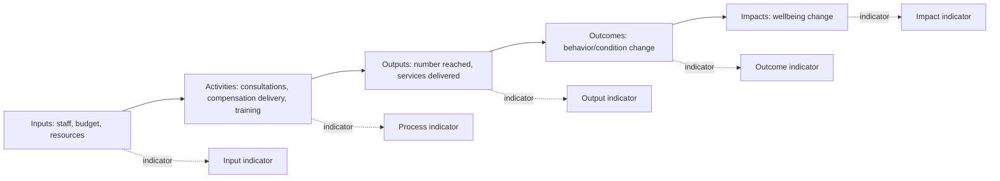

## Developing Social Performance Indicators

### Definition and Purpose

Social performance indicators are measurable variables used to track the social outcomes, impacts, and process quality of a project or program over time, forming the empirical backbone of a Monitoring, Evaluation, and Adaptive Management (MEAM) system. Within a Social Impact Assessment (SIA) framework, these indicators translate qualitative commitments made during impact assessment and stakeholder engagement (e.g., "minimize impacts on livelihoods," "ensure equitable access to benefits") into quantifiable or systematically observable measures that can be tracked, compared against baselines, and reported.

Indicator development sits at the interface between the SIA's predicted impacts and the project's operational monitoring system: a well-designed indicator set allows managers to detect whether predicted impacts are materializing as expected, whether mitigation measures are working, and whether unanticipated impacts are emerging.

### Indicator Typology

**Key Points**

| Type | Function | Example |
| --- | --- | --- |
| Input indicators | Resources or activities allocated | Number of community liaison staff hired; budget allocated to livelihood restoration |
| Output indicators | Immediate, direct products of project activities | Number of households receiving compensation; number of grievance cases resolved |
| Outcome indicators | Medium-term changes in behavior, condition, or access resulting from outputs | Percentage of resettled households with restored income levels; percentage of women participating in community decision-making forums |
| Impact indicators | Longer-term, higher-level changes in wellbeing attributable (at least partially) to the project | Change in poverty headcount ratio in affected communities; change in food security index |
| Process indicators | Quality and integrity of implementation processes themselves | Percentage of consultations meeting minimum FPIC procedural standards; grievance resolution timeliness |

[Inference] The boundary between "outcome" and "impact" indicators is not always sharply defined in practice; different institutional frameworks (e.g., IFC, World Bank, GRI) draw this line at different points along the results chain, so practitioners should confirm which convention their specific reporting framework uses rather than assuming a universal definition.

### The Results Chain and Indicator Placement

Indicators are typically developed by working backward from this chain: identifying the project's stated social objectives and predicted impacts (from the SIA), then defining what would need to be observed at each level of the chain to demonstrate progress or detect deviation.

### SMART and CREAM Criteria for Indicator Design

Two overlapping quality frameworks are commonly applied when drafting candidate indicators:

**SMART**: Specific, Measurable, Achievable, Relevant, Time-bound

**CREAM** (more specific to M&E practice): Clear, Relevant, Economic (cost-effective to collect), Adequate (sufficient to assess the outcome), Monitorable (verifiable through independent means)

**Design Question**: Which framework should take precedence when the two criteria sets conflict — for instance, when the most methodologically rigorous indicator is not cost-effective to collect (violating "Economic") but is otherwise ideal? [Inference] Common practice favors a pragmatic compromise: retaining a smaller set of rigorous, higher-cost indicators for critical/high-risk impact areas (e.g., resettlement livelihood restoration) while accepting simpler proxy indicators for lower-risk areas, but this trade-off should be made explicitly and documented rather than resolved silently, since it affects the strength of evidence available for adaptive management decisions later.

### Quantitative vs. Qualitative Indicators

- **Quantitative indicators**: Numeric measures suited to statistical aggregation and trend analysis (household income levels, school enrollment rates, number of land disputes recorded).
- **Qualitative indicators**: Descriptive or categorical measures capturing dimensions not easily reduced to numbers (perceived fairness of compensation process, quality of community-company relationship, sense of cultural continuity).

A robust social performance indicator set typically blends both, since purely quantitative indicators can miss important dimensions of social change (e.g., a household may show restored income yet report severe loss of social cohesion or cultural disruption that no income metric captures), while purely qualitative indicators are harder to aggregate and compare over time or across sites.

### Disaggregation as a Design Requirement

Rather than treating disaggregation as an afterthought in analysis, well-designed indicators build disaggregation categories into the indicator definition itself from the outset. Common disaggregation dimensions include:

- Gender
- Age cohort (e.g., youth, working-age adult, elderly)
- Ethnicity/indigenous status
- Household vulnerability status (female-headed household, disability, extreme poverty)
- Geographic sub-unit (village, ward, resettlement site)

For example, rather than defining an indicator as "percentage of households with restored livelihoods," a disaggregation-ready formulation specifies: "percentage of households with restored livelihoods, disaggregated by gender of household head and by resettlement site," with data collection instruments designed to capture these fields from the start.

### Baseline Establishment

$$\text{Baseline Value} = \text{Indicator value measured at } t_0 \text{ (prior to project impact onset)}$$

Baselines should be established before the project activity likely to cause the relevant impact begins (e.g., before physical or economic displacement), since a baseline collected after impacts have already occurred will understate the true magnitude of change and undermine the validity of subsequent outcome comparisons. Where a true pre-project baseline was not collected in time, practitioners sometimes use:

- **Reconstructed baselines**: Retrospective estimation using recall data, historical records, or comparable non-affected populations, clearly flagged as [Inference]-based rather than directly measured.
- **Control/comparison group baselines**: Concurrent measurement in a similar, unaffected community, used to approximate a counterfactual when a true "before" baseline is unavailable.

[Unverified] The methodological reliability of reconstructed baselines using recall data varies significantly by indicator type (income recall tends to be less reliable than asset ownership recall) and by the length of the recall period; specific reliability figures should be sourced from the applicable evaluation methodology literature rather than assumed uniform.

### Target-Setting

Once baselines and indicators are defined, targets specify the expected or desired value at a future point:

- **Absolute targets**: A specific value to be reached (e.g., "80% of resettled households report restored income by year 3").
- **Relative/directional targets**: A direction of change without a fixed numeric target (e.g., "no net decline in household income compared to pre-displacement baseline"), often used when baseline uncertainty is high or when a specific numeric target risks appearing arbitrary.
- **Threshold/trigger targets**: A value that, if crossed, triggers a defined management response rather than representing a "success" endpoint (e.g., "if grievance recurrence rate on a single issue exceeds X in a quarter, trigger root-cause review").

### Data Collection Methods Matrix

| Method | Best Suited For | Limitation |
| --- | --- | --- |
| Household surveys | Quantitative outcome/impact indicators at scale | Costly, infrequent, recall bias |
| Key informant interviews | Contextual/process indicators, early signal detection | Not statistically representative |
| Focus group discussions | Qualitative outcome indicators, perception-based measures | Groupthink risk, dominant voices |
| Administrative/program records | Output indicators (services delivered, cases processed) | Reflects only what is formally recorded |
| Participatory monitoring (community scorecards, etc.) | Process and satisfaction indicators, local ownership | Variable rigor, potential local capture |
| Remote sensing/secondary data | Indirect proxies for certain impact indicators (land use change) | Indirect; requires ground-truthing |

### Indicator Development Workflow

<svg xmlns="http://www.w3.org/2000/svg" viewBox="0 0 900 480" font-family="Helvetica, Arial, sans-serif">
<text x="450" y="28" font-size="19" font-weight="bold" text-anchor="middle" fill="#1a1a1a">Social Performance Indicator Development Workflow (svg_diagram)</text>
<rect x="30" y="60" width="180" height="70" rx="8" fill="#eaf2fb" stroke="#3f6fa8" stroke-width="1.5" />
<text x="120" y="90" font-size="12" font-weight="bold" text-anchor="middle" fill="#1e3a5f">1. Review SIA</text>
<text x="120" y="108" font-size="11" text-anchor="middle" fill="#333">predicted impacts &amp;</text>
<text x="120" y="122" font-size="11" text-anchor="middle" fill="#333">commitments</text>
<rect x="240" y="60" width="180" height="70" rx="8" fill="#eaf2fb" stroke="#3f6fa8" stroke-width="1.5" />
<text x="330" y="90" font-size="12" font-weight="bold" text-anchor="middle" fill="#1e3a5f">2. Define results</text>
<text x="330" y="108" font-size="11" text-anchor="middle" fill="#333">chain per impact</text>
<text x="330" y="122" font-size="11" text-anchor="middle" fill="#333">area</text>
<rect x="450" y="60" width="180" height="70" rx="8" fill="#dcebff" stroke="#3f6fa8" stroke-width="1.5" />
<text x="540" y="90" font-size="12" font-weight="bold" text-anchor="middle" fill="#1e3a5f">3. Draft candidate</text>
<text x="540" y="108" font-size="11" text-anchor="middle" fill="#333">indicators per</text>
<text x="540" y="122" font-size="11" text-anchor="middle" fill="#333">chain level</text>
<rect x="660" y="60" width="200" height="70" rx="8" fill="#dcebff" stroke="#3f6fa8" stroke-width="1.5" />
<text x="760" y="90" font-size="12" font-weight="bold" text-anchor="middle" fill="#1e3a5f">4. Apply SMART/</text>
<text x="760" y="108" font-size="11" text-anchor="middle" fill="#333">CREAM screening,</text>
<text x="760" y="122" font-size="11" text-anchor="middle" fill="#333">refine list</text>
<line x1="210" y1="95" x2="238" y2="95" stroke="#888" stroke-width="2" marker-end="url(#arr2)" />
<line x1="420" y1="95" x2="448" y2="95" stroke="#888" stroke-width="2" marker-end="url(#arr2)" />
<line x1="630" y1="95" x2="658" y2="95" stroke="#888" stroke-width="2" marker-end="url(#arr2)" />
<line x1="760" y1="130" x2="760" y2="160" stroke="#888" stroke-width="2" marker-end="url(#arr2)" />
<line x1="760" y1="160" x2="120" y2="200" stroke="#888" stroke-width="2" marker-end="url(#arr2)" />
<rect x="30" y="205" width="200" height="70" rx="8" fill="#c3ddf7" stroke="#1e3a5f" stroke-width="1.5" />
<text x="130" y="235" font-size="12" font-weight="bold" text-anchor="middle" fill="#0d1f33">5. Build disaggregation</text>
<text x="130" y="253" font-size="11" text-anchor="middle" fill="#333">categories into each</text>
<text x="130" y="267" font-size="11" text-anchor="middle" fill="#333">indicator definition</text>
<line x1="230" y1="240" x2="258" y2="240" stroke="#888" stroke-width="2" marker-end="url(#arr2)" />
<rect x="260" y="205" width="200" height="70" rx="8" fill="#c3ddf7" stroke="#1e3a5f" stroke-width="1.5" />
<text x="360" y="235" font-size="12" font-weight="bold" text-anchor="middle" fill="#0d1f33">6. Assign data</text>
<text x="360" y="253" font-size="11" text-anchor="middle" fill="#333">collection method</text>
<text x="360" y="267" font-size="11" text-anchor="middle" fill="#333">&amp; frequency</text>
<line x1="460" y1="240" x2="488" y2="240" stroke="#888" stroke-width="2" marker-end="url(#arr2)" />
<rect x="490" y="205" width="200" height="70" rx="8" fill="#a9c9ef" stroke="#0d1f33" stroke-width="1.5" />
<text x="590" y="235" font-size="12" font-weight="bold" text-anchor="middle" fill="#0d1f33">7. Establish</text>
<text x="590" y="253" font-size="11" text-anchor="middle" fill="#333">baseline before</text>
<text x="590" y="267" font-size="11" text-anchor="middle" fill="#333">impact onset</text>
<line x1="690" y1="240" x2="718" y2="240" stroke="#888" stroke-width="2" marker-end="url(#arr2)" />
<rect x="720" y="205" width="150" height="70" rx="8" fill="#a9c9ef" stroke="#0d1f33" stroke-width="1.5" />
<text x="795" y="235" font-size="12" font-weight="bold" text-anchor="middle" fill="#0d1f33">8. Set targets</text>
<text x="795" y="253" font-size="11" text-anchor="middle" fill="#333">(absolute/</text>
<text x="795" y="267" font-size="11" text-anchor="middle" fill="#333">directional)</text>
<line x1="795" y1="275" x2="795" y2="310" stroke="#888" stroke-width="2" marker-end="url(#arr2)" />
<line x1="795" y1="310" x2="450" y2="350" stroke="#888" stroke-width="2" marker-end="url(#arr2)" />
<rect x="230" y="355" width="440" height="70" rx="8" fill="#7fa8d9" stroke="#0d1f33" stroke-width="1.5" />
<text x="450" y="385" font-size="13" font-weight="bold" text-anchor="middle" fill="#0d1f33">9. Validate with stakeholders &amp; pilot test</text>
<text x="450" y="403" font-size="11" text-anchor="middle" fill="#0d1f33">collection instruments before full rollout</text>
</svg>

### Example: Indicator Set for a Resettlement Livelihood Restoration Program

**Example**

| Level | Indicator | Disaggregation | Method | Frequency |
| --- | --- | --- | --- | --- |
| Input | Budget disbursed for livelihood restoration training | By site | Program records | Quarterly |
| Output | Number of households completing livelihood training | Gender, site | Program records | Quarterly |
| Outcome | Percentage of resettled households with income at or above pre-displacement baseline | Gender of household head, site, vulnerability status | Household survey | Annually |
| Outcome | Percentage of women reporting independent income control | Age cohort | Household survey + FGD | Annually |
| Impact | Change in household asset index vs. baseline | Site, vulnerability status | Household survey | Every 2–3 years |
| Process | Percentage of livelihood restoration plans co-developed with affected household input | Gender of respondent | Program records + interviews | Annually |

### Validation and Pilot Testing

Before full deployment, draft indicators and their associated data collection instruments should be pilot tested to check:

- **Comprehensibility**: Whether survey questions are understood as intended by respondents across literacy levels and languages (often requiring cognitive interviewing or back-translation checks).
- **Sensitivity**: Whether the indicator can actually detect meaningful change within realistic project timeframes, rather than being too coarse or too rare an event to register change.
- **Burden**: Whether the data collection instrument imposes excessive time burden on respondents or field staff, risking incomplete or low-quality data.
- **Stakeholder validation**: Reviewing candidate indicators with affected community representatives to confirm the indicators reflect locally meaningful notions of wellbeing and impact, not only externally imposed metrics.

### Common Pitfalls

- **Indicator proliferation**: Defining too many indicators to be feasibly and consistently collected, resulting in incomplete datasets that undermine trend analysis.
- **Proxy drift**: Using a convenient but weakly related proxy indicator (e.g., "number of trainings held" as a proxy for "improved livelihoods") without periodically validating that the proxy actually correlates with the intended outcome.
- **Static indicator sets**: Failing to revisit and revise indicators as the project context evolves or as monitoring reveals that certain indicators are not capturing relevant dynamics.
- **Aggregation masking**: Reporting only project-wide averages, obscuring important disaggregated patterns (e.g., overall livelihood restoration appears successful while a specific vulnerable subgroup lags significantly behind).
- **Baseline gaps**: Beginning outcome measurement without an adequate baseline, making it difficult to attribute observed change to the project versus pre-existing trends.
- **Attribution overreach**: Presenting impact-level changes as directly caused by the project without acknowledging confounding factors (economic conditions, weather, other concurrent programs) that also influence the same indicators. [Inference] This is a common methodological caution in impact evaluation literature rather than a claim specific to any single indicator framework.

### Related Topics

- Baseline data collection methodologies in SIA
- Results-based management and theory of change development
- Household survey design and sampling for social monitoring
- Participatory monitoring and community scorecards
- Adaptive management triggers and corrective action planning
- Grievance data as a complementary monitoring data source
- Livelihood restoration planning and monitoring frameworks