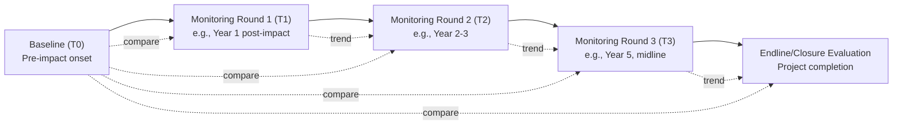

## Baseline-Referenced Outcome Monitoring

### Definition and Purpose

Baseline-referenced outcome monitoring is the practice of measuring social outcome indicators at repeated intervals over a project's lifecycle and interpreting each measurement relative to a pre-project (or pre-impact) baseline value, rather than in isolation. This approach anchors ongoing monitoring data to a fixed reference point, allowing practitioners to distinguish genuine project-related change from natural variation, seasonal fluctuation, or pre-existing trends that would have occurred regardless of the project.

Within a Monitoring, Evaluation, and Adaptive Management (MEAM) system, baseline-referenced monitoring provides the comparative logic that makes outcome and impact indicators (as opposed to simple output counts) interpretable: a statement like "60% of households report restored income" is only meaningful for adaptive management purposes when compared against what that same population's income status was before project-related impacts began.

### Relationship to Baseline Establishment

Baseline-referenced monitoring depends structurally on the baseline having been collected correctly at the outset, as covered in indicator development practice:

- The baseline must be collected using the **same indicator definitions, disaggregation categories, and measurement methods** that will be used in subsequent monitoring rounds, since any change in methodology between baseline and follow-up rounds introduces measurement artifacts that can be mistaken for real change.
- The baseline must be collected **before the onset of the specific impact** being tracked (e.g., before physical displacement, before land acquisition, before a labor influx begins), not merely before "project start" in a generic sense, since different impact pathways can begin at different project phases.

[Inference] In practice, a single project often has multiple distinct baseline dates for different indicator sets, because different impact pathways (land acquisition, construction-phase labor influx, operational-phase effects) begin at different times; treating "the baseline" as a single universal date across all indicators can misalign the reference point for indicators tied to later-onset impacts.

### Core Analytical Logic

$$\Delta_{\text{observed}} = X_{t} - X_{0}$$

Where $X_{0}$ is the baseline value and $X_{t}$ is the value observed at monitoring round $t$. This raw observed change, however, cannot on its own be attributed entirely to the project — it may include the effect of external factors unrelated to the project (economic trends, weather, other development programs operating concurrently).

**Key Points**

- Baseline-referenced monitoring answers "how has this indicator changed since baseline?"
- It does **not**, by itself, answer "how much of that change is attributable to the project?" — attribution requires a counterfactual comparison (see the comparison-group discussion below).
- The distinction between *monitoring change over time* and *attributing change to the intervention* is one of the most common sources of overreach in social performance reporting.

### Monitoring Design Options

| Design | Description | Attribution Strength | Typical Use |
| --- | --- | --- | --- |
| Simple before-after (single group) | Baseline vs. follow-up in affected population only | Weak — cannot rule out external trends | Resource-constrained contexts; process/output tracking |
| Before-after with comparison group | Baseline and follow-up collected in both affected and a similar unaffected population | Moderate — approximates counterfactual | Standard practice for outcome/impact-level indicators where feasible |
| Interrupted time series | Multiple measurement points before and after impact onset, tracking trend deviation | Moderate-to-strong — detects trend breaks | Contexts with existing longitudinal administrative data |
| Quasi-experimental (matched comparison, difference-in-differences) | Statistically matched comparison group plus before-after measurement in both | Strong | Larger projects with M&E budget and technical capacity for rigorous design |
| Randomized/phased rollout comparison | Comparison based on staggered project rollout timing across similar sites | Strongest (approaches experimental rigor) | Large, multi-site programs where phased implementation is already planned |

[Unverified] The feasibility of the more rigorous designs (quasi-experimental, randomized rollout) depends heavily on project structure, budget, and timeline; not all social impact contexts can support these designs, and the choice among them is a project-specific methodological decision rather than a fixed hierarchy that all projects should climb toward.

### The Comparison/Control Group Question

Because a simple before-after design in the affected population alone cannot separate project effects from broader trends, many outcome monitoring frameworks recommend a comparison group: a population similar to the affected group in relevant characteristics (livelihood type, geography, demographic profile) but not exposed to the project's impacts.

**Design Question**: When project-affected and non-affected populations differ systematically in ways that could bias the comparison (e.g., project-affected households were selected for resettlement partly because they sat on land needed for construction, which may correlate with other characteristics), is a naive before-after comparison-group design adequate, or does the analysis require statistical matching techniques? [Inference] This is a case-specific methodological judgment that generally depends on the size of the systematic differences between groups; where selection into the "affected" group appears essentially incidental to the outcome being measured (e.g., proximity to a right-of-way), a simple comparison design may be defensible, whereas selection correlated with the outcome itself (e.g., poorer households disproportionately located in the impact zone) would warrant matching or other adjustment techniques to avoid biased conclusions.

### Monitoring Round Cadence

Common cadence conventions:

- **Annual rounds** for standard outcome indicators (income, access to services)
- **More frequent (quarterly/semi-annual) rounds** for indicators tied to acute transition periods (e.g., first 12–24 months post-resettlement, when livelihood restoration risk is highest)
- **Less frequent (2–3 year) rounds** for slower-moving impact-level indicators (asset accumulation, long-term wellbeing indices), where annual measurement would mostly capture noise rather than meaningful change

### Interpreting Deviation from Expected Trajectory

Baseline-referenced monitoring is most useful for adaptive management when combined with an expected trajectory or target pathway, not just a single endline target. This allows earlier detection of underperformance:

<svg xmlns="http://www.w3.org/2000/svg" viewBox="0 0 820 460" font-family="Helvetica, Arial, sans-serif">
<text x="410" y="28" font-size="18" font-weight="bold" text-anchor="middle" fill="#1a1a1a">Baseline-Referenced Trajectory Monitoring (svg_diagram)</text>

<line x1="80" y1="380" x2="770" y2="380" stroke="#333" stroke-width="1.5" />
<line x1="80" y1="380" x2="80" y2="70" stroke="#333" stroke-width="1.5" />
<text x="420" y="415" font-size="12" text-anchor="middle" fill="#333">Time (monitoring rounds)</text>
<text x="30" y="225" font-size="12" text-anchor="middle" fill="#333" transform="rotate(-90 30 225)">Indicator value</text>

<circle cx="120" cy="330" r="5" fill="#1e3a5f" />
<text x="120" y="355" font-size="11" text-anchor="middle" fill="#1e3a5f">Baseline (T0)</text>

<line x1="120" y1="330" x2="250" y2="270" stroke="#2f9e5c" stroke-width="2" stroke-dasharray="6,4" />
<line x1="250" y1="270" x2="400" y2="200" stroke="#2f9e5c" stroke-width="2" stroke-dasharray="6,4" />
<line x1="400" y1="200" x2="560" y2="140" stroke="#2f9e5c" stroke-width="2" stroke-dasharray="6,4" />
<line x1="560" y1="140" x2="720" y2="100" stroke="#2f9e5c" stroke-width="2" stroke-dasharray="6,4" />
<text x="720" y="90" font-size="11" fill="#1c6b3c">Expected/target trajectory</text>

<line x1="120" y1="330" x2="250" y2="300" stroke="#c94a4a" stroke-width="2.5" />
<line x1="250" y1="300" x2="400" y2="290" stroke="#c94a4a" stroke-width="2.5" />
<line x1="400" y1="290" x2="560" y2="275" stroke="#c94a4a" stroke-width="2.5" />
<line x1="560" y1="275" x2="720" y2="260" stroke="#c94a4a" stroke-width="2.5" />
<text x="720" y="250" font-size="11" fill="#8a2323">Actual observed trajectory</text>

<circle cx="250" cy="300" r="4" fill="#c94a4a" />
<circle cx="400" cy="290" r="4" fill="#c94a4a" />
<circle cx="560" cy="275" r="4" fill="#c94a4a" />

<line x1="400" y1="290" x2="400" y2="200" stroke="#c98a1e" stroke-width="1" stroke-dasharray="3,3" />
<rect x="415" y="185" width="180" height="40" rx="5" fill="#fff2e0" stroke="#c98a1e" stroke-width="1.5" />
<text x="505" y="203" font-size="10" font-weight="bold" text-anchor="middle" fill="#7a530f">Deviation exceeds</text>
<text x="505" y="217" font-size="10" font-weight="bold" text-anchor="middle" fill="#7a530f">threshold: trigger review</text>

<text x="120" y="398" font-size="10" text-anchor="middle" fill="#555">T0</text>

<text x="250" y="398" font-size="10" text-anchor="middle" fill="#555">T1</text>

<text x="400" y="398" font-size="10" text-anchor="middle" fill="#555">T2</text>

<text x="560" y="398" font-size="10" text-anchor="middle" fill="#555">T3</text>

<text x="720" y="398" font-size="10" text-anchor="middle" fill="#555">Endline</text>

</svg>

The gap between the expected trajectory and the actual observed trajectory — rather than only the final endline value — is what typically triggers an adaptive management response, since waiting until the endline to detect underperformance forecloses the opportunity to intervene during the project lifecycle.

### Deviation Thresholds and Adaptive Triggers

Practitioners commonly pre-define acceptable deviation bands around the expected trajectory, so that monitoring teams and management have a clear, non-arbitrary basis for deciding when a corrective action process should be triggered, rather than making that judgment reactively each time. Typical structure:

- **Green (on track)**: Observed value within an agreed tolerance band of the expected trajectory
- **Yellow (watch)**: Observed value shows moderate deviation, triggering closer monitoring or a diagnostic sub-study but not immediate corrective action
- **Red (trigger)**: Observed value exceeds a defined deviation threshold, triggering formal corrective action planning and, in funder-reporting contexts, potentially mandatory disclosure

[Inference] The specific numeric thresholds for green/yellow/red bands are context- and indicator-specific; no universal percentage threshold applies across all social indicators, and setting these thresholds is itself a judgment call that should involve both technical M&E staff and project management, ideally informed by the acceptable range of natural variation observed in comparable historical data where available.

### Data Comparability Safeguards

To ensure follow-up rounds remain validly comparable to baseline:

1. **Instrument consistency**: Use the same survey questions, response categories, and units across rounds; any necessary changes should be documented with a bridging methodology (e.g., collecting data both ways during a transition round) rather than switched abruptly.
2. **Sampling consistency**: Where feasible, track the same panel of households/individuals over time (a panel design) rather than drawing a fresh random sample each round, since panel data allows individual-level change tracking, not just population averages. Where panel attrition occurs (households move away, become unreachable), attrition patterns should themselves be examined, since non-random attrition (e.g., disproportionately the most vulnerable households becoming unreachable) can bias apparent trends toward the more stable, better-off remaining sample.
3. **Seasonal alignment**: Collect follow-up rounds in the same season/period as the baseline where indicators are seasonally sensitive (e.g., agricultural income, food security), to avoid mistaking seasonal variation for a real trend.
4. **Enumerator and methodology consistency**: Where feasible, maintain consistent data collection protocols and train new enumerators to the same standard as those who collected the baseline, minimizing inter-observer variation.

### Example: Livelihood Restoration Monitoring Against Baseline

**Example**

A resettlement project established a baseline household income of a defined median value across affected households before displacement. The monitoring plan sets an expected trajectory: 50% income restoration by Year 1, 80% by Year 2, and 100% (parity with baseline, adjusted for inflation) by Year 3, based on the livelihood restoration plan's projected timeline.

- **Year 1 monitoring**: Observed median income restoration reaches only 30% against an expected 50% — a "yellow" deviation.
- **Diagnostic response**: Rather than waiting for Year 2, the M&E team commissions a rapid qualitative diagnostic (focus groups, key informant interviews) to understand the gap — findings indicate that alternative livelihood training was delayed by six months due to procurement issues.
- **Year 2 monitoring**: With the training now delivered, observed restoration reaches 75% against a revised expected 80% — within tolerance, moving back to "green."
- **Attribution caveat**: The report notes that a concurrent regional economic downturn affecting non-resettled comparison households as well suggests some of the shortfall may reflect broader economic conditions rather than the project's livelihood restoration program specifically, illustrating why comparison-group data (where available) strengthens the interpretation.

### Common Pitfalls

- **Moving baseline problem**: Revising or "re-baselining" without transparent documentation when early results look unfavorable, which undermines the credibility and comparability of the entire monitoring series.
- **Post-hoc baseline substitution**: Using a later measurement as a de facto baseline because true pre-impact data was never collected, without clearly flagging this limitation in all subsequent reporting.
- **Ignoring comparison group divergence**: Attributing all observed change in the affected population to the project without checking whether a comparison/control population moved similarly, which would suggest the change is due to external factors.
- **Endline-only monitoring**: Waiting until project closure to compare against baseline, forfeiting the opportunity to detect and correct underperformance during implementation.
- **Panel attrition blindness**: Reporting apparent improvement over time without checking whether the most vulnerable respondents from the baseline sample are disproportionately missing from later rounds.
- **Confusing statistical and practical significance**: Treating any observed numeric change from baseline as meaningful without considering measurement error, sample size, or whether the magnitude of change is actually consequential for affected people's wellbeing.

### Related Topics

- Developing social performance indicators
- Counterfactual and comparison-group evaluation design
- Livelihood restoration planning and monitoring
- Adaptive management triggers and corrective action planning
- Panel survey design and attrition management
- Grievance data as a complementary monitoring source
- Midline and endline evaluation methodology