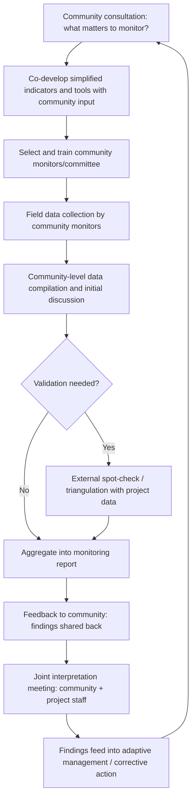

## Participatory and Community-Based Monitoring

### Definition and Scope

Participatory and community-based monitoring (often abbreviated PM or CBM) refers to monitoring approaches in which affected community members are active participants — as data collectors, analysts, or decision-makers about what and how to monitor — rather than passive subjects observed by external evaluators. Within a Monitoring, Evaluation, and Adaptive Management (MEAM) system, this approach shifts monitoring from something done *to* a community to something done *with* or *by* the community, on the premise that local people hold contextual knowledge, ongoing physical presence, and legitimacy that external monitoring teams often lack.

Participatory monitoring is not a single method but a spectrum of practices, ranging from communities providing input into indicator design (while data collection remains externally led) to communities fully owning and operating an independent monitoring system with no external control over findings.

### The Participation Spectrum

**Key Points**

| Level | Community Role | External Role | Typical Use |
| --- | --- | --- | --- |
| Consultative | Provide input on what matters to monitor | Design instruments, collect and analyze data | Early-stage indicator co-development |
| Collaborative | Co-design instruments; participate in data collection alongside external staff | Provide technical support, quality assurance, aggregation | Community scorecards, joint field monitoring |
| Community-led with external support | Community members independently collect and often analyze data using tools developed jointly | Provide training, occasional validation, technical backstopping | Community monitoring committees, citizen science |
| Fully autonomous/independent monitoring | Community designs, collects, analyzes, and reports independently | None, or only receives reports | Independent third-party or community-driven accountability monitoring |

[Inference] Movement along this spectrum toward greater community autonomy generally increases local ownership and contextual validity but can reduce standardization and comparability across sites or over time; the appropriate point on this spectrum is a project-specific design choice rather than a fixed best practice, and is often influenced by the relative trust between the community and the project proponent — independent, less externally-controlled monitoring tends to carry more credibility precisely where that trust is low.

### Why Participatory Monitoring Matters

- **Local knowledge advantage**: Community members often detect subtle changes (shifts in resource availability, early signs of social tension, changes in informal support networks) that periodic external survey rounds are structurally unlikely to capture between visits.
- **Continuous presence**: Communities are present year-round, enabling near-real-time detection of emerging issues rather than only point-in-time snapshots at scheduled monitoring rounds.
- **Trust and credibility**: In contexts where communities distrust the project proponent's own data (a common dynamic in extractives, large infrastructure, or contested-consent projects), community-generated data can carry greater legitimacy in disputes or negotiations.
- **Capacity building and empowerment**: The process of participating in monitoring can itself build organizational capacity and collective agency within the community, a secondary but often valued benefit distinct from the data output itself.
- **Complementarity with external monitoring**: Participatory monitoring is generally most effective as a complement to, rather than a full replacement for, externally validated monitoring — particularly for indicators requiring technical measurement (e.g., water quality parameters) or where independent verification is needed for compliance purposes.

### Common Participatory Monitoring Tools

**Community scorecards**: A structured group process in which community members rate service delivery or project performance against jointly defined criteria, often followed by an interface meeting between the community and service providers/project staff to discuss results and agree on improvements.

**Participatory GIS / community mapping**: Community members map resources, land use changes, hazards, or impacts using simple mapping tools (sketch maps, GPS-enabled mobile mapping, or participatory 3D modeling), often used to track land-use or environmental change relevant to social impacts.

**Community monitoring committees**: Locally elected or selected groups trained to conduct regular structured observation (e.g., of construction activities, compensation delivery, resettlement site conditions) using simplified checklists or forms.

**Photo/video voice methods**: Community members document conditions or changes through photography or video, providing qualitative visual evidence alongside narrative explanation, often useful for capturing dimensions (dignity, cultural disruption, aesthetic/environmental change) that numeric indicators struggle to represent.

**Community-based grievance monitoring**: Community volunteers or committees track and report on how grievances are being handled from the community's vantage point, complementing the project's own internal grievance tracking (see the GRM data tracking discussion) with an independent perspective on the same process.

**Mobile/SMS-based citizen reporting**: Structured or semi-structured reporting via basic mobile phones or smartphones, allowing dispersed community monitors to submit observations without requiring in-person meetings.

### Participatory Monitoring Workflow

### Selecting and Training Community Monitors

**Design Question**: Should community monitors be selected by the community itself, appointed by local authorities, or selected through a project-run process? [Inference] Community self-selection (e.g., through existing community groups or open nomination) is generally considered more likely to produce monitors perceived as legitimate and independent by the wider community, whereas appointment by local authorities or the project risks perceptions of bias, particularly where local power structures are contested; however, self-selection processes must still attend to inclusion, since dominant social groups may otherwise capture the monitor role and exclude marginalized voices (women, minority ethnic groups, lower-status households) from participation.

Typical training components for community monitors:

- Basic data collection ethics (consent, confidentiality of respondents, non-coercion)
- Use of simplified, low-literacy-friendly recording tools (pictorial checklists, simple tally forms, voice-memo protocols)
- Distinguishing observation from opinion/interpretation in recorded data
- Reporting protocols and escalation pathways for urgent findings (e.g., safety hazards, rights violations observed during monitoring)
- Basic understanding of how their data will be used and who will see it, to manage expectations about influence and confidentiality

### Data Quality and Triangulation Considerations

Participatory monitoring data carries distinct quality trade-offs compared to externally administered surveys:

| Dimension | Participatory Monitoring Strength | Participatory Monitoring Risk |
| --- | --- | --- |
| Contextual validity | High — locally meaningful, culturally grounded | Can reflect narrow local framing that misses broader comparability |
| Timeliness | High — near-continuous observation possible | Irregular reporting if not structured/incentivized |
| Cost | Generally lower marginal cost per data point | Training and support costs still required |
| Standardization | Lower unless tools are carefully simplified and consistent | Risk of inconsistent recording across different monitors |
| Independence/bias | Can be high if monitors are community-selected and trusted | Risk of capture by dominant local interests, or conversely by complainant bias against the project |
| Statistical representativeness | Often low (non-random, convenience-based observation) | Should generally be paired with, not substituted for, representative survey-based monitoring for impact-level claims |

Triangulation — cross-checking participatory monitoring findings against externally collected data, administrative records, or independent verification — is standard practice for strengthening confidence in findings, particularly before participatory data is used to support significant management decisions or external reporting claims. [Inference] The degree of triangulation warranted should scale with the stakes of the decision being informed: a participatory finding prompting a routine internal follow-up conversation likely needs less validation than one being used to justify a major corrective action or included in a formal compliance report.

### Illustration: Data Flow with Dual Validation

<svg xmlns="http://www.w3.org/2000/svg" viewBox="0 0 860 420" font-family="Helvetica, Arial, sans-serif">
<text x="430" y="28" font-size="18" font-weight="bold" text-anchor="middle" fill="#1a1a1a">Participatory + External Monitoring Triangulation (svg_diagram)</text>
<rect x="40" y="70" width="330" height="90" rx="8" fill="#eaf2fb" stroke="#3f6fa8" stroke-width="1.5" />
<text x="205" y="100" font-size="13" font-weight="bold" text-anchor="middle" fill="#1e3a5f">Community-Based Monitoring</text>
<text x="55" y="122" font-size="11" fill="#333">Monitoring committees, scorecards,</text>
<text x="55" y="138" font-size="11" fill="#333">photo-voice, mobile citizen reporting</text>
<rect x="490" y="70" width="330" height="90" rx="8" fill="#fdeaea" stroke="#c94a4a" stroke-width="1.5" />
<text x="655" y="100" font-size="13" font-weight="bold" text-anchor="middle" fill="#8a2323">External/Project Monitoring</text>
<text x="505" y="122" font-size="11" fill="#333">Household surveys, technical</text>
<text x="505" y="138" font-size="11" fill="#333">measurements, program records</text>
<line x1="205" y1="160" x2="380" y2="230" stroke="#888" stroke-width="2" />
<line x1="655" y1="160" x2="480" y2="230" stroke="#888" stroke-width="2" />
<rect x="290" y="235" width="280" height="80" rx="8" fill="#fff2e0" stroke="#c98a1e" stroke-width="2" />
<text x="430" y="265" font-size="13" font-weight="bold" text-anchor="middle" fill="#7a530f">Triangulation &amp; Cross-Validation</text>
<text x="430" y="285" font-size="11" text-anchor="middle" fill="#333">Convergence strengthens confidence;</text>
<text x="430" y="300" font-size="11" text-anchor="middle" fill="#333">divergence prompts further inquiry</text>
<line x1="430" y1="315" x2="430" y2="345" stroke="#888" stroke-width="2" marker-end="url(#arr3)" />
<rect x="280" y="350" width="300" height="55" rx="8" fill="#c3ddf7" stroke="#1e3a5f" stroke-width="1.5" />
<text x="430" y="375" font-size="12" font-weight="bold" text-anchor="middle" fill="#0d1f33">Adaptive Management Decision</text>
<text x="430" y="393" font-size="10" text-anchor="middle" fill="#333">informed by converged evidence base</text>
</svg>

### Example: Community Monitoring Committee for Resettlement Site Conditions

**Example**

A resettlement project establishes a community monitoring committee at a new resettlement site, comprising members nominated by household clusters (with a minimum representation quota for women and elderly-headed households agreed jointly with the community).

1. **Co-designed checklist**: The committee, with facilitation support, develops a simplified monthly checklist covering: water supply functionality, access road condition, social infrastructure use (school, health post), and any observed disputes or safety concerns.
2. **Monthly monitoring**: Committee members conduct a walk-through and brief household check-ins, recording findings using a simple paper form with picture-based rating icons (adapted for varying literacy levels).
3. **Compilation and discussion**: Findings are compiled at a monthly committee meeting, where patterns are discussed before submission to the project's social team.
4. **Interface meeting**: Quarterly, the committee presents findings directly to project management in a joint meeting, allowing direct community voice in interpreting the data rather than only receiving a filtered summary.
5. **Triangulation**: The project's independent M&E team conducts semi-annual spot-checks against the committee's water supply and infrastructure findings using technical measurement, cross-validating community-reported conditions against externally verified data before those specific claims are included in external compliance reporting.
6. **Feedback loop**: A running record of committee findings and project responses is posted at the community center in the local language, closing the loop and demonstrating that community input results in visible follow-up action.

### Common Pitfalls

- **Tokenistic participation**: Involving community members only in data collection (as unpaid or under-compensated labor) while all analysis, interpretation, and decision-making remain entirely external, undermining the empowerment rationale for the approach.
- **Elite capture**: Allowing existing local power holders to dominate monitor selection or data interpretation, systematically muting marginalized voices the mechanism was partly intended to surface.
- **Inconsistent recording without support**: Providing training once at the outset without ongoing supportive supervision, leading to data quality degradation as monitors face unaddressed questions or ambiguous situations over time.
- **No feedback loop**: Collecting community-generated data without visibly reporting back findings or resulting actions to the community, which erodes motivation to continue participating and can be perceived as extractive.
- **Overreliance without triangulation**: Using uncorroborated participatory data as the sole basis for significant compliance claims or management decisions without external validation, exposing the monitoring system's credibility to challenge.
- **Uncompensated burden**: Expecting sustained monitoring effort from community volunteers without adequately addressing the time burden this places on them, particularly for already time-constrained groups such as women with substantial domestic responsibilities. [Inference] Compensation approaches vary widely by context and organizational policy — some programs provide stipends or in-kind support, others rely on structuring monitoring as a low-burden, integrated activity — and the appropriate approach depends on local norms around volunteer versus paid civic participation, which should be assessed rather than assumed.

### Related Topics

- Developing social performance indicators
- Baseline-referenced outcome monitoring
- Culturally appropriate grievance channels
- Stakeholder engagement and consultation methodologies
- Grievance data tracking, analysis, and reporting
- Free, Prior, and Informed Consent (FPIC) processes
- Adaptive management and corrective action planning