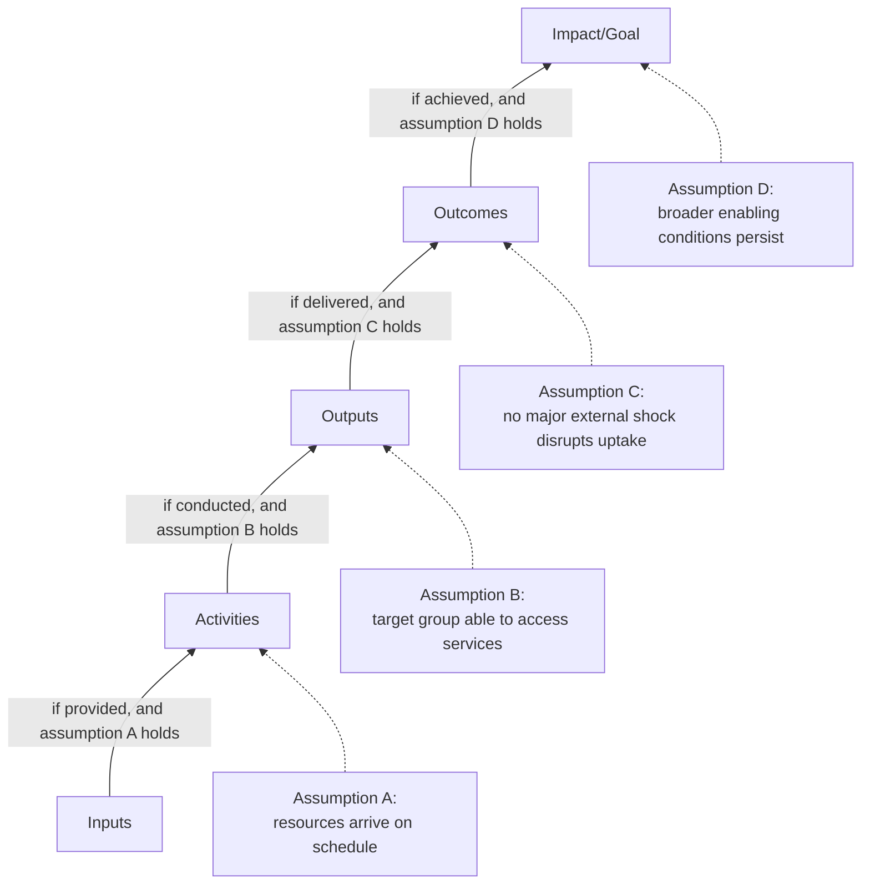

## Theory of Change and Logframe Design

### Definition and Purpose

A Theory of Change (ToC) is an explicit articulation of how and why a set of project activities is expected to lead to desired social outcomes and long-term impacts, including the underlying assumptions and contextual conditions that must hold for the causal chain to function. A Logical Framework (logframe) is a structured, typically tabular tool that operationalizes a theory of change into a matrix of objectives, indicators, means of verification, and assumptions across defined result levels.

Within Monitoring, Evaluation, and Adaptive Management (MEAM), these two tools are closely related but serve distinct functions: the ToC provides the narrative and causal logic — often visualized as a diagram — explaining *why* the project is expected to work, while the logframe translates that logic into a monitorable structure that anchors indicator development, data collection planning, and reporting. A logframe without an underlying theory of change tends to produce indicators disconnected from a coherent causal argument; a theory of change without a logframe tends to remain a conceptual narrative that is difficult to monitor systematically.

### Core Components of a Theory of Change

**Key Points**

- **Long-term impact/goal**: The ultimate, higher-level social change the project aims to contribute to (e.g., improved community wellbeing, sustainable livelihoods).
- **Outcomes**: Medium-term changes in behavior, practice, or condition among specific stakeholder groups that are expected to lead toward the impact.
- **Outputs**: Direct products or deliverables of project activities.
- **Activities**: The specific actions undertaken by the project or its implementing partners.
- **Inputs**: Resources (financial, human, technical) required to carry out activities.
- **Assumptions**: Conditions that must hold true, but are outside the project's direct control, for each causal link in the chain to function as expected (e.g., "government maintains land tenure security," "market prices for alternative crops remain stable").
- **Preconditions/pathways**: Intermediate causal steps or enabling conditions positioned between outcome levels, often used in more elaborated theories of change to make each causal link more explicit and testable.

### Theory of Change vs. Logframe: Structural Comparison

| Aspect | Theory of Change | Logframe |
| --- | --- | --- |
| Primary format | Narrative and/or diagram (causal pathway map) | Structured matrix/table |
| Emphasis | Explaining *why* and *how* change is expected to occur, including assumptions | Operationalizing *what* will be measured and *how verified* |
| Typical use | Strategic planning, stakeholder alignment, communicating project logic | Indicator planning, M&E system design, donor/funder reporting templates |
| Treatment of assumptions | Central and elaborated — critical to the causal argument | Often reduced to a single assumptions column per row |
| Flexibility | Generally treated as a living document, revisited as understanding deepens | Often treated as a more fixed reference document, though should still be revisited |
| Typical origin | Developed through participatory/analytical process, sometimes before a logframe | Frequently derived *from* an already-articulated theory of change |

[Inference] In practice, project teams sometimes develop a logframe without first fully articulating an underlying theory of change, particularly under funder template pressure; this sequencing shortcut is common but is generally considered to produce a weaker logframe, since assumptions and causal linkages between levels tend to be less rigorously examined without the ToC development process.

### Standard Logframe Matrix Structure

| Result Level | Narrative Summary | Indicators | Means of Verification (MoV) | Assumptions |
| --- | --- | --- | --- | --- |
| Goal/Impact | Long-term change the project contributes to | Impact-level indicators | Impact evaluation, secondary data | Assumptions linking outcome to impact |
| Outcome(s) | Medium-term change in target group behavior/condition | Outcome-level indicators | Household surveys, monitoring reports | Assumptions linking output to outcome |
| Output(s) | Direct deliverables of activities | Output-level indicators | Program/administrative records | Assumptions linking activity to output |
| Activities | Specific actions undertaken | (Often process indicators or milestones) | Activity/progress reports | Assumptions linking input to activity |
| Inputs | Resources required | Budget/resource utilization | Financial and procurement records | — |

The logframe's characteristic feature is its **vertical logic**: each row's narrative summary should causally lead to the row above it, contingent on the assumptions listed for that row holding true. This is often referred to as the "if-then" or "if-and-then" logic underlying the matrix.

### Vertical and Horizontal Logic

**Vertical logic** (reading bottom to top): *If* inputs are provided *and* assumptions hold, *then* activities occur; *if* activities occur *and* assumptions hold, *then* outputs are produced; and so on up the chain to impact. This chain of conditional statements is the testable causal backbone of the logframe.

**Horizontal logic** (reading across a single row): For each result level, the indicator specifies *what* will be measured, the means of verification specifies *how and where* that measurement will be found or collected, and together these should provide sufficient information to confirm whether that row's narrative summary has actually been achieved.

### Developing a Theory of Change: Process Steps

1. **Define the long-term impact/goal** the project seeks to contribute to, grounded in the problem analysis from the SIA.
2. **Work backward** from that impact through outcomes, identifying the intermediate changes that must occur among specific stakeholder groups for the impact to materialize.
3. **Identify outputs** — the direct, controllable deliverables the project itself is responsible for producing.
4. **Map activities and inputs** required to produce each output.
5. **Surface and test assumptions** at each causal link, ideally through participatory discussion with stakeholders and available evidence (prior evaluations, contextual research) rather than assumed uncritically.
6. **Identify risks to assumptions** — for each assumption, consider what could cause it to fail and whether the project has any mitigation lever over that risk.
7. **Validate the pathway with stakeholders**, including affected communities, to check whether the assumed causal logic matches lived experience and local knowledge, which can reveal flawed assumptions the project team had not considered.
8. **Translate into a logframe**, assigning indicators, means of verification, and responsible parties to each level.

**Design Question**: Should assumptions that are identified as high-risk and largely outside the project's control (e.g., macroeconomic conditions, government policy stability) be actively monitored as part of the M&E system, or simply documented and revisited periodically? [Inference] Common practice favors active monitoring for assumptions assessed as both high-risk *and* high-consequence for the causal chain (i.e., where failure would substantially undermine achievement of outcomes), since these represent the greatest threat to the theory of change's validity, while lower-consequence assumptions are more often just periodically reviewed rather than continuously tracked — this is a resource-allocation judgment rather than a fixed rule, since not every assumption can be actively monitored within realistic M&E budgets.

### Illustration: Theory of Change Causal Pathway Map

<svg xmlns="http://www.w3.org/2000/svg" viewBox="0 0 900 520" font-family="Helvetica, Arial, sans-serif">
<text x="450" y="28" font-size="18" font-weight="bold" text-anchor="middle" fill="#1a1a1a">Theory of Change Causal Pathway (svg_diagram)</text>
<rect x="370" y="55" width="160" height="55" rx="8" fill="#7fa8d9" stroke="#0d1f33" stroke-width="2" />
<text x="450" y="88" font-size="13" font-weight="bold" text-anchor="middle" fill="#0d1f33">IMPACT/GOAL</text>
<line x1="450" y1="110" x2="450" y2="140" stroke="#888" stroke-width="2" marker-end="url(#arr4)" />
<rect x="280" y="145" width="160" height="55" rx="8" fill="#a9c9ef" stroke="#1e3a5f" stroke-width="1.5" />
<text x="360" y="178" font-size="12" font-weight="bold" text-anchor="middle" fill="#0d1f33">OUTCOME A</text>
<rect x="460" y="145" width="160" height="55" rx="8" fill="#a9c9ef" stroke="#1e3a5f" stroke-width="1.5" />
<text x="540" y="178" font-size="12" font-weight="bold" text-anchor="middle" fill="#0d1f33">OUTCOME B</text>
<line x1="360" y1="200" x2="360" y2="230" stroke="#888" stroke-width="2" marker-end="url(#arr4)" />
<line x1="540" y1="200" x2="540" y2="230" stroke="#888" stroke-width="2" marker-end="url(#arr4)" />
<rect x="200" y="235" width="140" height="50" rx="8" fill="#c3ddf7" stroke="#1e3a5f" stroke-width="1.5" />
<text x="270" y="264" font-size="11" font-weight="bold" text-anchor="middle" fill="#0d1f33">OUTPUT 1</text>
<rect x="380" y="235" width="140" height="50" rx="8" fill="#c3ddf7" stroke="#1e3a5f" stroke-width="1.5" />
<text x="450" y="264" font-size="11" font-weight="bold" text-anchor="middle" fill="#0d1f33">OUTPUT 2</text>
<rect x="560" y="235" width="140" height="50" rx="8" fill="#c3ddf7" stroke="#1e3a5f" stroke-width="1.5" />
<text x="630" y="264" font-size="11" font-weight="bold" text-anchor="middle" fill="#0d1f33">OUTPUT 3</text>
<line x1="270" y1="285" x2="270" y2="315" stroke="#888" stroke-width="2" marker-end="url(#arr4)" />
<line x1="450" y1="285" x2="450" y2="315" stroke="#888" stroke-width="2" marker-end="url(#arr4)" />
<line x1="630" y1="285" x2="630" y2="315" stroke="#888" stroke-width="2" marker-end="url(#arr4)" />
<rect x="150" y="320" width="600" height="45" rx="8" fill="#dcebff" stroke="#3f6fa8" stroke-width="1.5" />
<text x="450" y="347" font-size="12" font-weight="bold" text-anchor="middle" fill="#1e3a5f">ACTIVITIES (project-implemented actions)</text>
<line x1="450" y1="365" x2="450" y2="395" stroke="#888" stroke-width="2" marker-end="url(#arr4)" />
<rect x="250" y="400" width="400" height="40" rx="8" fill="#eaf2fb" stroke="#3f6fa8" stroke-width="1.5" />
<text x="450" y="424" font-size="12" font-weight="bold" text-anchor="middle" fill="#1e3a5f">INPUTS (budget, staff, resources)</text>

<rect x="720" y="145" width="160" height="80" rx="6" fill="#fff2e0" stroke="#c98a1e" stroke-width="1" stroke-dasharray="4,3" />
<text x="800" y="163" font-size="10" font-weight="bold" text-anchor="middle" fill="#7a530f">Assumptions</text>
<text x="730" y="180" font-size="9" fill="#333">— Stable policy environment</text>
<text x="730" y="194" font-size="9" fill="#333">— No major external shock</text>
<text x="730" y="208" font-size="9" fill="#333">— Target group retains access</text>
<rect x="720" y="235" width="160" height="80" rx="6" fill="#fff2e0" stroke="#c98a1e" stroke-width="1" stroke-dasharray="4,3" />
<text x="800" y="253" font-size="10" font-weight="bold" text-anchor="middle" fill="#7a530f">Assumptions</text>
<text x="730" y="270" font-size="9" fill="#333">— Beneficiaries able to</text>
<text x="730" y="282" font-size="9" fill="#333"> participate as planned</text>
<text x="730" y="296" font-size="9" fill="#333">— Timely delivery of outputs</text>
</svg>

### Example: Theory of Change for a Livelihood Restoration Component

**Example**

- **Impact**: Restored and sustainable household wellbeing among resettled communities
- **Outcome**: Resettled households achieve income levels at or above pre-displacement baseline, with income diversification reducing vulnerability to single-source shocks
- **Output**: Households complete alternative livelihood training and receive start-up support (equipment, seed capital, or land access)
- **Activity**: Design and deliver livelihood training curricula; disburse start-up support packages; provide post-training mentoring
- **Input**: Livelihood restoration budget; trained facilitators; partnership agreements with technical training providers
- **Key assumptions**: (1) Local market conditions can absorb new livelihood activities without saturating demand; (2) Households have sufficient labor capacity, after resettlement-related disruption, to take up new livelihood activities; (3) Land or resource access needed for new livelihoods (e.g., agricultural plots) is secured as planned

**Corresponding logframe row (outcome level)**:

| Narrative Summary | Indicator | Means of Verification | Assumptions |
| --- | --- | --- | --- |
| Resettled households achieve income parity and diversification | % of households at ≥100% of baseline income; number of income sources per household (mean) | Annual household survey; comparison-group data | Local market can absorb new livelihood activities without saturation |

### Common Design Weaknesses

- **Missing or unexamined assumptions**: Logframes that leave the assumptions column sparse or generic ("political stability maintained") without genuine analysis of what specific conditions the causal chain depends on, or what would happen if they failed.
- **Logic gaps between levels**: Outcomes that do not plausibly follow from the specified outputs (e.g., assuming that training delivery alone, without addressing market access barriers, will produce income outcomes).
- **Indicator-narrative mismatch**: Indicators that do not actually measure what the narrative summary claims (horizontal logic failure) — for instance, using an output-level indicator (number trained) to claim evidence of an outcome-level change (income restored).
- **Static documents**: Treating the logframe as fixed at project approval and never revisiting it as implementation reveals flawed assumptions or changed context, undermining its usefulness for adaptive management.
- **Impact-level overreach**: Claiming attribution of impact-level change directly to project activities without acknowledging the many external assumptions and contributing factors along the causal chain, echoing the attribution caution relevant to baseline-referenced outcome monitoring.
- **Assumption-outcome confusion**: Placing what is actually a necessary project deliverable in the assumptions column (treating something the project should be responsible for delivering as merely an external hope), which obscures accountability.

### Related Topics

- Developing social performance indicators
- Baseline-referenced outcome monitoring
- Adaptive management and corrective action planning
- Results-based management frameworks
- Risk and assumption monitoring systems
- Stakeholder engagement and participatory planning processes
- Livelihood restoration program design