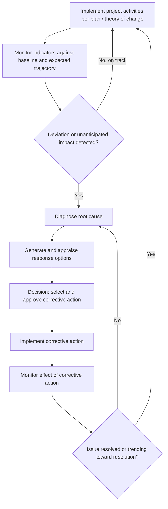

## Adaptive Management and Course Correction

### Definition and Purpose

Adaptive management is the systematic practice of using ongoing monitoring data and evaluation findings to deliberately revise project design, implementation approaches, or mitigation measures during the project lifecycle, rather than treating the original project plan as fixed regardless of what monitoring reveals. Course correction refers to the specific corrective actions taken as a result of this process — the operational changes made in response to detected underperformance, unanticipated impacts, or failed assumptions.

Within a Monitoring, Evaluation, and Adaptive Management (MEAM) system, adaptive management is the function that closes the loop opened by the other MEAM components: indicators (developed per the process discussed under social performance indicators), baseline-referenced monitoring, participatory monitoring, and the theory of change/logframe all exist, ultimately, to generate the evidence base that adaptive management acts upon. A monitoring system that produces excellent data but never triggers a documented management response is not functioning as an adaptive management system — it is functioning only as a reporting system.

### The Adaptive Management Cycle

**Key Points**

- Adaptive management is inherently cyclical, not a one-time correction event.
- It depends on monitoring data being available with sufficient timeliness to allow intervention before damage becomes severe or irreversible.
- It requires institutional mechanisms (defined authority, triggers, decision processes) that translate "we noticed a problem" into "we changed something," since data alone does not automatically produce action.

### Triggers for Adaptive Management

Adaptive management responses are generally triggered by one or more of the following signal types:

| Trigger Type | Example | Source |
| --- | --- | --- |
| Deviation from expected trajectory | Livelihood restoration tracking below the pre-defined trajectory band | Baseline-referenced outcome monitoring |
| Grievance pattern/recurrence | Repeated grievances on the same root cause exceeding a defined threshold | GRM data tracking and analysis |
| Unanticipated impact | A social effect not predicted in the original SIA emerges during implementation | Participatory monitoring, field observation, community reporting |
| Failed assumption | A theory-of-change assumption (e.g., "market can absorb new livelihoods") proves false | Combined monitoring and diagnostic review |
| External context shift | Policy change, economic shock, conflict escalation, natural hazard | Contextual/risk monitoring |
| Independent audit or evaluation finding | Midline or independent compliance review identifies a systemic gap | External evaluation |

[Inference] Not every deviation warrants the same intensity of response; most adaptive management frameworks implicitly or explicitly grade responses by severity, distinguishing between minor within-tolerance variation (routine monitoring continues), moderate deviation (diagnostic review triggered), and severe deviation or high-risk unanticipated impacts (formal corrective action process triggered, sometimes with mandatory escalation to senior management or funder notification) — this graded response structure mirrors the trigger threshold logic used in baseline-referenced monitoring.

### Diagnostic Process: From Signal to Root Cause

Detecting a deviation is not the same as understanding its cause, and premature corrective action based on an incorrect diagnosis can waste resources or worsen the underlying problem. A structured diagnostic step typically precedes the design of a corrective action:

1. **Confirm the signal is real**: Rule out data quality issues, measurement error, or seasonal/sampling artifacts before concluding a genuine deviation exists (see the data comparability safeguards relevant to baseline-referenced monitoring).
2. **Disaggregate the finding**: Determine whether the deviation is project-wide or concentrated in a specific location, demographic group, or component, since this materially changes the appropriate response.
3. **Gather qualitative context**: Use key informant interviews, focus groups, or community monitoring input to understand *why* the deviation is occurring, since quantitative indicators typically show *that* something changed but not *why*.
4. **Test alternative explanations**: Consider whether external factors (economic conditions, concurrent programs, contextual shocks) rather than the project itself are the primary driver, particularly where a comparison group is available to help isolate project-specific effects.
5. **Identify the specific failed link in the theory of change**: Locate which causal step (input→activity, activity→output, output→outcome) is breaking down, since the appropriate corrective action differs substantially depending on where in the chain the failure occurs.

### Types of Corrective Action

**Design-level corrections**: Revising the project's technical or physical design (e.g., adjusting a resettlement site layout, modifying compensation formulas, redesigning a livelihood restoration package).

**Process-level corrections**: Changing how activities are implemented without changing the underlying objective (e.g., adding a step to the consultation process, changing the sequencing of compensation payment and physical relocation, adjusting the grievance intake channel mix in response to low uptake from a specific group).

**Resourcing corrections**: Increasing budget, staff, or technical support allocated to an underperforming component.

**Partnership/institutional corrections**: Changing implementing partners, contractors, or the institutional arrangement responsible for a function found to be underperforming.

**Indicator/target corrections**: Revising the indicator, target, or expected trajectory itself, where monitoring reveals the original target was based on a flawed assumption — though this type of correction requires particular caution and transparency (see the "moving baseline" pitfall discussed under baseline-referenced monitoring), since revising targets after the fact can also be used to obscure genuine underperformance if not done transparently.

**Scope corrections**: In more severe cases, pausing, scaling back, or halting a specific project component or activity found to be causing significant unanticipated harm, pending redesign.

### Decision Authority and Escalation Structure

A functioning adaptive management system requires clarity on who has authority to approve different tiers of corrective action, since ambiguity here is a common reason data-driven signals fail to translate into action:

<svg xmlns="http://www.w3.org/2000/svg" viewBox="0 0 860 420" font-family="Helvetica, Arial, sans-serif">
<text x="430" y="28" font-size="18" font-weight="bold" text-anchor="middle" fill="#1a1a1a">Adaptive Management Decision Authority Tiers (svg_diagram)</text>
<rect x="60" y="60" width="740" height="70" rx="8" fill="#eaf2fb" stroke="#3f6fa8" stroke-width="1.5" />
<text x="430" y="90" font-size="13" font-weight="bold" text-anchor="middle" fill="#1e3a5f">Tier 1: Minor within-component adjustment</text>
<text x="430" y="112" font-size="11" text-anchor="middle" fill="#333">Field/site management authority — e.g., adjusting training schedule, minor process tweak</text>
<rect x="60" y="150" width="740" height="70" rx="8" fill="#dcebff" stroke="#3f6fa8" stroke-width="1.5" />
<text x="430" y="180" font-size="13" font-weight="bold" text-anchor="middle" fill="#1e3a5f">Tier 2: Moderate resourcing or design change</text>
<text x="430" y="202" font-size="11" text-anchor="middle" fill="#333">Project management authority — e.g., reallocating budget, revising a livelihood package</text>
<rect x="60" y="240" width="740" height="70" rx="8" fill="#c3ddf7" stroke="#1e3a5f" stroke-width="1.5" />
<text x="430" y="270" font-size="13" font-weight="bold" text-anchor="middle" fill="#0d1f33">Tier 3: Significant scope or partnership change</text>
<text x="430" y="292" font-size="11" text-anchor="middle" fill="#0d1f33">Senior management / steering committee approval — e.g., changing contractor, redesigning a component</text>
<rect x="60" y="330" width="740" height="70" rx="8" fill="#7fa8d9" stroke="#0d1f33" stroke-width="2" />
<text x="430" y="360" font-size="13" font-weight="bold" text-anchor="middle" fill="#0d1f33">Tier 4: Scope pause/halt or funder-material change</text>
<text x="430" y="382" font-size="11" font-weight="bold" text-anchor="middle" fill="#0d1f33">Board/governance and funder notification — e.g., pausing physical resettlement pending redesign</text>
<line x1="430" y1="130" x2="430" y2="148" stroke="#888" stroke-width="1.5" marker-end="url(#arr5)" />
<line x1="430" y1="220" x2="430" y2="238" stroke="#888" stroke-width="1.5" marker-end="url(#arr5)" />
<line x1="430" y1="310" x2="430" y2="328" stroke="#888" stroke-width="1.5" marker-end="url(#arr5)" />
</svg>

**Design Question**: Should the specific numeric or categorical thresholds that separate these tiers be pre-defined in the project's M&E plan, or determined case-by-case as issues arise? [Inference] Pre-defining thresholds (as discussed for deviation bands under baseline-referenced monitoring) is generally preferable where feasible, since it reduces delay caused by ad hoc deliberation about "how serious is this," reduces the risk of inconsistent responses to similar-severity issues over time, and provides a defensible basis if corrective action decisions are later scrutinized externally; however, some issues (particularly novel unanticipated impacts not contemplated in the original risk assessment) will inevitably require case-by-case judgment since they cannot be fully anticipated in advance.

### Corrective Action Planning Documentation

A standard corrective action record typically includes:

| Field | Content |
| --- | --- |
| Issue identification | What deviation/impact was detected, and the monitoring source that flagged it |
| Root cause diagnosis | Summary of the diagnostic findings |
| Response options considered | Alternative corrective actions evaluated, with trade-offs noted |
| Selected action and rationale | The chosen corrective action and justification for selecting it over alternatives |
| Responsible party and timeline | Who is accountable for implementation and by when |
| Revised targets/indicators (if applicable) | Any changes to the original logframe/indicator targets, with transparent justification |
| Monitoring plan for the correction itself | How the effectiveness of the corrective action itself will be verified |
| Closure criteria | What evidence will confirm the issue is resolved |

### Example: Course Correction in Response to Livelihood Restoration Shortfall

**Example**

Continuing the livelihood restoration scenario introduced under baseline-referenced outcome monitoring: Year 1 monitoring showed income restoration at 30% against an expected 50% trajectory.

1. **Signal confirmation**: The M&E team confirms the shortfall is not a data artifact by cross-checking survey results against program administrative records, which similarly show delayed training completion rates.
2. **Diagnosis**: Key informant interviews and focus groups reveal the specific failed link in the theory of change: the *activity→output* transition failed, because livelihood training delivery was delayed six months due to a procurement issue with the training provider, not because the training approach itself was flawed.
3. **Response options appraised**: (a) Accelerate remaining training delivery with additional facilitators; (b) provide interim income support to bridge the gap while training catches up; (c) revise the expected trajectory to reflect the delay. The team selects a combination of (a) and (b), judging that revising the trajectory alone (option c) without addressing the underlying delay would not resolve the substantive shortfall.
4. **Decision authority**: Because the corrective action involves additional budget allocation (interim income support) beyond the project manager's discretionary authority, the corrective action plan is escalated to Tier 2/3 approval per the project's pre-defined decision authority structure.
5. **Implementation and re-monitoring**: The corrective action is implemented, and Year 2 monitoring is specifically designed to track whether the combination of accelerated training and interim support closes the gap, with the corrective action recorded as "open" until the closure criteria (income restoration returning to within the tolerance band of the expected trajectory) are met.

### Common Pitfalls

- **Data without decision pathways**: Producing high-quality monitoring reports that identify clear problems, but with no defined process or authority for translating findings into approved action, resulting in "monitoring for monitoring's sake."
- **Diagnosis skipped**: Jumping directly from signal detection to corrective action without adequately diagnosing the root cause, risking a response that addresses symptoms rather than the actual failed causal link.
- **Defensive re-baselining**: Using "adaptive management" as a label to justify quietly lowering targets or revising indicators to make underperformance disappear from reports, rather than genuinely correcting course — a serious credibility risk if detected by external reviewers or affected communities.
- **Escalation paralysis**: Corrective actions stalling because the required approval tier is unclear, unavailable, or slow, allowing a detected issue to persist well past the point where the diagnostic and response steps identified an appropriate action.
- **No re-monitoring of the correction**: Implementing a corrective action and assuming it worked without verifying its actual effect through continued monitoring, risking a false sense of resolution.
- **Community exclusion from the response process**: Designing corrective actions based solely on internal project data and staff judgment, without validating the proposed response with the affected community whose feedback (including through participatory monitoring channels) often revealed the issue in the first place.

### Related Topics

- Developing social performance indicators
- Baseline-referenced outcome monitoring
- Theory of change and logframe design
- Participatory and community-based monitoring
- Grievance data tracking, analysis, and reporting
- Risk and assumption monitoring systems
- Corrective action governance and funder disclosure requirements