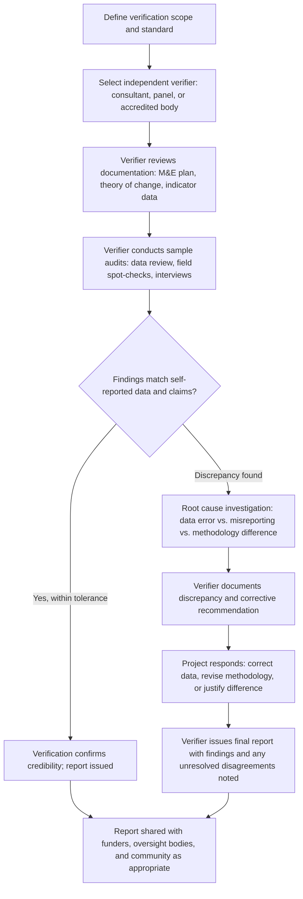

## Independent and Third-Party Verification

### Definition and Purpose

Independent and third-party verification refers to the practice of having an entity with no direct stake in project outcomes review, audit, or re-collect data to confirm the accuracy, completeness, and credibility of a project's self-reported monitoring and social performance data. Within a Monitoring, Evaluation, and Adaptive Management (MEAM) system, verification functions as an external check on the entire evidence chain — from baseline establishment through indicator tracking, participatory monitoring input, and adaptive management decisions — addressing the structural limitation that a project proponent reporting on its own performance carries an inherent conflict of interest, whether or not that conflict actually distorts the reported findings.

Verification is distinct from, but complementary to, internal monitoring and evaluation: internal M&E is designed to generate operational data for management decision-making, while independent verification is designed to test whether that data (and the processes producing it) can be trusted by external audiences — funders, regulators, affected communities, and the public.

### Why Independence Matters

**Key Points**

- Self-reported data, even when collected in good faith, is subject to unconscious bias (confirmation bias toward favorable results, optimism bias in interpreting ambiguous findings) that independent review can help detect.
- In contexts of low community trust in the project proponent, internally generated data — however accurate — may simply not be believed; independent verification provides a credibility bridge that internal reporting alone cannot.
- Verification creates accountability pressure that can improve the rigor of internal monitoring systems over time, since project teams anticipating external review tend to invest more in data quality.
- For compliance-driven contexts (lender safeguard requirements, certification schemes, regulatory obligations), independent verification is often a formal, non-discretionary requirement rather than an optional best practice.

[Inference] The degree of independence required varies by risk context and stakeholder expectations; a fully independent third party with no prior relationship to the project offers the strongest credibility, while an internal-but-separate audit function (e.g., a corporate internal audit department independent of the project team) offers a partial, more limited form of independence that may be adequate for lower-risk contexts but is generally considered insufficient for high-risk or high-controversy projects.

### Spectrum of Independence

| Level | Description | Independence Strength | Typical Use |
| --- | --- | --- | --- |
| Internal self-assessment | Project team reviews its own data | None | Routine internal quality checks |
| Internal audit function | Separate internal unit (not part of project team) reviews data/processes | Low-moderate | Corporate compliance checks |
| Second-party review | A partner organization or co-funder reviews data | Moderate | Joint-venture or co-financed projects |
| Independent consultant/auditor | Externally contracted, unaffiliated professional or firm | High | Standard third-party verification/audit |
| Independent Advisory Panel (IAP) | Standing panel of external experts with ongoing oversight role | High | Large, high-risk, or controversial projects |
| Community-designated independent monitor | Verifier selected or endorsed by affected communities themselves | High (and community-legitimate) | Contexts of low proponent-community trust |
| Statutory/regulatory audit | Government or regulatory body-mandated review | High (backed by legal authority) | Regulated sectors, compliance-triggered audits |

### Common Verification Mechanisms

**Data audits**: Systematic review of a sample of monitoring records against source documentation (survey forms, program records) to check for data entry errors, inconsistencies, or fabrication.

**Field spot-checks**: Independent visits to a sample of monitoring sites or beneficiary households to re-verify specific data points (e.g., confirming that reported compensation payments were actually received, or that reported infrastructure was actually built to specification).

**Process audits**: Review of whether stated procedures (consultation protocols, grievance handling timelines, consent processes) were actually followed as documented, rather than only reviewing the resulting data.

**Independent parallel surveys**: Commissioning a separate, independently designed and implemented survey covering some of the same indicators, allowing direct statistical comparison against internally collected data.

**Social audits**: A structured, often participatory process (sometimes overlapping with community-based monitoring approaches) in which independent facilitators support affected communities to review project performance against commitments, with findings formally documented and shared.

**Grievance mechanism audits**: Independent review of the GRM's actual functioning (case handling timeliness, confidentiality practice, resolution quality) against its documented procedures and the non-retaliation/confidentiality safeguards it claims to uphold.

**Certification and standard-based audits**: Verification against a recognized external standard (e.g., a certification scheme's social criteria), typically conducted by an accredited certification body following a defined audit protocol.

### Verification Workflow

### Selecting and Contracting a Verifier

**Design Question**: Should the independent verifier be selected and contracted by the project proponent, by the funder/lender, or jointly with affected community input? [Inference] Verifier selection method materially affects perceived independence even when the verifier's actual conduct is rigorous: proponent-selected verifiers, however professionally competent, can face credibility skepticism from communities or civil society observers who note the financial relationship runs from the party being verified to the verifier; funder-selected or jointly-agreed verifier selection (sometimes with community consultation on the choice of verifier, particularly for high-controversy projects) is generally considered to strengthen perceived independence, though this is a stakeholder-trust consideration rather than a claim that proponent-selected verification is inherently unreliable.

Key considerations in verifier selection:

- **Technical competence**: Relevant sector experience and methodological capability for the specific indicators and context being verified.
- **Absence of conflicts of interest**: No prior or concurrent financial relationship with the project proponent that could compromise independence or its perception.
- **Cultural and linguistic competence**: Particularly important where verification involves direct community engagement, echoing considerations relevant to culturally appropriate channel design more broadly.
- **Access and authority**: Contractual terms ensuring the verifier has genuine, unimpeded access to records, sites, and respondents, rather than access mediated or filtered by the project team.
- **Reporting independence**: Contractual terms ensuring the verifier's findings are reported directly to the commissioning body (funder, oversight board) rather than filtered or edited by the project proponent before release.

### Verification Scope and Sampling

Full verification of every data point is rarely feasible; verification typically relies on structured sampling:

$$n = \frac{Z^2 \cdot p(1-p)}{e^2}$$

Where $n$ is the sample size, $Z$ is the confidence-level coefficient, $p$ is the estimated proportion of interest, and $e$ is the acceptable margin of error — a standard statistical sampling formula sometimes referenced when designing the audit sample size for a data verification exercise, though verifiers often also use risk-based (non-random) sampling to deliberately oversample higher-risk categories (e.g., high-value compensation payments, contested resettlement sites) rather than relying on statistical randomness alone.

[Inference] The choice between purely random sampling (better for statistically generalizing confidence across the full dataset) and risk-based/purposive sampling (better for detecting problems concentrated in known higher-risk areas) is a verification design trade-off; many verification protocols in practice combine both — a risk-based core sample supplemented by a smaller random sample for broader assurance — though the specific ratio is protocol-dependent rather than standardized.

### Illustration: Verification as an External Check on the MEAM Loop

<svg xmlns="http://www.w3.org/2000/svg" viewBox="0 0 880 460" font-family="Helvetica, Arial, sans-serif">
<text x="440" y="28" font-size="18" font-weight="bold" text-anchor="middle" fill="#1a1a1a">Independent Verification Within the MEAM Cycle (svg_diagram)</text>

<circle cx="440" cy="250" r="150" fill="#eaf2fb" stroke="#3f6fa8" stroke-width="1.5" stroke-dasharray="0" />
<text x="440" y="140" font-size="11" font-weight="bold" text-anchor="middle" fill="#1e3a5f">Internal MEAM Cycle</text>
<rect x="360" y="160" width="160" height="45" rx="6" fill="#dcebff" stroke="#3f6fa8" stroke-width="1.5" />
<text x="440" y="187" font-size="11" font-weight="bold" text-anchor="middle" fill="#1e3a5f">Indicators &amp; baseline</text>
<rect x="240" y="270" width="160" height="45" rx="6" fill="#dcebff" stroke="#3f6fa8" stroke-width="1.5" />
<text x="320" y="297" font-size="11" font-weight="bold" text-anchor="middle" fill="#1e3a5f">Monitoring data</text>
<rect x="480" y="270" width="160" height="45" rx="6" fill="#dcebff" stroke="#3f6fa8" stroke-width="1.5" />
<text x="560" y="297" font-size="11" font-weight="bold" text-anchor="middle" fill="#1e3a5f">Adaptive management</text>
<line x1="440" y1="205" x2="330" y2="270" stroke="#888" stroke-width="1.5" />
<line x1="330" y1="315" x2="480" y2="295" stroke="#888" stroke-width="1.5" />
<line x1="560" y1="270" x2="450" y2="205" stroke="#888" stroke-width="1.5" />

<circle cx="440" cy="250" r="215" fill="none" stroke="#c94a4a" stroke-width="2.5" stroke-dasharray="10,6" />
<text x="440" y="45" font-size="13" font-weight="bold" text-anchor="middle" fill="#8a2323">Independent Verification (external audit layer)</text>
<rect x="30" y="230" width="150" height="55" rx="8" fill="#fdeaea" stroke="#c94a4a" stroke-width="1.5" />
<text x="105" y="255" font-size="10" font-weight="bold" text-anchor="middle" fill="#8a2323">Data audit &amp;</text>
<text x="105" y="270" font-size="10" font-weight="bold" text-anchor="middle" fill="#8a2323">spot-checks</text>
<rect x="700" y="230" width="150" height="55" rx="8" fill="#fdeaea" stroke="#c94a4a" stroke-width="1.5" />
<text x="775" y="255" font-size="10" font-weight="bold" text-anchor="middle" fill="#8a2323">Verification report</text>
<text x="775" y="270" font-size="10" font-weight="bold" text-anchor="middle" fill="#8a2323">to funders/public</text>
<line x1="180" y1="255" x2="290" y2="255" stroke="#c94a4a" stroke-width="1.5" stroke-dasharray="4,3" />
<line x1="590" y1="255" x2="700" y2="255" stroke="#c94a4a" stroke-width="1.5" stroke-dasharray="4,3" />
</svg>

### Example: Independent Verification of a Resettlement Compensation Program

**Example**

A resettlement project's internal M&E system reports that 95% of eligible households have received full compensation as scheduled. Given the high compliance stakes attached to this figure, the funder requires independent verification before releasing the next disbursement tranche.

1. **Scope definition**: The verification terms of reference specify review of the compensation database, a risk-based sample of high-value payments, and a random sample of standard payments, plus direct household interviews.
2. **Document review**: The independent auditor reviews the compensation eligibility criteria, payment records, and reconciliation against the project's resettlement action plan and asset inventory.
3. **Field verification**: The auditor conducts household visits (not pre-selected by the project team, to avoid selection bias) to confirm reported payment amounts match what households state they actually received, and to probe for any informal deductions or delays not captured in the official record.
4. **Discrepancy found**: The audit identifies a subset of households in one village reporting receipt of compensation amounts approximately 10% lower than the official record indicates, concentrated among households that used a specific local intermediary to process paperwork.
5. **Root cause investigation**: Further inquiry (outside the audit's original scope but flagged for follow-up) suggests the intermediary may have retained a processing fee not disclosed to households — a finding with implications for both grievance handling and future safeguarding of the compensation process.
6. **Reporting and response**: The verifier's report documents the discrepancy transparently, including its magnitude and the affected village, without over-generalizing beyond what the sample supports; the project responds with a corrective action (echoing the adaptive management process) to investigate the intermediary practice and remediate affected households, with the verifier's report and the project's response both shared with the funder.

### Common Pitfalls

- **Verification theater**: Commissioning a verification exercise with narrow scope, limited access, or insufficient independence specifically to produce a favorable report rather than a genuine credibility check, which risks severe reputational damage if later exposed.
- **Verifier capture**: Allowing the project proponent to select respondents, mediate site access, or review/edit findings before release, undermining the independence the exercise is meant to provide.
- **Sampling too narrow or too convenient**: Focusing verification sampling only on low-risk, easily accessible cases, missing the higher-risk situations most likely to reveal genuine problems.
- **One-off verification**: Treating verification as a single point-in-time compliance exercise rather than a recurring practice integrated into the ongoing MEAM cycle, missing problems that emerge between verification rounds.
- **No follow-through on findings**: Commissioning and receiving a verification report that identifies genuine issues, but failing to route those findings into the adaptive management/corrective action process, reducing verification to a paperwork exercise.
- **Conflating verification with evaluation**: Treating independent verification (which checks the accuracy and credibility of reported data and processes) as equivalent to independent evaluation (which assesses overall program effectiveness and impact) — the two serve related but distinct purposes and are sometimes, but not always, combined in a single exercise.

### Related Topics

- Baseline-referenced outcome monitoring
- Grievance data tracking, analysis, and reporting
- Adaptive management and course correction
- Participatory and community-based monitoring
- External compliance reporting under environmental and social frameworks
- Independent Advisory Panels and grievance escalation structures
- Data quality assurance and audit sampling methodology