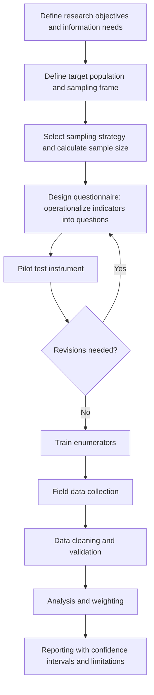

## Quantitative Survey Design and Sampling

### Definition and Purpose

Quantitative survey design and sampling refers to the systematic methodology for constructing structured data collection instruments and selecting respondent populations such that the resulting numeric data can support statistically valid inference about a broader population of interest. Within Research Methods and Data Collection for Social Impact Assessment (SIA), this discipline underpins baseline establishment, outcome monitoring (see baseline-referenced outcome monitoring), and impact evaluation — nearly every quantitative social performance indicator ultimately traces back to a survey instrument and sampling design decision made at some point in the research process.

The central methodological challenge is generalizability: a survey conducted with a poorly designed sample or a flawed instrument may produce numerically precise-looking results that nonetheless fail to accurately represent the population, or fail to measure what they claim to measure — problems that downstream statistical analysis cannot correct after the fact.

### Survey Design Process Overview

### Target Population and Sampling Frame

**Key Points**

- The **target population** is the full group about whom conclusions are intended to be drawn (e.g., all households within a defined project impact zone).
- The **sampling frame** is the actual, practically accessible list or enumeration from which the sample is drawn (e.g., a household register, a census enumeration list, a project-compiled beneficiary list).
- **Coverage error** arises when the sampling frame does not fully or accurately represent the target population — a common and often underappreciated source of bias, since a sample can be drawn with perfect randomness from a frame that itself excludes or underrepresents part of the population of interest.

[Inference] In many SIA contexts, particularly in areas with informal settlements, mobile/pastoralist populations, or incomplete administrative records, achieving a sampling frame that fully covers the target population is genuinely difficult; practitioners should treat frame quality as a specific, examined risk rather than assuming an available list (e.g., a voter roll or municipal register) adequately represents the affected population without verification.

### Probability Sampling Methods

| Method | Description | Strength | Limitation |
| --- | --- | --- | --- |
| Simple random sampling (SRS) | Every unit in the frame has an equal, independent chance of selection | Statistically straightforward, unbiased if frame is complete | Requires a complete frame; can be logistically inefficient across dispersed geography |
| Systematic sampling | Units selected at a fixed interval from a randomly chosen starting point | Simple to implement in the field | Risk of periodicity bias if the frame has a hidden cyclical pattern |
| Stratified sampling | Population divided into subgroups (strata) sharing a characteristic; random sampling within each stratum | Ensures adequate representation of small but important subgroups (e.g., a minority ethnic group, female-headed households) | Requires reliable stratification variable data in advance |
| Cluster sampling | Population divided into naturally occurring clusters (villages, city blocks); clusters randomly selected, then all/sampled units within selected clusters surveyed | Cost-efficient for geographically dispersed populations | Higher standard errors due to within-cluster homogeneity (design effect) |
| Multi-stage sampling | Combination of cluster and other methods across sequential stages (e.g., randomly select villages, then randomly select households within villages) | Balances cost-efficiency with reasonable rigor; common in large-scale household surveys | More complex sample size and weighting calculations |

### Non-Probability Sampling Methods

| Method | Description | Appropriate Use |
| --- | --- | --- |
| Convenience sampling | Selecting readily accessible respondents | Rapid, exploratory, non-generalizing needs assessments only |
| Purposive/judgmental sampling | Deliberately selecting respondents with specific characteristics relevant to the research question | Qualitative or mixed-methods components; not appropriate for population-level statistical claims |
| Snowball sampling | Existing respondents refer additional respondents | Hard-to-reach or hidden populations (e.g., specific vulnerable subgroups) where no sampling frame exists |
| Quota sampling | Non-random selection until pre-set demographic quotas are filled | Faster/cheaper alternative to stratified random sampling, with weaker statistical guarantees |

[Inference] Non-probability methods can still generate useful and valid *qualitative or exploratory* insight, but findings from these methods should not be presented with the same statistical confidence-interval language used for probability-based samples, since the mathematical basis for inferring population-level estimates from a non-random sample does not hold in the same way — this is a standard methodological distinction rather than a claim that non-probability data lacks value.

### Sample Size Determination

For estimating a population proportion with a simple random sample, the standard formula is:

$$n = \frac{Z^2 \cdot p(1-p)}{e^2}$$

Where:

- $n$ = required sample size
- $Z$ = the Z-score corresponding to the desired confidence level (e.g., $Z = 1.96$ for 95% confidence)
- $p$ = estimated proportion of the population with the characteristic of interest (use $p = 0.5$ for maximum variance/conservative sample size when no prior estimate exists)
- $e$ = desired margin of error

For a finite population (common in SIA, where the target population may be a small, bounded community rather than effectively infinite), a finite population correction is applied:

$$n_{\text{adj}} = \frac{n}{1 + \frac{n-1}{N}}$$

Where $N$ is the total finite population size and $n$ is the sample size calculated from the formula above.

When cluster or multi-stage sampling is used, the calculated sample size should be inflated by a **design effect (DEFF)** to account for reduced statistical efficiency from clustering:

$$n_{\text{cluster}} = n \times \text{DEFF}$$

[Unverified] Typical design effect values cited in survey methodology literature commonly range from approximately 1.5 to 3 for household cluster surveys, but the actual design effect for any specific survey depends on the degree of within-cluster homogeneity for the specific indicator being measured and should ideally be estimated from prior similar surveys in the same context rather than assumed from a generic range.

### Questionnaire Design Principles

**Operationalization**: Each survey question should trace back to a specific indicator defined during indicator development (see developing social performance indicators), ensuring the instrument measures what the M&E plan actually requires rather than including tangential questions that dilute respondent time and data quality.

**Question wording**:

- Avoid double-barreled questions (asking two things in one question)
- Avoid leading or loaded phrasing that suggests a socially desirable answer
- Use response categories that are exhaustive and mutually exclusive
- Match question complexity and vocabulary to the respondent population's literacy and familiarity with the topic

**Question sequencing**:

- Begin with simple, non-threatening questions to build rapport before more sensitive topics
- Group related questions together to maintain respondent cognitive flow
- Place highly sensitive questions (income, conflict experience) later, once trust is established, and consider offering explicit opt-out options for such items

**Response scale design**: Likert-type scales (e.g., 5-point agreement scales) should use balanced, evenly spaced response options; the number of scale points and use of a neutral midpoint should be decided deliberately and applied consistently across the instrument rather than varying arbitrarily by section.

### Illustration: Multi-Stage Sampling Design

<svg xmlns="http://www.w3.org/2000/svg" viewBox="0 0 880 480" font-family="Helvetica, Arial, sans-serif">
<text x="440" y="28" font-size="18" font-weight="bold" text-anchor="middle" fill="#1a1a1a">Multi-Stage Cluster Sampling Design (svg_diagram)</text>

<text x="440" y="60" font-size="12" font-weight="bold" text-anchor="middle" fill="`#1e3a5f`">Stage 1: Random selection of villages (clusters) from project impact zone</text>

<circle cx="150" cy="120" r="35" fill="#eaf2fb" stroke="#3f6fa8" stroke-width="1.5" />
<circle cx="260" cy="150" r="35" fill="#7fa8d9" stroke="#0d1f33" stroke-width="2.5" />
<circle cx="370" cy="110" r="35" fill="#eaf2fb" stroke="#3f6fa8" stroke-width="1.5" />
<circle cx="480" cy="160" r="35" fill="#7fa8d9" stroke="#0d1f33" stroke-width="2.5" />
<circle cx="590" cy="115" r="35" fill="#eaf2fb" stroke="#3f6fa8" stroke-width="1.5" />
<circle cx="700" cy="150" r="35" fill="#eaf2fb" stroke="#3f6fa8" stroke-width="1.5" />
<circle cx="640" cy="220" r="35" fill="#7fa8d9" stroke="#0d1f33" stroke-width="2.5" />

<text x="150" y="125" font-size="10" text-anchor="middle" fill="`#1e3a5f`">Village A</text>

<text x="260" y="155" font-size="10" font-weight="bold" text-anchor="middle" fill="`#0d1f33`">Village B*</text>

<text x="370" y="115" font-size="10" text-anchor="middle" fill="`#1e3a5f`">Village C</text>

<text x="480" y="165" font-size="10" font-weight="bold" text-anchor="middle" fill="`#0d1f33`">Village D*</text>

<text x="590" y="120" font-size="10" text-anchor="middle" fill="`#1e3a5f`">Village E</text>

<text x="700" y="155" font-size="10" text-anchor="middle" fill="`#1e3a5f`">Village F</text>

<text x="640" y="225" font-size="10" font-weight="bold" text-anchor="middle" fill="`#0d1f33`">Village G*</text>

<text x="440" y="270" font-size="11" text-anchor="middle" fill="#333">* = randomly selected clusters proceed to Stage 2</text>

<line x1="260" y1="185" x2="260" y2="300" stroke="#888" stroke-width="1.5" marker-end="url(#arr6)" />
<line x1="480" y1="195" x2="440" y2="300" stroke="#888" stroke-width="1.5" marker-end="url(#arr6)" />
<line x1="640" y1="255" x2="620" y2="300" stroke="#888" stroke-width="1.5" marker-end="url(#arr6)" />

<text x="440" y="330" font-size="12" font-weight="bold" text-anchor="middle" fill="`#1e3a5f`">Stage 2: Random selection of households within each selected village</text>

<rect x="180" y="345" width="160" height="90" rx="6" fill="#dcebff" stroke="#3f6fa8" stroke-width="1.5" />
<text x="260" y="365" font-size="10" font-weight="bold" text-anchor="middle" fill="#1e3a5f">Village B</text>
<text x="200" y="382" font-size="9" fill="#333">☐ HH1 ☑ HH2 ☐ HH3</text>
<text x="200" y="396" font-size="9" fill="#333">☑ HH4 ☐ HH5 ☑ HH6</text>
<text x="200" y="410" font-size="9" fill="#333">☐ HH7 ☑ HH8 ☐ HH9</text>
<text x="200" y="424" font-size="9" fill="#555">(random sample selected)</text>
<rect x="360" y="345" width="160" height="90" rx="6" fill="#dcebff" stroke="#3f6fa8" stroke-width="1.5" />
<text x="440" y="365" font-size="10" font-weight="bold" text-anchor="middle" fill="#1e3a5f">Village D</text>
<text x="380" y="382" font-size="9" fill="#333">☑ HH1 ☐ HH2 ☐ HH3</text>
<text x="380" y="396" font-size="9" fill="#333">☐ HH4 ☑ HH5 ☐ HH6</text>
<text x="380" y="410" font-size="9" fill="#333">☑ HH7 ☐ HH8 ☑ HH9</text>
<rect x="540" y="345" width="160" height="90" rx="6" fill="#dcebff" stroke="#3f6fa8" stroke-width="1.5" />
<text x="620" y="365" font-size="10" font-weight="bold" text-anchor="middle" fill="#1e3a5f">Village G</text>
<text x="560" y="382" font-size="9" fill="#333">☐ HH1 ☑ HH2 ☑ HH3</text>
<text x="560" y="396" font-size="9" fill="#333">☑ HH4 ☐ HH5 ☐ HH6</text>
<text x="560" y="410" font-size="9" fill="#333">☐ HH7 ☐ HH8 ☑ HH9</text>
</svg>

### Weighting

When sampling probabilities differ across strata or clusters (e.g., a stratum was deliberately oversampled to ensure adequate representation of a small subgroup, as flagged under indicator disaggregation practice), analysis weights must be applied so that population-level estimates are not distorted by the oversampled group's disproportionate presence in the raw sample:

$$w_i = \frac{1}{\pi_i}$$

Where $w_i$ is the design weight for unit $i$ and $\pi_i$ is that unit's known probability of selection. Failing to apply appropriate weights when strata or clusters were sampled at different rates is a common analytical error that can produce systematically biased population estimates even when the underlying data collection was executed correctly.

### Pilot Testing

Before full fielding, the questionnaire and sampling protocol should be pilot tested with a small subset of the target population (not included in the main survey sample) to check:

- **Comprehension**: Whether questions are understood as intended across literacy and language variation, echoing considerations relevant to participatory monitoring tool design
- **Flow and duration**: Whether the questionnaire length is manageable and logically sequenced
- **Skip logic functionality**: Whether conditional question routing (e.g., skip patterns based on prior answers) works correctly, particularly important for computer-assisted personal interviewing (CAPI) tools
- **Enumerator protocol clarity**: Whether field procedures (informed consent scripts, respondent selection rules within households) are being followed consistently

### Example: Sample Size Calculation for a Livelihood Restoration Baseline Survey

**Example**

A project needs to estimate the proportion of resettled households below a defined income threshold, with 95% confidence and a 5% margin of error, from a target population of 800 households (a finite population, given the bounded resettlement community).

Using $p = 0.5$ (conservative, maximum-variance assumption), $Z = 1.96$, $e = 0.05$:

$$n = \frac{1.96^2 \times 0.5 \times 0.5}{0.05^2} \approx 384$$

Applying the finite population correction for $N = 800$:

$$n_{\text{adj}} = \frac{384}{1 + \frac{384-1}{800}} \approx 260$$

If the survey will use a two-stage cluster design (randomly selecting a subset of resettlement site zones, then sampling households within each), a design effect of approximately 1.5–2 (context-dependent, per the caveat above) would be applied, increasing the effective required sample to roughly 390–520 households — illustrating why cluster designs, despite their cost efficiency, generally require larger raw sample sizes than a simple random sample to achieve equivalent statistical precision.

### Common Pitfalls

- **Convenience masquerading as representative**: Presenting a convenience or purposively selected sample's findings with population-level statistical language (percentages, confidence intervals) that implies a level of generalizability the sampling method does not support.
- **Ignoring the design effect**: Calculating sample size using the simple random sampling formula while actually implementing a cluster design, resulting in an underpowered survey that produces wider-than-expected confidence intervals.
- **Unweighted analysis of a stratified/oversampled design**: Failing to apply design weights when strata were sampled at different rates, biasing aggregate estimates toward the oversampled group.
- **Frame-population mismatch**: Assuming an available list (voter roll, prior beneficiary list, administrative register) fully and accurately represents the current target population without verifying coverage, particularly in contexts with population mobility or incomplete records.
- **Leading or culturally inappropriate question wording**: Importing a standardized survey instrument from another context without adapting phrasing, response categories, and sensitive-topic framing to local language and cultural norms.
- **Insufficient piloting**: Skipping or truncating pilot testing under time pressure, resulting in discovery of comprehension or skip-logic problems only after significant fielding has already occurred.
- **Non-response bias neglect**: Failing to track and analyze patterns in survey non-response (which households refuse or cannot be reached), which can silently bias results if non-response is correlated with the outcome of interest (paralleling the panel attrition concern raised under baseline-referenced outcome monitoring).

### Related Topics

- Qualitative methods: interviews and focus group discussions
- Developing social performance indicators
- Baseline-referenced outcome monitoring
- Mixed-methods research design and triangulation
- Data quality assurance and enumerator training
- Independent and third-party verification
- Ethical considerations in social research (informed consent, do-no-harm)