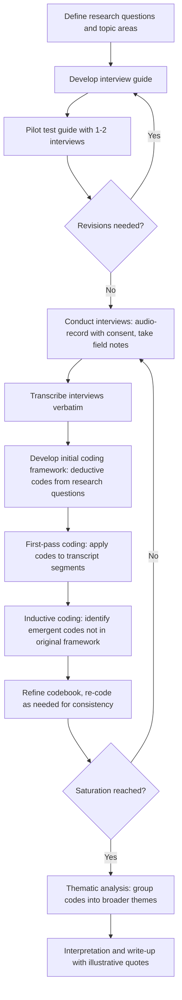

## Qualitative Interviewing and Coding

### Definition and Purpose

Qualitative interviewing and coding refers to the systematic methodology for collecting rich, narrative data through structured, semi-structured, or unstructured conversations with individuals or groups, and for subsequently organizing, categorizing, and interpreting that narrative data through a disciplined analytical process. Within Research Methods and Data Collection for Social Impact Assessment (SIA), this methodology complements quantitative survey approaches (see quantitative survey design and sampling) by capturing dimensions of social experience — meaning, context, causal explanation, lived perception — that numeric indicators alone typically cannot represent.

Where quantitative methods answer "how much" or "how many," qualitative interviewing is generally oriented toward answering "why," "how," and "in what way," making it particularly valuable for understanding the mechanisms behind observed patterns (e.g., why a livelihood restoration outcome indicator is underperforming, as discussed under adaptive management's diagnostic process) and for surfacing perspectives that a structured survey instrument was not designed to anticipate.

### Interview Structure Types

**Key Points**

| Type | Structure | Flexibility | Best Suited For |
| --- | --- | --- | --- |
| Structured interview | Fixed question set, fixed order, closed or semi-closed responses | Low | Comparability across many respondents; closer to a verbal survey |
| Semi-structured interview | Core question guide with defined topics, but open-ended phrasing and flexible probing | Moderate | Most common SIA qualitative method; balances comparability and depth |
| Unstructured/in-depth interview | Broad topic areas only, conversation flows organically | High | Exploratory research, life history, sensitive or complex topics requiring rapport-building |
| Key informant interview (KII) | Semi-structured, targeted at individuals with specialized knowledge or position | Moderate | Understanding institutional context, historical background, technical/local expertise |
| Focus group discussion (FGD) | Semi-structured, group setting with facilitated discussion | Moderate | Capturing shared/community-level perspectives, social norms, group dynamics |

[Inference] The choice among these structures is typically driven by the research question's need for standardization versus depth; a common practical pattern combines a semi-structured guide with flexible probing (rather than the extremes of fully structured or fully unstructured), since a completely fixed question set forecloses the exploratory value qualitative methods are chosen for, while a completely unstructured approach makes cross-respondent comparison and systematic coding more difficult.

### Sampling for Qualitative Research

Qualitative interviewing typically uses purposive (non-probability) sampling strategies, since the goal is depth and diversity of perspective rather than statistical generalizability (a key methodological distinction from the probability sampling discussed in quantitative survey design):

- **Maximum variation sampling**: Deliberately selecting respondents who differ widely on key characteristics to capture the full range of perspectives.
- **Typical case sampling**: Selecting respondents representative of the "average" or common experience.
- **Critical case sampling**: Selecting cases expected to yield the most information about the phenomenon of interest (e.g., interviewing households facing the most severe reported impacts).
- **Snowball sampling**: Using initial respondents to identify further respondents, useful for reaching populations without an accessible sampling frame (e.g., specific vulnerable or hard-to-reach subgroups).
- **Theoretical sampling**: Selecting subsequent respondents based on emerging findings from earlier interviews, a technique closely associated with grounded theory approaches.

### Saturation as a Sample Size Concept

Unlike quantitative sampling, which determines sample size through statistical power calculations, qualitative sampling adequacy is typically judged by **saturation** — the point at which additional interviews stop yielding substantially new themes, codes, or insights.

$$\text{Saturation reached when: } \frac{\Delta(\text{new codes/themes identified})}{\Delta(\text{additional interviews conducted})} \approx 0$$

[Unverified] There is no universally agreed numeric interview count at which saturation is guaranteed to occur; some qualitative methodology literature suggests saturation for relatively homogeneous populations and narrowly scoped research questions can often emerge within a range of roughly 12–20 interviews, but this figure varies substantially with population heterogeneity, topic complexity, and interview depth, and should be treated as a rough planning heuristic rather than a fixed target to be mechanically applied.

### Interview Guide Design

A semi-structured interview guide typically includes:

1. **Introduction and consent script**: Purpose of the research, confidentiality assurances, voluntary participation statement, and explicit consent request (echoing the ethical requirements relevant to community-based monitoring and survey methods alike).
2. **Warm-up questions**: Non-threatening, easy opening questions to build rapport.
3. **Core topic areas with open-ended lead questions**: Broad questions inviting narrative response rather than yes/no answers (e.g., "Can you describe how the resettlement process affected your household's daily life?" rather than "Were you satisfied with resettlement?").
4. **Planned probes**: Follow-up prompts to deepen initial responses (e.g., "Can you tell me more about that?" "What happened next?" "How did that make you feel?").
5. **Closing questions**: Opportunity for the respondent to raise anything not covered, and appreciation/closing remarks.

**Question wording principles**: Open-ended, non-leading, and avoiding compound questions — closely paralleling the question wording principles relevant to quantitative questionnaire design, though qualitative guides generally tolerate and even invite a degree of conversational flexibility that a standardized survey instrument does not.

### Interview and Coding Workflow

### Coding Approaches: Deductive vs. Inductive

**Deductive coding**: Codes are pre-defined based on the research questions, theory of change (see theory of change and logframe design), or existing conceptual framework before analysis begins, then applied systematically to the data. This approach ensures the analysis directly addresses pre-identified information needs but risks missing unanticipated findings that fall outside the pre-defined framework.

**Inductive coding**: Codes emerge from close reading of the data itself, without imposing a pre-existing framework, allowing unanticipated themes to surface organically. This approach is more exploratory and better suited to detecting unanticipated impacts (a category directly relevant to the adaptive management trigger typology) but is more time-intensive and can produce less directly comparable findings across research phases if categories shift.

Most SIA-relevant qualitative research uses a **hybrid approach**: an initial deductive framework aligned to the theory of change and research questions, supplemented by inductive codes capturing emergent, unanticipated themes — allowing systematic tracking of expected dimensions while remaining open to genuine surprises in the data.

### Coding Process Detail

1. **Familiarization**: Reading through all transcripts before beginning formal coding, to develop a holistic sense of the data.
2. **Initial/open coding**: Line-by-line or segment-by-segment labeling of data with descriptive codes.
3. **Codebook development**: Consolidating and defining codes with clear inclusion/exclusion criteria, so that multiple coders (if applicable) apply codes consistently.
4. **Intercoder reliability check** (where multiple coders are used): A subset of transcripts independently coded by two or more coders, with agreement measured (e.g., using Cohen's kappa) and discrepancies discussed to refine the codebook before full-scale coding proceeds.

$$\kappa = \frac{P_o - P_e}{1 - P_e}$$

Where $P_o$ is the observed proportion of agreement between coders and $P_e$ is the proportion of agreement expected by chance.

5. **Axial coding**: Identifying relationships between codes (causes, conditions, consequences), building toward higher-level categories.
6. **Thematic synthesis**: Grouping related codes into broader themes that directly address the research questions.
7. **Interpretation**: Developing analytical narrative connecting themes to the research objectives, illustrated with representative (not cherry-picked) quotes.

[Inference] The specific interpretive threshold for what constitutes acceptable intercoder reliability (e.g., a minimum kappa value) varies by methodological tradition and the stakes of the analysis; some research contexts treat kappa above roughly 0.6–0.7 as indicating substantial agreement, but this convention is discipline-specific rather than a universal statistical rule, and for lower-stakes exploratory SIA work, less formal consensus-based coding discussions are also common practice in place of a formal kappa calculation.

### Illustration: Coding Hierarchy from Raw Data to Theme

<svg xmlns="http://www.w3.org/2000/svg" viewBox="0 0 880 460" font-family="Helvetica, Arial, sans-serif">
<text x="440" y="28" font-size="18" font-weight="bold" text-anchor="middle" fill="#1a1a1a">Qualitative Coding Hierarchy (svg_diagram)</text>
<rect x="40" y="60" width="800" height="70" rx="8" fill="#eaf2fb" stroke="#3f6fa8" stroke-width="1.5" />
<text x="60" y="85" font-size="11" font-weight="bold" fill="#1e3a5f">Raw transcript excerpt:</text>
<text x="60" y="105" font-size="10" fill="#333">"Since we moved to the new site, my wife has to walk much further for water, and it's</text>
<text x="60" y="120" font-size="10" fill="#333">taking time away from her small business. The kids are also further from school now."</text>
<line x1="440" y1="130" x2="440" y2="155" stroke="#888" stroke-width="2" marker-end="url(#arr7)" />
<rect x="60" y="160" width="230" height="55" rx="6" fill="#dcebff" stroke="#3f6fa8" stroke-width="1.5" />
<text x="175" y="182" font-size="10" font-weight="bold" text-anchor="middle" fill="#1e3a5f">Open code:</text>
<text x="175" y="198" font-size="10" text-anchor="middle" fill="#333">"increased water collection time"</text>
<rect x="325" y="160" width="230" height="55" rx="6" fill="#dcebff" stroke="#3f6fa8" stroke-width="1.5" />
<text x="440" y="182" font-size="10" font-weight="bold" text-anchor="middle" fill="#1e3a5f">Open code:</text>
<text x="440" y="198" font-size="10" text-anchor="middle" fill="#333">"reduced time for livelihood activity"</text>
<rect x="590" y="160" width="230" height="55" rx="6" fill="#dcebff" stroke="#3f6fa8" stroke-width="1.5" />
<text x="705" y="182" font-size="10" font-weight="bold" text-anchor="middle" fill="#1e3a5f">Open code:</text>
<text x="705" y="198" font-size="10" text-anchor="middle" fill="#333">"increased school access distance"</text>
<line x1="175" y1="215" x2="400" y2="255" stroke="#888" stroke-width="1.5" />
<line x1="440" y1="215" x2="440" y2="255" stroke="#888" stroke-width="1.5" />
<line x1="705" y1="215" x2="480" y2="255" stroke="#888" stroke-width="1.5" />
<rect x="230" y="260" width="420" height="55" rx="6" fill="#c3ddf7" stroke="#1e3a5f" stroke-width="1.5" />
<text x="440" y="285" font-size="11" font-weight="bold" text-anchor="middle" fill="#0d1f33">Category: "Increased time burden from</text>
<text x="440" y="302" font-size="11" font-weight="bold" text-anchor="middle" fill="#0d1f33">relocation-related distance to services"</text>
<line x1="440" y1="315" x2="440" y2="345" stroke="#888" stroke-width="2" marker-end="url(#arr7)" />
<rect x="180" y="350" width="520" height="60" rx="8" fill="#7fa8d9" stroke="#0d1f33" stroke-width="2" />
<text x="440" y="375" font-size="12" font-weight="bold" text-anchor="middle" fill="#0d1f33">THEME: Unanticipated secondary impacts of</text>
<text x="440" y="393" font-size="12" font-weight="bold" text-anchor="middle" fill="#0d1f33">resettlement site location on household time allocation</text>
</svg>

### Ethical and Practical Considerations Specific to Interviewing

- **Informed consent**: Explicit, understandable consent covering purpose, voluntary participation, right to withdraw, confidentiality limits, and how data will be used and stored — paralleling the confidentiality limits disclosure discussed under non-retaliation and confidentiality safeguards.
- **Confidentiality in transcription and reporting**: De-identifying transcripts (removing names, specific identifying details) before wider circulation, and using generic identifiers (e.g., "Respondent 14, female, resettled household") in reporting.
- **Power dynamics in the interview setting**: Being attentive to how the interviewer's identity (project staff vs. independent researcher, outsider vs. local) may affect respondent candor, particularly on sensitive topics — directly relevant to the interview conditions discussed under social auditing and compliance review.
- **Emotional sensitivity**: Some topics (loss of land, displacement, grievance experiences) may be distressing to recall; interviewers should be trained to recognize distress signals, allow pauses, and know when and how to appropriately pause or conclude an interview.
- **Interviewer reflexivity**: Recognizing that the interviewer's own background, assumptions, and interpretive lens shape both the interview interaction and the subsequent coding process — a standard qualitative methodology consideration, sometimes documented in a reflexivity memo alongside the analysis.

### Example: Using Qualitative Interviewing to Diagnose a Quantitative Finding

**Example**

Continuing a scenario introduced under baseline-referenced outcome monitoring: a household survey shows livelihood restoration tracking below the expected trajectory. To diagnose the root cause (per the adaptive management diagnostic process), the M&E team conducts semi-structured interviews with a purposively sampled set of households showing the largest gaps between actual and expected income restoration.

1. **Sampling**: Critical case sampling selects 15 households with the most significant shortfalls, plus 5 households performing at or above the expected trajectory, for contrast.
2. **Interview guide**: Semi-structured guide with open-ended questions on livelihood activities attempted, barriers encountered, and perceived reasons for success or difficulty.
3. **Coding**: Deductive codes aligned to theory-of-change assumptions (e.g., "market access," "training relevance," "labor capacity") are applied, supplemented by inductive codes capturing unanticipated themes.
4. **Emergent finding**: An inductive code, "distrust of new crop viability," emerges repeatedly among underperforming households — a theme not anticipated in the original theory of change, revealing that many households quietly abandoned the recommended alternative livelihood activity due to skepticism about local market demand, despite completing training.
5. **Feed into adaptive management**: This qualitative finding directly informs the corrective action process, shifting the response from "accelerate training delivery" (the initially assumed fix) toward addressing the underlying market-confidence barrier through a market linkage pilot — illustrating how qualitative interviewing can surface root causes that quantitative monitoring alone would not have revealed.

### Common Pitfalls

- **Leading questions**: Phrasing interview questions in ways that suggest a desired or expected answer, contaminating the narrative data's validity.
- **Premature closure**: Stopping data collection before genuine saturation is reached, particularly under time or budget pressure, risking an incomplete or skewed thematic picture.
- **Cherry-picked quotes**: Selecting illustrative quotes that support a pre-existing narrative while omitting representative but less convenient data, undermining analytical credibility.
- **Coding without a clear codebook**: Applying codes inconsistently across transcripts or coders without documented code definitions, reducing analytical rigor and reproducibility.
- **Confusing frequency with importance**: Assuming a theme mentioned by more respondents is automatically more significant, when a rarely mentioned but severe issue (e.g., a single credible safeguarding concern) may warrant more attention than its frequency alone would suggest.
- **Insufficient attention to power dynamics**: Failing to consider how interviewer identity or interview setting may have suppressed candid responses, particularly on sensitive topics relevant to grievances, safety, or dissatisfaction with the project.
- **Treating qualitative findings as unable to generalize at all**: While qualitative findings from purposive samples should not be presented with population-level statistical claims, well-triangulated qualitative findings can still support meaningful, defensible conclusions about mechanisms and experiences — dismissing qualitative evidence entirely as "just anecdotes" is itself a methodological misstep.

### Related Topics

- Quantitative survey design and sampling
- Mixed-methods research design and triangulation
- Participatory and community-based monitoring
- Adaptive management and course correction
- Ethical considerations in social research (informed consent, do-no-harm)
- Non-retaliation and confidentiality safeguards
- Theory of change and logframe design