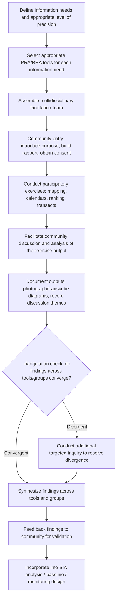

## Participatory Rural and Rapid Rural Appraisal

### Definition and Purpose

Participatory Rural Appraisal (PRA) and Rapid Rural Appraisal (RRA) are families of research methods that use visual, group-based, and locally-led techniques to gather information about a community's conditions, resources, priorities, and perspectives, typically over a compressed timeframe relative to conventional survey or long-term ethnographic research. Within Research Methods and Data Collection for Social Impact Assessment (SIA), these methods occupy a distinct methodological niche: they are faster and less resource-intensive than a full household survey (see quantitative survey design and sampling), yet more structured and often more community-empowering than a series of individual qualitative interviews (see qualitative interviewing and coding) conducted by outside researchers alone.

RRA emerged first, in the 1970s–80s, as a faster alternative to costly, slow conventional rural research (particularly large-scale surveys), with data collection still largely led by outside researchers who extracted information relatively quickly using semi-structured techniques. PRA developed subsequently as a deliberate evolution emphasizing that community members themselves should generate, analyze, and own the information, not merely supply it to outside researchers — shifting the researcher's role from extractor to facilitator.

### RRA vs. PRA: Key Distinctions

**Key Points**

| Dimension | Rapid Rural Appraisal (RRA) | Participatory Rural Appraisal (PRA) |
| --- | --- | --- |
| Primary purpose | Efficient extraction of information for outside researchers/planners | Community empowerment and self-directed analysis, with information as a secondary product |
| Who controls the process | Outside researcher/facilitator | Community members, with facilitator support |
| Who analyzes the data | Outside researcher, often after fieldwork | Community members, often during the exercise itself |
| Typical output ownership | Researcher's report | Community-owned visual outputs (maps, diagrams) that remain with the community |
| Degree of local capacity building | Limited | Central objective |

[Inference] In current practice, the line between RRA and PRA has substantially blurred, and many practitioners use the terms loosely or interchangeably, or use a hybrid label ("participatory appraisal") without rigorously distinguishing the two traditions; the distinctions above reflect the methods' historical development and conceptual difference in emphasis rather than a strict boundary consistently applied in contemporary project practice. [Unverified] The extent to which any given field team consciously applies the PRA/RRA distinction, versus using either label as a generic term for participatory field methods, likely varies considerably by institution and training background.

### Core Principles (Particularly for PRA)

- **Reversal of roles**: Community members are positioned as the experts on their own lives and context; the outside facilitator's role is to enable, not lead, the analytical process.
- **Optimal ignorance and appropriate imprecision**: Deliberately avoiding the collection of more precision or detail than is actually needed for the decision at hand, since over-precise data collection in a rapid appraisal context can consume disproportionate time without added decision-relevant value.
- **Triangulation**: Using multiple methods, sources, and, where feasible, multiple facilitators/disciplines to cross-check findings, given that the more rapid, less statistically rigorous nature of these methods makes single-source information more vulnerable to bias or error.
- **Seeking diversity ("sampling for diversity" rather than representativeness)**: Deliberately including a range of perspectives (different genders, wealth levels, ages, occupations) rather than seeking a statistically representative sample as in quantitative survey design.
- **Facilitation over extraction**: The facilitator asks open questions, provides tools, and steps back, rather than directing the process toward a pre-determined conclusion.

### Common PRA/RRA Tools and Techniques

| Tool | Purpose | Typical Output |
| --- | --- | --- |
| Social/community mapping | Visualize household locations, infrastructure, resources, and social features | Hand-drawn or ground map showing spatial and social layout |
| Transect walk | Systematic walk through the community with key informants, observing and discussing land use, resources, and conditions along a route | Transect diagram noting zones, resources, and issues observed |
| Seasonal calendar | Document cyclical patterns (agricultural activity, income, labor demand, food security, disease incidence) across the year | Calendar chart showing seasonal variation |
| Timeline / historical trend analysis | Document significant historical events and changes affecting the community | Chronological timeline with key events and associated changes |
| Venn/chapati diagram | Map relationships and relative importance of institutions and organizations affecting the community | Diagram with circles sized/positioned to represent institutional influence and relationships |
| Wealth ranking | Community-led categorization of households by relative wealth/wellbeing using locally defined criteria | Ranked list or matrix of household wealth categories |
| Matrix scoring/ranking | Compare and rank options, preferences, or problems against locally defined criteria | Scored matrix (e.g., ranking livelihood options by criteria the community defines) |
| Focus group discussion | Structured group conversation on a defined topic | Discussion notes/themes (overlaps with qualitative interviewing methods) |
| Daily activity/time-use diagram | Document how different household members allocate time across a typical day | Pie chart or schedule showing gendered/age-based time allocation |

### PRA/RRA Process Workflow

### Illustration: Seasonal Calendar Tool Output

<svg xmlns="http://www.w3.org/2000/svg" viewBox="0 0 900 380" font-family="Helvetica, Arial, sans-serif">
<text x="450" y="28" font-size="18" font-weight="bold" text-anchor="middle" fill="#1a1a1a">Example Seasonal Calendar (svg_diagram)</text>

<g font-size="10" fill="#333" text-anchor="middle">
<text x="120" y="60">Jan</text><text x="180" y="60">Feb</text><text x="240" y="60">Mar</text>
<text x="300" y="60">Apr</text><text x="360" y="60">May</text><text x="420" y="60">Jun</text>
<text x="480" y="60">Jul</text><text x="540" y="60">Aug</text><text x="600" y="60">Sep</text>
<text x="660" y="60">Oct</text><text x="720" y="60">Nov</text><text x="780" y="60">Dec</text>
</g>

<text x="30" y="95" font-size="11" font-weight="bold" fill="`#1e3a5f`">Rainfall</text>

<text x="30" y="145" font-size="11" font-weight="bold" fill="`#1e3a5f`">Planting</text>

<text x="30" y="195" font-size="11" font-weight="bold" fill="`#1e3a5f`">Harvest</text>

<text x="30" y="245" font-size="11" font-weight="bold" fill="`#1e3a5f`">Food scarcity</text>

<text x="30" y="295" font-size="11" font-weight="bold" fill="`#1e3a5f`">Labor migration</text>

<line x1="90" y1="75" x2="90" y2="320" stroke="#ccc" stroke-width="1" />
<line x1="810" y1="75" x2="810" y2="320" stroke="#ccc" stroke-width="1" />

<rect x="330" y="80" width="240" height="15" fill="#4a7fc9" rx="3" />

<rect x="330" y="130" width="90" height="15" fill="#2f9e5c" rx="3" />

<rect x="630" y="180" width="120" height="15" fill="#c98a1e" rx="3" />

<rect x="150" y="230" width="150" height="15" fill="#c94a4a" rx="3" />

<rect x="90" y="280" width="180" height="15" fill="#7a4fc9" rx="3" />

<text x="450" y="345" font-size="10" text-anchor="middle" fill="#555">Community-generated calendar showing overlap between food scarcity period and pre-harvest season —</text>

<text x="450" y="360" font-size="10" text-anchor="middle" fill="#555">informs timing of any planned compensation or livelihood support disbursement</text>

</svg>

### Complementarity with Other Research Methods

PRA/RRA tools are rarely used as a complete standalone research methodology for formal SIA baseline or compliance purposes; they are more typically used as a **complementary layer**:

- **Feeding into quantitative survey design**: PRA exercises (e.g., wealth ranking, seasonal calendars) conducted early in a research process can inform how a subsequent household survey instrument should be structured, stratified, or timed — for instance, a seasonal calendar might reveal that a survey conducted during the identified food-scarcity period would capture atypically depressed income and consumption figures.
- **Contextualizing quantitative findings**: A transect walk or community mapping exercise can provide spatial and contextual grounding that helps interpret why certain households show different survey results.
- **Rapid scoping for SIA screening**: In early project phases, PRA/RRA tools are often used for rapid, resource-efficient scoping to identify key social issues before a full-scale baseline survey is commissioned.
- **Complementing participatory monitoring**: PRA-style tools (mapping, ranking, seasonal calendars) are frequently adapted for use within participatory and community-based monitoring systems on an ongoing basis, not only as a one-time baseline exercise.

[Inference] Because PRA/RRA outputs are generated through group processes with facilitator involvement and are not based on random sampling, they should generally be treated as contextual, illustrative, and hypothesis-generating rather than as a substitute for statistically representative quantitative data where population-level precision is required for compliance or funding decisions — this is a standard methodological positioning rather than a claim that PRA/RRA data lacks value.

### Example: Combined PRA Toolkit for a Pre-Feasibility Social Scoping

**Example**

A hydropower project in an early planning phase commissions a rapid participatory scoping exercise across three potentially affected villages before committing resources to a full baseline survey.

1. **Community mapping**: Facilitated in each village, revealing the spatial distribution of households, agricultural land, water sources, and culturally significant sites relative to the proposed project footprint — immediately identifying that one village's primary water source lies within the likely inundation zone, a finding not evident from available secondary/administrative data.
2. **Transect walk**: Conducted with a mixed group of farmers, women, and youth, documenting land use zones and resource conditions along a route crossing the project area, surfacing a concern about an unmapped seasonal grazing route used by a subset of households.
3. **Seasonal calendar**: Reveals that the community's primary agricultural income period overlaps with the project's planned construction start date, flagging a potential labor and land-access conflict for later, more detailed assessment.
4. **Venn diagram exercise**: Maps existing institutional relationships (local government, traditional authority, an existing NGO water project), revealing which institutions the community already trusts — directly informing subsequent design choices around culturally appropriate grievance channels for the eventual GRM.
5. **Wealth ranking**: Provides a locally-grounded (though non-statistical) categorization of household wellbeing that helps subsequently target which household types should be prioritized in follow-up quantitative baseline sampling to ensure adequate representation of vulnerable groups.
6. **Synthesis and validation**: Findings are shared back with each community for confirmation before being incorporated into the SIA scoping report, which recommends specific priority areas (water source protection, grazing route mapping, construction timing) for the subsequent full baseline survey and detailed impact assessment to investigate further.

### Common Pitfalls

- **Extraction without follow-through**: Conducting PRA exercises, extracting the information, and never sharing findings or resulting decisions back with the community — replicating the extractive dynamic PRA was specifically developed to move away from, and eroding trust for future engagement.
- **Facilitator dominance**: A facilitator who inadvertently leads or steers the exercise toward a predetermined conclusion, undermining the "reversal of roles" principle central to genuine PRA practice.
- **Elite or vocal-group capture**: Allowing dominant community members (often men, elders, or local elites) to control the mapping, ranking, or discussion process, marginalizing women's, youth's, or minority perspectives — a risk directly paralleling the elite capture concern raised under participatory and community-based monitoring.
- **Overgeneralizing from a single exercise**: Treating findings from one PRA session in one village as representative of an entire, larger, or more heterogeneous affected population without triangulation or further verification.
- **Treating PRA outputs as statistically rigorous data**: Presenting wealth ranking percentages or matrix scoring results with a level of quantitative precision and confidence that the underlying non-random, small-group method does not actually support.
- **Rushed or superficial application under time pressure**: Compressing PRA/RRA exercises so much that "rapid" undermines meaningful facilitation and genuine community analysis, producing thin, low-quality outputs that fail to capture the depth the method is capable of providing.
- **Neglecting documentation**: Failing to systematically photograph, transcribe, or otherwise preserve the visual outputs (maps, diagrams, calendars) produced during the exercise, losing valuable data that exists only in the physical artifact created during the session.

### Related Topics

- Qualitative interviewing and coding
- Quantitative survey design and sampling
- Participatory and community-based monitoring
- Culturally appropriate grievance channels
- Developing social performance indicators
- Stakeholder mapping and engagement planning
- Mixed-methods research design and triangulation