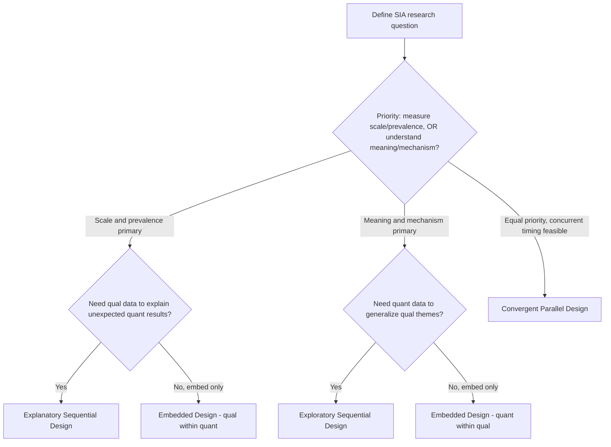

## Mixed-Methods Research Design

### Definition and Conceptual Foundation

Mixed-methods research design is a systematic approach that integrates quantitative and qualitative data collection, analysis, and interpretation within a single study or coordinated series of studies. In the context of Community Engagement and Social Impact Assessment (SIA), this design responds to a core methodological reality: numeric indicators (displacement rates, income change, service usage statistics) tell an assessor *what* changed, while narrative and observational data (interviews, focus groups, oral testimony) explain *why* and *how* it changed, and *for whom* the change matters most. Neither mode alone captures the full picture of social impact on affected communities.

The philosophical underpinning most commonly cited for mixed-methods work is pragmatism, which holds that the research question — not allegiance to a single epistemological tradition — should determine the choice and combination of methods. This stands in contrast to purist positions that treat quantitative (post-positivist) and qualitative (constructivist) paradigms as incompatible.

### Core Rationale for Use in Social Impact Assessment

**Key Points**

- **Triangulation**: Cross-validating findings from statistical surveys against community interviews strengthens confidence in conclusions and exposes discrepancies (e.g., official resettlement statistics that don't match lived experience accounts).
- **Complementarity**: Quantitative data measures the scale and distribution of impacts (how many households affected, magnitude of income loss); qualitative data explains mechanisms and meaning (why certain groups experience disproportionate harm).
- **Development**: Findings from one phase inform the design of the next (e.g., qualitative scoping interviews identify which quantitative indicators matter to the community before a household survey is built).
- **Initiation**: Contradictions between quantitative and qualitative findings can surface hidden assumptions or previously unrecognized subgroups requiring deeper inquiry.
- **Expansion**: Different components of an SIA (e.g., livelihood restoration vs. cultural heritage impacts) may require different methods, and mixed designs allow the overall study to expand its scope credibly.

### Major Design Typologies

The Creswell and Plano Clark typology remains the most widely referenced classification framework and is directly applicable to SIA fieldwork planning.

#### Convergent Parallel Design

Quantitative and qualitative data are collected concurrently, analyzed separately, and then merged during interpretation to compare or combine results.

**Example**

A resettlement impact study administers a structured household income survey ($n = 400$) at the same time that a research team conducts semi-structured interviews with 30 purposively selected households. Both strands are analyzed independently; findings are then merged in a joint display comparing survey-reported income loss against interview-reported coping strategies.

#### Explanatory Sequential Design

Quantitative data collection and analysis occurs first; qualitative data collection follows and is used to explain or elaborate on the quantitative results, particularly outliers or unexpected patterns.

**Example**

A baseline survey shows a subgroup of affected households reporting anomalously low satisfaction with a compensation program despite receiving compensation amounts comparable to their neighbors. A second-phase qualitative inquiry — targeted interviews with exactly that subgroup — is designed to explain the anomaly (e.g., delayed disbursement timing, land tenure insecurity not captured in the survey instrument).

#### Exploratory Sequential Design

Qualitative data collection and analysis occurs first, generating themes, hypotheses, or locally relevant categories, which are then used to build a quantitative instrument administered to a larger sample.

**Example**

Open-ended focus group discussions with community elders in a project-affected area surface locally specific dimensions of "social cohesion" (shared irrigation labor, ceremonial land use) that would not appear in a generic survey. These dimensions are translated into a structured Likert-scale instrument and administered to the full affected population to measure the prevalence and distribution of cohesion impacts.

#### Embedded Design

One data type (usually qualitative) is embedded within a largely quantitative design (or vice versa) to answer a secondary question supporting the primary method.

**Example**

A large-scale quantitative panel survey tracking economic indicators over a 5-year resettlement monitoring period embeds annual qualitative case studies of 10 households to provide contextual depth on outlier trajectories, without altering the primary quantitative sampling frame.

### Design Selection Process (Diagram)

### Implementation Workflow

#### Phase 1: Design Justification and Question Alignment

Every mixed-methods SIA should articulate, in a methods statement, why a single-method design would be insufficient. Reviewers and funding bodies increasingly require this justification rather than treating mixed methods as a default "more is better" choice.

#### Phase 2: Sampling Strategy Alignment

Quantitative and qualitative strands typically use different sampling logics — probability sampling for the quantitative component (to support statistical generalization) and purposive or theoretical sampling for the qualitative component (to support depth and information richness). In convergent designs, it is common practice to draw the qualitative sample as a purposive subset of the quantitative sampling frame, which strengthens the validity of merged comparisons.

#### Phase 3: Instrument Development

- Quantitative instruments (household surveys, structured checklists) require piloting for construct validity and translation fidelity in the local language.
- Qualitative instruments (interview guides, focus group protocols) require flexibility for emergent lines of inquiry while retaining core comparability across sites.

#### Phase 4: Concurrent or Sequential Data Collection

Field logistics differ substantially by design type. Sequential designs allow findings from phase one to shape phase two but extend the project timeline. Convergent designs compress the timeline but require larger field teams operating simultaneously, and risk contamination if survey questions prime interview responses (or vice versa).

#### Phase 5: Analysis and Integration

Three integration techniques are standard:

- **Merging**: Statistical results and coded qualitative themes are brought together in a **joint display** (a matrix table pairing quantitative findings with corresponding qualitative quotations or theme summaries).
- **Connecting**: Quantitative results from one phase are used to select the qualitative sample for the next phase.
- **Embedding**: One data type is nested inside the reporting structure of the other throughout the analysis.

#### Phase 6: Interpretation and Meta-Inference

The researcher draws a "meta-inference" — a conclusion that could not have been reached from either strand alone. This is the analytical payoff that justifies the added cost and complexity of a mixed design.

### Joint Display Example

| Quantitative Finding | Qualitative Theme | Meta-Inference |
| --- | --- | --- |
| 62% of surveyed households report income decline post-resettlement | Interviews reveal loss of informal market access near the original site, not captured by formal employment statistics | Income decline is driven substantially by informal economy disruption, not formal job loss — livelihood restoration programs targeting formal employment will miss the majority of affected households |
| Compensation satisfaction score: mean 2.1/5 despite compensation meeting legal minimums | Focus groups cite delayed disbursement (average 14 months) and lack of transparency in valuation as primary grievances | Satisfaction is driven more by procedural fairness and timeliness than by the compensation amount itself |

### Quality and Rigor Considerations

**Key Points**

- **Legitimation**: Mixed-methods scholars use the term "legitimation" (rather than separate validity/reliability standards) to describe the combined quality criteria applying to the integrated inferences, not just each strand independently.
- **Weighting**: Designs are described using notation indicating relative priority and sequence — e.g., $QUAN \rightarrow qual$ denotes a quantitative-dominant sequential design where quantitative methods are prioritized (capital letters) and occur first (arrow indicates sequence); $QUAN + QUAL$ denotes equal-priority concurrent design.
- **Divergence handling**: When quantitative and qualitative findings conflict, this should be reported transparently as a substantive finding rather than resolved by discarding one strand — divergence often signals an important subgroup or unmeasured variable.
- Reviewers of SIA reports should specifically check whether the stated design type matches the actual timing and integration described in the methods section, as design type is frequently mislabeled in practice. [Inference]

### Common Pitfalls in SIA Practice

- Treating qualitative components as merely illustrative ("a few quotes to humanize the numbers") rather than as a rigorously analyzed data strand with its own coding and thematic analysis.
- Failing to pilot-test whether local community members interpret quantitative survey categories (e.g., "household head," "primary occupation") consistently with the researchers' intended meaning — a frequent validity threat in cross-cultural SIA fieldwork.
- Under-resourcing the qualitative strand's analysis timeline, since thematic coding of interview transcripts is typically more labor-intensive per data point than statistical analysis of survey data.
- Conducting concurrent designs without a genuine integration/merging step, resulting in two parallel but disconnected reports rather than a true mixed-methods study.

### Ethical and Practical Considerations Specific to SIA Fieldwork

Community engagement and SIA work involves power-sensitive dynamics that shape mixed-methods choices: quantitative surveys can feel extractive to communities that have been repeatedly studied without benefit, while qualitative methods (participatory mapping, oral history, photovoice) can build trust and yield richer engagement — but at higher cost per respondent and lower statistical generalizability. Practitioners should also account for literacy levels, language diversity, and gender dynamics (e.g., whether household surveys captured only the household head's perspective) when designing the balance between strands. [Inference — the degree to which any given community perceives quantitative methods as extractive varies and should be assessed contextually, not assumed.]

**Related Topics**

- Sampling strategies for mixed-methods SIA (probability vs. purposive integration)
- Joint display construction and meta-inference reporting
- Participatory rural appraisal (PRA) as a qualitative data collection method
- Free, Prior, and Informed Consent (FPIC) processes and their methodological implications
- Triangulation and validity threats in cross-cultural fieldwork
- Longitudinal panel design for resettlement and livelihood monitoring
- Grievance redress mechanism data as a qualitative-quantitative hybrid data source