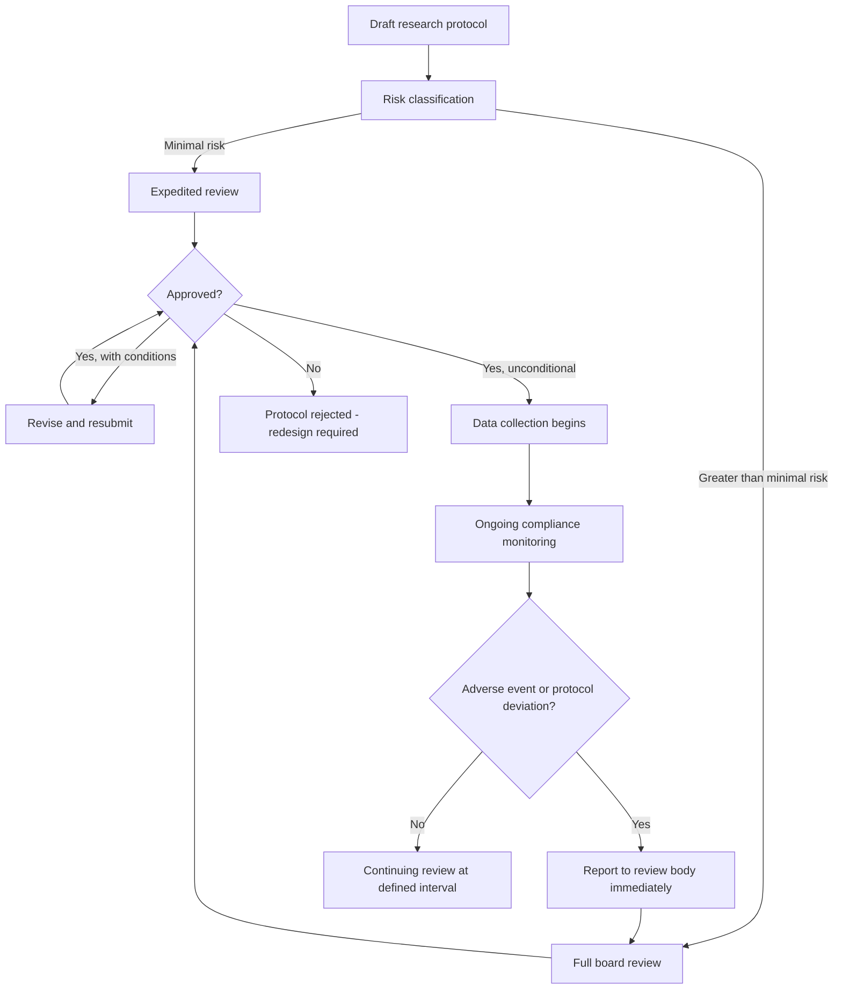

## Ethical Review and Research Protocols

### Definition and Purpose

Ethical review is the formal, structured process by which a research proposal involving human participants is evaluated by an independent body — an Institutional Review Board (IRB), Research Ethics Committee (REC), or equivalent — to ensure that risks to participants are minimized, informed consent is properly obtained, and vulnerable populations receive appropriate protections before data collection begins. In Community Engagement and Social Impact Assessment (SIA), ethical review carries added weight because SIA fieldwork routinely engages populations facing displacement, economic precarity, or power asymmetry relative to the project proponent commissioning the assessment — conditions that heighten the risk of coercion, exploitation, or inadequate consent.

### Foundational Ethical Principles

**Key Points**

- **Respect for persons**: Recognizing individual autonomy and requiring free, informed, and ongoing consent; extending additional protection to individuals with diminished autonomy (children, persons with cognitive impairment, populations under duress).
- **Beneficence**: Maximizing possible benefits and minimizing possible harms to participants and the communities studied — not merely to the researcher's data quality.
- **Justice**: Ensuring the burdens and benefits of research are distributed fairly, so that the same populations are not repeatedly studied without corresponding benefit, and that vulnerable groups are not selected for research merely because of their vulnerability or accessibility.

These three principles derive from the Belmont Report framework and underpin most national and institutional research ethics codes in use today, including those referenced by development finance institutions (e.g., World Bank, Asian Development Bank) that commission or require SIAs as a condition of project financing.

### The Ethical Review Process

#### Step 1: Protocol Development

The researcher prepares a written research protocol describing the study's purpose, methodology, sampling frame, data collection instruments, anticipated risks, safeguards, and data management plan. For SIA work this protocol should explicitly address community-level risks (e.g., risk of retaliation against individuals who criticize a resettlement scheme) in addition to individual-level risks.

#### Step 2: Risk Classification

Most review bodies classify studies by risk tier:

- **Minimal risk**: The probability and magnitude of harm anticipated is not greater than that ordinarily encountered in daily life (e.g., an anonymous satisfaction survey).
- **Greater than minimal risk**: Studies involving sensitive topics (land dispossession, gender-based violence, livelihood loss), vulnerable populations, or identifiable data requiring more intensive review and stronger safeguards.

#### Step 3: Informed Consent Design

Consent processes must be tailored to the literacy level, language, and cultural context of the population. In many SIA settings, this necessitates oral consent processes with a witnessed verbal script rather than a signed written form, particularly where written consent could itself create legal exposure or discomfort for participants.

#### Step 4: Review and Determination

The review body evaluates the protocol and issues one of several determinations: approval, approval with required modifications, deferral pending further information, or rejection. Continuing review (re-approval at defined intervals) is typically required for multi-year SIA monitoring programs.

#### Step 5: Ongoing Compliance Monitoring

Ethical obligations do not end at approval. Protocol deviations, adverse events (e.g., a participant experiencing retaliation after an interview), and amendments to methodology must be reported to the review body during the life of the study.

### Process Flow (Diagram)

### Informed Consent: Required Elements

**Key Points**

- Clear statement that participation is voluntary and that refusal or withdrawal carries no penalty or loss of benefits (including project compensation or services the participant may separately be entitled to).
- Explanation of the study's purpose, procedures, expected duration, and who is commissioning or funding the research — critical in SIA contexts where the proponent funding the assessment may be the same entity whose project is causing the impact being studied.
- Description of foreseeable risks and discomforts, including social or reputational risks specific to the local context.
- Description of anticipated benefits, explicitly avoiding overstatement that could constitute a "therapeutic misconception" (a participant believing that research participation itself will resolve their grievance or secure compensation).
- Statement of confidentiality protections and the limits of confidentiality (e.g., mandatory reporting obligations if abuse is disclosed).
- Contact information for questions about the research and about participants' rights, typically including an independent contact not directly involved in data collection.

### Special Protections for Vulnerable Populations

SIA fieldwork frequently intersects with populations warranting heightened protection:

- **Indigenous Peoples and traditional communities**: Many international standards (e.g., IFC Performance Standard 7, UN Declaration on the Rights of Indigenous Peoples) require Free, Prior, and Informed Consent (FPIC) — a distinct and more stringent standard than standard informed consent, requiring consent to be obtained through the community's own representative institutions, free of coercion, in advance of project activities, and based on full disclosure.
- **Children**: Require parental/guardian permission plus child assent appropriate to their developmental stage; direct research on children in SIA contexts (e.g., child labor assessments) demands specialized protocols.
- **Persons with diminished capacity or under duress**: Populations facing eviction, in active conflict zones, or economically dependent on the project proponent require additional safeguards against implicit coercion, since the power differential itself can undermine the voluntariness of consent even absent explicit pressure.
- **Persons disclosing illegal status or activity**: Informal settlers, undocumented land occupants, or those engaged in unpermitted resource extraction require careful data handling to avoid exposing participants to legal risk through their participation in the study.

### Confidentiality and Data Protection in Practice

**Example**

A livelihood impact survey collects household GPS coordinates to map resettlement patterns. The research protocol specifies that: (1) raw GPS data is stored on an encrypted, access-controlled server separate from the coded qualitative interview transcripts; (2) published outputs report only aggregated or jittered location data to prevent re-identification of individual households; (3) any direct quotations used in the final SIA report are stripped of identifying details or approved in advance by the specific participant quoted, per a member-checking protocol built into the consent process.

### Community-Level Consent and Engagement Protocols

Unlike much biomedical or clinical research, SIA frequently requires engagement with community-level decision-making structures in addition to individual consent. This can include:

- Prior notification to and consultation with recognized community leadership or governance structures before individual-level data collection begins.
- Community-level agreement on research parameters (what topics are appropriate to ask about, which methods are culturally acceptable) negotiated separately from individual consent.
- Feedback loops that return preliminary findings to the community before publication, allowing correction of factual errors or misinterpretation (a practice sometimes called "member checking" or "respondent validation").

[Inference — the specific sequencing of community-level versus individual-level consent, and which is treated as a precondition for the other, varies by jurisdiction, funder requirement, and community governance structure, and should be confirmed against the applicable regulatory and lender standards for the specific project.]

### Conflict of Interest Considerations

Because SIAs are frequently commissioned and paid for by the project proponent whose activities are under assessment, ethical review protocols in this field place particular emphasis on disclosing and managing this structural conflict of interest. Review bodies and international lending standards increasingly require disclosure of the funding relationship to participants as part of informed consent, and some frameworks call for independent third-party verification of SIA findings precisely because of this inherent conflict. [Inference]

### Common Pitfalls in SIA Ethical Practice

- Treating community leader consent as a substitute for, rather than a supplement to, individual informed consent — particularly risky where community leadership does not equitably represent marginalized subgroups (women, minority ethnic groups, landless residents).
- Using written consent forms in contexts of low literacy or where signing documents carries cultural or legal anxiety, without offering an oral consent alternative.
- Failing to disclose the commissioning relationship between the researcher/consultancy and the project proponent, which can undermine the validity of consent if participants believe they are speaking to a neutral party.
- Inadequate data retention and destruction planning, particularly for identifiable data collected in politically sensitive contexts where data breach could expose participants to harm long after the study concludes.
- Treating ethical review as a one-time gate at project inception rather than an ongoing obligation across multi-year monitoring programs common in resettlement and livelihood restoration SIAs.

**Related Topics**

- Free, Prior, and Informed Consent (FPIC) procedures for Indigenous and traditional communities
- Grievance redress mechanisms as an ethical safeguard during data collection
- Power dynamics and researcher positionality in proponent-funded SIA
- Data management and long-term confidentiality planning for longitudinal monitoring
- International lender safeguard standards (IFC Performance Standards, World Bank Environmental and Social Framework) and their ethical review requirements
- Member checking and participatory validation of SIA findings