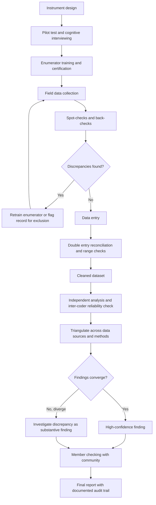

## Data Triangulation and Quality Assurance

### Definition and Conceptual Foundation

Data triangulation is the practice of using multiple data sources, methods, investigators, or theoretical perspectives to examine the same phenomenon, with the goal of cross-validating findings and compensating for the inherent limitations of any single data source. Quality assurance (QA), in the context of Community Engagement and Social Impact Assessment (SIA), refers to the systematic procedures applied throughout the data lifecycle — collection, entry, cleaning, analysis, and reporting — to ensure that findings are accurate, consistent, and defensible to regulators, lenders, affected communities, and independent reviewers.

Triangulation and QA are closely linked in SIA practice: triangulation is a primary *mechanism* for achieving the quality standard of credibility, one of the core criteria against which SIA findings are typically judged.

### Types of Triangulation

**Key Points**

- **Data triangulation**: Using multiple data sources (e.g., household survey data, government census records, and community focus group testimony) to examine the same impact indicator.
- **Method triangulation**: Using multiple methods (e.g., structured surveys, semi-structured interviews, direct observation, remote sensing/satellite imagery) to study the same phenomenon.
- **Investigator triangulation**: Using multiple researchers or enumerators to independently collect or code the same data, then comparing results to identify observer bias or inconsistency.
- **Theory triangulation**: Interpreting the same dataset through multiple theoretical or disciplinary lenses (e.g., an economic lens and a social-cultural lens applied to the same livelihood displacement data) to surface interpretations a single framework might miss.

### Application to SIA Fieldwork

#### Example: Cross-Validating Displacement Impact

**Example**

An SIA team assessing resettlement impacts triangulates three independent sources: (1) a structured household survey reporting self-assessed income change; (2) official land registry and compensation payment records held by the implementing agency; (3) semi-structured interviews with a purposive subsample of surveyed households. Where the survey data shows minimal income change but interviews reveal substantial informal-economy disruption not captured by the survey instrument, the discrepancy itself becomes a key finding, prompting a targeted follow-up module to capture informal income sources more accurately in future survey rounds.

### Quality Assurance Framework Across the Data Lifecycle

#### Phase 1: Instrument Design QA

- Pilot testing of survey instruments and interview guides with a small sample drawn from the target population before full deployment, to identify ambiguous questions, translation issues, and culturally inappropriate framings.
- Back-translation of instruments (translating from source language to local language and then independently back to the source language by a separate translator) to check for semantic drift.
- Cognitive interviewing techniques, where pilot respondents are asked to explain their understanding of a question in their own words, to verify construct validity.

#### Phase 2: Field Collection QA

- **Enumerator training and certification**: Standardized training with role-play exercises and inter-rater reliability checks before enumerators are certified to collect data independently.
- **Spot-checking and back-checking**: Supervisors re-visit a random subset of surveyed households (typically 5–10%) to verify that the interview occurred and that key responses match, detecting fabrication or serious enumerator error.
- **Real-time data validation**: When using electronic data collection (mobile survey platforms), programming range checks, skip-logic enforcement, and internal consistency checks (e.g., flagging a household reporting zero income but high expenditure) at the point of entry rather than after the fact.
- **Audio recording and transcript spot review**: For qualitative interviews, periodic supervisor review of recordings against submitted field notes to verify fidelity.

#### Phase 3: Data Entry and Cleaning QA

- **Double data entry**: For paper-based instruments, having two independent data entry clerks input the same forms and reconciling discrepancies, a traditional but effective error-detection method.
- **Range and logic checks**: Automated scripts flagging values outside plausible bounds (e.g., household size of 200) or internally inconsistent responses.
- **Duplicate detection**: Identifying and resolving duplicate records, particularly important in multi-round panel studies tracking the same households over time.
- **Outlier review protocol**: A documented, non-arbitrary procedure for how statistical outliers are investigated, retained, or excluded, to avoid the appearance (or reality) of cherry-picking data to fit a predetermined narrative.

#### Phase 4: Analysis QA

- **Inter-coder reliability**: For qualitative coding, having two or more analysts independently code a subset of transcripts and calculating agreement statistics (e.g., Cohen's kappa) to verify that coding categories are applied consistently rather than idiosyncratically.
- **Negative case analysis**: Deliberately searching for and reporting on cases that contradict the emerging pattern or narrative, strengthening the credibility of the overall analysis.
- **Audit trail maintenance**: Documenting analytical decisions (coding scheme changes, exclusion criteria, weighting decisions) so that an independent reviewer could reconstruct the analytical path from raw data to reported conclusion.

#### Phase 5: Reporting and Dissemination QA

- **Member checking / respondent validation**: Returning preliminary findings to community representatives to verify accuracy and correct misinterpretation before finalizing the report.
- **Peer or independent expert review**: External review of the SIA methodology and findings, particularly valuable given the structural conflict of interest where proponents commonly fund the assessment of their own project's impacts.

### Quality Assurance Workflow (Diagram)

### Credibility Criteria for SIA Data Quality

**Key Points**

- **Credibility**: Confidence in the truth of findings, established through triangulation, prolonged engagement with the community, and member checking.
- **Transferability**: The degree to which findings can inform understanding of similar contexts elsewhere, supported by thick, detailed description of the study context.
- **Dependability**: The stability of findings over time and consistency of the research process, supported by a documented audit trail.
- **Confirmability**: The degree to which findings are shaped by respondents and data rather than researcher bias, supported by reflexivity documentation and inter-coder checks.

These four criteria, adapted from Lincoln and Guba's naturalistic inquiry framework, are commonly used as the qualitative-research analogue to the quantitative concepts of internal validity, external validity, reliability, and objectivity, and are frequently referenced together in mixed-methods SIA quality frameworks.

### Handling Divergent Triangulated Findings

When triangulated data sources disagree, the appropriate response is documented investigation rather than silent reconciliation toward whichever source is more convenient. A defensible approach:

1. Document the divergence explicitly in the analysis (do not average away or drop the outlying source without justification).
2. Investigate whether divergence reflects a genuine subgroup difference, a measurement artifact (e.g., a survey question poorly capturing a locally specific concept), or a temporal difference (data collected at different points in a changing situation).
3. Report the divergence and the investigation outcome transparently in the final SIA report, since undisclosed data conflicts undermine the assessment's credibility if later discovered by an external reviewer or affected community members.

### Common Pitfalls in SIA Practice

- Treating triangulation as a checkbox exercise (citing that "multiple methods were used") without actually comparing findings across sources at the analysis stage.
- Under-resourcing back-checking and spot-checking budgets, leaving field data quality effectively unverified until analysis reveals implausible patterns too late to correct.
- Applying quantitative validity/reliability terminology directly to qualitative data without adapting to the appropriate credibility/dependability framework, creating a category error in the QA plan.
- Excluding outlier or divergent cases without a documented, pre-specified protocol, which exposes the assessment to credible accusations of selective reporting — a particular risk given the proponent-funded nature of most SIAs.
- Failing to version-control or timestamp datasets across multiple rounds of a longitudinal monitoring program, making it difficult to reconstruct which data cleaning decisions applied to which round.

**Related Topics**

- Mixed-methods research design (foundational pairing with triangulation)
- Ethical review and research protocols (interaction between QA audit trails and confidentiality safeguards)
- Sampling strategies for SIA fieldwork
- Longitudinal panel design for resettlement and livelihood monitoring
- Inter-coder reliability statistics (Cohen's kappa, Krippendorff's alpha) for qualitative coding
- Independent third-party verification of proponent-funded impact assessments