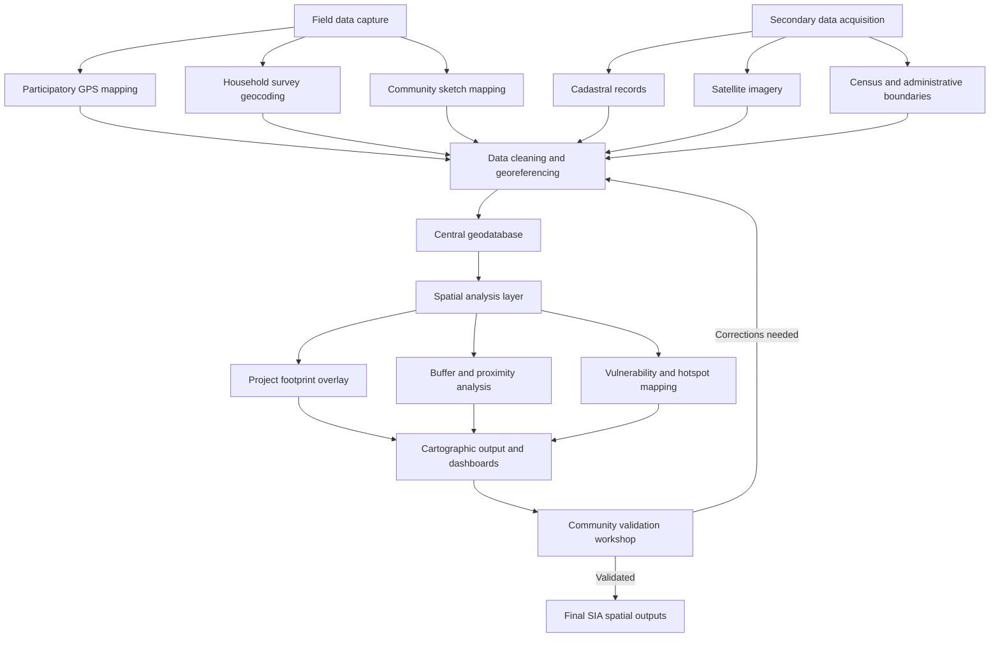

## Geographic Information Systems for Social Mapping

### Definition and Conceptual Foundation

A Geographic Information System (GIS) is a framework for capturing, storing, analyzing, managing, and visualizing spatially referenced data. Social mapping, within Community Engagement and Social Impact Assessment (SIA), refers to the use of GIS to represent the spatial distribution of social phenomena — settlement patterns, land use and tenure, resource access, vulnerability, displacement zones, and community assets — layered against the physical footprint of a proposed or existing project. GIS transforms tabular social data (survey responses, census records, land registry entries) into spatially explicit layers that can be overlaid with project infrastructure to identify who is affected, where, and to what degree.

### Core Data Structures

**Key Points**

- **Vector data**: Represents discrete features as points (household locations, wells, sacred sites), lines (roads, rivers, transmission corridors), and polygons (village boundaries, agricultural parcels, protected areas). Vector data is the dominant format for social mapping because most social phenomena (a household, a parcel, a community boundary) have discrete, identifiable extents.
- **Raster data**: Represents continuous surfaces as a grid of cells, commonly used for elevation, land cover classification derived from satellite imagery, and population density surfaces (e.g., WorldPop gridded population estimates).
- **Attribute data**: Non-spatial data (household size, income, ethnicity, land tenure status) linked to a vector feature through a common identifier, enabling spatial queries such as "show all households with informal tenure within 500 meters of the project boundary."

### Data Sources for Social Mapping in SIA

- **Participatory GPS mapping**: Community members, guided by field enumerators, walk parcel or settlement boundaries with handheld GPS units or smartphone applications to capture locally recognized boundaries that may not appear in any official cadastral record — particularly important in customary or informal tenure systems.
- **Cadastral and land registry data**: Official government parcel and ownership records, where they exist and are digitized, providing a formal-tenure baseline against which participatory data can be triangulated.
- **Satellite and aerial imagery**: Used for land cover classification, settlement footprint delineation, and change detection (e.g., comparing pre- and post-project imagery to verify resettlement compliance or detect unauthorized encroachment).
- **Census and household survey geocoding**: Attaching spatial coordinates to survey response records, enabling the social survey data discussed under mixed-methods design to be mapped and spatially analyzed.
- **Community-generated sketch maps**: Hand-drawn or participatory maps produced in community workshops, subsequently georeferenced and digitized into the GIS, which is particularly effective for capturing local knowledge about resource use, sacred sites, and seasonal land use that would otherwise be invisible to external assessors.

### Standard GIS Architecture for an SIA Mapping Program

### Core Analytical Techniques

#### Overlay Analysis

Combining multiple spatial layers to identify areas of intersection or conflict — for example, overlaying a proposed transmission line corridor against a layer of participatory-mapped agricultural parcels to quantify the number and area of parcels directly affected.

#### Buffer and Proximity Analysis

Generating a zone of a specified distance around a feature to assess indirect impacts. A common SIA application is generating a 1 km buffer around a project's physical footprint to identify the population potentially affected by noise, dust, or access disruption, distinct from the population within the direct footprint requiring resettlement.

#### Example

**Example**

An SIA team overlays a proposed road realignment corridor (a vector line layer with an attached 200-meter right-of-way buffer polygon) against a parcel layer generated through participatory GPS mapping. The overlay identifies 340 parcels intersecting the right-of-way, of which attribute data indicates 85 are held under customary rather than titled tenure. This spatial output directly informs the compensation eligibility framework, since customary tenure holders may require a distinct legal and consultative pathway from titled landowners.

#### Hotspot and Vulnerability Mapping

Applying spatial statistics (e.g., Getis-Ord Gi* or kernel density estimation) to survey-derived vulnerability indices (poverty incidence, female-headed households, disability prevalence) to identify statistically significant clusters of vulnerability, which can then guide the targeting of mitigation or livelihood restoration programs toward areas of greatest need rather than uniform blanket coverage.

#### Network Analysis

Modeling travel time or accessibility along road and path networks to assess how project activities (road closures, new checkpoints, altered river crossings) change community access to markets, schools, and health facilities — a common and often underweighted dimension of social impact.

### Common Software and Platforms

**Key Points**

- **Desktop GIS**: QGIS (open-source, widely used in development and SIA contexts due to no licensing cost) and Esri ArcGIS (proprietary, common where institutional licenses already exist) are the two dominant desktop platforms for analysis and cartographic production.
- **Mobile data collection**: KoboToolbox, ODK (Open Data Kit), and CommCare are widely used in SIA fieldwork to capture GPS-tagged survey responses directly in the field, feeding into the central geodatabase.
- **Web mapping and dashboards**: ArcGIS Online, QGIS Cloud, and open-source stacks built on Leaflet or Mapbox GL JS are used to produce interactive dashboards for sharing findings with stakeholders, regulators, and community members who may lack desktop GIS access.
- **Satellite imagery sources**: Freely available imagery from Landsat and Sentinel (via the Copernicus program) supports land cover and change detection analysis without commercial imagery licensing costs; higher-resolution commercial imagery (Maxar, Planet) is used where fine-grained settlement or infrastructure detail is required.

### Coordinate Reference Systems and Data Integrity

A recurring technical error in SIA GIS work is mismatched coordinate reference systems (CRS) between layers from different sources — for example, participatory GPS data captured in WGS84 (EPSG:4326) geographic coordinates combined with cadastral data in a local projected CRS. Because GIS software will often display mismatched layers without an explicit error, an unnoticed CRS mismatch can produce spatial offsets of tens to hundreds of meters, which is analytically significant when the offset determines whether a given household falls inside or outside a project's direct impact footprint. Standard practice requires: (1) explicitly documenting the CRS of every incoming data source, (2) reprojecting all layers to a common CRS appropriate to the project's location before overlay analysis, and (3) validating alignment through a visual spot-check against a known reference feature. [Inference — the specific magnitude of offset from a CRS mismatch depends on the specific systems involved and the project's geographic location; practitioners should verify against the actual CRS parameters in use.]

### Participatory and Ethical Considerations in Spatial Data

Social mapping raises distinct ethical considerations beyond those covered under general research ethics, because spatial data is inherently identifying — a household's precise GPS coordinate is functionally equivalent to a name and address. Standard safeguards include:

- **Spatial anonymization**: Applying coordinate jittering (random offset within a defined radius) or aggregation to a coarser administrative unit before including location data in publicly released reports.
- **Data sovereignty considerations**: Recognizing that participatory mapping of Indigenous or customary land can carry legal and political significance beyond the immediate SIA, since the resulting maps may later be used as evidence in tenure disputes; consent processes should disclose this potential downstream use.
- **Community ownership of mapped data**: Establishing clear protocols on who retains custody of and access to the geodatabase after the SIA concludes, particularly where the proponent commissioning the study is a different party from the community that contributed the spatial knowledge.

### Common Pitfalls in SIA Practice

- Relying solely on official cadastral data in contexts with substantial informal or customary tenure, systematically undercounting affected households who lack formal title.
- Failing to reproject and validate CRS alignment before overlay analysis, producing silently incorrect impact footprint calculations.
- Treating GIS outputs (maps, buffer analyses) as objective and unquestionable, when the underlying participatory boundary data reflects a specific negotiated moment and may not capture contested or overlapping claims.
- Publishing precise household-level coordinates in publicly available SIA reports without anonymization, creating security or land-grab risk for identified households.
- Under-investing in community validation workshops to review draft maps, missing an opportunity to catch digitization errors and to build community trust in the mapping outputs before they are used to determine compensation eligibility.

**Related Topics**

- Data triangulation and quality assurance (spatial vs. survey data cross-validation)
- Ethical review and research protocols (spatial data as identifying information)
- Remote sensing for land cover and resettlement compliance monitoring
- Participatory rural appraisal and community sketch mapping methods
- Cadastral systems and customary land tenure documentation
- Vulnerability and hotspot mapping for targeted livelihood restoration
- Free, Prior, and Informed Consent (FPIC) in the context of Indigenous land mapping