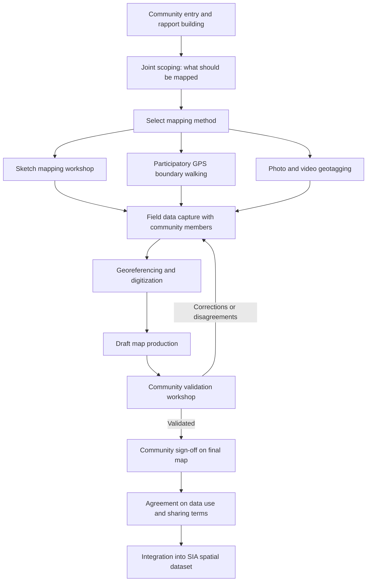

## Participatory GIS and Community-Generated Data

### Definition and Conceptual Foundation

Participatory GIS (PGIS) is an approach to geographic information systems that centers community members as active producers of spatial knowledge rather than passive subjects of external data collection. It merges participatory development methods (participatory rural appraisal, participatory mapping) with GIS technology, enabling local and Indigenous knowledge — settlement histories, resource use patterns, sacred sites, customary boundaries, seasonal land use — to be captured in a spatially explicit, analyzable form. In Community Engagement and Social Impact Assessment (SIA), PGIS serves both an evidentiary function (documenting impacts and claims that official records omit) and an empowerment function (giving communities a legible, negotiable artifact to use in consultations, grievance processes, and compensation negotiations).

PGIS is distinguished from conventional GIS-based social mapping primarily by *who controls the process*: in PGIS, community members typically identify what to map, participate directly in data capture, and retain a voice in how the resulting data is used and shared, rather than serving solely as informants whose knowledge is extracted and digitized by external technicians.

### Core Rationale in SIA Contexts

**Key Points**

- **Captures invisible claims**: Customary tenure, communal grazing rights, seasonal resource access, and sacred or culturally significant sites frequently have no formal legal or cadastral record, and PGIS is often the only method capable of documenting them before a project proceeds.
- **Builds legitimacy and trust**: Communities that participate directly in producing the spatial evidence used in an SIA are more likely to view resulting impact determinations as fair, compared to a process where an external map is presented to them as a fait accompli.
- **Surfaces intra-community heterogeneity**: Different mapping exercises with different subgroups (women, youth, elders, different ethnic or occupational groups) frequently reveal divergent land use patterns and priorities that a single community-wide map would flatten or obscure.
- **Supports negotiation and grievance processes**: A jointly produced map can function as a shared reference document during compensation negotiations or grievance redress, reducing disputes rooted in disagreement over what land or resources existed before project impact.

### Methodological Spectrum of Participation

PGIS practice spans a range of participation intensity, commonly framed using Arnstein's ladder of citizen participation adapted to spatial data work:

- **Extractive mapping**: External researchers use community informants to verify or supplement externally generated maps, with minimal community control over the process or output — technically participatory in data source but not in process control.
- **Consultative mapping**: Community members are consulted on map content and asked to validate draft outputs, but external technicians retain control over data capture, digitization, and analysis.
- **Collaborative mapping**: Community members participate directly in field data capture (walking boundaries with GPS units, contributing sketch maps) alongside facilitators, with joint control over what is mapped and how it is represented.
- **Community-owned mapping**: Community members lead the mapping process with facilitation support only, retain custody of the resulting data, and control decisions on external data sharing and use.

### Standard PGIS Workflow

### Data Capture Techniques

#### Sketch Mapping Workshops

Community members collaboratively draw a map of their territory on paper or a large ground surface, marking features they consider significant (water sources, grazing routes, burial grounds, disputed boundaries). Facilitators subsequently georeference the sketch by cross-referencing marked features against known coordinates or satellite imagery, then digitize it into the GIS.

#### Participatory GPS Boundary Walking

Community members, often specifically the customary landholder or a designated community representative, physically walk the perimeter of a parcel or territory carrying a GPS-enabled device, with a facilitator recording waypoints or a continuous track log. This method produces higher positional accuracy than sketch mapping but requires more time and logistical coordination per feature mapped.

#### Example

**Example**

A PGIS exercise supporting a hydropower SIA convenes separate mapping sessions with a village's farming households and its fishing households, since preliminary scoping interviews indicated the two groups use substantially different stretches of the river and adjacent land. The farming group's GPS-walked map identifies 12 distinct agricultural parcels along the reservoir's projected inundation line. The fishing group's sketch map, subsequently georeferenced, identifies 6 traditional fishing grounds and 3 seasonal fish-drying sites not captured by any existing land registry. Both datasets are integrated into the project's impact footprint overlay, revealing that the fishing group's livelihood impact — invisible in land-based cadastral records — would have been entirely omitted had only conventional GIS social mapping been used.

#### Mobile and Smartphone-Based Participatory Mapping

Applications such as Mapeo, OpenStreetMap's field tools (e.g., StreetComplete, OSMAnd), and Kobo/ODK with geopoint fields allow community members with basic smartphone literacy to directly capture points, tracks, and attribute data (photos, audio notes, categorical tags) without requiring facilitators to operate specialized GPS hardware, lowering the skill barrier to direct community data capture. [Inference — the appropriateness of smartphone-based tools depends on local smartphone access, connectivity, and digital literacy, which vary substantially by context and should be assessed before tool selection.]

### Integration with Formal GIS Systems

Community-generated data captured through PGIS is typically integrated into the broader SIA geodatabase alongside cadastral, satellite, and survey-derived layers (as covered under GIS for social mapping), but requires additional metadata documenting provenance — specifically, which community group or individual contributed each feature, the mapping method used, and the date and context of capture. This provenance metadata is essential both for triangulation with other data sources and for maintaining chain-of-custody credibility if the map is later used in a legal or compensation dispute context.

### Governance of Community-Generated Data

**Key Points**

- **Data ownership and custody**: Establishing in advance, ideally through a written agreement negotiated with community representatives, who retains the master copy of PGIS data, whether the community retains independent access, and under what terms the commissioning entity (often the project proponent) may use or publish it.
- **Consent for downstream use**: Because PGIS outputs can later be used as evidence in tenure disputes, compensation negotiations, or litigation, consent processes should explicitly disclose these potential downstream uses rather than presenting the mapping exercise as a purely descriptive or academic exercise.
- **Benefit-sharing and reciprocity**: Given that PGIS extracts significant time and locally held knowledge from community participants, good practice frameworks increasingly call for the process to provide some direct benefit to participants (capacity building in GIS skills, retained copies of maps for the community's own land-use planning) beyond the SIA's own data needs.
- **Risk of exposure**: In contexts involving contested land claims, disclosing precise Indigenous or community territorial boundaries can create risk of encroachment or conflict if the data is shared beyond its intended audience; spatial anonymization or aggregation practices (as used in conventional GIS social mapping) apply with equal or greater force to PGIS outputs.

### Common Pitfalls in SIA Practice

- Treating PGIS as a purely technical data collection exercise rather than a social process, underinvesting in the rapport-building and scoping phases that determine whether community participation is genuine or performative.
- Allowing a single community mapping session with unrepresentative participants (e.g., only male household heads, or only community leadership) to stand in for the full diversity of land use and resource claims within the community.
- Digitizing and formalizing a sketch map without an adequate community validation step, risking the introduction of digitization errors or misinterpretation of ambiguous hand-drawn features into what becomes treated as an authoritative record.
- Failing to negotiate data ownership and use terms before the mapping exercise begins, leading to later disputes over whether the proponent may use community-generated maps in ways the community did not anticipate or endorse.
- Conflating extractive or consultative mapping with genuine collaborative or community-owned mapping in SIA reporting, overstating the degree of community control actually exercised over the process.

**Related Topics**

- Geographic information systems for social mapping (integration architecture and CRS considerations)
- Free, Prior, and Informed Consent (FPIC) in the context of Indigenous land mapping
- Ethical review and research protocols (consent for downstream data use)
- Grievance redress mechanisms and the use of community maps in dispute resolution
- Data triangulation and quality assurance (provenance metadata for community-sourced spatial data)
- Customary and communal land tenure documentation frameworks