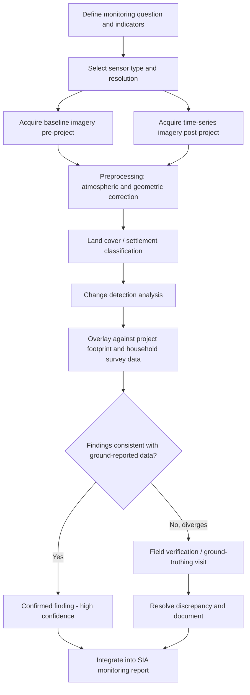

## Remote Sensing for Displacement and Land Change

### Definition and Conceptual Foundation

Remote sensing is the acquisition of information about the Earth's surface through sensors mounted on satellites, aircraft, or drones, without direct physical contact with the object of study. In Community Engagement and Social Impact Assessment (SIA), remote sensing is applied to detect, measure, and monitor land cover change, settlement dynamics, and physical displacement indicators over time — providing an independent, spatially comprehensive, and temporally repeatable evidence source that complements household surveys, participatory mapping, and qualitative fieldwork.

Remote sensing is particularly valuable in SIA for two categories of analysis: (1) documenting baseline conditions before project impact, especially where ground survey access is limited or where a historical baseline predates the assessment team's involvement; and (2) monitoring compliance and change over time, such as verifying that resettlement occurred as planned or detecting unauthorized encroachment into protected or restricted zones.

### Core Sensor Types and Data Sources

**Key Points**

- **Optical (multispectral) imagery**: Captures reflected sunlight across visible and near-infrared bands, used for land cover classification, vegetation health assessment (via indices such as NDVI), and visual interpretation of settlement footprints. Landsat (30m resolution, free) and Sentinel-2 (10m resolution, free, via the Copernicus program) are the standard public sources; commercial providers (Maxar, Planet, Airbus) offer sub-meter resolution for fine-grained settlement and structure-level analysis.
- **Synthetic Aperture Radar (SAR)**: Active sensors (e.g., Sentinel-1) that penetrate cloud cover and operate day or night, valuable for monitoring in persistently cloudy regions where optical imagery has frequent gaps, and for detecting subtle ground deformation (e.g., subsidence near mining or extraction sites) through interferometric SAR (InSAR) techniques.
- **High-resolution commercial satellite imagery**: Sub-meter resolution imagery capable of resolving individual structures, used for detailed settlement counting, structure condition assessment, and pre/post-resettlement verification at the household level.
- **Unmanned Aerial Vehicles (drones/UAVs)**: Provide very high resolution (centimeter-level) imagery over smaller areas, commonly used for detailed site-specific documentation such as verifying the condition of structures scheduled for demolition or documenting agricultural land immediately before construction begins.
- **Nighttime lights imagery**: Data such as VIIRS Day/Night Band, used as a coarse proxy for economic activity and settlement intensity change over broad areas, though resolution limits its use to regional rather than household-level analysis.

### Applications in Displacement and Land Change Analysis

#### Settlement Footprint Change Detection

Comparing classified imagery from two or more time points to identify where built-up area has expanded, contracted, or shifted, providing an independent cross-check against household survey-reported resettlement counts.

#### Land Cover and Land Use Change Analysis

Classifying imagery into land cover categories (forest, cropland, built-up, water, bare land) at multiple time points to quantify the rate and pattern of land conversion attributable to a project, distinguishing project-driven change from broader regional trends (e.g., in-migration-driven deforestation unrelated to the specific project).

#### Example

**Example**

An SIA monitoring program for a mining concession compares Sentinel-2 imagery from the year before project approval against imagery from three years into operation. Land cover classification reveals that built-up area within a 5 km buffer of the concession boundary increased by 40%, substantially exceeding the regional baseline rate of settlement growth observed in a comparable control area 20 km away. This finding, combined with household survey data showing in-migration for mine-related employment, supports a "induced access" or "in-migration" impact pathway distinct from the direct land-take impact already documented through participatory GPS mapping — an impact category frequently underestimated in SIAs that rely solely on direct footprint analysis.

#### Resettlement Compliance Verification

Using high-resolution imagery time series to verify that resettlement occurred on the timeline and to the standard documented in a Resettlement Action Plan (RAP), including confirming that vacated land was not subsequently re-occupied and that replacement housing was constructed as committed.

#### Detecting Unauthorized Encroachment

Monitoring buffer zones around protected areas, right-of-way corridors, or resettlement exclusion zones for unauthorized settlement or land use, supporting both compliance monitoring and early identification of secondary displacement risk (where households or non-affected residents move into vacated or restricted areas).

### Standard Remote Sensing Workflow for SIA Monitoring

### Technical Considerations and Limitations

- **Resolution limits**: Publicly available imagery (Landsat, Sentinel-2) at 10–30m resolution cannot reliably distinguish individual households in dense informal settlements, requiring commercial high-resolution imagery or drone data for household-level counting; coarse-resolution imagery remains adequate for broader land cover and settlement extent trends.
- **Cloud cover and atmospheric interference**: Optical imagery acquisition in tropical and monsoon-affected regions frequently suffers from persistent cloud cover, which can delay or gap a monitoring time series; SAR imagery provides a cloud-penetrating alternative where optical coverage is inadequate.
- **Classification accuracy and ground-truthing**: Automated land cover classification algorithms require validation against ground-truth data (field verification points) to establish an accuracy assessment (commonly reported as an overall accuracy percentage or a confusion matrix); classification outputs used as SIA evidence should report this accuracy alongside the classified map itself, since misclassification directly affects the credibility of derived impact figures.
- **Temporal resolution and revisit frequency**: The interval between available cloud-free images affects how precisely a change event can be dated (e.g., distinguishing gradual encroachment from a single land-clearing event); higher revisit frequency sensors (Sentinel-2's 5-day repeat cycle, or daily commercial constellations such as Planet) improve temporal precision at higher cost or processing complexity. [Inference — specific revisit frequencies and their practical implications depend on the sensor constellation and configuration in use at the time of the assessment and should be verified against current provider specifications.]

### Standard Processing Tools and Platforms

**Key Points**

- **Google Earth Engine**: A cloud-based platform providing access to petabyte-scale public satellite imagery archives (Landsat, Sentinel) with built-in processing capability, widely used for large-area change detection analysis without requiring local download and storage of raw imagery.
- **QGIS and ArcGIS**: Standard desktop GIS platforms used for imagery visualization, supervised and unsupervised classification, and integration of remote sensing outputs with the broader SIA geodatabase covered under GIS for social mapping.
- **Semi-Automatic Classification Plugin (SCP) and similar QGIS plugins**: Open-source tools supporting land cover classification workflows without requiring proprietary remote sensing software licenses.
- **Cloud-based drone imagery processing**: Platforms such as Pix4D and DroneDeploy process raw drone imagery into orthomosaics and digital surface models for site-specific high-resolution documentation.

### Integration with Ground-Based Data

Remote sensing findings should not stand alone as SIA evidence; standard practice triangulates remote sensing-derived change detection against household survey data, participatory GPS mapping, and qualitative fieldwork, consistent with the broader data triangulation and quality assurance framework applied throughout SIA data collection. Divergence between remote sensing-detected change and community-reported experience is itself analytically valuable — for example, imagery showing stable settlement footprint despite survey-reported economic displacement indicates that impact may be occurring through livelihood or access pathways not visible as physical land cover change.

### Common Pitfalls in SIA Practice

- Relying on classification outputs without reporting or verifying accuracy through ground-truthing, presenting an unvalidated automated classification as definitive evidence.
- Using resolution inadequate to the analytical question, such as attempting household-level counting from 10m or 30m resolution imagery where sub-meter resolution is required.
- Failing to distinguish project-attributable change from broader regional trends by omitting a comparable control area or region in the change detection design.
- Treating remote sensing as a substitute for, rather than a complement to, ground-based data collection, missing impact pathways (livelihood, cultural, social) that leave no visible land cover signature.
- Inadequate documentation of imagery acquisition dates and preprocessing steps, undermining the reproducibility and audit trail expected of SIA evidence under the broader quality assurance framework.

**Related Topics**

- Geographic information systems for social mapping (integration of remote sensing layers with the SIA geodatabase)
- Data triangulation and quality assurance (ground-truthing and ground-based cross-validation)
- Participatory GIS and community-generated data (comparison with independently derived remote sensing findings)
- Resettlement Action Plan (RAP) compliance monitoring
- Induced access and in-migration impact pathways
- Change detection accuracy assessment and confusion matrix interpretation