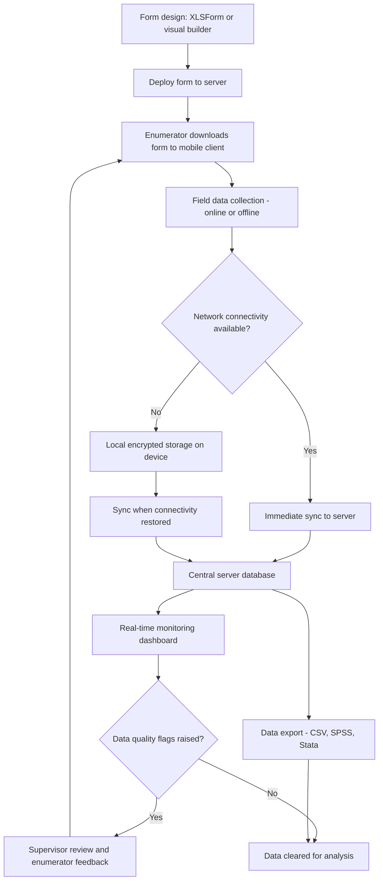

## Digital Data Collection and Survey Platforms

### Definition and Conceptual Foundation

Digital data collection platforms are software systems that enable field enumerators to capture survey and interview data electronically — via smartphone, tablet, or web browser — replacing paper-based instruments with structured digital forms that enforce logic, capture metadata (GPS location, timestamp, media attachments), and transmit data to a central server for real-time monitoring. In Community Engagement and Social Impact Assessment (SIA), digital platforms underpin the household surveys, structured checklists, and increasingly the qualitative interview management that feed the mixed-methods research designs and quality assurance processes covered elsewhere in this curriculum.

### Core Architecture

**Key Points**

- **Form design layer**: A form-building interface or standard (most commonly the XLSForm standard, an Excel-based specification, or a visual drag-and-drop builder) used to define question types, skip logic, validation rules, and multilingual translations.
- **Mobile client application**: The app installed on enumerator devices that renders the form, captures responses (including offline, without network connectivity), and stores data locally until synchronization is possible.
- **Server/backend**: A central repository (self-hosted or cloud-hosted) that receives synchronized submissions, stores the resulting dataset, and typically provides a web interface for monitoring submission rates, reviewing individual records, and exporting data.
- **Data export and analysis layer**: Mechanisms for exporting collected data into formats usable by statistical software (CSV, SPSS, Stata formats) or connecting directly to analysis and visualization tools.

### Standard Platform Architecture (Diagram)

### Major Platforms in Development and SIA Practice

- **Open Data Kit (ODK)**: The foundational open-source toolkit underlying many derivative platforms, consisting of ODK Build/XLSForm for form design, ODK Collect as the Android mobile client, and ODK Central as the self-hostable server component. ODK is widely used because it is free, open-source, and can be self-hosted, which matters for data sovereignty in politically sensitive SIA contexts.
- **KoboToolbox**: Built on the ODK ecosystem, KoboToolbox provides a hosted (or self-hostable) service layer with a more accessible web interface, widely adopted in humanitarian and development contexts including SIA fieldwork, and offers free hosting tiers oriented toward non-profit and research use.
- **SurveyCTO**: A commercial platform built on the ODK standard, offering additional enterprise features (advanced quality control dashboards, more robust encryption options, dedicated support) at a licensing cost, commonly used in academically rigorous or donor-funded impact evaluations with larger budgets.
- **CommCare**: A platform oriented toward case management in addition to survey data collection, useful in SIA contexts requiring longitudinal tracking of the same households or cases over multiple encounters (e.g., grievance case tracking, livelihood restoration program monitoring).
- **REDCap**: Common in academic and health-research-adjacent contexts, offering strong data governance and audit trail features, sometimes used where an SIA is conducted in partnership with an academic institution subject to that institution's data management requirements.

### Key Functional Features for SIA Fieldwork

#### Offline Data Collection

Given that SIA fieldwork frequently occurs in rural or remote areas with unreliable connectivity, the ability to collect data fully offline and synchronize later is a baseline requirement rather than an advanced feature. All major platforms (ODK, KoboToolbox, SurveyCTO) support this by default.

#### Skip Logic and Constraint Validation

Forms can be programmed to show or hide questions based on prior answers (skip logic) and to reject implausible entries at the point of capture (constraint validation) — for example, rejecting a household size entry below 1 or above a defined plausible maximum, or automatically skipping a section on agricultural income for households that indicated no agricultural activity.

#### GPS and Geopoint Capture

Most platforms support a geopoint question type that captures the device's GPS coordinates at the time of response, directly feeding the geocoded survey data used in GIS-based social mapping analysis.

#### Multimedia Capture

Photo, audio, and video capture fields allow enumerators to document physical conditions (structure photos for resettlement baseline documentation), record consent statements, or capture audio of open-ended qualitative responses for later transcription.

#### Multilingual Support

Forms can present the same questions in multiple languages selectable by the enumerator or respondent, critical in linguistically diverse project-affected areas, though translation accuracy still requires the back-translation quality assurance practices covered under ethical review and research protocols.

#### Example

**Example**

An SIA household survey deployed via KoboToolbox is built with an XLSForm containing skip logic that routes respondents into a distinct "livelihood restoration eligibility" module only if a prior question confirms their land falls within the demarcated project footprint (verified against a geopoint capture cross-referenced with the GIS-based project boundary layer). Enumerators collect data offline across a three-week field period in an area with intermittent mobile connectivity, syncing each evening from a location with WiFi access. The server's real-time dashboard flags two enumerators whose average interview duration is significantly shorter than the team average, prompting a supervisor to conduct back-checks on their submitted records as part of the field collection quality assurance protocol.

### Data Security and Privacy Considerations

**Key Points**

- **Encryption in transit and at rest**: Sensitive SIA data (household income, tenure status, vulnerability indicators) should be encrypted both during transmission from device to server and in server-side storage; most major platforms support this, but configuration (e.g., enabling end-to-end encryption features) is often not the default and requires deliberate setup.
- **Self-hosting vs. third-party hosting**: Self-hosting a server (ODK Central, self-hosted KoboToolbox) gives the commissioning organization direct control over data residency and access, which can matter for compliance with data protection regulations or community data sovereignty commitments; third-party hosted services introduce a data processing relationship with the platform provider that should be reflected in the study's data management and consent documentation.
- **Access control**: Role-based access restricting which team members can view raw identifiable data versus de-identified aggregated exports, consistent with the confidentiality protections established under the study's ethical review protocol.
- **Device-level security**: Since field devices may be lost or stolen, device-level encryption and remote-wipe capability (or, at minimum, a policy against storing unsynced sensitive data on a device longer than necessary) reduces exposure from physical device loss.

### Integration with the Broader SIA Data Pipeline

Digital data collection platforms function as the front-end of the SIA data pipeline described under data triangulation and quality assurance: platform-enforced constraints and skip logic implement instrument design QA, sync logs and submission timestamps support field collection QA (enabling detection of enumerator fabrication through submission timing patterns), and structured export formats feed directly into the data cleaning and analysis phases. Geopoint capture fields link survey records to the GIS-based social mapping layers, enabling the overlay and buffer analyses described in that context.

### Common Pitfalls in SIA Practice

- Selecting a platform based on familiarity rather than fit-for-purpose evaluation of offline capability, data hosting requirements, and budget, particularly where a commercial platform's licensing cost is not sustainable across a multi-year monitoring program.
- Under-utilizing built-in constraint and skip logic features, effectively using the digital platform as an expensive paper form rather than leveraging its data quality advantages.
- Neglecting to configure encryption and access control defaults, leaving sensitive data more exposed than a comparable paper-based system with physical document security.
- Failing to plan for data export and long-term archival in a platform-independent format, creating risk of data lock-in or loss of access if a hosted service changes its terms or discontinues support.
- Treating GPS geopoint capture as automatically accurate without accounting for device-level GPS error margins (commonly several meters, more in dense urban or forest canopy environments), which can matter when geopoint data is used for fine-grained eligibility determinations near a project boundary. [Inference — specific GPS accuracy depends on the device hardware and environmental conditions at time of capture and should be verified rather than assumed precise.]

**Related Topics**

- Data triangulation and quality assurance (field collection QA and real-time monitoring dashboards)
- Geographic information systems for social mapping (geopoint data integration)
- Ethical review and research protocols (data security and consent for digital data capture)
- Participatory GIS and community-generated data (mobile-based participatory mapping tools)
- Grievance redress mechanism case tracking systems
- XLSForm standard and form design best practices