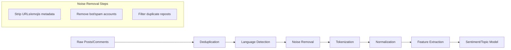
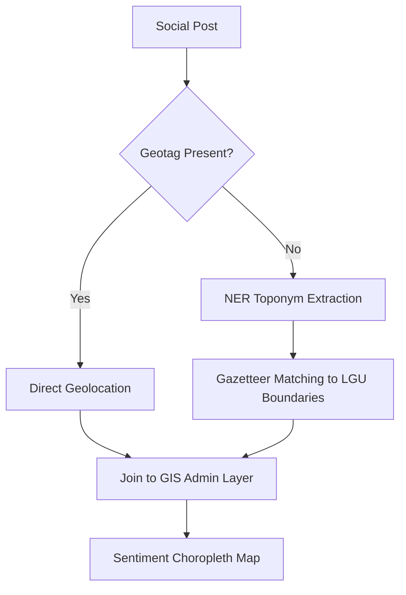

## Social media listening and sentiment analysis

### Overview

Social media listening and sentiment analysis is the systematic collection, monitoring, and interpretation of publicly available social media content (posts, comments, replies, shares) to understand public perception, emerging concerns, and community sentiment relevant to a project, policy, or development intervention. Within Social Impact Assessment (SIA), it serves as a supplementary, non-intrusive data-gathering method that captures stakeholder voice in near real time, complementing traditional methods like surveys, focus group discussions (FGDs), and key informant interviews (KIIs).

Social media listening differs from simple social media monitoring: monitoring tracks mentions, volume, and reach; listening goes further to extract meaning, sentiment, themes, and actionable insight from that content.

### Role in Social Impact Assessment

**Key Points**

- Captures unsolicited, organic stakeholder sentiment that is not shaped by an interviewer's presence (reducing certain forms of response bias)
- Enables early detection of grievances, misinformation, or emerging opposition before they escalate into formal complaints or conflict
- Provides a longitudinal view of sentiment shift across project phases (pre-construction, construction, operation)
- Supports triangulation: findings can be cross-validated against household surveys, grievance redress mechanism (GRM) logs, and public consultation minutes
- Helps identify influential local voices (community leaders, local pages, civic groups) shaping public discourse

**Limitations for SIA use**

- Sampling bias: only captures views of social-media-active populations, which may skew younger, urban, and more digitally literate — a critical equity concern in SIA where marginalized or offline populations may be systematically excluded
- Platform bias: sentiment on Facebook (dominant in many Southeast Asian and Philippine contexts) differs from X/Twitter or TikTok audiences
- Context collapse: sarcasm, local dialect, code-switching (e.g., Taglish), and cultural idioms can cause sentiment misclassification
- Ethical and privacy considerations around scraping, consent, and identifiability of individuals in public posts

### Core Technical Components

#### 1. Data Collection Layer

Data is gathered through platform APIs, licensed data aggregators, or (with caution) web scraping.

| Source | Access Method | Notes |
| --- | --- | --- |
| Facebook/Instagram (Meta) | Meta Graph API, CrowdTangle (legacy, discontinued 2024) | Public page data accessible; private profile data restricted |
| X (Twitter) | X API v2 (paid tiers) | Rate-limited; historical access requires higher tier |
| TikTok | TikTok Research API | Limited to approved researchers in most regions |
| YouTube | YouTube Data API v3 | Comments, video metadata |
| News/forums/blogs | RSS feeds, web scraping (BeautifulSoup, Scrapy) | Subject to site terms of service |
| Aggregator platforms | Brandwatch, Talkwalker, Meltwater, Sprout Social | Commercial, cross-platform normalization |

[Unverified] Exact API rate limits, pricing tiers, and data access policies change frequently and should be verified against each platform's current developer documentation before implementation.

#### 2. Data Preprocessing Pipeline

Raw social text requires substantial cleaning before analysis:

Key preprocessing steps:

- **Deduplication** — removing retweets/reshares that inflate volume without adding new sentiment
- **Language detection** — critical in multilingual contexts (e.g., Filipino, Ilocano, English, Taglish code-mixing)
- **Noise removal** — stripping URLs, hashtags-as-noise, boilerplate, and bot-generated content
- **Normalization** — lowercasing, expanding contractions, handling emoji-to-text mapping (emojis often carry strong sentiment signal and should not simply be discarded)
- **Spam/bot filtering** — using heuristics (posting frequency, account age, duplicate content ratio) or ML classifiers

#### 3. Sentiment Analysis Approaches

**Lexicon-based methods**

Use predefined dictionaries mapping words to sentiment scores.

- Tools: VADER (tuned for social media text, handles emoji/slang/punctuation emphasis), TextBlob, SentiWordNet
- Advantages: fast, interpretable, no training data required
- Disadvantages: poor handling of sarcasm, negation scope, and domain-specific or local-language slang

**Machine learning methods (supervised classification)**

- Traditional: Naive Bayes, SVM, Logistic Regression on TF-IDF or bag-of-words features
- Requires labeled training data (positive/negative/neutral, or fine-grained emotion categories)

**Deep learning / transformer-based methods**

- Pretrained language models fine-tuned for sentiment classification: BERT, RoBERTa, and multilingual variants (mBERT, XLM-RoBERTa) for code-switched Filipino-English text
- [Unverified] Specific pretrained Filipino sentiment models (e.g., variants trained on Filipino social media corpora) exist in academic literature, but their production readiness, licensing, and accuracy should be independently verified before deployment in an SIA pipeline
- Aspect-Based Sentiment Analysis (ABSA) — determines sentiment toward specific aspects (e.g., "resettlement compensation" vs. "construction noise") rather than an overall document-level score, which is more useful for SIA where a single post may express mixed sentiment across multiple project dimensions

**Sentiment classification schema commonly used in SIA**

$$S(d) = \begin{cases} \text{Positive} & \text{if } \text{score}(d) > \theta_{pos} \\ \text{Neutral} & \text{if } \theta_{neg} \le \text{score}(d) \le \theta_{pos} \\ \text{Negative} & \text{if } \text{score}(d) < \theta_{neg} \end{cases}$$

where $\text{score}(d)$ is the aggregate polarity score of document $d$, and $\theta_{pos}$, $\theta_{neg}$ are tunable thresholds. [Inference] Threshold values are typically calibrated per corpus rather than universal, since baseline positivity/negativity varies by platform and topic domain.

#### 4. Topic Modeling and Thematic Extraction

Beyond polarity, SIA practitioners need to know *what* people are talking about.

- **LDA (Latent Dirichlet Allocation)** — unsupervised discovery of latent topics across a document corpus
- **BERTopic** — combines transformer embeddings with clustering (UMAP + HDBSCAN) for more coherent, human-interpretable topics than classical LDA
- **Keyword/hashtag co-occurrence networks** — visualizing which concerns cluster together (e.g., "#relocation" clustering with "#compensation" and "#delay")

#### 5. Geospatial Integration

Since this falls under "Geospatial and Digital Tools," a key technical extension is geotagging sentiment:

- **Explicit geotags** — posts with GPS metadata (increasingly rare due to privacy defaults) or user-declared location fields
- **Implicit geolocation inference** — NLP-based toponym extraction (identifying place names, barangay/municipality references) using Named Entity Recognition (NER) tuned for local administrative units
- **Aggregation to administrative boundaries** — mapping sentiment scores to barangay, municipal, or provincial GIS layers for choropleth visualization

This geospatial-sentiment fusion allows SIA teams to identify *where* negative sentiment clusters geographically relative to a project's area of influence (e.g., within a 5 km buffer of a proposed dam or infrastructure corridor).

### Practical Example: Monitoring an LGU Infrastructure Project

**Example**

A local government unit (LGU) is planning a road-widening project affecting several barangays. An SIA team sets up a listening pipeline:

1. Define keyword/hashtag set: project name, contractor name, affected barangay names, common local terms for "demolition" or "clearing"
2. Collect Facebook public page comments and public group posts via Graph API (page-level, with appropriate access permissions) over a 6-month baseline period
3. Preprocess: filter Filipino/English/Taglish content, remove bot accounts, deduplicate
4. Run ABSA to separate sentiment on distinct aspects: compensation, timeline, traffic disruption, environmental impact
5. Geotag mentions to barangay level using toponym NER matched against the LGU's administrative gazetteer
6. Visualize as a time-series sentiment trend line plus a barangay-level choropleth map
7. Cross-validate spikes in negative sentiment against the formal GRM log dates to check for consistency or detect underreported grievances

**Output**

A dashboard combining:

- Sentiment trend line (percentage positive/neutral/negative per week)
- Top emerging topics per period (via BERTopic)
- Barangay-level sentiment heat map
- Flagged high-negative-sentiment posts for manual review by the SIA/GRM team

### Simplified Sentiment Trend Visualization (SVG)

<svg xmlns="http://www.w3.org/2000/svg" viewBox="0 0 640 320" font-family="Arial, sans-serif">
<text x="20" y="24" font-size="15" font-weight="bold">Sentiment Trend Over Project Timeline (svg_diagram)</text>
<line x1="60" y1="270" x2="600" y2="270" stroke="#333" stroke-width="1.5" />
<line x1="60" y1="60" x2="60" y2="270" stroke="#333" stroke-width="1.5" />
<text x="15" y="65" font-size="11">100%</text>
<text x="15" y="170" font-size="11">50%</text>
<text x="30" y="272" font-size="11">0%</text>
<text x="300" y="300" font-size="12" text-anchor="middle">Project Timeline (weeks)</text>

<polyline points="60,220 140,210 220,215 300,200 380,190 460,180 540,175" fill="none" stroke="#2e7d32" stroke-width="2.5" />

<polyline points="60,150 140,155 220,150 300,155 380,150 460,148 540,150" fill="none" stroke="#9e9e9e" stroke-width="2.5" />

<polyline points="60,240 140,230 220,120 300,110 380,200 460,205 540,210" fill="none" stroke="#c62828" stroke-width="2.5" />

<circle cx="220" cy="120" r="4" fill="#c62828" />
<text x="225" y="105" font-size="10" fill="#c62828">Demolition notice spike</text>

<rect x="470" y="60" width="12" height="12" fill="#2e7d32" />
<text x="486" y="70" font-size="11">Positive</text>
<rect x="470" y="78" width="12" height="12" fill="#9e9e9e" />
<text x="486" y="88" font-size="11">Neutral</text>
<rect x="470" y="96" width="12" height="12" fill="#c62828" />
<text x="486" y="106" font-size="11">Negative</text>
</svg>

### Toolchain Summary

| Layer | Open-Source Options | Commercial Options |
| --- | --- | --- |
| Data collection | `tweepy`, `facebook-sdk`, `snscrape` [Unverified: scraping tools frequently break due to platform ToS/API changes] | Brandwatch, Meltwater, Talkwalker |
| Preprocessing/NLP | spaCy, NLTK, Hugging Face `transformers` | — |
| Sentiment | VADER, `transformers` fine-tuned models | Lexalytics, MonkeyLearn |
| Topic modeling | Gensim (LDA), BERTopic | — |
| Geospatial | GeoPandas, QGIS, Folium | Esri ArcGIS |
| Dashboarding | Streamlit, Dash, Metabase | Power BI, Tableau |

### Ethical and Methodological Safeguards

- Only collect data that is genuinely public (public pages/groups, not private profiles) and comply with each platform's Terms of Service
- Anonymize or aggregate before reporting; avoid quoting identifiable individuals in SIA reports without consent, even if the post is public
- Disclose in the SIA methodology section that social listening supplements — and does not replace — representative sampling methods, given its inherent access/digital-divide bias
- Document model limitations (e.g., sentiment classifier accuracy on Filipino/Taglish text) transparently as a caveat to findings
- [Inference] Given the digital divide in many LGU jurisdictions in the Philippines, findings from social listening are best treated as indicative of vocal/online segments rather than representative of the full affected population, and should be weighted accordingly when combined with survey-based findings

### Next Steps

- Geographic Information Systems (GIS) for stakeholder mapping and buffer-zone analysis
- Grievance Redress Mechanism (GRM) digital logging systems and their integration with sentiment data
- Mobile-based/SMS survey tools for reaching populations underrepresented in social media data
- Aspect-Based Sentiment Analysis (ABSA) model fine-tuning for local language corpora
- Data privacy and ethics frameworks for digital SIA methods (e.g., alignment with the Philippine Data Privacy Act of 2012)
- Crowdsourced mapping and participatory GIS as complementary community engagement tools