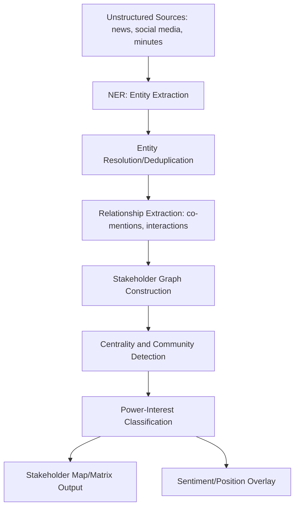

## Artificial intelligence applications in stakeholder analysis

### Overview

Artificial intelligence (AI) applications in stakeholder analysis refer to the use of machine learning, natural language processing (NLP), network analysis, and predictive modeling techniques to identify, classify, map, and monitor stakeholders relevant to a development project or policy intervention. Within Social Impact Assessment (SIA), AI augments traditional stakeholder analysis methods (stakeholder matrices, power-interest grids, manual mapping from consultations) by processing larger, more heterogeneous data sources — social media, news, administrative records, geospatial data, and survey text — at a scale and speed manual methods cannot match.

AI does not replace the judgment-based, participatory core of stakeholder analysis; it functions as a decision-support layer that surfaces patterns, relationships, and priority signals for human analysts to interpret and validate.

### Role in Social Impact Assessment

**Key Points**

- Accelerates identification of stakeholders (individuals, groups, organizations) who may be affected by or influence a project, including less visible or emergent actors
- Enables dynamic, continuously updated stakeholder maps rather than static, point-in-time matrices
- Supports classification of stakeholders by influence, interest, sentiment, and network position using quantitative signals
- Assists in early detection of coalition-building, opposition movements, or emerging grievances
- Improves resource allocation for engagement by prioritizing stakeholders algorithmically flagged as high-influence or high-risk

**Limitations**

- Risk of over-reliance on digitally visible stakeholders, systematically underweighting marginalized, offline, or non-literate populations — a core equity concern in SIA
- Algorithmic bias: training data (often global or Western-centric) may misclassify local context, dialect, or culturally specific expressions of interest/opposition
- Explainability gap: some AI outputs (e.g., deep learning-based influence scores) are difficult to justify transparently to affected communities or regulators
- Data governance and consent issues when AI systems ingest personal or quasi-personal data from public sources
- [Inference] Because SIA findings often inform decisions with real consequences for communities, AI-derived stakeholder classifications should generally be treated as a triage/prioritization aid rather than a sole basis for engagement decisions

### Core Technical Components

#### 1. Data Ingestion Layer

AI-driven stakeholder analysis draws from multiple structured and unstructured sources:

| Source Type | Examples | Format |
| --- | --- | --- |
| Social media | Facebook pages/groups, X, YouTube comments | Unstructured text, metadata |
| News/media | Local and national news articles, press releases | Unstructured text |
| Administrative records | LGU registries, barangay profiles, business permits | Structured/semi-structured |
| Consultation records | FGD/KII transcripts, public hearing minutes | Unstructured text |
| Geospatial data | Land use maps, cadastral records, service boundaries | Vector/raster GIS layers |
| Survey data | Household surveys, perception surveys | Structured (tabular) |

#### 2. Stakeholder Identification and Extraction

**Named Entity Recognition (NER)**

Used to automatically extract mentions of persons, organizations, locations, and roles from unstructured text (news articles, meeting minutes, social posts).

- Tools: spaCy, Hugging Face `transformers` (e.g., BERT-based NER models), Stanford NLP
- For Philippine LGU contexts, custom-trained or fine-tuned NER models are typically needed to correctly recognize local entities (barangay names, local organization acronyms, indigenous peoples' groups, cooperatives) not well represented in general-purpose pretrained models
- [Unverified] The accuracy of off-the-shelf multilingual NER models on Filipino/Taglish administrative and colloquial text varies significantly and should be validated against a locally annotated sample before production use

**Entity Resolution / Deduplication**

Merges multiple mentions of the same stakeholder across sources (e.g., "Brgy. Captain Dela Cruz," "Kapitan Dela Cruz," "Hon. J. Dela Cruz" referring to the same person) using string similarity (Levenshtein, Jaro-Winkler) combined with contextual embeddings.

#### 3. Stakeholder Classification

**Rule-based / heuristic classification**

Assigns stakeholders to categories (government, civil society, private sector, affected community, media) based on keyword patterns and known registries.

**Supervised ML classification**

Trains classifiers on labeled examples to predict stakeholder attributes such as:

- Position (supportive / neutral / opposed)
- Power/influence tier (high / medium / low)
- Legitimacy or interest level

**Power-Interest Grid, computationally derived**

$$\text{Influence}(s) = w_1 \cdot C(s) + w_2 \cdot R(s) + w_3 \cdot F(s)$$

where $C(s)$ is a centrality score from network analysis, $R(s)$ is a resource/authority proxy (e.g., formal position, budget control), $F(s)$ is media/social mention frequency, and $w_1, w_2, w_3$ are weights calibrated by the analyst. [Inference] Weight calibration is context-specific and typically requires validation against known ground-truth cases (e.g., stakeholders already confirmed as high-influence through fieldwork) rather than being set arbitrarily.

#### 4. Social Network Analysis (SNA)

AI/graph-based methods reconstruct stakeholder relationship networks from co-occurrence in documents, social media interactions (mentions, replies, shared group membership), or formal organizational affiliations.

Key metrics:

- **Degree centrality** — number of direct connections a stakeholder has
- **Betweenness centrality** — extent to which a stakeholder acts as a bridge/broker between otherwise disconnected groups
- **Eigenvector centrality** — influence weighted by the influence of one's connections
- **Community detection** (e.g., Louvain method, Girvan-Newman) — identifies coalitions or factions within the stakeholder network

#### 5. Sentiment and Position Analysis Overlay

Combines with NLP sentiment classification (as in social media listening pipelines) to overlay each stakeholder node with an inferred position: supportive, neutral, or opposed, and confidence level. Aspect-Based Sentiment Analysis (ABSA) can further indicate *which aspect* of a project a stakeholder supports or opposes (e.g., supportive of jobs created, opposed to resettlement terms).

#### 6. Predictive and Risk Modeling

- **Grievance escalation prediction** — classification/regression models trained on historical GRM data to flag stakeholders or issues likely to escalate into formal disputes
- **Engagement outcome prediction** — [Speculation] some organizations have piloted models predicting the likelihood of stakeholder attendance or cooperation in consultations based on historical engagement patterns, though this is not a standardized or widely validated practice in SIA and carries risk of self-fulfilling bias if used to deprioritize engagement with certain groups

### Practical Example: AI-Assisted Stakeholder Mapping for an LGU Project

**Example**

An LGU document management system (such as a `batac-dms`-style platform) is extended with a stakeholder analysis module for a proposed public market redevelopment project:

1. **Ingestion**: Scrape/collect barangay council resolutions, public hearing minutes (OCR'd if scanned), local Facebook group posts, and past GRM records related to the project area
2. **Entity extraction**: Run NER fine-tuned on local administrative vocabulary to extract names of barangay officials, vendor associations, homeowners' associations, and civil society groups
3. **Relationship graph**: Build a graph where edges represent co-mentions in the same document or shared meeting attendance
4. **Centrality analysis**: Compute betweenness centrality to identify brokers (e.g., a vendors' association president who bridges the LGU and informal vendor community)
5. **Sentiment overlay**: Apply sentiment classification to each stakeholder's public statements to populate a position axis
6. **Output**: Auto-generated power-interest grid with computed coordinates, reviewed and manually adjusted by the SIA team before finalization
7. **Validation**: Cross-check AI-flagged "high-influence, opposed" stakeholders against field team's local knowledge before prioritizing them for direct consultation

**Output**

- Interactive stakeholder network graph (nodes sized by influence score, colored by sentiment/position)
- Power-interest grid auto-populated from computed scores, editable by analysts
- Ranked engagement priority list with rationale (e.g., "high betweenness centrality + negative sentiment + low prior engagement frequency")

### Simplified Stakeholder Network Diagram (SVG)

<svg xmlns="http://www.w3.org/2000/svg" viewBox="0 0 640 360" font-family="Arial, sans-serif">
<text x="20" y="24" font-size="15" font-weight="bold">AI-Derived Stakeholder Network (svg_diagram)</text>

<line x1="320" y1="180" x2="150" y2="90" stroke="#999" stroke-width="1.5" />
<line x1="320" y1="180" x2="480" y2="90" stroke="#999" stroke-width="1.5" />
<line x1="320" y1="180" x2="150" y2="270" stroke="#999" stroke-width="1.5" />
<line x1="320" y1="180" x2="480" y2="270" stroke="#999" stroke-width="1.5" />
<line x1="150" y1="90" x2="150" y2="270" stroke="#ccc" stroke-width="1" />
<line x1="480" y1="90" x2="480" y2="270" stroke="#ccc" stroke-width="1" />

<circle cx="320" cy="180" r="26" fill="#1565c0" />
<text x="320" y="185" font-size="10" fill="#fff" text-anchor="middle">Broker</text>
<text x="320" y="220" font-size="10" text-anchor="middle">Vendors' Assoc. Pres.</text>

<circle cx="150" cy="90" r="20" fill="#2e7d32" />
<text x="150" y="94" font-size="9" fill="#fff" text-anchor="middle">LGU</text>
<text x="150" y="115" font-size="10" text-anchor="middle">Barangay Council</text>

<circle cx="480" cy="90" r="20" fill="#c62828" />
<text x="480" y="94" font-size="9" fill="#fff" text-anchor="middle">Opp.</text>
<text x="480" y="115" font-size="10" text-anchor="middle">Homeowners' Assoc.</text>

<circle cx="150" cy="270" r="18" fill="#9e9e9e" />
<text x="150" y="274" font-size="9" fill="#fff" text-anchor="middle">Neu.</text>
<text x="150" y="298" font-size="10" text-anchor="middle">Local Media</text>

<circle cx="480" cy="270" r="18" fill="#2e7d32" />
<text x="480" y="274" font-size="9" fill="#fff" text-anchor="middle">Sup.</text>
<text x="480" y="298" font-size="10" text-anchor="middle">Market Vendors</text>

<rect x="20" y="320" width="12" height="12" fill="#2e7d32" />
<text x="36" y="330" font-size="10">Supportive</text>
<rect x="120" y="320" width="12" height="12" fill="#9e9e9e" />
<text x="136" y="330" font-size="10">Neutral</text>
<rect x="200" y="320" width="12" height="12" fill="#c62828" />
<text x="216" y="330" font-size="10">Opposed</text>
<rect x="280" y="320" width="12" height="12" fill="#1565c0" />
<text x="296" y="330" font-size="10">High centrality</text>
</svg>

### Toolchain Summary

| Layer | Open-Source Options | Commercial Options |
| --- | --- | --- |
| NER/Entity extraction | spaCy, Hugging Face `transformers`, Stanza | Amazon Comprehend, Google Cloud NLP |
| Network analysis | NetworkX, `igraph`, Gephi | Palantir, Kumu |
| Sentiment/NLP | VADER, fine-tuned BERT/RoBERTa | Lexalytics, Brandwatch |
| Graph database | Neo4j (Community Edition) | Neo4j AuraDB, TigerGraph |
| Visualization | Gephi, D3.js, Plotly | Kumu, Tableau |
| OCR (for scanned minutes/resolutions) | Tesseract OCR | ABBYY FineReader |

### Ethical and Methodological Safeguards

- Treat AI-generated stakeholder classifications as provisional hypotheses requiring field validation, not final determinations
- Avoid using AI-derived "low priority" scores as sole justification for excluding a group from consultation, particularly indigenous peoples, informal settlers, or other historically underrepresented groups
- Maintain a documented, auditable trail of how each stakeholder's classification was derived (data sources, model version, confidence score) to support transparency and, where relevant, compliance with free, prior, and informed consent (FPIC) processes
- Apply data minimization: extract and retain only data necessary for the stakeholder analysis purpose, consistent with the Philippine Data Privacy Act of 2012
- Regularly audit classification outputs for systematic bias against specific demographic or geographic groups
- Disclose AI involvement in stakeholder analysis methodology within the SIA report, including model limitations

### Next Steps

- Social network analysis (SNA) methods and metrics in depth
- Grievance Redress Mechanism (GRM) predictive analytics
- Natural language processing for local/regional language and code-switched text
- Participatory validation techniques for AI-generated stakeholder maps
- Data governance and consent frameworks for AI-driven SIA tools
- Integration of AI stakeholder outputs into GIS-based stakeholder mapping (linking to geospatial and digital tools)