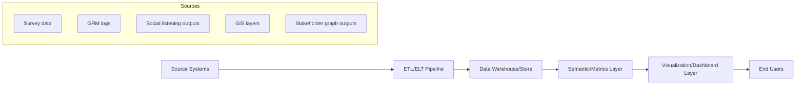

## Data visualization and dashboard reporting

### Overview

Data visualization and dashboard reporting refers to the design and technical implementation of visual representations and interactive interfaces that communicate Social Impact Assessment (SIA) findings — demographic profiles, stakeholder sentiment, grievance trends, geospatial impact zones, and monitoring indicators — to diverse audiences including project proponents, regulators, affected communities, and internal SIA teams. It transforms raw quantitative and qualitative data into accessible visual formats that support decision-making, transparency, and accountability throughout the project lifecycle.

Within the "Geospatial and Digital Tools for Social Analysis" chapter, this topic serves as the synthesis layer: it is where outputs from social media listening, AI stakeholder analysis, geospatial mapping, and survey data converge into a coherent, decision-ready presentation.

### Role in Social Impact Assessment

**Key Points**

- Translates complex, multi-source data (surveys, GIS layers, sentiment scores, GRM logs) into interpretable visual narratives for non-technical stakeholders
- Supports real-time or periodic monitoring of social impact indicators across project phases (baseline, construction, operation, decommissioning)
- Enables comparative analysis across time periods, geographic units (barangay, municipality), or demographic segments
- Facilitates transparency and accountability by making SIA data accessible to affected communities and oversight bodies
- Serves as an early-warning system when dashboards are configured with threshold-based alerts (e.g., grievance volume spikes, sentiment decline)

**Limitations**

- Poorly designed visualizations can mislead (e.g., truncated axes, inappropriate chart types, aggregation that masks localized harm)
- Dashboards displaying aggregate data risk obscuring impacts on small or marginalized subgroups unless disaggregation is deliberately built in
- Requires ongoing data pipeline maintenance; a dashboard is only as reliable as its underlying data refresh and validation processes
- Accessibility barriers (language, digital literacy, connectivity) may limit usefulness for direct community access, requiring complementary non-digital reporting formats
- [Inference] Dashboards intended for public-facing transparency purposes generally warrant a different design standard (simplicity, plain language, disaggregation controls) than internal analyst dashboards, which can carry higher data density

### Core Technical Components

#### 1. Data Pipeline Architecture

A dashboard is the presentation layer of a broader data pipeline:

- **ETL/ELT (Extract, Transform, Load)**: consolidates disparate sources (survey exports, GRM database, sentiment analysis outputs, GIS shapefiles) into a unified schema
- **Data warehouse/store**: centralized storage (PostgreSQL/PostGIS for geospatial-enabled relational storage, or a data warehouse like BigQuery/Redshift for larger deployments)
- **Semantic/metrics layer**: defines standardized calculated metrics (e.g., "grievance resolution rate," "negative sentiment share") so all dashboard views draw from consistent definitions
- **Visualization layer**: the dashboard tool itself, querying the semantic layer or warehouse directly

#### 2. Chart Type Selection

Choosing the correct visual encoding for the data type and analytical question is a core design competency:

| Data Relationship | Recommended Chart Type | Avoid |
| --- | --- | --- |
| Trend over time | Line chart, area chart | 3D charts, pie charts |
| Part-to-whole (few categories) | Stacked bar, donut chart | Pie chart with >5 slices |
| Comparison across categories | Bar chart, grouped bar | Pie chart |
| Geographic distribution | Choropleth map, proportional symbol map | Non-geo chart for spatial data |
| Correlation between variables | Scatter plot | Bar chart |
| Distribution/spread | Histogram, box plot | Single summary statistic alone |
| Network/relationship | Node-link graph | Table for highly connected data |
| Hierarchical composition | Treemap, sunburst | Nested pie charts |

**Key Points**

- Choropleth maps for barangay/municipal-level sentiment or grievance density should use appropriate classification methods (e.g., natural breaks/Jenks, quantile) rather than arbitrary equal intervals, since equal intervals can visually flatten meaningful disparities
- Color palettes must account for colorblind accessibility (avoid red-green as the sole differentiator) and should use sequential palettes for continuous data, diverging palettes for data with a meaningful midpoint (e.g., sentiment: negative–neutral–positive), and qualitative palettes for categorical data

#### 3. Dashboard Design Principles

- **Progressive disclosure**: high-level summary metrics (KPIs) at the top, with drill-down capability into granular detail
- **Consistent filtering**: global filters (date range, geographic unit, demographic segment) that apply uniformly across all dashboard panels
- **Disaggregation by default**: SIA-specific best practice is to build in disaggregation controls (by sex, age group, indigenous status, income level, disability status) rather than presenting only aggregate figures, since aggregate data can mask disproportionate impacts on vulnerable subgroups
- **Annotation and context**: including baseline reference lines, target thresholds, and narrative annotations for significant events (e.g., "Public hearing held here") so viewers do not misinterpret data changes as purely organic

#### 4. Technical Implementation Stacks

**Business Intelligence (BI) platforms** — lower-code, business-user-friendly

- Power BI, Tableau, Looker Studio (formerly Google Data Studio), Metabase
- Suited for LGU or organizational contexts where non-developer staff need to maintain dashboards

**Code-based visualization frameworks** — higher flexibility, developer-oriented

- Python: Plotly Dash, Streamlit, Bokeh
- JavaScript: D3.js, Chart.js, Observable Plot, ECharts
- R: Shiny, `ggplot2` with `flexdashboard`

**Geospatial-specific dashboard tools**

- QGIS with QGIS Server/Web plugins for publishing interactive web maps
- Leaflet.js or Mapbox GL JS for custom web-based interactive maps
- ArcGIS Online/ArcGIS Dashboards (commercial)
- Kepler.gl (Uber's open-source geospatial analysis tool) for large-scale point/trip data visualization

[Unverified] Specific feature sets, pricing tiers, and licensing terms for commercial BI and GIS platforms change frequently and should be verified against current vendor documentation before procurement decisions.

#### 5. Real-Time vs. Periodic (Static) Reporting

| Approach | Use Case | Technical Requirement |
| --- | --- | --- |
| Real-time/near-real-time dashboard | Ongoing GRM monitoring, social listening trend tracking | Live database connection, scheduled ETL refresh (e.g., hourly/daily) |
| Periodic static report | Formal SIA milestone reports, regulatory submissions | Export to PDF/print-ready format, often generated from the same underlying dashboard |
| Hybrid | Public-facing transparency portal updated monthly, internal dashboard updated daily | Tiered refresh schedules by audience |

### Practical Example: LGU SIA Monitoring Dashboard

**Example**

An LGU document management system (such as `batac-dms`) is extended with an SIA monitoring dashboard module for an ongoing infrastructure project:

1. **Data integration**: Pipe in data from the GRM database (PostgreSQL), social listening sentiment outputs (from a scheduled NLP batch job), household survey results (CSV exports), and GIS boundary layers (PostGIS/shapefile)
2. **Metrics layer**: Define standardized KPIs — grievance resolution rate, average resolution time, negative sentiment percentage, survey satisfaction index — computed consistently
3. **Dashboard build**: Using Metabase or a custom Dash app:
   - Panel 1: KPI summary cards (total grievances, % resolved, avg. sentiment)
   - Panel 2: Time-series line chart of sentiment and grievance volume overlaid
   - Panel 3: Choropleth map of grievance density by barangay
   - Panel 4: Disaggregated bar chart of survey satisfaction by demographic segment
   - Panel 5: Filterable table of open high-priority grievances
4. **Access tiers**: Internal dashboard (full detail, role-based access control) vs. public-facing simplified version (aggregate trends only, plain-language labels, mobile-responsive)
5. **Refresh cadence**: Internal dashboard refreshes daily via scheduled ETL job; public dashboard refreshes monthly with manual QA review before publishing

**Output**

- Internal analyst dashboard with full drill-down and disaggregation capability
- Public transparency dashboard published as a lightweight web page, summarizing project social impact status in accessible language
- Automated monthly PDF export generated from the same data pipeline for formal regulatory reporting

### Simplified Dashboard Layout Wireframe (SVG)

<svg xmlns="http://www.w3.org/2000/svg" viewBox="0 0 640 380" font-family="Arial, sans-serif">
<text x="20" y="24" font-size="15" font-weight="bold">SIA Monitoring Dashboard Layout (svg_diagram)</text>

<rect x="20" y="40" width="140" height="60" rx="4" fill="#e3f2fd" stroke="#1565c0" />
<text x="90" y="65" font-size="10" text-anchor="middle">Total Grievances</text>
<text x="90" y="85" font-size="16" font-weight="bold" text-anchor="middle">142</text>
<rect x="175" y="40" width="140" height="60" rx="4" fill="#e8f5e9" stroke="#2e7d32" />
<text x="245" y="65" font-size="10" text-anchor="middle">% Resolved</text>
<text x="245" y="85" font-size="16" font-weight="bold" text-anchor="middle">78%</text>
<rect x="330" y="40" width="140" height="60" rx="4" fill="#fff3e0" stroke="#ef6c00" />
<text x="400" y="65" font-size="10" text-anchor="middle">Avg. Resolution (days)</text>
<text x="400" y="85" font-size="16" font-weight="bold" text-anchor="middle">12.4</text>
<rect x="485" y="40" width="135" height="60" rx="4" fill="#fce4ec" stroke="#c62828" />
<text x="552" y="65" font-size="10" text-anchor="middle">Negative Sentiment</text>
<text x="552" y="85" font-size="16" font-weight="bold" text-anchor="middle">23%</text>

<rect x="20" y="115" width="300" height="130" rx="4" fill="#fafafa" stroke="#999" />
<text x="30" y="132" font-size="11" font-weight="bold">Sentiment &amp; Grievance Trend</text>
<polyline points="35,220 90,210 145,225 200,200 255,190 300,195" fill="none" stroke="#1565c0" stroke-width="2" />
<polyline points="35,230 90,225 145,200 200,215 255,205 300,180" fill="none" stroke="#c62828" stroke-width="2" />

<rect x="335" y="115" width="285" height="130" rx="4" fill="#fafafa" stroke="#999" />
<text x="345" y="132" font-size="11" font-weight="bold">Grievance Density by Barangay</text>
<rect x="350" y="150" width="60" height="60" fill="#ffcdd2" />
<rect x="415" y="150" width="60" height="60" fill="#ef5350" />
<rect x="480" y="150" width="60" height="60" fill="#fff9c4" />
<rect x="350" y="185" width="60" height="60" fill="#c62828" opacity="0.6" />
<rect x="415" y="185" width="60" height="60" fill="#fff9c4" />
<rect x="480" y="185" width="60" height="60" fill="#e8f5e9" />

<rect x="20" y="260" width="600" height="100" rx="4" fill="#fafafa" stroke="#999" />
<text x="30" y="277" font-size="11" font-weight="bold">Open High-Priority Grievances (filterable table)</text>
<line x1="30" y1="290" x2="610" y2="290" stroke="#ccc" />
<line x1="30" y1="310" x2="610" y2="310" stroke="#eee" />
<line x1="30" y1="330" x2="610" y2="330" stroke="#eee" />
</svg>

### Toolchain Summary

| Layer | Open-Source Options | Commercial Options |
| --- | --- | --- |
| ETL/pipeline orchestration | Apache Airflow, Dagster, `dbt` | Fivetran, Talend |
| Data storage | PostgreSQL/PostGIS, DuckDB | Snowflake, BigQuery, Redshift |
| BI/dashboarding | Metabase, Apache Superset, Grafana | Power BI, Tableau, Looker |
| Code-based visualization | Plotly Dash, Streamlit, D3.js, ECharts | — |
| Geospatial dashboards | Leaflet.js, Kepler.gl, QGIS | ArcGIS Dashboards, Mapbox |
| Report export | WeasyPrint, `matplotlib` + LaTeX for PDF | Tableau/Power BI native export |

### Ethical and Methodological Safeguards

- Build disaggregation into dashboard design by default rather than as an afterthought, to prevent aggregate figures from masking disproportionate impacts on vulnerable subgroups
- Apply small-number suppression or aggregation rules when displaying data for small population groups (e.g., a specific indigenous community) to prevent re-identification
- Clearly label data sources, collection methods, and known limitations directly on public-facing dashboards (methodological transparency)
- Distinguish between correlation and causation in any annotated trend explanations to avoid misleading interpretation
- Ensure public-facing dashboards are designed for accessibility: plain language, mobile responsiveness, and where feasible, non-digital equivalents (printed summaries, radio/community bulletin translations) for populations with limited connectivity
- Maintain version control and change logs for dashboard metric definitions, since silent redefinition of a KPI (e.g., "resolved" criteria) can distort trend interpretation over time

### Next Steps

- Geographic Information Systems (GIS) and choropleth mapping techniques in depth
- Grievance Redress Mechanism (GRM) database design and analytics
- Data governance, access control, and consent frameworks for SIA dashboards
- Participatory dashboards: co-designing visualization tools with affected communities
- Statistical disaggregation methods and small-sample suppression rules
- Report automation and PDF generation pipelines for regulatory SIA submissions