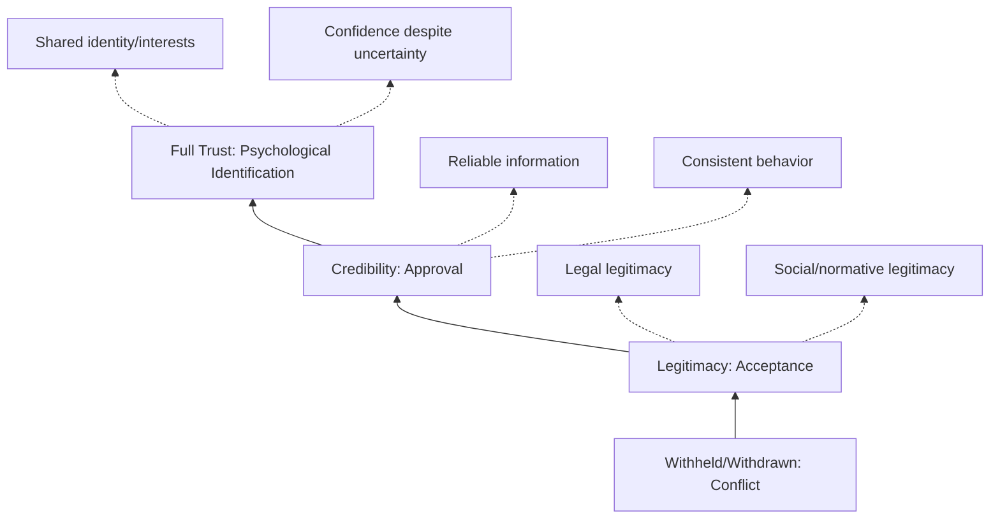

## Legitimacy, credibility, and trust components

### Overview

Legitimacy, credibility, and trust are the three foundational components of Social License to Operate (SLO) — the ongoing, informal approval granted by local communities and stakeholders for a company or project to operate within their area. First articulated in the mining sector by Joyce and Thomson (1999) and further developed by Boutilier and Thomson (2011) through the SLO "Pyramid Model," these components form a sequential trust hierarchy: legitimacy must generally be established before credibility can be built, and credibility before genuine trust develops. Together they determine whether a project moves from mere legal compliance toward broader psychological identification and support from affected communities.

### The SLO Pyramid Model

**Key Points**

The Boutilier-Thomson framework conceptualizes SLO as a pyramid with four ascending levels, each requiring the foundation below it:

1. **Withheld/Withdrawn** — the baseline state of conflict or non-acceptance
2. **Acceptance/Legitimacy** — the community tolerates the project's presence and perceives it as following proper rules and norms
3. **Approval/Credibility** — the community believes the company's actions, information, and commitments are reliable and consistent
4. **Psychological Identification/Full Trust** — the community identifies with the project's goals and grants a shared sense of ownership or partnership

[Inference] While widely referenced in SLO literature, the strict sequential/hierarchical nature of this pyramid (i.e., that each level is a strict precondition for the next) is a conceptual simplification; in practice, perceptions of legitimacy, credibility, and trust can develop unevenly or be lost and regained non-linearly across different stakeholder subgroups simultaneously.

### Component 1: Legitimacy

**Definition**

Legitimacy is the perception that an organization's actions are appropriate, proper, and desirable within a socially constructed system of norms, values, beliefs, and definitions (drawing on Suchman's 1995 organizational legitimacy framework, widely cited in SLO literature).

**Sub-types of legitimacy**

| Type | Description | Example Indicator |
| --- | --- | --- |
| Legal/regulatory legitimacy | Compliance with formal laws, permits, and licenses | Environmental Compliance Certificate (ECC), local business permits |
| Economic legitimacy | Perceived fairness of economic exchange and benefit distribution | Local employment quotas, revenue-sharing agreements |
| Social/socio-political legitimacy | Alignment with community norms, values, and expectations of proper conduct | Respect for indigenous customary practices, cultural sensitivity |
| Interactional legitimacy | Quality and respectfulness of day-to-day interpersonal engagement | Staff conduct during consultations, responsiveness to inquiries |

**Key Points**

- Legal legitimacy alone (having a permit) is necessary but not sufficient for SLO; a project can be fully compliant yet still lack social legitimacy in the eyes of the community
- Legitimacy is granted by the community, not claimed by the proponent — it is fundamentally a perception-based, externally validated construct
- Legitimacy can be undermined by a single event perceived as norm-violating (e.g., disrespecting a sacred site), even amid strong regulatory compliance elsewhere

### Component 2: Credibility

**Definition**

Credibility refers to the community's confidence that the company provides truthful information and follows through consistently on its commitments over time. It builds on legitimacy but requires a track record of demonstrated reliability.

**Determinants of credibility**

- **Information accuracy** — whether disclosed data (environmental monitoring results, employment figures, impact assessments) proves accurate when independently verified
- **Consistency between words and actions** — whether stated commitments (e.g., in a Memorandum of Agreement) are actually fulfilled
- **Transparency of process** — openness about decision-making processes, even when outcomes are unfavorable to the community
- **Responsiveness to grievances** — whether concerns raised are addressed in observable, timely ways

**Key Points**

- Credibility is cumulative and built through repeated interactions over time; it cannot be established through a single communication campaign
- A single instance of misinformation or broken commitment can disproportionately damage credibility relative to the effort required to build it (asymmetric trust dynamics — well documented in trust literature, e.g., Slovic's work on risk perception and trust asymmetry)
- Third-party validation (independent monitoring, NGO verification, academic studies) often carries more credibility-building weight than company self-reporting

### Component 3: Trust

**Definition**

Trust, in the fullest sense of the SLO pyramid, is the community's confidence in the company's intentions and competence even under conditions of uncertainty or incomplete information — extending beyond verified track record into a relational, identity-based confidence.

**Types of trust (drawing from established trust theory applied to SLO contexts)**

| Trust Type | Basis | SLO Relevance |
| --- | --- | --- |
| Calculus-based trust | Rational assessment of costs/benefits of trusting vs. not | Early-stage project relationships |
| Knowledge-based trust | Predictability from accumulated interaction history | Mid-stage, corresponds to "credibility" level |
| Identification-based trust | Shared values, goals, and mutual understanding | Highest level, corresponds to full psychological identification |
| Institutional/system trust | Confidence in the broader regulatory and governance system, independent of the specific company | Background condition affecting baseline trust levels |

**Key Points**

- Trust at the "identification" level means the community perceives the project's success and their own community's wellbeing as interconnected, not merely tolerated
- Trust is asymmetric and fragile: it accumulates slowly through consistent positive interactions but can collapse rapidly following a single serious breach (a "trust violation")
- Institutional trust (in government, regulators) and interpersonal/organizational trust (in the specific company) are distinct and can diverge — a community may trust the company's local staff while distrusting the broader regulatory system, or vice versa

### Interrelationship and Erosion Dynamics

$$\text{SLO Strength} = f(\text{Legitimacy}, \text{Credibility}, \text{Trust})$$

where the function $f$ is not simply additive: [Inference] SLO literature generally treats a deficit in a lower-level component (e.g., legitimacy) as capable of capping the achievable level of the components above it, meaning high credibility-building efforts cannot fully compensate for a foundational legitimacy deficit, though the strength and shape of this constraint is not precisely quantified in the literature and varies by context.

**Trust erosion triggers commonly identified in SLO case studies**

- Discrepancy between promised and delivered benefits
- Perceived lack of consultation or "checkbox" engagement (see Arnstein's Ladder of Citizen Participation)
- Environmental incidents or safety failures, especially if information about them is delayed or minimized
- Changes in company leadership, ownership, or personnel that disrupt established relationships
- External events (e.g., incidents by comparable companies/industries elsewhere) that trigger generalized distrust by association

### Practical Example: LGU Infrastructure Project Trust-Building Sequence

**Example**

A local government unit is undertaking a solid waste management facility project. Applying the legitimacy-credibility-trust framework:

1. **Establishing legitimacy**:
   - Secure all required permits (ECC, Sanggunian resolution, barangay clearance) — legal legitimacy
   - Conduct culturally appropriate consultations respecting local decision-making structures (e.g., working through barangay councils and recognized community leaders) — social legitimacy
   - Ensure project staff conduct themselves respectfully during site visits and consultations — interactional legitimacy
2. **Building credibility**:
   - Publish environmental monitoring data (odor levels, groundwater testing) on a regular, predictable schedule via the project's transparency dashboard
   - Follow through on commitments made in public hearings (e.g., committed traffic management measures actually implemented on schedule)
   - Establish a functioning, responsive Grievance Redress Mechanism (GRM) with tracked resolution timelines
   - Invite third-party or academic environmental monitoring where feasible to independently validate self-reported data
3. **Cultivating trust**:
   - Involve community representatives in ongoing project oversight committees (moving from consultation toward partnership)
   - Demonstrate long-term consistency across multiple project phases and potential leadership changes
   - Respond transparently and promptly if an incident occurs, rather than minimizing or delaying disclosure

**Output**

- A phased SLO strategy document mapping specific engagement activities to each pyramid level
- Indicators/metrics tracked per level (e.g., permit compliance rate for legitimacy; percentage of commitments fulfilled on schedule for credibility; community survey-based trust index for the trust level)
- Early-warning indicators for trust erosion integrated into the SIA monitoring dashboard (e.g., sentiment decline, GRM escalation rate)

### Simplified SLO Pyramid Diagram (SVG)

<svg xmlns="http://www.w3.org/2000/svg" viewBox="0 0 500 380" font-family="Arial, sans-serif">
<text x="20" y="24" font-size="15" font-weight="bold">Social License to Operate Pyramid (svg_diagram)</text>

<polygon points="250,50 300,120 200,120" fill="#1565c0" />
<text x="250" y="95" font-size="11" fill="#fff" text-anchor="middle">Trust</text>

<polygon points="200,120 300,120 340,190 160,190" fill="#2e7d32" />
<text x="250" y="160" font-size="12" fill="#fff" text-anchor="middle">Credibility</text>

<polygon points="160,190 340,190 380,260 120,260" fill="#f9a825" />
<text x="250" y="230" font-size="13" fill="#333" text-anchor="middle">Legitimacy</text>

<polygon points="120,260 380,260 420,330 80,330" fill="#c62828" />
<text x="250" y="300" font-size="12" fill="#fff" text-anchor="middle">Withheld / Conflict (baseline)</text>

<text x="440" y="90" font-size="10">Identification-based</text>

<text x="440" y="155" font-size="10">Knowledge-based</text>

<text x="440" y="225" font-size="10">Calculus-based</text>

</svg>

### Related Concepts and Cross-References

| Concept | Relationship to This Topic |
| --- | --- |
| Arnstein's Ladder of Citizen Participation | Describes engagement depth that underpins legitimacy-building |
| Free, Prior, and Informed Consent (FPIC) | A formal legitimacy mechanism for indigenous peoples' consent |
| Grievance Redress Mechanism (GRM) | Operational tool for building/maintaining credibility |
| Stakeholder salience model (Mitchell, Agle, Wood) | Complementary framework for prioritizing whose legitimacy/trust perceptions matter most |
| Procedural justice theory | Underpins why fair process (not just fair outcomes) drives legitimacy perceptions |

### Ethical and Methodological Safeguards

- Avoid treating SLO-building activities (consultations, information disclosure) as public relations exercises rather than genuine engagement; communities can generally distinguish substantive engagement from symbolic gestures, and detection of the latter accelerates trust erosion
- Recognize that legitimacy, credibility, and trust may be assessed differently across distinct stakeholder subgroups (e.g., indigenous peoples, women's groups, youth) within the same community; aggregate SLO metrics can mask subgroup-specific deficits
- Document and disclose instances where commitments were not fulfilled, along with corrective actions, rather than omitting them from reporting — since selective disclosure itself undermines credibility if later discovered
- Recognize institutional trust deficits (e.g., historical distrust of government or industry generally) as a contextual factor that may constrain achievable trust levels regardless of a specific project's individual conduct

### Next Steps

- Arnstein's Ladder of Citizen Participation and engagement depth typologies
- Free, Prior, and Informed Consent (FPIC) processes for indigenous peoples
- Grievance Redress Mechanism (GRM) design as a credibility-building tool
- Stakeholder salience and power-interest-legitimacy models
- Measuring and indexing community trust (survey instrument design)
- Case studies of SLO collapse and recovery in extractive/infrastructure sectors