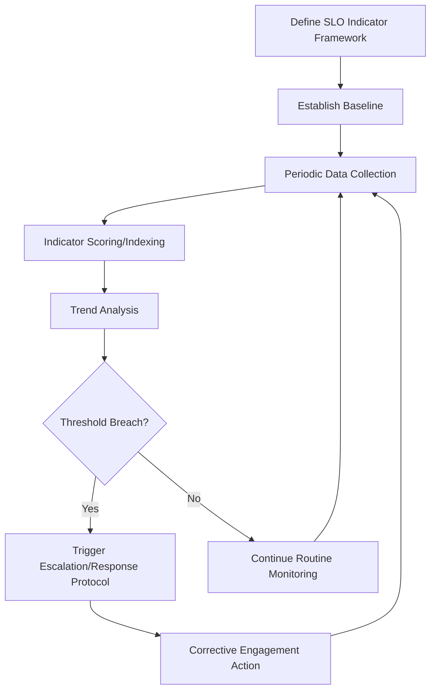
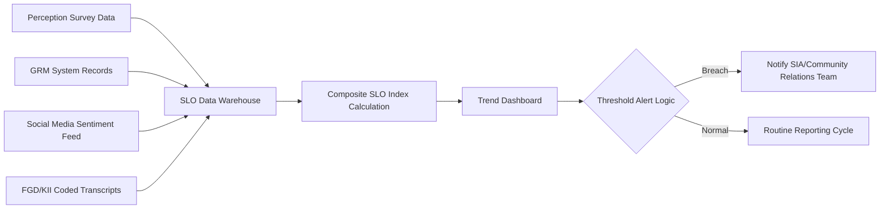

## Measuring and tracking social license over time

### Overview

Measuring and tracking Social License to Operate (SLO) over time refers to the systematic, longitudinal application of quantitative and qualitative indicators to monitor how a project's legitimacy, credibility, and trust standing with stakeholders evolves across its lifecycle. Unlike a one-time SLO assessment conducted during initial Social Impact Assessment (SIA), tracking SLO over time requires a repeatable measurement architecture: consistent indicators, defined data collection intervals, and mechanisms to detect and respond to trend shifts before they escalate into conflict or license withdrawal.

Because SLO is a perception-based, socially granted construct rather than a fixed legal status, it can strengthen or deteriorate at any point in a project's life — making continuous measurement, rather than periodic snapshot assessment alone, a core good-practice requirement.

### Rationale for Longitudinal Measurement

**Key Points**

- SLO is dynamic, not static; a project holding strong SLO at baseline can lose it due to a single incident, a change in company conduct, or shifts in the broader socio-political context
- Early detection of SLO erosion allows for corrective engagement before a formal grievance, protest, or work stoppage occurs
- Longitudinal data supports evidence-based reporting to regulators, financiers (e.g., IFC Performance Standards, Equator Principles lenders), and corporate governance bodies who increasingly require demonstrated ongoing social performance, not just a one-time baseline study
- Enables differentiation between short-term sentiment fluctuation (e.g., temporary construction noise complaints) and structural trust erosion requiring strategic intervention

### Measurement Framework Architecture

#### 1. Indicator Selection

Indicators should map to the legitimacy-credibility-trust hierarchy, combining quantitative (survey-based, administrative) and qualitative (perception-based) measures.

| Component | Example Quantitative Indicators | Example Qualitative Indicators |
| --- | --- | --- |
| Legitimacy | Permit/compliance status, % of consultations following documented protocol | Perceived fairness of consultation process (interview coding) |
| Credibility | % of public commitments fulfilled on schedule, information accuracy verification rate | Community narrative themes around company reliability (from FGDs) |
| Trust | Survey-based trust index score, GRM resolution satisfaction rate | Depth interviews on willingness to engage in partnership activities |
| Composite/behavioral proxies | Attendance rates at voluntary consultations, volume of unsolicited community-initiated contact | Media/social sentiment tone trend |

**Key Points**

- No single indicator is sufficient; SLO measurement frameworks in practice generally triangulate across at least three data types: perception surveys, behavioral/administrative data (e.g., GRM records), and qualitative narrative data
- [Inference] Behavioral proxies (e.g., voluntary attendance at consultations, community-initiated contact) are often treated in practice as more reliable trend signals than stated survey attitudes alone, since they reflect revealed rather than stated preference, though this should be validated against the specific context rather than assumed universally applicable

#### 2. Survey-Based Trust Indexing

A common quantitative approach constructs a composite SLO or trust index from Likert-scale survey items.

$$\text{SLO Index} = \sum_{i=1}^{n} w_i \cdot x_i$$

where $x_i$ is the normalized score for indicator $i$ (e.g., a 1–5 Likert response on "I trust the company to act in the community's interest"), $w_i$ is the weight assigned to that indicator, and $n$ is the total number of indicators in the index. [Inference] Weighting schemes vary by practitioner and context; some frameworks use equal weighting for simplicity and transparency, while others derive weights through factor analysis or expert elicitation — the choice should be documented and justified in the methodology.

**Common validated or widely referenced survey constructs**

- Community-Company trust scales adapted from organizational trust literature (e.g., Mayer, Davis & Schoorman's ability-benevolence-integrity trust model)
- SLO-specific instruments developed in mining/extractives SLO research (e.g., Moffat & Zhang's SLO survey instrument, which models trust and procedural fairness as antecedents of acceptance)
- [Unverified] The specific psychometric validity and reliability statistics of any given SLO survey instrument should be checked against the original published source before adoption, since instrument quality varies

#### 3. Data Collection Methods and Frequency

| Method | Frequency | Strengths | Limitations |
| --- | --- | --- | --- |
| Household/community perception surveys | Annual or bi-annual | Statistically representative if properly sampled | Costly, infrequent, subject to recall/response bias |
| GRM administrative data | Continuous/real-time | Captures actual behavior and issues as they arise | Only reflects those who choose to file grievances |
| Social media/news sentiment monitoring | Continuous | Near-real-time signal, low cost | Sampling bias toward digitally active population |
| Key informant interviews (community leaders) | Quarterly or triggered by events | Rich contextual/qualitative insight | Small sample, potential informant bias |
| Focus group discussions | Periodic (e.g., annually) or triggered | Captures group dynamics and consensus/dissent | Resource-intensive, scheduling constraints |
| Direct observation (attendance, participation rates) | Continuous, tied to project activities | Objective behavioral proxy | Requires consistent event/activity cadence to compare against |

#### 4. Technical Implementation: Monitoring System Architecture

A tracking system operationally combines several previously discussed technical components (social listening, dashboards, GRM systems) into an integrated SLO monitoring pipeline:

- **Data warehouse layer**: consolidates survey exports, GRM database records, sentiment analysis outputs, and coded qualitative data into a common schema with consistent time-stamping and geographic tagging
- **Composite index calculation**: scheduled batch job (e.g., recalculated monthly or quarterly) recomputing the SLO index and its component sub-scores
- **Threshold/alert logic**: rule-based or statistical process control methods (e.g., flagging when an indicator moves beyond a defined number of standard deviations from its rolling baseline) to trigger review
- **Trend dashboard**: time-series visualization of the composite index and component scores, typically disaggregated by geographic unit and demographic segment (see prior dashboard reporting topic)

#### 5. Statistical Considerations for Trend Detection

- **Baseline establishment**: requires a methodologically sound baseline survey conducted before or at the earliest feasible stage of project implementation, since all subsequent trend comparisons are relative to this reference point
- **Sample consistency**: repeated measurement ideally uses consistent or comparable sampling frames (same barangays/households where feasible, or a comparably representative rotating panel) to ensure trend validity rather than artifacts of sample composition change
- **Statistical significance vs. practical significance**: a small numerical shift in a composite index may or may not represent a meaningful change in underlying sentiment; [Inference] practitioners generally apply both statistical thresholds (e.g., confidence intervals around survey estimates) and qualitative corroboration (e.g., matching GRM trend direction) before concluding a genuine SLO shift has occurred, rather than relying on point-estimate changes alone
- **Confounding events**: trend interpretation should account for external confounders (e.g., a national political event, an unrelated industry incident) that may shift sentiment independent of the specific project's conduct

### Practical Example: LGU SLO Tracking System

**Example**

An LGU environmental infrastructure project implements a multi-year SLO tracking system:

1. **Baseline (Year 0)**: Conduct a representative household survey across all affected barangays measuring trust, perceived fairness, and satisfaction; establish baseline GRM categories and expected resolution timelines; conduct baseline social media sentiment scan
2. **Indicator framework**: Define a composite SLO index combining (a) survey-based trust score (40% weight), (b) GRM resolution rate and satisfaction (30% weight), (c) social sentiment trend (20% weight), (d) consultation attendance rate (10% weight) — [Inference] specific weights illustrated here are for demonstration and would need context-specific justification in an actual deployment
3. **Ongoing collection**:
   - GRM data flows continuously into the tracking dashboard
   - Social sentiment analyzed weekly via the social listening pipeline
   - Perception surveys repeated annually with a consistent barangay-level sampling frame
   - Quarterly key informant interviews with barangay captains and civil society representatives
4. **Threshold monitoring**: Alert configured to flag if the composite SLO index drops more than one standard deviation below its trailing 12-month average, or if negative sentiment share exceeds 35% for two consecutive weeks
5. **Response protocol**: A defined escalation pathway routes threshold breaches to the community relations team for review and, where warranted, targeted engagement (e.g., additional consultations, transparency disclosures)

**Output**

- Multi-year SLO index trend chart (see prior dashboard reporting topic for visualization approach) disaggregated by barangay and demographic segment
- Annual SLO status report combining the quantitative index with qualitative narrative synthesis from KIIs/FGDs
- Documented threshold-breach response log demonstrating adaptive management to funders/regulators

### Simplified SLO Tracking Trend Chart (SVG)

<svg xmlns="http://www.w3.org/2000/svg" viewBox="0 0 640 320" font-family="Arial, sans-serif">
<text x="20" y="24" font-size="15" font-weight="bold">Composite SLO Index Over Time (svg_diagram)</text>
<line x1="60" y1="270" x2="600" y2="270" stroke="#333" stroke-width="1.5" />
<line x1="60" y1="50" x2="60" y2="270" stroke="#333" stroke-width="1.5" />
<text x="15" y="55" font-size="11">100</text>
<text x="15" y="160" font-size="11">50</text>
<text x="25" y="272" font-size="11">0</text>
<text x="300" y="300" font-size="12" text-anchor="middle">Project Year</text>

<line x1="60" y1="180" x2="600" y2="180" stroke="#999" stroke-dasharray="4,4" />
<text x="565" y="175" font-size="9" fill="#666">Baseline</text>

<polyline points="60,180 160,175 260,150 360,220 460,205 560,170" fill="none" stroke="#1565c0" stroke-width="2.5" />
<circle cx="360" cy="220" r="4" fill="#c62828" />
<text x="365" y="245" font-size="9" fill="#c62828">Incident: threshold breach</text>

<line x1="60" y1="200" x2="600" y2="200" stroke="#ef9a9a" stroke-dasharray="2,2" />
<text x="565" y="196" font-size="9" fill="#c62828">Alert threshold</text>

<text x="60" y="290" font-size="10" text-anchor="middle">Y0</text>

<text x="160" y="290" font-size="10" text-anchor="middle">Y1</text>

<text x="260" y="290" font-size="10" text-anchor="middle">Y2</text>

<text x="360" y="290" font-size="10" text-anchor="middle">Y3</text>

<text x="460" y="290" font-size="10" text-anchor="middle">Y4</text>

<text x="560" y="290" font-size="10" text-anchor="middle">Y5</text>

</svg>

### Toolchain Summary

| Layer | Open-Source Options | Commercial Options |
| --- | --- | --- |
| Survey data collection | KoboToolbox, ODK (Open Data Kit) | SurveyCTO, Qualtrics |
| Statistical analysis | R (`lme4`, `psych` for factor analysis), Python (`statsmodels`, `pandas`) | SPSS, Stata |
| Data warehouse | PostgreSQL, DuckDB | Snowflake, BigQuery |
| Dashboard/trend visualization | Metabase, Apache Superset, Grafana | Power BI, Tableau |
| Qualitative coding | Taguette, QualCoder | NVivo, ATLAS.ti |
| Alerting/threshold monitoring | Grafana Alerting, custom scripts | Datadog-style monitoring adapted for social metrics |

### Ethical and Methodological Safeguards

- Ensure survey instruments are validated for cultural and linguistic appropriateness in the local context before adoption, rather than directly importing instruments designed for different socio-cultural settings without adaptation
- Maintain consistent, transparent methodology across measurement waves; changes to survey instruments, sampling frames, or index weighting should be documented and, where they affect trend comparability, flagged explicitly in reporting
- Protect respondent confidentiality in longitudinal tracking, particularly where repeated identification of the same respondents/households creates re-identification risk over time
- Avoid using SLO tracking data solely for defensive/reputational purposes; findings indicating declining trust should trigger genuine corrective engagement, not merely narrative reframing in reports
- Disaggregate tracked indicators by demographic and geographic subgroup to avoid masking localized SLO erosion within an acceptable-looking aggregate trend
- Recognize the limits of quantification: a composite index is a decision-support signal, not a complete substitute for ongoing qualitative relationship-building and direct community engagement

### Next Steps

- Survey instrument design and validation for trust/SLO measurement
- Statistical process control methods adapted for social indicator monitoring
- Integration of SLO tracking with Grievance Redress Mechanism (GRM) analytics
- Adaptive management and corrective action protocols in SIA implementation
- Financier/lender social performance reporting requirements (IFC Performance Standards, Equator Principles)
- Qualitative-quantitative triangulation methods in longitudinal social research