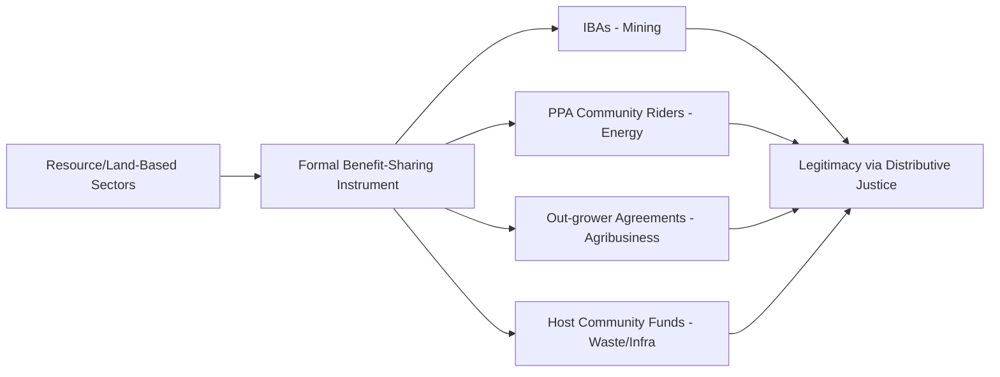

## Comparative social license models across industries

### Overview

Comparative social license models across industries examines how the Social License to Operate (SLO) construct — originally developed within the mining and extractives sector — has been adapted, reinterpreted, and operationalized differently across industries with distinct risk profiles, stakeholder relationships, and impact footprints. While the underlying legitimacy-credibility-trust hierarchy remains broadly applicable, the specific indicators, engagement mechanisms, and risk triggers that define SLO vary substantially between sectors such as mining/extractives, energy/renewables, infrastructure/construction, agriculture/agribusiness, forestry, waste management, and technology/data-driven industries.

Understanding these sectoral variations helps SIA practitioners in a given industry (e.g., LGU infrastructure projects) draw appropriately from cross-sectoral lessons while avoiding uncritical transplantation of frameworks designed for a different risk and relationship context.

### Origins and Cross-Sectoral Diffusion

**Key Points**

- SLO originated in the Canadian and Australian mining sectors in the late 1990s (Joyce and Thomson, 1999) in response to community opposition that persisted despite full regulatory compliance
- The concept diffused to oil and gas, forestry, and hydropower/energy sectors through the 2000s–2010s as these industries faced comparable patterns of community conflict despite legal permit compliance
- More recently, SLO framing has been applied — often more loosely and with less academic rigor — to renewable energy siting, waste management/infrastructure, agribusiness/agricultural land use, aquaculture, and even digital/technology sectors (e.g., data centers, AI/tech infrastructure) facing community or public trust challenges
- [Inference] The core insight that transfers across all sectors is that legal compliance and social acceptance are distinct axes of legitimacy; sectors differ mainly in which additional axis-specific factors (environmental risk perception, land tenure disruption, cultural/sacred site sensitivity, benefit-sharing expectations) dominate the legitimacy calculus

### Sectoral Comparison Framework

| Sector | Primary SLO Risk Drivers | Dominant Trust-Building Mechanisms | Typical SLO Timeframe |
| --- | --- | --- | --- |
| Mining/Extractives | Land/resource displacement, environmental contamination risk, long operational life, boom-bust economic cycles | Revenue-sharing agreements, Impact-Benefit Agreements (IBAs), long-term community development funds | Very long (decades); highest cumulative SLO literature base |
| Oil and Gas / Pipelines | Spill risk perception, land access/easements, indigenous territorial rights | Compensation frameworks, emergency response transparency, FPIC processes | Long; often contested at siting/routing stage |
| Hydropower/Energy Infrastructure | Displacement/resettlement, downstream ecological disruption, land inundation | Resettlement Action Plans (RAPs), livelihood restoration programs | Long; concentrated conflict risk during construction/displacement phase |
| Renewable Energy (wind/solar) | Visual/landscape impact, land use competition with agriculture, perceived inequitable benefit distribution (energy exported vs. local benefit) | Community benefit funds, local ownership/co-investment models, "good neighbor" agreements | Medium; often shorter construction period but persistent visual/land-use tension |
| Agribusiness/Plantation | Land tenure conflict, smallholder displacement, labor conditions, water use competition | Certification schemes (e.g., RSPO for palm oil), out-grower/contract farming schemes | Long; land-based conflicts can persist across generations |
| Forestry/Logging | Deforestation perception, indigenous customary land rights, biodiversity loss concerns | Sustainable forest certification (FSC), community forestry agreements | Long; strong overlap with indigenous rights frameworks |
| Waste Management/Infrastructure (LGU-relevant) | NIMBY ("Not In My Backyard") dynamics, odor/health perception, property value concerns, siting equity | Transparent environmental monitoring, host community compensation/incentive schemes, GRM responsiveness | Medium-long; concentrated tension at siting and early operations |
| Technology/Data Centers | Resource consumption (water, power), noise, land use, algorithmic/data governance trust (for AI-related infrastructure) | Community benefit agreements, environmental transparency reporting | Emerging/short track record; [Unverified] sector-specific SLO norms are still forming and less standardized in academic literature compared to extractives |

[Unverified] Precise comparative timeframes and risk magnitudes vary considerably by specific project context, jurisdiction, and community history; the categorizations above represent general sectoral tendencies documented in SLO and social impact literature rather than fixed rules.

### Model Comparison: Structural Approaches

#### 1. The Boutilier-Thomson Pyramid Model (Mining-Origin, Generalized)

As covered in "Legitimacy, credibility, and trust components," this remains the most widely cited cross-sectoral reference model, applying the legitimacy → credibility → trust hierarchy generically across industries.

#### 2. Benefit-Sharing / Compensation-Centric Models (Extractives, Agribusiness, Energy)

Sectors with significant, quantifiable resource extraction or land-use benefits (mining royalties, energy revenue, agricultural yield) tend to formalize SLO through structured benefit-sharing instruments:

- Impact-Benefit Agreements (IBAs) in mining
- Power Purchase Agreement (PPA) community benefit riders in energy
- Contract farming/out-grower agreements in agribusiness

#### 3. Risk-Perception-Centric Models (Waste, Nuclear, Chemical/Hazardous Facilities)

Sectors where the dominant community concern is health/environmental risk perception (rather than land displacement or benefit distribution) tend to center SLO-building on risk communication and transparency:

- Continuous environmental monitoring with public data access
- Independent/third-party verification of safety claims
- Emergency preparedness and community right-to-know provisions
- [Inference] Risk-perception-centric sectors generally find that procedural transparency and independent verification carry disproportionate weight relative to compensation in building credibility, since the underlying community concern (health/safety) is not directly resolved by financial benefit alone

#### 4. Land Rights and Tenure-Centric Models (Forestry, Agribusiness, Indigenous Territories)

Sectors involving customary or indigenous land tenure center SLO around Free, Prior, and Informed Consent (FPIC) processes and formal recognition of customary rights, often anchored in frameworks such as ILO Convention 169 or, in the Philippines, the Indigenous Peoples' Rights Act (IPRA) of 1997 and the National Commission on Indigenous Peoples (NCIP) Certification Precondition process.

#### 5. Emerging Digital/Technology Sector Models

[Speculation] SLO application to technology infrastructure (data centers, AI compute facilities) is a more recent and less codified extension of the concept; emerging discourse tends to focus on resource consumption transparency (water/energy use disclosure), local economic benefit (jobs, tax revenue) versus perceived limited local benefit from globally-oriented digital services, and — for AI-specific facilities — additional trust dimensions around data governance and algorithmic accountability that do not have a clear precedent in the traditional extractives-derived SLO literature.

### Cross-Sectoral Transferability to LGU/Public Infrastructure Contexts

**Key Points**

- LGU infrastructure projects (roads, waste facilities, water systems, public markets) most closely resemble the **waste management/infrastructure** and **hydropower/resettlement** sectoral patterns when they involve displacement or siting controversy (NIMBY dynamics)
- Unlike private extractive companies, LGUs carry an additional layer of *institutional* legitimacy derived from democratic mandate (elected officials, Sanggunian resolutions) — but this institutional legitimacy does not automatically transfer to project-specific social legitimacy, particularly if the affected community perceives inadequate consultation
- Benefit-sharing mechanisms common in mining (royalty-based community development funds) are less directly transferable to LGU public works, which instead often rely on service-improvement framing (the facility itself as the community benefit) — a distinct legitimacy logic that requires the service benefit to be credibly and equitably delivered to be effective
- [Inference] LGU projects can draw most directly on the waste-management/infrastructure sector's emphasis on transparent environmental monitoring and responsive GRMs, while adapting extractives-sector consultation depth practices (FPIC-style processes) primarily where indigenous peoples or ancestral domain areas are affected

### Practical Example: Cross-Sectoral Lesson Transfer for an LGU Waste Facility

**Example**

An LGU designing SLO strategy for a new sanitary landfill or materials recovery facility can draw structured lessons across sectors:

1. **From mining sector**: Adopt the legitimacy-credibility-trust phased approach and long-term monitoring discipline, recognizing that host community relationships require sustained multi-year investment, not a one-time consultation
2. **From hydropower/resettlement sector**: If any displacement is involved (even minor), adopt Resettlement Action Plan (RAP)-style livelihood restoration planning rather than compensation-only approaches
3. **From waste/risk-perception sector globally**: Implement continuous, publicly accessible environmental monitoring (leachate testing, odor monitoring, groundwater quality) as the primary credibility-building mechanism, since health/environmental risk perception — not land benefit distribution — is the dominant concern for host communities near waste facilities
4. **From renewable energy sector**: Consider a local benefit-sharing instrument (e.g., a host barangay development fund financed by tipping fees) to address the common "we bear the burden, others get the benefit" equity perception associated with centralized waste facilities serving a wider service area
5. **From indigenous/forestry sector** (if applicable): If the site is near ancestral domain areas, integrate NCIP-compliant FPIC processes rather than treating standard LGU public consultation as sufficient

**Output**

- A sector-informed SLO strategy matrix mapping specific cross-sectoral practices to the LGU project's specific risk profile
- Identification of which sectoral model(s) are most analogous to justify practice selection, with documented rationale for practitioners and reviewers

### Simplified Cross-Sectoral SLO Driver Comparison (SVG)

<svg xmlns="http://www.w3.org/2000/svg" viewBox="0 0 640 340" font-family="Arial, sans-serif">
<text x="20" y="24" font-size="15" font-weight="bold">Dominant SLO Risk Driver by Sector (svg_diagram)</text>

<line x1="180" y1="50" x2="180" y2="300" stroke="#333" stroke-width="1" />
<text x="60" y="45" font-size="11" font-weight="bold">Land/Displacement</text>
<text x="320" y="45" font-size="11" font-weight="bold">Risk Perception</text>
<text x="480" y="45" font-size="11" font-weight="bold">Benefit Equity</text>

<text x="20" y="80" font-size="11">Mining</text>

<circle cx="180" cy="76" r="8" fill="`#8d6e63`" />

<circle cx="480" cy="76" r="6" fill="`#8d6e63`" opacity="0.6" />

<text x="20" y="120" font-size="11">Hydropower</text>

<circle cx="180" cy="116" r="9" fill="`#1565c0`" />

<text x="20" y="160" font-size="11">Renewables</text>

<circle cx="480" cy="156" r="8" fill="`#2e7d32`" />

<circle cx="180" cy="156" r="5" fill="`#2e7d32`" opacity="0.5" />

<text x="20" y="200" font-size="11">Waste/Infra (LGU)</text>

<circle cx="320" cy="196" r="9" fill="`#c62828`" />

<circle cx="480" cy="196" r="6" fill="`#c62828`" opacity="0.6" />

<text x="20" y="240" font-size="11">Agribusiness</text>

<circle cx="180" cy="236" r="8" fill="`#f9a825`" />

<text x="20" y="280" font-size="11">Forestry</text>

<circle cx="180" cy="276" r="8" fill="`#33691e`" />

<text x="20" y="320" font-size="9" fill="#666">Circle size indicates relative dominance of that risk driver for the sector (illustrative, not statistically derived)</text>

</svg>

### Toolchain and Reference Frameworks Summary

| Sector Grouping | Key Reference Frameworks/Standards |
| --- | --- |
| Mining/Extractives | ICMM Sustainable Development Framework, IFC Performance Standard 1 |
| Oil and Gas | IPIECA social performance guidance, Equator Principles |
| Hydropower | World Commission on Dams guidelines, IFC PS5 (resettlement) |
| Agribusiness | RSPO, Rainforest Alliance certification standards |
| Forestry | FSC (Forest Stewardship Council) standards |
| Renewable Energy | IRENA community engagement guidance, national feed-in-tariff community benefit rules |
| LGU/Public Infrastructure (Philippines) | Local Government Code provisions on public consultation, DENR environmental compliance processes, NCIP FPIC guidelines where applicable |

### Ethical and Methodological Safeguards

- Avoid uncritically importing a sectoral model without adapting it to the specific power dynamics, regulatory context, and community history of the actual project sector
- Recognize that sectors with more mature SLO literature (mining) also carry a history of well-documented SLO failures; comparative study should draw on both successes and documented failures rather than idealized frameworks alone
- Be cautious extending SLO terminology to sectors (e.g., technology/AI infrastructure) where the concept is still emergent and less empirically validated, clearly flagging such extensions as adapted rather than established practice
- When transferring benefit-sharing instruments across sectors, ensure the transferred mechanism is legally and institutionally feasible within the receiving sector's governance context (e.g., an LGU cannot necessarily replicate a private mining royalty structure without appropriate legal/fiscal authority)

### Next Steps

- Impact-Benefit Agreements (IBAs) and community development fund design
- Resettlement Action Plans (RAPs) and livelihood restoration frameworks
- Free, Prior, and Informed Consent (FPIC) and NCIP certification processes in the Philippines
- Risk communication theory and its application to environmental health perception
- Certification schemes (FSC, RSPO) as legitimacy-signaling mechanisms
- Comparative case study analysis of SLO success and failure across sectors