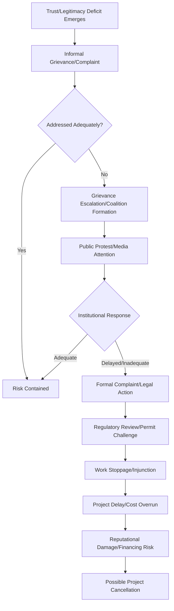

## Risks of social license erosion and project delay

### Overview

Risks of social license erosion and project delay examines the mechanisms by which declining Social License to Operate (SLO) translates into tangible project consequences — schedule delays, cost overruns, work stoppages, litigation, and in severe cases, project cancellation or asset abandonment. Unlike legal/regulatory risk, SLO-related risk operates through informal, socially-mediated pathways: community opposition, reputational damage, and stakeholder coalition-building against a project, even where the project remains fully compliant with formal permits and regulations. Understanding these risk pathways and their quantifiable business/project impact is central to justifying sustained investment in trust-building activities to project proponents and financiers.

### Risk Pathway: From Erosion to Delay

**Key Points**

SLO erosion does not translate into project delay through a single mechanism; it typically escalates through an identifiable sequence of stages, each carrying increasing cost and reputational consequence.

[Inference] While this escalation pathway is commonly observed in documented SLO conflict case studies, not every SLO erosion event follows this full sequence; many are contained at earlier stages through effective grievance response, and the specific triggers and speed of escalation vary considerably by context, project visibility, and the presence of organized advocacy networks.

### Categories of SLO Erosion Risk

#### 1. Legitimacy-Stage Risks

| Risk Trigger | Mechanism | Potential Consequence |
| --- | --- | --- |
| Inadequate or "checkbox" consultation | Community perceives consultation as procedural rather than genuine (see Arnstein's Ladder) | Legal challenge to permit validity on procedural grounds |
| Cultural/normative violation | Project activity disregards local customs, sacred sites, or informal land use norms | Immediate, often intense local opposition regardless of legal compliance |
| Perceived elite capture | Benefits perceived as flowing to local elites/officials rather than broader community | Erosion of legitimacy among excluded subgroups; internal community conflict |
| Non-compliance with FPIC (indigenous contexts) | Failure to secure Free, Prior, and Informed Consent from indigenous peoples where legally or normatively required | Formal NCIP complaint, work stoppage order, international scrutiny (e.g., from financiers applying IFC Performance Standards) |

#### 2. Credibility-Stage Risks

| Risk Trigger | Mechanism | Potential Consequence |
| --- | --- | --- |
| Broken commitments | Public commitments (e.g., in an MOA) not fulfilled on stated timeline | Rapid credibility loss; commitments increasingly viewed with skepticism |
| Information discrepancy | Self-reported data (environmental monitoring, employment figures) contradicted by independent sources | Public accusation of "greenwashing" or misrepresentation; media amplification |
| Inconsistent messaging across representatives | Different company/project representatives provide conflicting information to community members | Confusion and distrust; perception of dishonesty even if unintentional |
| Slow/unresponsive GRM | Grievances filed but not resolved within reasonable, communicated timeframes | Grievants bypass formal GRM in favor of public protest or legal action |

#### 3. Trust-Stage Risks

| Risk Trigger | Mechanism | Potential Consequence |
| --- | --- | --- |
| Incident mismanagement | Environmental or safety incident occurs and is perceived as minimized, delayed in disclosure, or inadequately remediated | Severe, often durable trust collapse; "trust violation" effects are typically asymmetric and slow to repair |
| Leadership/ownership change | Change in company management or project ownership disrupts established relationships | Loss of accumulated relationship capital; community must "re-earn" trust in new representatives |
| External sectoral incidents | A comparable company/project elsewhere experiences a high-profile failure | Generalized distrust by association, even absent any local project fault |
| Perceived betrayal after partnership signals | Community that had reached "identification" level trust experiences a subsequent breach | Disproportionately severe reaction due to the higher relational investment already made |

### Quantifying SLO-Related Project Risk

While company-specific and project-specific figures vary and should not be treated as universally applicable, SLO/social risk research (notably work associated with Franks, Davis, and colleagues on the costs of company-community conflict in the extractives sector) has documented that social conflict-related delays can impose substantial costs through idled capital, extended project timelines, and foregone revenue — figures that are project- and context-specific and should be sourced directly from the relevant primary literature rather than assumed as fixed benchmarks. [Unverified] Given how much these estimates vary by project scale, sector, and study methodology, any specific cost figures the reader may recall from secondary sources should be independently verified against the original published research before citation in formal SIA documentation.

**Cost categories typically affected by SLO-related delay**

$$\text{Total SLO Risk Cost} = C_{\text{idle capital}} + C_{\text{extended schedule}} + C_{\text{legal/regulatory}} + C_{\text{reputational/financing}}$$

where:

- $C_{\text{idle capital}}$ — cost of capital and equipment sitting unused during work stoppages
- $C_{\text{extended schedule}}$ — extended overhead, labor, and financing costs from schedule slippage
- $C_{\text{legal/regulatory}}$ — legal defense costs, regulatory review costs, potential fines
- $C_{\text{reputational/financing}}$ — increased cost of capital, financier withdrawal risk, difficulty securing future permits/projects

[Inference] Because idle capital and extended schedule costs tend to scale with project capital intensity and duration, SLO-related delay risk is generally treated as proportionally more consequential for large, capital-intensive, long-duration projects (mining, hydropower, major infrastructure) than for smaller or shorter-duration interventions — though smaller LGU projects still face meaningful reputational and political risk from SLO erosion.

### Early Warning Indicators

Drawing on the SLO tracking framework (see "Measuring and tracking social license over time"), the following are commonly cited leading indicators of impending SLO erosion, allowing intervention before escalation to formal conflict:

| Indicator Category | Specific Warning Sign |
| --- | --- |
| GRM data | Rising grievance volume, declining resolution rate, repeat complainants on the same unresolved issue |
| Sentiment data | Sustained negative sentiment trend, emergence of coordinated negative hashtag/campaign activity |
| Attendance/participation | Declining voluntary attendance at consultations; boycotts of official engagement events |
| Coalition signals | Formation of new civil society groups or alliances explicitly opposing the project |
| Media coverage | Shift from neutral/factual reporting to investigative or critical framing |
| Institutional signals | Local government officials publicly distancing themselves from prior project support |
| Elite/leadership signals | Previously supportive community leaders becoming publicly neutral or critical |

### Practical Example: Risk Monitoring for an LGU Infrastructure Project

**Example**

An LGU implementing a road-widening project with associated minor resettlement integrates SLO erosion risk monitoring into its SIA implementation plan:

1. **Risk register**: Document identified legitimacy, credibility, and trust risk triggers specific to the project (e.g., risk of perceived inadequate compensation for informal settlers, risk of construction-phase traffic disruption complaints)
2. **Leading indicator dashboard**: Extend the SIA monitoring dashboard (see prior topic) with an explicit "early warning" panel tracking GRM volume trend, sentiment trend, and consultation attendance trend against defined thresholds
3. **Escalation protocol**: Define a tiered response protocol:
   - Tier 1 (routine): Standard GRM processing within committed timelines
   - Tier 2 (elevated): Sentiment or grievance volume threshold breached — triggers additional community dialogue session within a defined number of days
   - Tier 3 (critical): Coalition formation or media escalation detected — triggers senior management/LGU executive engagement and revised communication strategy
4. **Post-incident review**: If an escalation occurs, conduct a structured review identifying which legitimacy/credibility/trust factor failed, to inform revised engagement practice for subsequent project phases

**Output**

- A documented SLO risk register mapped to the project's specific vulnerabilities
- An early-warning dashboard panel with defined threshold-triggered escalation tiers
- A post-incident review template for organizational learning after any SLO erosion event

### Simplified Risk Escalation Cost Curve (SVG)

<svg xmlns="http://www.w3.org/2000/svg" viewBox="0 0 640 320" font-family="Arial, sans-serif">
<text x="20" y="24" font-size="15" font-weight="bold">Cost of Intervention vs. Escalation Stage (svg_diagram)</text>
<line x1="60" y1="270" x2="600" y2="270" stroke="#333" stroke-width="1.5" />
<line x1="60" y1="50" x2="60" y2="270" stroke="#333" stroke-width="1.5" />
<text x="10" y="60" font-size="10">High</text>
<text x="10" y="272" font-size="10">Low</text>
<text x="20" y="35" font-size="11" transform="rotate(0)">Cost</text>
<text x="300" y="300" font-size="12" text-anchor="middle">Escalation Stage</text>

<polyline points="80,260 180,250 280,220 380,160 480,90 560,55" fill="none" stroke="#c62828" stroke-width="3" />

<text x="80" y="290" font-size="9" text-anchor="middle">Early signal</text>

<text x="180" y="290" font-size="9" text-anchor="middle">Grievance</text>

<text x="280" y="290" font-size="9" text-anchor="middle">Coalition</text>

<text x="380" y="290" font-size="9" text-anchor="middle">Protest</text>

<text x="480" y="290" font-size="9" text-anchor="middle">Legal action</text>

<text x="560" y="290" font-size="9" text-anchor="middle">Work stoppage</text>

<circle cx="80" cy="260" r="5" fill="#2e7d32" />
<circle cx="180" cy="250" r="5" fill="#9e9e9e" />
<circle cx="280" cy="220" r="5" fill="#f9a825" />
<circle cx="380" cy="160" r="5" fill="#ef6c00" />
<circle cx="480" cy="90" r="5" fill="#c62828" />
<circle cx="560" cy="55" r="5" fill="#b71c1c" />

<text x="90" y="245" font-size="9" fill="`#2e7d32`">Lowest cost to address</text>

<text x="420" y="145" font-size="9" fill="`#c62828`">Highest cost to address</text>

</svg>

### Toolchain Summary

| Function | Open-Source Options | Commercial Options |
| --- | --- | --- |
| GRM/grievance tracking | Open-source ticketing systems (e.g., Zammad), custom database (PostgreSQL) | Salesforce-based GRM modules, dedicated SIA software (e.g., Ulula) |
| Sentiment/social monitoring | VADER, custom NLP pipeline (see social listening topic) | Brandwatch, Meltwater |
| Risk register/dashboard | Spreadsheet-based register with Metabase/Superset visualization | Enterprise risk management (ERM) platforms |
| Statistical threshold alerting | Custom Python/R scripts, Grafana Alerting | Datadog-style monitoring adapted for social indicators |

### Ethical and Methodological Safeguards

- Avoid framing SLO risk monitoring purely as a tool for anticipating and neutralizing opposition; the underlying purpose should be genuine early identification and resolution of legitimate community concerns, not suppression of dissent
- Ensure early-warning systems do not become a basis for surveilling or targeting individual community members or activists; monitoring should focus on aggregate sentiment/grievance patterns, not identifying specific dissenting individuals for retaliatory purposes
- Recognize that some community opposition reflects legitimate, well-founded concerns rather than a "risk" to be managed away; escalation response protocols should include genuine reassessment of project design or terms, not solely communication/messaging responses
- Disclose material SLO-related risks transparently in regulatory and financier reporting rather than minimizing documented erosion signals
- Ensure post-incident reviews are used for genuine organizational learning and corrective action, not solely for reputational risk containment

### Next Steps

- Grievance Redress Mechanism (GRM) design and escalation protocols
- Cost-of-conflict research methodology in extractives and infrastructure sectors
- Crisis communication and incident disclosure best practices
- Coalition and civil society mapping techniques
- Financier social risk due diligence (IFC Performance Standards, Equator Principles)
- Adaptive project design as a risk response strategy (beyond communications-only responses)