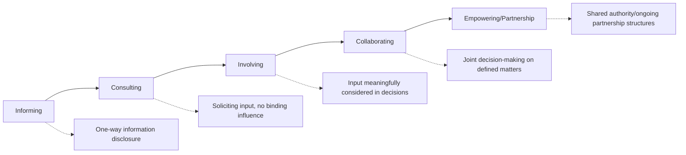
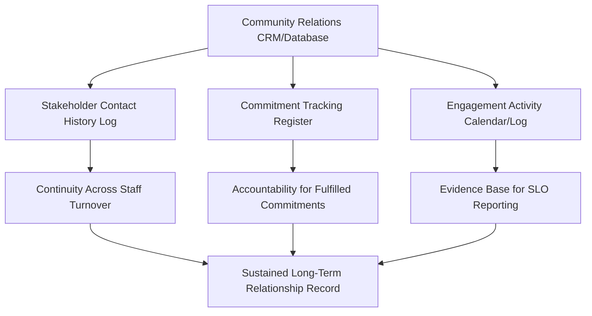

## Relationship-building and long-term trust strategies

### Overview

Relationship-building and long-term trust strategies encompass the deliberate, sustained practices through which project proponents cultivate and maintain positive, durable relationships with affected communities and stakeholders across the full project lifecycle. Where the preceding topics addressed *what* Social License to Operate (SLO) consists of, *how* to measure it, and *what happens when it erodes*, this topic addresses the proactive, operational strategies used to actively build and sustain trust — moving beyond reactive grievance management toward genuine, long-term relational investment.

Effective relationship-building strategies treat trust not as a byproduct of compliance activities but as a deliberate outcome requiring dedicated resources, consistent practice, and organizational commitment across the project's full duration.

### Foundational Principles of Long-Term Trust Strategy

**Key Points**

- Trust-building is a continuous process, not a discrete project phase; strategies designed only for the pre-construction consultation period tend to leave credibility and trust vulnerable during longer operational phases
- Relationship investment should be proportional to project duration and impact magnitude — a decades-long facility (e.g., a landfill, power plant) warrants a fundamentally different relationship-building cadence than a short-term construction project
- Consistency of personnel and institutional memory matters: frequent turnover in community relations staff disrupts accumulated relational trust, requiring new staff to "re-earn" credibility
- Genuine relationship-building requires the organization to be prepared to adapt project design or terms in response to community input, not solely to communicate more effectively about a fixed plan
- [Inference] Because trust accumulates slowly and asymmetrically (as covered in the legitimacy-credibility-trust topic), sustained, small, consistent positive interactions over time are generally considered more effective for durable trust-building than large, infrequent gestures, though both have documented roles in SLO literature

### Strategic Framework: The Engagement-Trust Continuum

Drawing on Arnstein's Ladder of Citizen Participation and subsequent participation typologies, long-term trust strategies map to progressively deeper forms of engagement:

**Key Points**

- Long-term trust strategies aim to progress relationships along this continuum over time, rather than remaining fixed at "informing" or "consulting" throughout the project life
- Community perception of *where* on this continuum the actual practice sits (versus where the company claims it sits) is itself a credibility indicator — a project that claims "collaboration" but practices only "informing" risks a credibility gap that accelerates trust erosion
- Reaching "empowering/partnership" level engagement is not always necessary or appropriate for every project context, but the strategic intent should be to move as far along the continuum as the project's nature and community preference allow, rather than defaulting to minimum-compliance consultation

### Core Relationship-Building Mechanisms

#### 1. Structured Ongoing Engagement Platforms

| Mechanism | Function | Typical Cadence |
| --- | --- | --- |
| Community Liaison Officer (CLO) / dedicated community relations staff | Consistent, accessible single point of contact embedded in or near the community | Continuous, on-site presence |
| Community Advisory Panel/Committee | Standing body of community representatives providing ongoing input and oversight | Monthly/quarterly meetings |
| Multi-stakeholder oversight/monitoring committee | Joint body (company, LGU, community, sometimes academic/NGO) overseeing specific commitments (e.g., environmental monitoring) | Quarterly or per-milestone |
| Open-door/walk-in office hours | Low-barrier, informal access point for community members to raise concerns directly | Weekly or as scheduled |
| Community bulletin/newsletter | Regular, plain-language project update communication | Monthly/quarterly |

#### 2. Transparency and Information-Sharing Practices

- **Proactive disclosure** of monitoring data, project changes, and incidents — including unfavorable information — rather than only responding to specific inquiries
- **Consistent, plain-language communication** avoiding technical jargon that can be perceived as obfuscation
- **Multi-channel communication** accounting for local media consumption patterns (radio, barangay bulletin boards, social media, SMS/text blast systems, in-person town halls) to reach populations with varying digital access
- **Two-way feedback loops**: mechanisms that close the loop by reporting back to the community on how their input was used or why it was not incorporated, rather than one-directional information sharing

#### 3. Formalized Partnership and Co-Governance Structures

- **Joint monitoring committees**: community representatives trained and included in actual environmental or social monitoring activities (community-based monitoring), which builds both technical trust and a sense of shared ownership over data credibility
- **Community development fund governance boards**: where benefit-sharing funds exist, giving community representatives real decision-making authority (not merely advisory input) over fund allocation
- **Local employment and procurement pipelines**: structured programs (not ad hoc hiring) that create tangible, visible economic interdependence between the project and local community, reinforcing "identification-based trust"

#### 4. Cultural and Relational Investment Practices

- **Participation in community life** beyond formal project business (e.g., supporting local events, respecting local customs and decision-making protocols) — [Inference] such practices are generally understood in SLO literature as contributing to interactional and social legitimacy, though their effectiveness depends heavily on being perceived as genuine rather than performative
- **Working through recognized local governance structures** (barangay councils, indigenous councils, cooperative leadership) rather than bypassing them, which reinforces rather than undermines existing community legitimacy structures
- **Long-term staff/leadership continuity** in community-facing roles, recognizing that relational trust is often personally embodied in specific individuals as well as institutionally held

### Technical/Systems Support for Relationship-Building

While relationship-building is fundamentally a human and organizational practice, digital systems support and sustain it operationally:

- **Community relations CRM**: a structured database (which can be a module within a broader document management system such as `batac-dms`) logging every stakeholder interaction, commitment made, and its fulfillment status — critical for maintaining institutional memory despite staff turnover
- **Commitment tracking register**: a specific, auditable log of every public commitment made (in MOAs, public hearings, community meetings) with fulfillment status and evidence, directly supporting the credibility component of SLO
- **Engagement calendar/activity log**: systematic scheduling and documentation of ongoing engagement activities, providing both operational consistency and an evidence base for SLO reporting to regulators/financiers

### Practical Example: LGU Long-Term Trust Strategy for an Ongoing Facility

**Example**

An LGU operating a long-duration public facility (e.g., a sanitary landfill with a multi-decade operational life) implements a structured relationship-building strategy:

1. **Dedicated staffing**: Assign a permanent Community Liaison Officer role (not a rotating assignment) based in or near the host barangay, with continuity prioritized across administrative transitions
2. **Standing oversight body**: Establish a Multi-Partite Monitoring Team (a Philippine DENR-recognized mechanism for environmentally critical projects) including host barangay representatives, giving the community a formal, ongoing oversight role in environmental compliance monitoring
3. **Commitment tracking**: Implement a commitment register (within the LGU's document management system) logging every public commitment made during consultations, with quarterly public reporting on fulfillment status
4. **Transparent monitoring access**: Provide the Multi-Partite Monitoring Team and broader community with regular, understandable access to environmental monitoring data (not only technical reports, but plain-language summaries)
5. **Local benefit structures**: Establish a host community development fund (financed through tipping fees or similar mechanisms) with a governance board including genuine community representative decision-making authority, not solely advisory input
6. **Feedback loop closure**: Institute a practice of publicly reporting back on how community input from consultations and the monitoring team influenced actual operational decisions, even when input could not be fully incorporated

**Output**

- An institutionalized community relations function embedded in the LGU's organizational structure, not dependent on any single individual
- A public commitment tracking register demonstrating accountability over time
- A functioning co-governance body (Multi-Partite Monitoring Team) providing structural, ongoing community oversight
- Documented evidence base (interaction logs, fulfillment records) supporting both SLO measurement (see prior topic) and regulatory/financier reporting

### Simplified Engagement-to-Trust Continuum Diagram (SVG)

<svg xmlns="http://www.w3.org/2000/svg" viewBox="0 0 640 300" font-family="Arial, sans-serif">
<text x="20" y="24" font-size="15" font-weight="bold">Engagement Depth vs. Trust Level Achieved (svg_diagram)</text>
<line x1="60" y1="250" x2="600" y2="250" stroke="#333" stroke-width="1.5" />
<line x1="60" y1="50" x2="60" y2="250" stroke="#333" stroke-width="1.5" />
<text x="300" y="280" font-size="12" text-anchor="middle">Engagement Depth (Arnstein-style continuum)</text>

<rect x="70" y="220" width="80" height="30" fill="#ef9a9a" />
<text x="110" y="240" font-size="9" text-anchor="middle" fill="#333">Informing</text>
<rect x="160" y="195" width="80" height="55" fill="#ffcc80" />
<text x="200" y="225" font-size="9" text-anchor="middle" fill="#333">Consulting</text>
<rect x="250" y="160" width="80" height="90" fill="#fff59d" />
<text x="290" y="205" font-size="9" text-anchor="middle" fill="#333">Involving</text>
<rect x="340" y="115" width="80" height="135" fill="#a5d6a7" />
<text x="380" y="180" font-size="9" text-anchor="middle" fill="#333">Collaborating</text>
<rect x="430" y="70" width="90" height="180" fill="#66bb6a" />
<text x="475" y="160" font-size="9" text-anchor="middle" fill="#fff">Empowering /</text>
<text x="475" y="172" font-size="9" text-anchor="middle" fill="#fff">Partnership</text>

<text x="15" y="55" font-size="10">High</text>

<text x="15" y="252" font-size="10">Low</text>

<text x="15" y="150" font-size="10" transform="rotate(-90 15 150)" />

</svg>

### Toolchain Summary

| Function | Open-Source Options | Commercial Options |
| --- | --- | --- |
| Community relations CRM | Custom-built module (e.g., within a Django/PostgreSQL LGU document management system), CiviCRM (adapted) | Salesforce Nonprofit/Community Cloud, dedicated stakeholder engagement platforms (e.g., Ulula, Simply Stakeholders) |
| Commitment tracking | Spreadsheet-based register with version control, custom database table | Enterprise commitment/action tracking modules |
| Communication/outreach | Mailchimp (newsletters), SMS gateway APIs (e.g., Semaphore for Philippine SMS) | Dedicated stakeholder communication platforms |
| Meeting/engagement scheduling | Open-source calendar tools (Nextcloud Calendar) | Scheduling platforms integrated with CRM |

### Ethical and Methodological Safeguards

- Ensure co-governance and partnership structures (advisory panels, monitoring committees) include genuinely representative membership, avoiding capture by a narrow set of elite or pre-selected community representatives
- Avoid relationship-building activities that function as one-way relationship management without genuine willingness to adapt project decisions based on community input; performative "engagement theater" is generally recognized in SLO literature as accelerating rather than preventing trust erosion once identified as such
- Maintain continuity plans for community-facing staff transitions, including structured handover of relationship history and context, to minimize relational trust loss during personnel changes
- Ensure local benefit and employment structures are implemented equitably across community subgroups, avoiding reinforcement of existing local inequalities or elite capture of benefits
- Recognize the resource and time commitment genuine long-term relationship-building requires, and avoid underfunding community relations functions relative to their demonstrated importance in preventing costlier downstream conflict

### Next Steps

- Arnstein's Ladder of Citizen Participation and participation typology frameworks
- Community-based environmental monitoring program design
- Multi-Partite Monitoring Team structures (Philippine DENR context)
- Commitment tracking and accountability system design
- Community development fund governance models
- Staff continuity and institutional memory management in community relations functions