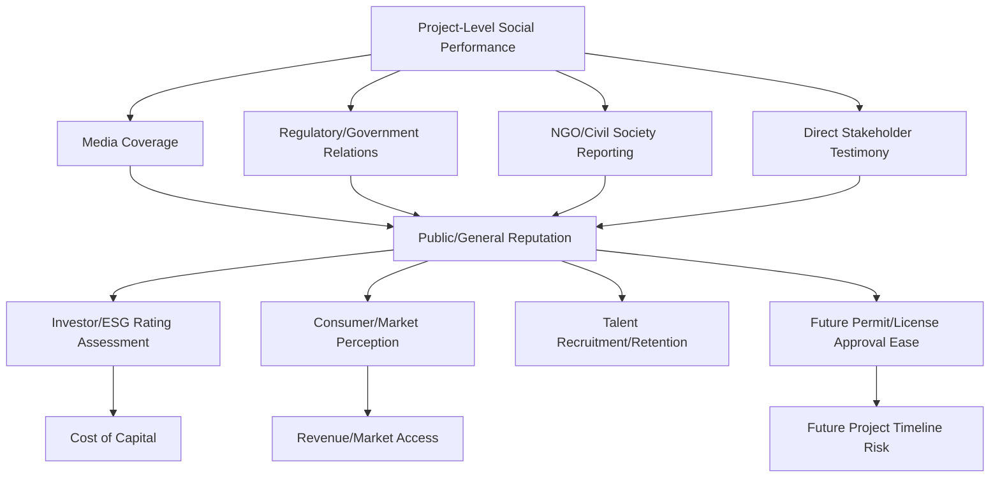

## Linking social performance to corporate reputation

### Overview

Linking social performance to corporate reputation examines how an organization's demonstrated conduct toward affected communities and stakeholders — its Social License to Operate (SLO) standing, social impact management practices, and grievance handling — translates into broader reputational capital that extends beyond any single project site. While Social License to Operate is typically conceptualized at the project or facility level, corporate reputation operates at the organizational, sectoral, and sometimes national level, mediated through media coverage, investor/financier assessments, regulatory relationships, sustainability ratings, and public perception. This topic addresses the mechanisms, measurement approaches, and strategic implications of that linkage.

### Distinguishing Project-Level SLO from Corporate Reputation

**Key Points**

- SLO is typically site-specific and stakeholder-specific (a community's relationship with a particular facility), whereas corporate reputation is an aggregate, cross-site, cross-stakeholder perception of the organization as a whole
- A company can hold strong SLO at one site while suffering reputational damage from conduct at another site — reputation effects generalize across a company's portfolio in ways that individual-site SLO does not automatically transfer
- Conversely, strong aggregate corporate reputation (e.g., from broad ESG performance) does not guarantee SLO at any specific new project site; local communities generally assess trust based on direct experience and site-specific engagement rather than solely on a company's general reputation
- [Inference] Given this asymmetry, corporate reputation and site-level SLO are better understood as related but distinct constructs — corporate reputation can amplify the consequences of an SLO failure at one site (through cross-site reputational contagion) without substituting for the relational work required to establish SLO at any individual site

### Mechanisms Linking Social Performance to Reputation

#### 1. Media and Public Discourse Channel

Social performance failures (or successes) at a specific site are reported through local, national, and increasingly international media, shaping aggregate public perception of the parent organization. Negative coverage of one site's community conflict can attach to the corporate brand as a whole, particularly for companies with recognizable consumer-facing brands or high public visibility.

#### 2. ESG and Sustainability Rating Channel

Environmental, Social, and Governance (ESG) rating agencies and sustainability indices incorporate social performance indicators — often including documented community conflict, grievance mechanisms, and human rights due diligence — into corporate-level ratings that influence investor decisions.

| Rating/Framework | Relevant Social Performance Inputs |
| --- | --- |
| MSCI ESG Ratings | Community relations controversies, stakeholder opposition incidents |
| Sustainalytics | Social capital risk exposure, controversy tracking |
| Dow Jones Sustainability Index | Corporate citizenship and philanthropy, human rights policies |
| GRI (Global Reporting Initiative) Standards | Standardized social impact disclosure metrics used in sustainability reporting |
| IFC Performance Standards compliance (for financed projects) | Directly ties financing continuation to social performance compliance |

[Unverified] The specific weighting methodologies and data sources used by individual ESG rating agencies are proprietary and vary between providers; organizations seeking to understand their specific rating exposure should consult the relevant rating provider's published methodology directly rather than relying on generalized assumptions.

#### 3. Financier and Investor Due Diligence Channel

Development finance institutions and increasingly commercial lenders applying the Equator Principles require environmental and social due diligence, including SLO-related risk assessment, as a condition of financing. Documented social conflict or grievance mismanagement at any project site can affect an organization's ability to secure financing for future projects, independent of that future project's own merits.

#### 4. Regulatory and Government Relations Channel

Regulators and government bodies may factor a company's track record of social performance into future permit approvals, license renewals, or contract awards — particularly relevant for LGU or government-facing organizations where past project conduct informs future procurement or partnership decisions.

#### 5. Talent and Organizational Culture Channel

[Inference] Corporate reputation for social performance is increasingly understood to affect talent recruitment and retention, particularly among younger professional cohorts who weight organizational social/environmental conduct in employment decisions, though the magnitude of this effect varies by sector, geography, and is less rigorously quantified in the literature compared to financial/regulatory reputation channels.

### Reputation Risk Amplification Dynamics

**Key Points**

- **Cross-site contagion**: a well-publicized SLO failure at one site can trigger heightened scrutiny, stakeholder skepticism, and even opposition at otherwise unrelated project sites operated by the same organization
- **Velocity of digital amplification**: social media and digital news distribution significantly accelerate the speed at which a localized incident becomes a reputational issue at national or international scale, compressing the response time available before reputational damage compounds
- **Asymmetric memory**: negative reputational events tend to be recalled and referenced disproportionately relative to positive social performance, consistent with broader risk perception and reputation literature (loss aversion in perception)
- **Sectoral reputation spillover**: reputational damage from one company's failure can affect perception of the entire sector or industry, creating a shared reputational interest among sector peers in collective social performance standards (part of the rationale behind sector-wide certification schemes like RSPO or FSC, discussed in the comparative sectoral models topic)

### Measurement Approaches

#### 1. Media Sentiment and Share of Voice Analysis

Extending the social media listening and sentiment analysis techniques (covered earlier in this course) to corporate-level (rather than project-level) media monitoring, tracking:

- Overall sentiment trend in coverage mentioning the organization by name
- "Share of voice" — proportion of coverage that is social-performance-related versus other business topics
- Comparative sentiment benchmarking against sector peers

#### 2. Reputation Index Construction

$$\text{Reputation Score} = \alpha \cdot S_{\text{media}} + \beta \cdot S_{\text{esg}} + \gamma \cdot S_{\text{stakeholder}} + \delta \cdot S_{\text{regulatory}}$$

where $S_{\text{media}}$, $S_{\text{esg}}$, $S_{\text{stakeholder}}$, and $S_{\text{regulatory}}$ represent normalized sub-scores from media sentiment, ESG ratings, direct stakeholder survey data, and regulatory relationship indicators respectively, with $\alpha, \beta, \gamma, \delta$ as context-specific weights. [Inference] As with the SLO index discussed previously, weighting methodology should be explicitly documented and justified, since different weighting choices can produce materially different aggregate reputation assessments from the same underlying data.

#### 3. Controversy/Incident Tracking Databases

Systematic logging of documented social performance incidents (grievances escalated to formal complaints, media exposés, regulatory sanctions, financier covenant breaches) across an organization's full project portfolio, enabling trend analysis of reputation-relevant events over time and across sites.

### Practical Example: LGU/Government Reputation Considerations

**Example**

While corporate reputation frameworks are most developed for private companies, analogous dynamics apply to government agencies and LGUs, which face reputational consequences affecting future project approval, public trust in governance, and electoral accountability:

1. **Cross-project reputational linkage**: An LGU's handling of social impact for one infrastructure project (e.g., a contentious resettlement) can affect public and stakeholder trust in the LGU's conduct of subsequent, unrelated projects, even under different project teams or administrations
2. **Media and civil society monitoring**: Track local and national media coverage plus civil society/NGO reporting on the LGU's social performance track record across its portfolio of public works projects
3. **Institutional memory systems**: Maintain a cross-project incident and commitment-fulfillment log (potentially within a document management system such as `batac-dms`) so that reputational lessons from one project inform SIA practice on subsequent projects, rather than each project team starting without access to prior track record data
4. **Transparent public reporting**: Publish aggregate, LGU-wide social performance summaries (e.g., annual GRM resolution rates across all active projects) to proactively demonstrate accountability rather than relying on ad hoc, project-specific disclosure alone
5. **Electoral/political dimension**: [Inference] Because LGU leadership is subject to electoral accountability, social performance reputation carries a distinct political dimension not present for private corporations, where sustained community grievances can directly affect electoral outcomes for incumbent officials, providing an additional (though not purely technical) incentive structure for sustained social performance investment

**Output**

- A cross-project social performance tracking system providing institutional memory beyond individual project timelines or administrations
- Aggregate public reporting demonstrating LGU-wide accountability
- Documented linkage between project-level SIA/GRM data and broader institutional reputation monitoring

### Simplified Reputation Linkage Diagram (SVG)

<svg xmlns="http://www.w3.org/2000/svg" viewBox="0 0 640 340" font-family="Arial, sans-serif">
<text x="20" y="24" font-size="15" font-weight="bold">Project-Level Performance to Corporate Reputation (svg_diagram)</text>

<circle cx="100" cy="100" r="30" fill="#1565c0" />
<text x="100" y="105" font-size="9" fill="#fff" text-anchor="middle">Site A</text>
<circle cx="100" cy="200" r="30" fill="#2e7d32" />
<text x="100" y="205" font-size="9" fill="#fff" text-anchor="middle">Site B</text>
<circle cx="100" cy="300" r="30" fill="#c62828" />
<text x="100" y="305" font-size="9" fill="#fff" text-anchor="middle">Site C</text>

<line x1="130" y1="100" x2="300" y2="180" stroke="#999" stroke-width="1.5" />
<line x1="130" y1="200" x2="300" y2="190" stroke="#999" stroke-width="1.5" />
<line x1="130" y1="300" x2="300" y2="200" stroke="#999" stroke-width="1.5" />

<circle cx="340" cy="190" r="45" fill="#616161" />
<text x="340" y="185" font-size="10" fill="#fff" text-anchor="middle">Corporate</text>
<text x="340" y="198" font-size="10" fill="#fff" text-anchor="middle">Reputation</text>

<line x1="385" y1="170" x2="520" y2="100" stroke="#999" stroke-width="1.5" />
<line x1="385" y1="190" x2="520" y2="190" stroke="#999" stroke-width="1.5" />
<line x1="385" y1="210" x2="520" y2="280" stroke="#999" stroke-width="1.5" />
<rect x="520" y="80" width="100" height="40" rx="4" fill="#e3f2fd" stroke="#1565c0" />
<text x="570" y="104" font-size="9" text-anchor="middle">ESG Rating/</text>
<text x="570" y="114" font-size="9" text-anchor="middle">Cost of Capital</text>
<rect x="520" y="170" width="100" height="40" rx="4" fill="#fff3e0" stroke="#ef6c00" />
<text x="570" y="194" font-size="9" text-anchor="middle">Future Permit/</text>
<text x="570" y="204" font-size="9" text-anchor="middle">Approval Ease</text>
<rect x="520" y="260" width="100" height="40" rx="4" fill="#fce4ec" stroke="#c62828" />
<text x="570" y="284" font-size="9" text-anchor="middle">Public/Market</text>
<text x="570" y="294" font-size="9" text-anchor="middle">Perception</text>
</svg>

### Toolchain Summary

| Function | Open-Source Options | Commercial Options |
| --- | --- | --- |
| Media/reputation monitoring | Custom NLP pipeline extending social listening tools (spaCy, transformers, VADER) | Brandwatch, Meltwater, Signal AI |
| ESG data tracking | Manual compilation against public rating methodologies | MSCI ESG Manager, Sustainalytics platform access |
| Incident/controversy database | Custom database (PostgreSQL) with structured incident taxonomy | Enterprise GRC (Governance, Risk, Compliance) platforms |
| Cross-project institutional memory | Document management system module (e.g., extension of `batac-dms`) | Enterprise content management with cross-project tagging |

### Ethical and Methodological Safeguards

- Avoid treating reputation management as a substitute for genuine social performance improvement; strategies that optimize perception without corresponding substantive change risk detection and disproportionate credibility loss when exposed (a documented "greenwashing backlash" dynamic)
- Ensure internal reputation risk monitoring does not incentivize suppression or non-disclosure of legitimate community grievances to protect aggregate reputation metrics
- Recognize the ethical distinction between managing reputation as a business risk versus genuinely accountable social performance; SIA practitioners should advocate for the latter as the primary objective, with reputational benefit as a secondary, consequential outcome rather than the driving purpose
- For government/LGU contexts, be attentive to the risk that reputation management incentives could conflict with transparent public accountability obligations, which carry a different ethical standard than private corporate reputation management
- Maintain clear separation between legitimate transparent reporting of social performance and public relations framing that selectively emphasizes favorable data while obscuring unfavorable findings

### Next Steps

- ESG rating methodologies and corporate sustainability disclosure standards (GRI, SASB)
- Equator Principles and development finance institution social due diligence requirements
- Crisis communication and reputational risk management frameworks
- Cross-project institutional memory systems for social performance tracking
- Greenwashing detection and accountability frameworks
- Public sector accountability and transparency mechanisms distinct from private corporate reputation management