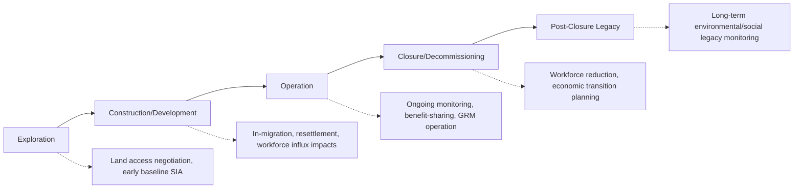
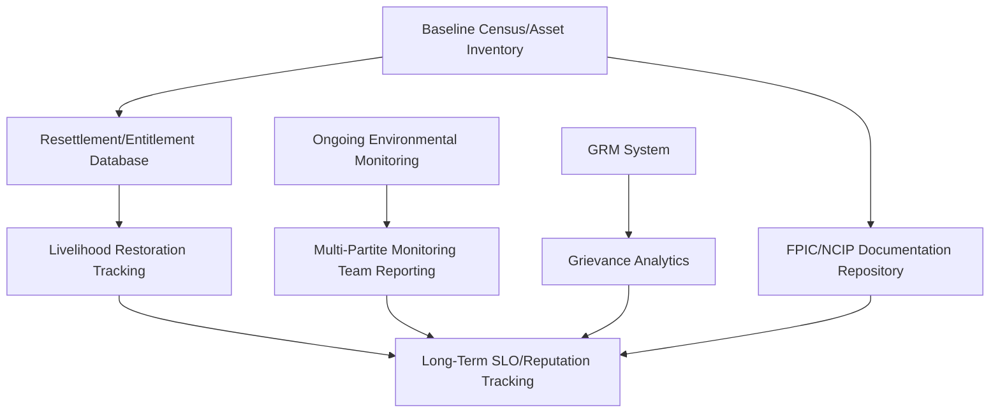

## Extractive industries including mining, oil, and gas

### Overview

Extractive industries — mining, oil, and gas — represent the sector in which Social Impact Assessment (SIA) and Social License to Operate (SLO) concepts were originally developed and most extensively documented. These industries are characterized by significant land and resource footprints, long operational lifespans (often decades), substantial capital intensity, and frequently occur in remote areas with indigenous populations, customary land tenure systems, and limited pre-existing infrastructure. This sectoral profile produces a distinctive set of SIA methodological requirements, risk patterns, and stakeholder engagement practices that differ meaningfully from other sectors covered elsewhere in this course.

### Sectoral Characteristics Shaping SIA Approach

**Key Points**

- **Long project lifecycle**: extractive projects typically span exploration, construction, operation (often 15–40+ years), and closure/decommissioning phases, each with distinct social impact profiles requiring phase-specific SIA methodologies
- **Boom-bust economic dynamics**: local economies often experience rapid in-migration and economic activity during construction/early operation, followed by economic contraction at closure — creating distinctive social impact patterns (housing pressure, service strain, then post-closure economic vulnerability) not typical of shorter-duration projects
- **High land/resource footprint**: mining and oil/gas extraction frequently require large exclusive-use land areas, subsurface rights, and can involve significant displacement, resettlement, or restriction of access to customary land and resources
- **Remote/frontier locations**: many extractive projects operate in areas with limited pre-existing government service delivery, placing informal pressure on the company to provide quasi-governmental services (roads, health, education) — creating dependency dynamics distinct from urban infrastructure projects
- **High-profile environmental risk**: tailings management, spill risk, water table impacts, and biodiversity loss carry significant risk-perception weight, directly shaping the credibility and trust dynamics covered in earlier chapter topics

### Phase-Specific Social Impact Considerations

| Phase | Key Social Risks | SIA Focus |
| --- | --- | --- |
| Exploration | Early trust establishment, land access disputes, unclear future project scope creating community uncertainty | Baseline data collection, initial stakeholder mapping |
| Construction/Development | Workforce in-migration, "man camp" social impacts (including gender-based violence risk in some documented contexts), housing/service strain, resettlement | Resettlement Action Plans (RAPs), influx management plans |
| Operation | Ongoing environmental monitoring credibility, benefit-sharing delivery, GRM function, community dependency dynamics | Continuous SLO tracking (per earlier chapter topics), livelihood restoration monitoring |
| Closure/Decommissioning | Workforce/economic contraction, loss of company-provided services, environmental legacy concerns | Closure/transition planning, post-closure land use planning |
| Post-closure | Long-term environmental monitoring, historical grievance resolution, economic diversification legacy | Legacy monitoring, historical accountability mechanisms |

[Inference] Because extractive projects frequently outlast the specific personnel, and sometimes the specific corporate ownership, present at project initiation, phase-transition planning — particularly for closure — is generally considered a distinct and often underweighted SIA discipline requiring social impact planning that begins well before the actual closure phase, not merely at its onset.

### Distinctive SIA Methodological Requirements

#### 1. Resettlement Action Plans (RAPs)

Extractive projects requiring physical or economic displacement typically require formal RAPs, most commonly structured around IFC Performance Standard 5 (Land Acquisition and Involuntary Resettlement) or the World Bank's analogous standard.

**Core RAP components**

- Census and asset inventory of affected persons/households
- Entitlement matrix defining compensation and assistance by impact category
- Livelihood restoration strategy (not compensation alone, but demonstrated restoration of pre-displacement livelihood standards)
- Grievance mechanism specific to resettlement-related disputes
- Monitoring and evaluation framework, often including third-party/independent completion audits

#### 2. Free, Prior, and Informed Consent (FPIC)

Given the frequent overlap between extractive project areas and indigenous territories, FPIC processes are a central and often legally mandated SIA requirement, anchored in:

- ILO Convention 169 (international framework)
- UN Declaration on the Rights of Indigenous Peoples (UNDRIP)
- In the Philippines specifically: Indigenous Peoples' Rights Act (IPRA) of 1997, administered through the National Commission on Indigenous Peoples (NCIP) Certification Precondition process, which is a mandatory requirement for mining and other extractive projects affecting ancestral domain areas

**Key Points**

- FPIC is a *process* requirement (free, prior, informed, and involving genuine consent-seeking), not merely a consultation checkbox; procedural deficiencies in FPIC processes are a documented and recurring source of legal challenge and project delay in the extractive sector
- [Unverified] Specific procedural requirements and documentation standards for NCIP Certification Preconditions should be verified against current NCIP administrative issuances, as these are subject to periodic regulatory updates

#### 3. Cumulative Impact Assessment

Given the scale and duration of extractive operations, SIA in this sector frequently requires cumulative impact assessment — evaluating social impacts not just from the specific project in isolation, but combined with other existing or planned developments in the same region, since regional-scale social change (in-migration, land use competition, service demand) often exceeds what any single project's footprint would suggest in isolation.

#### 4. Human Rights Impact Assessment (HRIA) Integration

Extractive sector SIA increasingly integrates formal Human Rights Impact Assessment methodology, particularly for projects seeking International Finance Corporation (IFC) or Equator Principles-aligned financing, addressing:

- Security and human rights (particularly where private or public security forces are engaged to protect project assets)
- Labor rights and working conditions, including for contracted/informal workforce
- Indigenous peoples' rights beyond land tenure (cultural rights, self-determination)

### Extractives-Specific SLO Instruments

Building on the comparative sectoral models discussed earlier in this course, extractives commonly employ:

| Instrument | Function |
| --- | --- |
| Impact-Benefit Agreements (IBAs) | Formal, often legally binding agreements between company and indigenous/local communities defining benefit-sharing, employment commitments, and sometimes veto/consultation rights over specific project decisions |
| Community Development Agreements (CDAs) | Broader benefit-sharing frameworks, sometimes mandated by national mining legislation |
| Multi-Partite Monitoring Teams (Philippine context) | DENR-mandated joint monitoring bodies including community, government, and company representatives for environmentally critical projects, including most mining operations |
| Mine closure/rehabilitation funds | Financial mechanisms (sometimes legally mandated, e.g., under the Philippine Mining Act) ensuring funds are available for closure-phase social and environmental obligations regardless of company financial status at closure |

### Technical Data Systems for Extractives SIA

Given the long timeframes and regulatory complexity, extractives SIA typically requires more elaborate data management than shorter-duration projects:

- **Entitlement/resettlement databases**: structured tracking of every affected household's compensation entitlement, delivery status, and livelihood restoration outcome over multi-year timeframes — errors or gaps in this data carry significant legal and reputational risk given the formal RAP audit requirements
- **FPIC/NCIP documentation repositories**: given the formal, auditable nature of FPIC certification processes, systematic document management (meeting minutes, attendance records, consent documentation) is a functional and legal necessity
- **Long-duration monitoring data continuity**: given multi-decade project lifespans, data systems must be designed for long-term continuity across potential changes in company ownership, staff, or even the underlying software systems used

### Practical Example: Philippine Mining Sector SIA Application

**Example**

A mining project in an area overlapping ancestral domain in the Philippines would typically require an integrated SIA approach combining sector-specific requirements:

1. **Baseline phase**: Conduct census/asset inventory across affected barangays; initiate NCIP-mandated Field-Based Investigation as a precursor to FPIC process
2. **FPIC process**: Conduct the formal, NCIP-facilitated consent-seeking process with the affected Indigenous Cultural Community/Indigenous People (ICC/IP), following documented, legally-compliant procedural steps, culminating in (or halting at, if consent is withheld) an NCIP Certification Precondition
3. **Resettlement planning** (if applicable): Develop a full RAP aligned with IFC PS5 principles if any physical or economic displacement is involved, including livelihood restoration planning beyond direct compensation
4. **Benefit-sharing structure**: Establish a Community Development Agreement or equivalent, potentially informed by cross-sectoral IBA models, with governance structures giving affected communities genuine input into fund allocation
5. **Ongoing monitoring**: Establish a Multi-Partite Monitoring Team per DENR requirements, with transparent, regularly disclosed environmental monitoring data supporting the credibility component of SLO
6. **Closure planning**: Begin social transition planning (economic diversification support, workforce transition) well ahead of the anticipated closure phase, informed by documented lessons from post-closure legacy issues at comparable sites

**Output**

- A phased, legally compliant FPIC and resettlement documentation package
- An integrated data system tracking entitlements, livelihood restoration outcomes, and ongoing monitoring compliance across the project's multi-decade lifespan
- A closure transition plan initiated well in advance of the operational phase's end, rather than only at closure announcement

### Simplified Extractives Project Lifecycle and Risk Profile (SVG)

<svg xmlns="http://www.w3.org/2000/svg" viewBox="0 0 640 320" font-family="Arial, sans-serif">
<text x="20" y="24" font-size="15" font-weight="bold">Social Risk Intensity Across Extractives Project Lifecycle (svg_diagram)</text>
<line x1="60" y1="270" x2="600" y2="270" stroke="#333" stroke-width="1.5" />
<line x1="60" y1="50" x2="60" y2="270" stroke="#333" stroke-width="1.5" />
<text x="15" y="60" font-size="10">High</text>
<text x="15" y="272" font-size="10">Low</text>

<polyline points="80,240 160,120 260,150 400,160 500,110 580,200" fill="none" stroke="#c62828" stroke-width="3" />

<text x="80" y="290" font-size="9" text-anchor="middle">Exploration</text>

<text x="160" y="290" font-size="9" text-anchor="middle">Construction</text>

<text x="260" y="290" font-size="9" text-anchor="middle">Early Ops</text>

<text x="400" y="290" font-size="9" text-anchor="middle">Mid Ops</text>

<text x="500" y="290" font-size="9" text-anchor="middle">Closure</text>

<text x="580" y="290" font-size="9" text-anchor="middle">Post-closure</text>

<circle cx="160" cy="120" r="5" fill="#c62828" />
<text x="165" y="105" font-size="8" fill="#c62828">In-migration/resettlement peak</text>
<circle cx="500" cy="110" r="5" fill="#c62828" />
<text x="360" y="95" font-size="8" fill="#c62828">Workforce contraction/economic transition</text>
</svg>

### Toolchain and Reference Frameworks Summary

| Function | Frameworks/Standards | Tools |
| --- | --- | --- |
| Resettlement planning | IFC Performance Standard 5, World Bank OP 4.12 | RAP database templates, GIS-linked asset inventory systems |
| Indigenous consent | ILO 169, UNDRIP, IPRA/NCIP (Philippines) | FPIC documentation management systems |
| Environmental/social monitoring | ICMM Sustainable Development Framework | Multi-Partite Monitoring Team reporting templates |
| Human rights due diligence | UN Guiding Principles on Business and Human Rights, IFC PS | HRIA methodology toolkits |
| Financing compliance | Equator Principles, IFC Performance Standards | Financier social/environmental due diligence checklists |

### Ethical and Methodological Safeguards

- Ensure FPIC processes are conducted with genuine procedural integrity, not treated as a formality to be completed for regulatory compliance; documented FPIC procedural failures are a recurring and serious source of both ethical harm and legal/project risk
- Design resettlement and livelihood restoration programs to demonstrably restore (not merely nominally compensate for) pre-displacement livelihood standards, with independent verification where feasible
- Begin closure and post-closure social transition planning well in advance of the closure phase, recognizing that economic dependency created during operation creates genuine social vulnerability if transition is inadequately planned
- Avoid allowing company-provided quasi-governmental services (common in remote extractive locations) to substitute indefinitely for genuine government service delivery, which can create problematic long-term dependency dynamics
- Maintain data continuity and institutional memory systems robust enough to survive potential changes in company ownership or personnel across multi-decade project lifespans, given the legal and ethical obligations tied to long-term commitments (resettlement, closure funds)

### Next Steps

- Resettlement Action Plan (RAP) methodology and IFC Performance Standard 5 in depth
- Free, Prior, and Informed Consent (FPIC) and NCIP Certification Precondition procedures
- Mine closure planning and post-closure legacy management
- Cumulative impact assessment methodology for regional-scale development
- Human Rights Impact Assessment (HRIA) frameworks for extractive projects
- Impact-Benefit Agreement (IBA) and Community Development Agreement (CDA) design