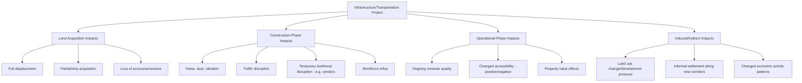
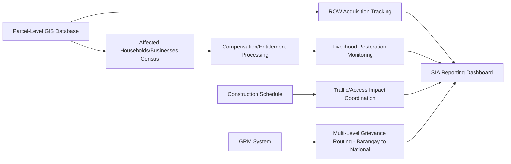

## Infrastructure and transportation projects

### Overview

Infrastructure and transportation projects — roads, bridges, ports, airports, rail systems, water supply networks, and urban transit — constitute a distinct sector for Social Impact Assessment (SIA) characterized by linear or networked spatial footprints, frequent involvement of multiple government levels (national, provincial, municipal/LGU), significant right-of-way (ROW) acquisition requirements, and impacts that are often more geographically dispersed but individually smaller in magnitude than extractive industry impacts. This sector is directly relevant to LGU-context SIA work, including document management systems supporting local infrastructure development such as `batac-dms`.

### Sectoral Characteristics Shaping SIA Approach

**Key Points**

- **Linear/networked spatial footprint**: unlike a single-site facility, roads, transmission lines, and rail corridors traverse multiple jurisdictions, land tenure types, and community boundaries, requiring SIA methodologies adapted to corridor-based rather than point-based impact assessment
- **Right-of-way (ROW) acquisition**: infrastructure projects frequently require partial land acquisition (rather than full-site displacement), often affecting many households with relatively smaller individual impacts — a pattern requiring different resettlement planning approaches than the larger, more concentrated displacement typical in extractives or hydropower
- **Multi-level government involvement**: national infrastructure agencies (e.g., Department of Public Works and Highways in the Philippine context), provincial government, and LGUs often share overlapping authority and responsibility, creating coordination complexity distinct from single-proponent extractive projects
- **Public/quasi-public benefit framing**: infrastructure projects are typically framed as serving broad public benefit (improved connectivity, economic development), which shapes a different legitimacy narrative than resource extraction, though this framing does not eliminate legitimate concerns about unequal distribution of benefits and burdens
- **Construction-phase concentration of impact**: unlike extractives' multi-decade operational impact, most social impact in transportation infrastructure concentrates in the relatively shorter construction phase, with comparatively modest ongoing operational-phase impact (though traffic, noise, and access changes persist)

### Impact Typology for Infrastructure/Transportation Projects

### Distinctive SIA Methodological Requirements

#### 1. Right-of-Way (ROW) and Linear Resettlement Planning

Because infrastructure projects often require narrow strips of land across many parcels rather than complete site acquisition, resettlement planning requires distinctive approaches:

- **Strip/partial acquisition assessment**: determining whether partial land loss renders a remaining parcel economically non-viable (triggering full acquisition/relocation entitlement) versus a compensable partial loss
- **Severance impact assessment**: evaluating impacts where a linear project physically divides a property, community, or established access route (e.g., a highway bisecting a barangay, cutting off pedestrian access between residential and market areas)
- **Informal settler and encroachment considerations**: infrastructure ROW areas frequently include informal settlers or structures without formal land title; SIA and resettlement planning must address this population under applicable national/local social housing and resettlement policy frameworks (in the Philippines, this includes Republic Act 7279, the Urban Development and Housing Act)

#### 2. Traffic and Access Disruption Management

Distinctive to transportation infrastructure specifically:

- **Livelihood disruption for informal/small businesses**: temporary loss of customer access or foot traffic during construction disproportionately affects small vendors, sari-sari stores, and similar micro-enterprises along the corridor — often overlooked in standard resettlement frameworks focused on land/structure loss
- **Detour and access planning**: technical traffic management plans have direct social impact dimensions (emergency vehicle access, school access routes, market access) requiring SIA input into engineering-phase decisions rather than treatment as a purely technical/engineering matter

#### 3. Multi-Stakeholder Coordination Framework

Given the multi-level government involvement typical of infrastructure projects, SIA processes require structured coordination mechanisms:

| Level | Typical Role | Coordination Requirement |
| --- | --- | --- |
| National implementing agency (e.g., DPWH) | Overall project design, ROW acquisition authority, funding | Primary SIA/RAP responsibility for nationally funded projects |
| Provincial government | Regional coordination, sometimes co-funding | Alignment with provincial development plans |
| LGU/Municipal government | Local zoning, barangay-level consultation facilitation, local social services | Local consultation logistics, GRM local-level intake, ongoing community relations |
| Barangay level | Direct community liaison, local dispute mediation | Frontline consultation and grievance intake |

[Inference] Because responsibility for social impact management can be organizationally distributed across these levels, infrastructure SIA processes generally benefit from an explicit, documented responsibility matrix (who conducts baseline surveys, who processes compensation claims, who operates the GRM) to avoid gaps or duplication in accountability — a coordination challenge less pronounced in single-proponent extractive projects.

#### 4. Involuntary Resettlement Framework Application

Similar to extractives, infrastructure projects triggering displacement typically apply IFC Performance Standard 5 or, for government-funded projects, national resettlement policy frameworks:

- In the Philippines: Republic Act 8974 (Right-of-Way Act) governs national government infrastructure project land acquisition, alongside relevant LGU ordinances for locally funded projects
- [Unverified] Specific compensation valuation methods, entitlement matrices, and procedural timelines under RA 8974 and related implementing rules should be verified against current DPWH/relevant agency guidelines, as these are subject to periodic administrative and legislative updates

### Technical Data Systems for Infrastructure SIA

- **GIS-integrated parcel database**: given the linear, multi-parcel nature of ROW acquisition, GIS integration (linking cadastral/parcel data to acquisition status, compensation status, and affected household information) is a functional necessity rather than optional enhancement — directly connecting to the geospatial tools covered earlier in this course
- **Multi-level GRM routing**: grievance systems must accommodate intake at the barangay level while routing complaints appropriately to the responsible level of government (local vs. national implementing agency) depending on grievance type — a structural requirement distinct from single-proponent GRM systems
- **Construction schedule-linked social monitoring**: since impact concentrates in the construction phase, monitoring systems benefit from direct integration with construction progress tracking, allowing social impact monitoring (traffic disruption complaints, noise complaints) to be contextualized against actual construction activity and phase

### Practical Example: LGU Road-Widening Project SIA Application

**Example**

An LGU-implemented road-widening project (a common `batac-dms`-relevant scenario) requiring partial ROW acquisition across multiple barangays:

1. **Parcel-level baseline**: Conduct a parcel-by-parcel survey identifying affected landowners, informal occupants/structures, and businesses along the corridor, integrated with GIS mapping of the ROW boundary
2. **Severance and viability assessment**: For each affected parcel, assess whether partial land loss renders the remaining parcel viable for continued use, determining full versus partial acquisition entitlement
3. **Small business/vendor impact plan**: Develop a specific temporary livelihood disruption mitigation plan for vendors and small businesses along the corridor (e.g., temporary relocation space, phased construction sequencing to limit simultaneous full-corridor disruption, compensation for documented income loss during construction)
4. **Multi-level coordination**: Establish a documented responsibility matrix defining barangay-level consultation facilitation, LGU-level compensation processing, and (if nationally funded/co-funded) national agency ROW acquisition authority
5. **Construction-phase monitoring**: Track traffic/access-related grievances against the construction schedule, using phase-specific monitoring intensity (higher during active construction near a given segment)
6. **Post-construction assessment**: Following completion, assess operational-phase impacts (changed accessibility, any property value effects, sustained noise/traffic pattern changes) as distinct from the concluded construction-phase impacts

**Output**

- A GIS-integrated parcel and compensation tracking system supporting transparent, auditable ROW acquisition processing
- A documented multi-level responsibility matrix for SIA and GRM functions across barangay, LGU, and (if applicable) national agency levels
- A construction-phase-linked social monitoring dashboard distinguishing active-construction-zone impacts from broader corridor-level trends

### Simplified ROW/Severance Impact Diagram (SVG)

<svg xmlns="http://www.w3.org/2000/svg" viewBox="0 0 640 300" font-family="Arial, sans-serif">
<text x="20" y="24" font-size="15" font-weight="bold">Right-of-Way Acquisition and Severance Impact (svg_diagram)</text>

<rect x="60" y="140" width="520" height="30" fill="#757575" />
<text x="320" y="160" font-size="10" fill="#fff" text-anchor="middle">New Road Alignment / ROW</text>

<rect x="60" y="80" width="100" height="60" fill="#a5d6a7" stroke="#2e7d32" />
<text x="110" y="110" font-size="9" text-anchor="middle">Parcel A</text>
<text x="110" y="122" font-size="8" text-anchor="middle">Full acquisition</text>
<rect x="170" y="80" width="100" height="60" fill="#fff59d" stroke="#f9a825" />
<text x="220" y="110" font-size="9" text-anchor="middle">Parcel B</text>
<text x="220" y="122" font-size="8" text-anchor="middle">Partial - viable</text>
<rect x="280" y="80" width="100" height="60" fill="#ef9a9a" stroke="#c62828" />
<text x="330" y="110" font-size="9" text-anchor="middle">Parcel C</text>
<text x="330" y="122" font-size="8" text-anchor="middle">Severance -</text>
<text x="330" y="132" font-size="8" text-anchor="middle">not viable</text>

<rect x="200" y="170" width="100" height="60" fill="#fff59d" stroke="#f9a825" />
<text x="250" y="200" font-size="9" text-anchor="middle">Parcel D</text>
<text x="250" y="212" font-size="8" text-anchor="middle">Partial - viable</text>
<rect x="310" y="170" width="100" height="60" fill="#90caf9" stroke="#1565c0" />
<text x="360" y="200" font-size="9" text-anchor="middle">Vendor Row</text>
<text x="360" y="212" font-size="8" text-anchor="middle">Access disruption</text>

<rect x="420" y="80" width="12" height="12" fill="#a5d6a7" />
<text x="436" y="90" font-size="9">Full acquisition</text>
<rect x="420" y="98" width="12" height="12" fill="#fff59d" />
<text x="436" y="108" font-size="9">Partial - viable remainder</text>
<rect x="420" y="116" width="12" height="12" fill="#ef9a9a" />
<text x="436" y="126" font-size="9">Severance - full entitlement triggered</text>
<rect x="420" y="134" width="12" height="12" fill="#90caf9" />
<text x="436" y="144" font-size="9">Temporary access/livelihood impact</text>
</svg>

### Toolchain and Reference Frameworks Summary

| Function | Frameworks/Standards | Tools |
| --- | --- | --- |
| Land acquisition/resettlement | IFC Performance Standard 5, RA 8974 (Philippine ROW Act) | GIS-integrated parcel/compensation databases (QGIS/PostGIS) |
| Informal settler resettlement | RA 7279 (Urban Development and Housing Act, Philippines) | Census/enumeration tools (KoboToolbox, ODK) |
| Multi-level coordination | Local Government Code provisions on LGU-national agency coordination | Shared GRM/case management systems with role-based routing |
| Construction-phase monitoring | Environmental Compliance Certificate (ECC) conditions | Construction schedule-linked dashboards |

### Ethical and Methodological Safeguards

- Ensure partial/strip acquisition assessments genuinely evaluate remaining parcel viability using consistent, documented criteria, rather than defaulting to partial compensation in cases where severance effectively destroys livelihood viability
- Extend resettlement and livelihood restoration frameworks to include informal settlers and occupants without formal land title, consistent with applicable national social housing legislation, rather than limiting compensation eligibility to formal titleholders alone
- Recognize and specifically plan for temporary livelihood disruption to small businesses and vendors during construction, a commonly under-addressed impact category relative to land/structure-focused resettlement frameworks
- Maintain clear, documented multi-level accountability for SIA and grievance handling functions to prevent responsibility gaps between national, provincial, LGU, and barangay levels
- Ensure traffic/access management planning incorporates genuine social impact input (school access, emergency services, market access) rather than treating these solely as engineering/technical scheduling decisions

### Next Steps

- Right-of-Way (ROW) acquisition procedures under RA 8974 (Philippine context)
- Informal settler resettlement under RA 7279 (Urban Development and Housing Act)
- GIS-integrated parcel and compensation tracking system design
- Multi-level government coordination frameworks for infrastructure SIA
- Construction-phase livelihood disruption mitigation planning
- Severance impact assessment methodology for linear infrastructure projects