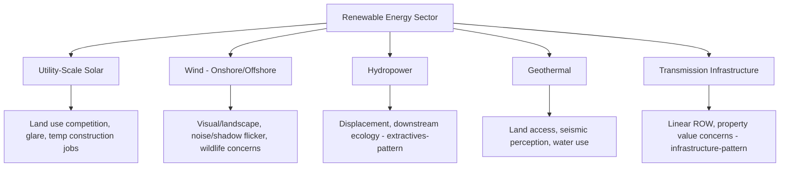
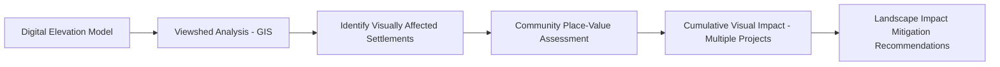

## Renewable energy and power sector projects

### Overview

Renewable energy and power sector projects — solar farms, wind installations, hydropower, geothermal, and associated transmission infrastructure — represent a rapidly growing sector for Social Impact Assessment (SIA) application, characterized by land-use-intensive siting requirements, distinctive visual and landscape impact concerns, and a recurring equity tension between broad societal decarbonization benefits and concentrated local costs. This sector combines elements of both the extractive industries pattern (for hydropower, which shares displacement and long-duration impacts) and infrastructure/transportation pattern (for transmission lines, which share linear/networked footprint characteristics), while introducing distinctive considerations specific to energy siting and grid integration.

### Sectoral Characteristics Shaping SIA Approach

**Key Points**

- **Land-use competition**: utility-scale solar and wind projects require substantial land areas relative to their workforce and often relative to their direct local economic activity, frequently competing with agricultural land use — a distinctive tension not present in more spatially compact facility types
- **Visual and landscape impact**: wind turbines and large solar arrays introduce visible landscape change that can generate opposition independent of any quantifiable environmental or health impact, requiring SIA methodologies that account for aesthetic/place-attachment concerns alongside conventional impact categories
- **"Exported benefit" equity perception**: renewable energy generated locally is frequently transmitted to and consumed by distant urban centers or industrial users, creating a recurring community perception that the local area bears siting costs while benefits accrue elsewhere — a structurally similar but distinct dynamic from the extractives sector's resource-export pattern
- **Hydropower's distinctive extractives-adjacent profile**: large hydropower shares extractives-sector characteristics (displacement, long operational life, significant land/water footprint) and is generally assessed using the frameworks covered in the "Extractive industries" topic rather than the lighter-footprint solar/wind pattern
- **Rapid deployment timelines**: unlike extractives' typically longer exploration-to-construction lead times, solar and wind projects can move from siting decision to operational status relatively quickly, compressing the time available for thorough community engagement if not proactively planned for

### Technology-Specific Impact Profiles

| Technology | Primary Local Concern | Typical Community Benefit Mechanism |
| --- | --- | --- |
| Utility-scale solar | Agricultural land conversion, temporary construction workforce housing pressure | Lease payments to landowners, local property tax revenue, limited permanent employment |
| Onshore wind | Visual/landscape impact, noise, shadow flicker, perceived property value effects | Community benefit funds, host landowner lease payments, sometimes local co-ownership models |
| Offshore wind | Fishing ground access/displacement, visual impact from shore, marine ecology concerns | Fisheries compensation funds, local port/supply chain economic development |
| Hydropower | Displacement, downstream flow alteration, fisheries impact | Resettlement/livelihood restoration (extractives-pattern), sometimes energy access provisions for host communities |
| Geothermal | Land access in often forested/protected areas, water use, induced seismicity perception | Community development funds, local employment |
| Transmission lines | ROW acquisition, visual impact, health perception concerns (electromagnetic fields) | Compensation for easements, sometimes local grid reliability improvements |

[Unverified] Specific health/safety claims regarding electromagnetic field exposure from transmission infrastructure should be sourced from current public health regulatory guidance rather than assumed; SIA practitioners addressing community EMF concerns should reference authoritative sources (e.g., WHO, national health regulatory bodies) directly.

### Distinctive SIA Methodological Requirements

#### 1. Landscape and Visual Impact Assessment (LVIA)

A methodology largely specific to renewable energy (particularly wind) siting, systematically assessing:

- Viewshed analysis (GIS-based determination of areas from which a proposed facility would be visible)
- Community-defined "sense of place" and landscape value assessment, often through qualitative methods (photo elicitation, community mapping) rather than purely technical visibility modeling
- Cumulative visual impact where multiple renewable installations exist or are planned in the same viewshed

#### 2. Benefit-Sharing Model Design for "Exported Benefit" Contexts

Given the recurring local-cost/distant-benefit equity concern, renewable energy SIA frequently requires deliberate benefit-sharing instrument design distinct from extractives royalty models:

| Model | Mechanism | Notes |
| --- | --- | --- |
| Community benefit funds | Fixed or production-linked annual payment to a host community fund | Common in wind/solar; governance structure quality significantly affects perceived legitimacy |
| Local ownership/co-investment | Community or local cooperative holds equity stake in the project | [Inference] Generally associated in the literature with stronger local support outcomes than pure compensation models, though requires financial/legal structuring capacity not always locally available |
| Reduced local electricity tariffs | Host community receives discounted or free electricity from the facility | Directly addresses the "we host it but don't benefit" perception, though implementation is subject to national grid/regulatory constraints |
| Property value guarantee/compensation schemes | Formal mechanism compensating documented property value loss attributable to the facility | Used in some jurisdictions for wind projects specifically; [Unverified] availability and structure vary significantly by jurisdiction |

#### 3. Fisheries and Marine Stakeholder Engagement (Offshore Wind)

Offshore wind introduces a distinctive stakeholder category — commercial and small-scale fishing communities — requiring engagement methodologies adapted from marine spatial planning practice, including fishing ground use mapping (often via participatory GIS with fisherfolk) and compensation/co-existence planning distinct from land-based stakeholder engagement.

#### 4. Grid Integration and Transmission Corridor SIA

Where new transmission infrastructure is required to connect renewable generation to the grid, SIA follows the linear infrastructure methodology covered in the "Infrastructure and transportation projects" topic (ROW acquisition, severance impact, ongoing property/health perception concerns), applied specifically to power line corridors.

### Practical Example: LGU-Hosted Solar Farm Siting

**Example**

An LGU is considering a utility-scale solar farm proposal on agricultural land within its jurisdiction:

1. **Land use and tenure baseline**: Document current agricultural land use, tenure arrangements (owned, tenanted, agrarian reform beneficiary status under CARP where applicable), and household dependency on the affected land for livelihood
2. **Benefit-distribution assessment**: Given that generated power will likely serve the broader grid rather than the immediate host community, proactively assess and address the "exported benefit" equity concern through a designed benefit-sharing mechanism (e.g., a host barangay development fund tied to generation output, or negotiated reduced local tariff arrangements where regulatorily feasible)
3. **Agricultural livelihood transition planning**: For tenant farmers or agrarian reform beneficiaries whose land use rights would be affected, develop a livelihood transition plan distinct from standard land-owner compensation, since land tenure complexity in agricultural contexts often involves multiple layers of use rights beyond simple ownership
4. **Visual/landscape consideration**: While utility-scale solar typically generates less visual opposition than wind, assess any specific local landscape or agricultural heritage value concerns through community consultation
5. **Local employment planning**: Given the relatively limited permanent workforce requirements of solar facilities compared to construction-phase employment, set realistic expectations in community communications about post-construction employment levels to avoid credibility damage from over-promising

**Output**

- A land tenure and livelihood dependency baseline distinguishing landowner, tenant, and agrarian-reform-beneficiary impacts
- A designed benefit-sharing mechanism directly addressing the exported-benefit equity concern
- Realistic, documented employment expectation communications to support long-term credibility

### Simplified Viewshed/Benefit Distribution Diagram (SVG)

<svg xmlns="http://www.w3.org/2000/svg" viewBox="0 0 640 320" font-family="Arial, sans-serif">
<text x="20" y="24" font-size="15" font-weight="bold">Host Community Cost vs. Benefit Distribution (svg_diagram)</text>

<rect x="40" y="60" width="200" height="200" fill="#fff3e0" stroke="#ef6c00" stroke-width="1.5" />
<text x="140" y="80" font-size="11" font-weight="bold" text-anchor="middle">Host Community</text>
<circle cx="140" cy="150" r="30" fill="#f9a825" />
<text x="140" y="155" font-size="9" text-anchor="middle">Facility</text>

<text x="140" y="200" font-size="9" text-anchor="middle">Bears: land use change,</text>

<text x="140" y="212" font-size="9" text-anchor="middle">visual impact, construction</text>

<text x="140" y="224" font-size="9" text-anchor="middle">disruption</text>

<line x1="240" y1="150" x2="480" y2="150" stroke="#616161" stroke-width="3" stroke-dasharray="6,3" />
<text x="360" y="140" font-size="9" text-anchor="middle">Transmission</text>

<rect x="480" y="60" width="120" height="200" fill="#e3f2fd" stroke="#1565c0" stroke-width="1.5" />
<text x="540" y="80" font-size="11" font-weight="bold" text-anchor="middle">Grid/Urban</text>
<text x="540" y="94" font-size="11" font-weight="bold" text-anchor="middle">Consumers</text>
<text x="540" y="150" font-size="9" text-anchor="middle">Receives:</text>
<text x="540" y="162" font-size="9" text-anchor="middle">electricity</text>
<text x="540" y="174" font-size="9" text-anchor="middle">benefit</text>

<rect x="40" y="270" width="560" height="35" rx="4" fill="#e8f5e9" stroke="#2e7d32" />
<text x="320" y="292" font-size="10" text-anchor="middle" fill="#2e7d32">Benefit-sharing mechanism (fund/tariff/co-ownership) designed to rebalance host community cost-benefit equity</text>
</svg>

### Toolchain and Reference Frameworks Summary

| Function | Frameworks/Standards | Tools |
| --- | --- | --- |
| Viewshed/visual impact | Landscape and Visual Impact Assessment (LVIA) methodology | GIS viewshed analysis (QGIS, ArcGIS), 3D visualization tools |
| Land tenure/agricultural impact | Comprehensive Agrarian Reform Program (CARP) framework (Philippine context) | Land tenure/parcel database systems |
| Benefit-sharing design | IRENA community engagement guidance | Fund governance/disbursement tracking systems |
| Marine/fisheries engagement (offshore) | Marine spatial planning methodology | Participatory GIS for fishing ground mapping |
| Transmission corridor SIA | Same as infrastructure/transportation sector (RA 8974 context) | GIS-integrated parcel/ROW tracking |

### Ethical and Methodological Safeguards

- Proactively address the "exported benefit" equity perception through deliberate benefit-sharing design rather than assuming broad societal decarbonization benefit is sufficient justification for local siting costs
- Set realistic, honest expectations regarding permanent local employment generation, which is typically modest for solar/wind facilities relative to construction-phase employment, to avoid credibility damage from over-promised economic benefit
- Ensure land tenure assessments account for the full range of use rights (tenancy, agrarian reform beneficiary status, informal use arrangements) rather than formal ownership alone, particularly relevant in agricultural siting contexts
- Take community-defined landscape and place-attachment concerns seriously as legitimate impact categories, rather than dismissing visual/aesthetic opposition as lacking objective basis
- For offshore wind and other marine-adjacent projects, ensure fishing community engagement uses methodologies genuinely adapted to that stakeholder group's spatial and livelihood patterns, rather than defaulting to land-based consultation approaches

### Next Steps

- Landscape and Visual Impact Assessment (LVIA) methodology in depth
- Community benefit fund and local co-ownership model design for renewable energy
- Comprehensive Agrarian Reform Program (CARP) land tenure considerations in project siting
- Marine spatial planning and fisheries stakeholder engagement for offshore projects
- Grid integration and transmission corridor social impact assessment
- Comparative analysis with hydropower's extractives-adjacent SIA requirements