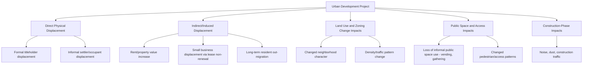
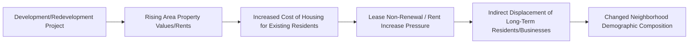
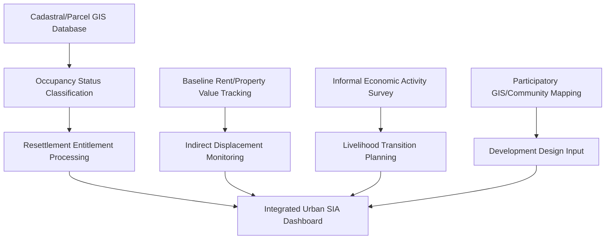

## Urban planning and land development

### Overview

Urban planning and land development encompasses Social Impact Assessment (SIA) applications for projects that transform urban and peri-urban land use — residential subdivisions, mixed-use developments, urban renewal/redevelopment, informal settlement upgrading, zoning changes, and public space projects. This sector is distinguished from the previously covered extractive, infrastructure, and energy sectors by its typically dense, highly heterogeneous stakeholder environment; its direct engagement with land tenure informality; and its frequent involvement of gentrification, displacement, and housing affordability dynamics that carry distinct social equity dimensions not present in more spatially isolated project types.

### Sectoral Characteristics Shaping SIA Approach

**Key Points**

- **Density and stakeholder heterogeneity**: urban development projects typically affect large numbers of stakeholders in close spatial proximity with widely varying interests (residents, business owners, informal vendors, property owners, renters, and prospective future residents), requiring SIA methodologies capable of disaggregating impacts across highly diverse and sometimes competing local interests
- **Land tenure informality**: urban and peri-urban areas, particularly in rapidly urbanizing contexts, frequently include informal settlements, informal vendors, and unregistered land occupancy, requiring SIA and resettlement approaches explicitly designed to address populations without formal legal tenure
- **Gentrification and displacement risk**: redevelopment and revitalization projects can trigger indirect displacement through rising property values and rents, affecting long-term residents who are not directly displaced by the project itself but by its secondary market effects — a distinctive impact category requiring specific assessment methodology
- **Multi-phase, long-term development horizons**: large urban development projects (e.g., master-planned communities, urban renewal zones) often unfold over many years with sequential phases, requiring SIA frameworks capable of tracking cumulative impact across phases rather than a single-point assessment
- **Regulatory and zoning interface**: urban development SIA is closely interwoven with formal land use planning, zoning, and building permit processes, requiring closer integration with planning/zoning technical processes than is typical in more remote-sited project types

### Impact Typology for Urban Development Projects

### Distinctive SIA Methodological Requirements

#### 1. Informal Settlement and Tenure-Sensitive Resettlement Planning

Urban development frequently requires resettlement or relocation planning explicitly designed to address informal occupancy:

| Occupancy Category | Typical Entitlement Approach |
| --- | --- |
| Formal titleholders | Standard compensation/relocation under applicable expropriation or negotiated purchase framework |
| Long-term informal occupants (recognized under national policy) | Relocation assistance and, in the Philippine context, entitlement under RA 7279 (Urban Development and Housing Act), which establishes specific protections and relocation standards for informal settler families |
| Recent/opportunistic occupants | Typically distinguished from long-term occupants through cut-off date establishment; policy treatment varies and requires careful, documented, and consistently applied criteria |
| Renters (formal or informal) | Often overlooked in property-focused resettlement frameworks; require distinct consideration since they hold no compensable property interest but face genuine displacement impact |

**Key Points**

- Establishing and clearly communicating a **cut-off date** (the date after which new occupants are not eligible for resettlement entitlements) is a standard and necessary practice to prevent opportunistic in-migration seeking compensation, but must be applied transparently and fairly to avoid perceptions of arbitrary exclusion
- [Inference] Renter displacement is a commonly under-addressed impact category in urban development SIA relative to property-owner-focused frameworks, since renters typically have no compensable property interest despite facing genuine housing and community displacement

#### 2. Indirect/Induced Displacement Assessment

A methodologically distinctive requirement for urban development (much less prominent in extractive or infrastructure SIA) is assessing displacement caused by market effects rather than direct project land acquisition:

- **Baseline rent/property value monitoring**: tracking area rent and property value trends before and after project announcement/implementation to assess attributable market pressure
- **Longitudinal resident tracking**: where feasible, following a panel of long-term resident households over time to assess actual displacement/retention outcomes, since indirect displacement unfolds gradually and is difficult to detect through single-point assessment
- **Affordable housing/anti-displacement mitigation instruments**: inclusionary zoning requirements, rent stabilization measures, or right-of-first-refusal provisions for long-term residents, where legally and institutionally feasible within the relevant jurisdiction
- [Unverified] The effectiveness and specific design of anti-displacement mitigation instruments vary considerably by jurisdiction, legal framework, and local housing market conditions; specific policy recommendations should be grounded in local housing policy research rather than generalized assumptions

#### 3. Public Space and Informal Economy Impact Assessment

Urban development and public space redevelopment projects frequently affect informal economic activity (street vending, informal markets) reliant on specific public space configurations:

- Mapping of informal economic activity dependent on the affected public space, including seasonal or time-of-day variation in use patterns
- Assessment of alternative site availability and viability for displaced informal economic activity, recognizing that informal vendors often depend on specific foot-traffic patterns not easily replicated at alternative sites

#### 4. Participatory Urban Planning Methods

Given the dense, heterogeneous stakeholder environment, urban development SIA frequently employs participatory planning methodologies more intensively than other sectors:

- Community mapping and participatory GIS to document existing land use, informal tenure claims, and community-valued spaces
- Design charrettes and participatory design workshops incorporating community input into physical planning decisions, not solely impact mitigation
- Scenario visualization tools allowing community stakeholders to evaluate and provide feedback on alternative development configurations before finalization

### Technical Data Systems for Urban Development SIA

- **Occupancy classification database**: given the tenure complexity typical of urban areas, systems must support clear, auditable classification of each affected unit/parcel by occupancy type (titled, long-term informal, recent/opportunistic, renter) linked to the applicable entitlement framework
- **Longitudinal market monitoring**: distinct from other sectors' monitoring needs, urban development SIA requires systems capable of tracking area-level rent/property value trends over multi-year periods to support indirect displacement assessment
- **Participatory GIS integration**: community-contributed spatial data (informal tenure claims, valued community spaces, informal economic activity locations) requires data systems capable of incorporating and appropriately weighting non-official/community-sourced spatial information alongside formal cadastral data

### Practical Example: LGU Public Market Redevelopment with Informal Vendor Community

**Example**

An LGU redevelopment project for an aging public market involving both formal stall lessees and informal/ambulant vendors:

1. **Occupancy and tenure baseline**: Conduct a comprehensive census distinguishing formal market stall lessees, long-term informal vendors (with an established, transparent cut-off date), and areas of informal public space use for vending
2. **Formal lessee transition planning**: Develop relocation/temporary stall arrangements for formal lessees during construction, with clear, binding commitments for post-construction stall reassignment
3. **Informal vendor livelihood assessment**: Given that informal vendors typically hold no compensable property interest, develop a distinct livelihood continuity plan (temporary vending space, phased construction sequencing to maintain some ongoing commercial activity, skills/transition support where displacement is unavoidable)
4. **Indirect impact monitoring**: If redevelopment is expected to significantly increase foot traffic and commercial value, monitor for potential secondary displacement of nearby small businesses through rent pressure, and consider whether local mitigation measures are feasible
5. **Participatory design input**: Conduct participatory design sessions with vendor associations and market user groups to incorporate practical operational knowledge (traffic flow, complementary goods placement, informal social functions of the market space) into the redevelopment design, rather than a purely technical/architectural design process
6. **Post-redevelopment monitoring**: Track actual outcomes for both formal lessees and informal vendors post-completion against the commitments made during planning, feeding into the credibility component of ongoing SLO tracking (see earlier chapter topics)

**Output**

- A tenure-disaggregated occupancy database supporting differentiated, transparent entitlement processing
- A specific informal vendor livelihood continuity plan distinct from formal lessee compensation arrangements
- Participatory design input documentation demonstrating genuine incorporation of vendor/user community knowledge into final design

### Simplified Occupancy Classification and Entitlement Diagram (SVG)

<svg xmlns="http://www.w3.org/2000/svg" viewBox="0 0 640 300" font-family="Arial, sans-serif">
<text x="20" y="24" font-size="15" font-weight="bold">Occupancy Classification and Entitlement Pathway (svg_diagram)</text>
<rect x="30" y="50" width="150" height="50" rx="4" fill="#a5d6a7" stroke="#2e7d32" />
<text x="105" y="80" font-size="10" text-anchor="middle">Formal Titleholder</text>
<rect x="30" y="120" width="150" height="50" rx="4" fill="#fff59d" stroke="#f9a825" />
<text x="105" y="145" font-size="10" text-anchor="middle">Long-Term Informal</text>
<text x="105" y="158" font-size="10" text-anchor="middle">(pre-cutoff date)</text>
<rect x="30" y="190" width="150" height="50" rx="4" fill="#ef9a9a" stroke="#c62828" />
<text x="105" y="215" font-size="10" text-anchor="middle">Recent/Opportunistic</text>
<text x="105" y="228" font-size="10" text-anchor="middle">(post-cutoff date)</text>
<rect x="30" y="260" width="150" height="30" rx="4" fill="#90caf9" stroke="#1565c0" />
<text x="105" y="280" font-size="10" text-anchor="middle">Renter (any category)</text>

<line x1="180" y1="75" x2="350" y2="75" stroke="#999" />
<rect x="350" y="55" width="240" height="40" rx="4" fill="#e8f5e9" />
<text x="470" y="79" font-size="9" text-anchor="middle">Standard compensation/relocation</text>
<line x1="180" y1="145" x2="350" y2="145" stroke="#999" />
<rect x="350" y="125" width="240" height="40" rx="4" fill="#fffde7" />
<text x="470" y="149" font-size="9" text-anchor="middle">RA 7279 relocation assistance (PH context)</text>
<line x1="180" y1="215" x2="350" y2="215" stroke="#999" />
<rect x="350" y="195" width="240" height="40" rx="4" fill="#ffebee" />
<text x="470" y="219" font-size="9" text-anchor="middle">Case-by-case; typically limited entitlement</text>
<line x1="180" y1="275" x2="350" y2="275" stroke="#999" />
<rect x="350" y="260" width="240" height="35" rx="4" fill="#e3f2fd" />
<text x="470" y="282" font-size="9" text-anchor="middle">Rental assistance/transition support (often overlooked)</text>
</svg>

### Toolchain and Reference Frameworks Summary

| Function | Frameworks/Standards | Tools |
| --- | --- | --- |
| Informal settler resettlement | RA 7279 (Urban Development and Housing Act, Philippines) | Census/enumeration tools (KoboToolbox, ODK) |
| Land use/zoning integration | Local Comprehensive Land Use Plan (CLUP) frameworks | GIS-integrated zoning/parcel systems |
| Participatory planning | Participatory GIS methodology | QGIS with community mapping modules, Mapillary/OpenStreetMap-based tools |
| Indirect displacement monitoring | Housing market impact assessment methodology | Longitudinal rent/property value tracking databases |
| Informal economy impact | Livelihood assessment methodology adapted for informal vending | Survey tools (KoboToolbox) with informal economic activity modules |

### Ethical and Methodological Safeguards

- Establish and apply cut-off dates for resettlement entitlement transparently and consistently, communicated clearly to the affected community in advance, to avoid both opportunistic in-migration and perceptions of arbitrary exclusion
- Extend genuine consideration to renter displacement impacts, rather than limiting resettlement and compensation frameworks to property-interest holders alone
- Assess and, where feasible, mitigate indirect/induced displacement risk rather than treating market-driven secondary displacement as outside the scope of project responsibility, particularly for redevelopment projects explicitly intended to increase area property values
- Ensure informal economic activity (vending, informal markets) is treated as a legitimate livelihood impact category requiring genuine continuity planning, not merely an obstacle to be cleared for redevelopment
- Incorporate participatory design input genuinely into physical planning decisions, rather than limiting community engagement to impact mitigation discussions after core design decisions have already been finalized

### Next Steps

- Urban Development and Housing Act (RA 7279) implementation procedures in the Philippine context
- Indirect/induced displacement assessment methodology and gentrification monitoring
- Participatory GIS and community mapping techniques for informal settlement documentation
- Informal economy livelihood transition planning
- Comprehensive Land Use Plan (CLUP) integration with SIA processes
- Affordable housing and anti-displacement policy instrument design