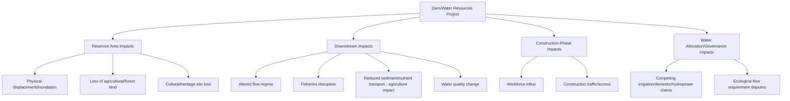
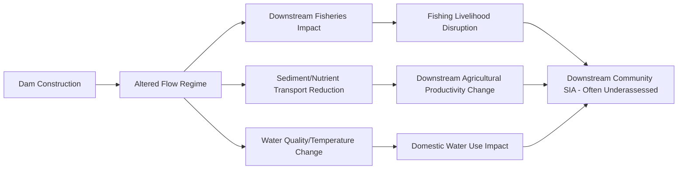
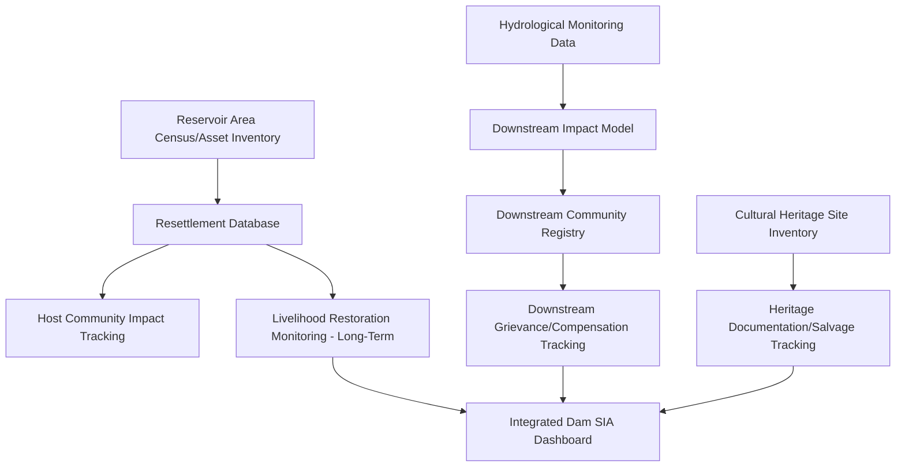

## Water resources and dam projects

### Overview

Water resources and dam projects — large and small hydropower dams, irrigation dams, multipurpose reservoirs, and water supply infrastructure — constitute one of the most extensively documented and methodologically developed sectors in Social Impact Assessment (SIA) history, largely due to the scale of displacement and the intensity of documented conflict associated with major dam projects globally. This sector shares extractives-pattern characteristics (long operational life, significant displacement, extended construction periods) while introducing distinctive downstream, watershed-scale, and water-rights considerations not present in land-based extractive or infrastructure projects.

### Sectoral Characteristics Shaping SIA Approach

**Key Points**

- **Reservoir inundation displacement**: dam projects characteristically displace populations through permanent flooding of the reservoir area, often affecting entire communities and requiring resettlement to new, sometimes distant sites — among the most severe and well-documented displacement patterns in development-induced displacement literature
- **Downstream/watershed-scale impact**: unlike site-bounded projects, dams alter river flow regimes, sediment transport, and water availability across an entire downstream watershed, affecting communities far beyond the immediate reservoir/construction footprint who may receive minimal, if any, direct project benefit
- **Water rights and multi-use conflict**: dam projects frequently create competing claims among irrigation, hydropower generation, domestic water supply, fisheries, and ecological flow requirements, requiring SIA to engage with water governance and allocation frameworks beyond typical land-based impact assessment
- **Fisheries and riverine livelihood disruption**: altered flow regimes and fish migration barriers can severely affect fishing-dependent livelihoods both upstream (reservoir area) and downstream, often affecting populations who receive no resettlement compensation because they are not physically displaced
- **Historical legacy of major conflict**: large dam projects carry a substantial documented history of severe, prolonged social conflict (extensively catalogued by bodies such as the World Commission on Dams, 2000), making this sector one where lessons-learned literature is unusually rich but also where community and civil society skepticism toward new projects is frequently elevated based on historical precedent elsewhere

### Impact Typology for Water/Dam Projects

### Distinctive SIA Methodological Requirements

#### 1. Reservoir Resettlement Planning at Scale

Given the frequently large scale of dam-induced displacement, resettlement planning requires distinctive rigor beyond standard Resettlement Action Plan (RAP) practice:

- **Community relocation vs. individual/household relocation**: dam resettlement frequently involves relocating entire communities as functioning social units to new sites, requiring attention to preserving (or deliberately reconstituting) community social structure, not solely individual household compensation
- **Host community impact assessment**: resettlement sites themselves have existing populations who experience impacts from receiving displaced populations (land/resource competition, social integration challenges, service strain) — a distinctive "double-sided" displacement impact requiring assessment of both displaced and host populations
- **Livelihood system transformation**: reservoir displacement frequently requires not just relocation but fundamental livelihood system change (e.g., from river-valley agriculture to different agroecological conditions at the resettlement site), requiring more intensive livelihood restoration planning than compensation-based approaches alone can address
- [Inference] Given the well-documented historical pattern of impoverishment risk following large dam resettlement (extensively analyzed in development displacement literature, notably Cernea's Impoverishment Risks and Reconstruction model), dam resettlement SIA generally applies more rigorous, longer-duration post-resettlement monitoring than is typical for smaller-scale displacement in other sectors

#### 2. Downstream and Watershed-Scale Impact Assessment

A methodologically distinctive requirement for dams, less prominent in other land-based sectors:

- **Environmental flow (e-flow) assessment**: technical hydrological studies determining minimum flow requirements to sustain downstream ecological function and dependent livelihoods, requiring integration of hydrological science with social impact assessment
- **Downstream community identification**: because downstream impacts can extend far beyond the immediate project area and may not be visually or administratively obvious, downstream-affected community identification requires deliberate hydrological/watershed-based stakeholder mapping rather than simple proximity-based identification
- [Unverified] The specific extent of downstream impact requiring formal SIA inclusion (i.e., how far downstream impacts must be assessed) varies by regulatory jurisdiction and project scale; applicable national EIA/SIA regulations and financier standards (e.g., IFC Performance Standards) should be consulted for jurisdiction-specific requirements

#### 3. Cultural and Heritage Site Assessment

Reservoir inundation frequently threatens archaeological sites, sacred sites, and culturally significant locations that will be permanently lost to flooding — requiring, where feasible, documentation, cultural heritage salvage/relocation planning, and meaningful engagement with affected communities (particularly indigenous groups) regarding irreplaceable cultural loss that cannot be addressed through standard compensation frameworks.

#### 4. Multi-Purpose Water Governance Integration

Dam projects serving multiple functions (hydropower, irrigation, domestic supply, flood control) require SIA to engage with the water allocation governance framework determining how benefits and risks are distributed across competing water uses and user groups — often involving multiple government agencies (energy, agriculture, water utility, local government) with potentially competing institutional interests.

### Technical Data Systems for Water/Dam SIA

- **Long-duration resettlement monitoring systems**: given documented impoverishment risk patterns, data systems must support monitoring of resettled populations' livelihood restoration outcomes over extended post-resettlement periods (often 5-10+ years), not just immediate post-relocation compensation delivery
- **GIS-integrated hydrological/social overlay**: linking hydrological flow modeling outputs with downstream community location data to identify and register potentially affected downstream populations who may not be captured through standard project-boundary-based stakeholder identification
- **Cultural heritage documentation repository**: systematic recording of cultural/heritage sites subject to inundation, supporting both salvage/documentation efforts and meaningful engagement records regarding irreplaceable loss

### Practical Example: Multipurpose Dam Project SIA Application (Philippine Context)

**Example**

A proposed multipurpose dam (irrigation and hydropower) affecting an upland community with potential ancestral domain overlap and downstream agricultural communities:

1. **Reservoir area baseline and resettlement planning**: Conduct comprehensive census and asset inventory of the reservoir area, identify any ancestral domain overlap triggering NCIP FPIC requirements (per the extractive industries topic's applicable frameworks), and develop a full RAP addressing both physical and economic displacement with community relocation (not solely individual household) planning
2. **Host community assessment**: If resettlement sites involve government or private land with existing occupants, conduct a host community impact assessment addressing land/resource competition and social integration planning
3. **Downstream impact assessment**: Commission environmental flow studies to determine minimum downstream flow requirements; identify downstream fishing and farming communities dependent on the river's natural flow and sediment regime, registering them within the project's stakeholder and, where impacts are substantiated, compensation frameworks
4. **Cultural heritage documentation**: Conduct heritage site surveys within the inundation area, particularly given potential indigenous cultural significance, with documentation and, where feasible and appropriate to the community's wishes, salvage or relocation of significant cultural/heritage elements
5. **Multi-agency water governance coordination**: Establish formal coordination between the implementing agency, National Irrigation Administration (or equivalent), local water district, and affected LGUs regarding water allocation commitments across irrigation, domestic supply, and hydropower functions
6. **Long-term monitoring commitment**: Establish a resettlement and downstream impact monitoring program extending well beyond project completion (multi-year, potentially decade-scale), given documented impoverishment risk patterns associated with large dam resettlement

**Output**

- An integrated reservoir and downstream stakeholder registry distinguishing physically displaced, host community, and downstream-affected populations with differentiated entitlement/engagement frameworks
- A long-duration livelihood restoration monitoring system extending well beyond initial resettlement completion
- Documented cultural heritage assessment and, where applicable, salvage/relocation records
- A multi-agency water governance coordination framework addressing competing water allocation interests

### Simplified Watershed-Scale Impact Diagram (SVG)

<svg xmlns="http://www.w3.org/2000/svg" viewBox="0 0 640 340" font-family="Arial, sans-serif">
<text x="20" y="24" font-size="15" font-weight="bold">Watershed-Scale Impact Distribution (svg_diagram)</text>

<path d="M 80,50 Q 150,100 140,160 Q 130,220 250,250 Q 380,280 550,300" fill="none" stroke="#1565c0" stroke-width="6" opacity="0.5" />

<rect x="120" y="150" width="40" height="20" fill="#616161" />
<text x="140" y="145" font-size="9" text-anchor="middle" font-weight="bold">DAM</text>

<ellipse cx="90" cy="90" rx="55" ry="40" fill="#90caf9" opacity="0.6" />
<text x="90" y="70" font-size="9" text-anchor="middle">Reservoir Area</text>
<text x="90" y="82" font-size="8" text-anchor="middle">(inundation/displacement)</text>

<rect x="200" y="40" width="80" height="40" rx="4" fill="#a5d6a7" stroke="#2e7d32" />
<text x="240" y="62" font-size="8" text-anchor="middle">Resettlement Site</text>
<text x="240" y="72" font-size="8" text-anchor="middle">(+ host community)</text>

<circle cx="280" cy="260" r="12" fill="#f9a825" />
<text x="280" y="285" font-size="8" text-anchor="middle">Downstream</text>
<text x="280" y="295" font-size="8" text-anchor="middle">Fishing Comm.</text>
<circle cx="420" cy="285" r="12" fill="#ef6c00" />
<text x="420" y="310" font-size="8" text-anchor="middle">Downstream</text>
<text x="420" y="320" font-size="8" text-anchor="middle">Farming Comm.</text>
<circle cx="540" cy="295" r="12" fill="#c62828" />
<text x="540" y="270" font-size="8" text-anchor="middle">Far Downstream</text>
<text x="540" y="260" font-size="8" text-anchor="middle">(often underassessed)</text>

<text x="20" y="330" font-size="8" fill="#666">Impact extends across the watershed, not only the immediate dam/reservoir footprint</text>

</svg>

### Toolchain and Reference Frameworks Summary

| Function | Frameworks/Standards | Tools |
| --- | --- | --- |
| Resettlement planning | IFC Performance Standard 5, World Bank OP 4.12, Cernea's Impoverishment Risks and Reconstruction (IRR) model | RAP/resettlement database systems, GIS-linked census tools |
| Environmental flow assessment | Environmental flow methodologies (e.g., Building Block Methodology) | Hydrological modeling software (HEC-RAS, SWAT) |
| Indigenous consent (where applicable) | ILO 169, UNDRIP, IPRA/NCIP (Philippines) | FPIC documentation systems |
| Dam-specific good practice reference | World Commission on Dams (2000) report and strategic priorities | N/A - policy/normative reference |
| Water governance coordination | National water code/irrigation administration frameworks | Multi-agency coordination platforms/MOUs |

### Ethical and Methodological Safeguards

- Apply resettlement planning rigor commensurate with the well-documented severe impoverishment risks associated with large dam displacement, including community-level (not solely household-level) relocation planning and long-duration post-resettlement monitoring
- Explicitly assess and address host community impacts at resettlement sites, recognizing that receiving communities also experience genuine impacts from displaced population influx
- Identify and meaningfully engage downstream-affected communities, who are frequently under-assessed relative to reservoir-area populations despite sometimes facing severe livelihood disruption from altered flow regimes
- Treat irreplaceable cultural and heritage site loss as a distinct impact category requiring genuine engagement and, where desired by affected communities, documentation/salvage effort, rather than assuming standard compensation frameworks adequately address such loss
- Ensure water allocation governance decisions affecting competing user groups (irrigation, domestic supply, ecological flow, hydropower) are made transparently, with meaningful input from affected communities, rather than through purely technical/engineering or single-agency determination
- Draw explicitly on the extensive documented lessons-learned literature from historical dam project conflicts (e.g., World Commission on Dams findings) rather than treating each new project's social risks as unprecedented

### Next Steps

- Cernea's Impoverishment Risks and Reconstruction (IRR) model for displacement planning
- Environmental flow assessment methodology and downstream impact modeling
- World Commission on Dams strategic priorities and historical case study analysis
- Host community impact assessment methodology for resettlement sites
- Water governance and multi-agency coordination frameworks
- Cultural heritage documentation and salvage planning for inundation areas