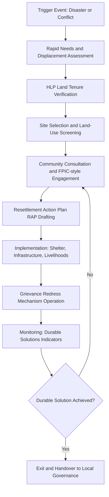

## Post-disaster and post-conflict resettlement

### Overview

Post-disaster and post-conflict resettlement refers to the planned relocation, rebuilding, and reintegration of populations displaced by natural hazards (earthquakes, floods, typhoons, volcanic eruptions), technological disasters, or armed conflict. Within Social Impact Assessment (SIA), this sector requires integrating displacement tracking, land tenure resolution, psychosocial recovery, and community-driven reconstruction into a single assessment and monitoring framework. It sits at the intersection of humanitarian response, development planning, and human rights protection.

### Defining Characteristics of the Sector

- **Compressed timelines**: Emergency, transitional, and durable-solution phases often overlap, unlike conventional development SIA which assumes sequential planning.
- **Involuntary displacement**: Unlike project-induced resettlement (e.g., dam construction), the triggering event is exogenous — the SIA practitioner is responding to, not causing, displacement.
- **Vulnerability stacking**: Affected populations frequently experience overlapping vulnerabilities — loss of livelihood, loss of documentation, trauma, and loss of social networks simultaneously.
- **Weak or contested governance**: Land records may be destroyed (disaster) or deliberately falsified/erased (conflict), complicating tenure verification.
- **Do-no-harm imperative**: In conflict settings, data collection itself can endanger respondents (e.g., revealing ethnic/political affiliation).

### Core Frameworks Referenced

1. **Sphere Standards** — minimum humanitarian standards for shelter, settlement, and non-food items.
2. **IASC Framework on Durable Solutions for IDPs** — defines durable solutions as return, local integration, or settlement elsewhere.
3. **World Bank Involuntary Resettlement Framework (ESS5)** — applied when disaster recovery projects are World Bank-financed.
4. **UN Guiding Principles on Internal Displacement** — normative baseline for IDP rights.
5. **Pinheiro Principles** — housing, land, and property (HLP) restitution for refugees and displaced persons.

### The Resettlement SIA Lifecycle

### Rapid Needs and Displacement Assessment

**Key Points**

- Conducted within 72 hours to 2 weeks of the triggering event.
- Combines household-level surveys, key informant interviews, and remote sensing (satellite imagery for damage assessment).
- Must disaggregate by sex, age, disability, and pre-existing vulnerability (SADD framework: Sex and Age Disaggregated Data).

**Common Data Instruments**

- Multi-Cluster/Sector Initial Rapid Assessment (MIRA)
- Displacement Tracking Matrix (DTM), maintained by IOM, which tracks mobility, location, and needs of displaced populations over time.

**Example**

A coastal municipality hit by a typhoon storm surge conducts a MIRA within 5 days, identifying 3,200 households displaced, of which 40% have unclear or undocumented land tenure — flagging this cohort for priority HLP support before any resettlement site is finalized.

### Housing, Land, and Property (HLP) Verification

This is the technical core distinguishing resettlement SIA from generic disaster response.

**Key Points**

- HLP verification establishes who has a legitimate claim to land/housing, which determines eligibility for compensation, replacement housing, or return.
- In post-conflict settings, secondary occupation (others moving into abandoned homes) is common and must be resolved without triggering new displacement.
- Customary or informal tenure (common in many Global South contexts) is often not captured by formal land registries and requires participatory mapping.

**Standard Methods**

- Participatory GIS / community-based land mapping.
- Tenure typology classification: formal title, customary right, tenancy, informal occupation.
- Documentation reconstruction: use of witness testimony, satellite imagery time-series, and tax records where registries were destroyed.

**Sample Tenure Classification Table**

| Tenure Type | Evidence Basis | Resettlement Eligibility Implication |
| --- | --- | --- |
| Formal freehold title | Land registry record | Full compensation/replacement |
| Customary right | Community attestation, elders' council | Compensation per national customary law recognition |
| Tenancy/rental | Lease agreement, landlord testimony | Transitional shelter support, not land compensation |
| Informal/undocumented occupation | Physical presence evidence, utility bills | Case-by-case, often minimum humanitarian assistance |

### Site Selection and Land-Use Screening

**Key Points**

- New resettlement sites must be screened for hazard exposure (avoiding re-siting people into flood plains or seismic fault zones — a frequent post-disaster planning failure).
- Environmental and social due diligence includes proximity to livelihoods, schools, health facilities, and water sources.
- In conflict settings, site selection must also screen for landmine/UXO (unexploded ordnance) contamination and ongoing security risk.

**[Inference]** Sites selected purely on available land ownership (government-owned parcels) rather than livelihood proximity are a commonly cited cause of resettlement failure in post-disaster literature, though outcomes are context-dependent and not universal.

### Community Consultation and Engagement

Resettlement in this sector demands heightened consultation standards because displacement itself may have eroded trust in authorities.

**Key Points**

- Use layered consultation: household-level, community-level, and leadership-level, since customary authority structures may have been disrupted by conflict.
- Where FPIC (Free, Prior, and Informed Consent) principles apply (e.g., Indigenous communities), consent processes must be adapted for displaced, dispersed populations.
- Conflict-sensitive engagement requires "Do No Harm" analysis (per the Do No Harm/Local Capacities for Peace framework) to ensure consultation processes do not reignite intergroup tension.

**Example**

In a post-earthquake resettlement in a multi-ethnic town, separate consultation sessions are held for different displaced neighborhoods before a joint site-planning workshop, to avoid pre-existing tensions surfacing destructively in a single large forum.

### Resettlement Action Plan (RAP) Components

1. Census and asset inventory of affected population (cut-off date established to prevent eligibility fraud).
2. Entitlement matrix linking tenure category to compensation/assistance type.
3. Livelihood restoration strategy.
4. Timeline and budget.
5. Grievance Redress Mechanism (GRM) design.
6. Monitoring and evaluation plan with durable-solution indicators.

### Grievance Redress Mechanisms (GRM)

**Key Points**

- Must be accessible without literacy or smartphone requirements (hotlines, in-person desks, suggestion boxes).
- In conflict-affected contexts, anonymity and safe reporting channels are essential to protect complainants from retaliation.
- Should track resolution time and category of grievance (tenure dispute, compensation shortfall, exclusion error).

### Durable Solutions Monitoring Indicators (IASC Framework)

| Dimension | Sample Indicator |
| --- | --- |
| Safety and security | Freedom of movement without threat |
| Adequate standard of living | Access to shelter, food, health, education |
| Access to livelihoods | Employment/income restoration rate |
| Restitution of housing/land/property | % of claims resolved |
| Access to documentation | % with restored civil/legal documents |
| Family reunification | % of separated families reunified |
| Participation in public affairs | Access to voting, local governance |
| Access to justice | Functioning grievance/legal remedy access |

### Psychosocial and Social Cohesion Dimensions

**Key Points**

- Resettlement disrupts social capital; SIA should assess pre-existing social networks and design site layouts (e.g., clustering by prior neighborhood) to preserve them where feasible.
- Mental health and psychosocial support (MHPSS) integration is standard practice per IASC MHPSS Guidelines, though direct clinical assessment is outside typical SIA scope and should be referred to specialized services.
- Intergroup contact in mixed resettlement sites can either build cohesion or entrench division depending on design; this is context-dependent and should be treated as [Inference] rather than a guaranteed outcome.

### Illustrative Framework: Vulnerability-Tenure-Site Matrix (svg_diagram)

<svg xmlns="http://www.w3.org/2000/svg" viewBox="0 0 720 380">
<text x="360" y="28" text-anchor="middle" font-size="16" font-weight="bold" fill="#1a1a1a">Resettlement Prioritization Matrix (svg_diagram)</text>
<line x1="100" y1="60" x2="100" y2="330" stroke="#333" stroke-width="2" />
<line x1="100" y1="330" x2="680" y2="330" stroke="#333" stroke-width="2" />

<text x="60" y="200" text-anchor="middle" font-size="13" fill="#333" transform="rotate(-90 60 200)">Vulnerability Level</text>

<text x="390" y="365" text-anchor="middle" font-size="13" fill="#333">Tenure Security</text>

<text x="100" y="345" text-anchor="middle" font-size="11" fill="#555">Low</text>

<text x="680" y="345" text-anchor="middle" font-size="11" fill="#555">High</text>

<text x="90" y="330" text-anchor="end" font-size="11" fill="#555">Low</text>

<text x="90" y="65" text-anchor="end" font-size="11" fill="#555">High</text>

<rect x="105" y="65" width="285" height="260" fill="#f8d7da" opacity="0.7" />
<rect x="395" y="65" width="280" height="260" fill="#fff3cd" opacity="0.7" />
<rect x="105" y="65" width="285" height="0" fill="none" />
<rect x="105" y="65" width="285" height="130" fill="#f5c6cb" opacity="0.6" />
<rect x="395" y="65" width="280" height="130" fill="#ffeeba" opacity="0.6" />
<rect x="105" y="195" width="285" height="130" fill="#fce4e6" opacity="0.5" />
<rect x="395" y="195" width="280" height="130" fill="#fff9e0" opacity="0.5" />

<text x="245" y="130" text-anchor="middle" font-size="13" font-weight="bold" fill="`#721c24`">Priority 1</text>

<text x="245" y="150" text-anchor="middle" font-size="11" fill="`#721c24`">Urgent HLP support</text>

<text x="245" y="165" text-anchor="middle" font-size="11" fill="`#721c24`">+ full assistance</text>

<text x="535" y="130" text-anchor="middle" font-size="13" font-weight="bold" fill="`#856404`">Priority 2</text>

<text x="535" y="150" text-anchor="middle" font-size="11" fill="`#856404`">Fast-track shelter</text>

<text x="535" y="165" text-anchor="middle" font-size="11" fill="`#856404`">Titled but vulnerable</text>

<text x="245" y="260" text-anchor="middle" font-size="13" font-weight="bold" fill="`#a94442`">Priority 3</text>

<text x="245" y="280" text-anchor="middle" font-size="11" fill="`#a94442`">Tenure resolution</text>

<text x="245" y="295" text-anchor="middle" font-size="11" fill="`#a94442`">before site allocation</text>

<text x="535" y="260" text-anchor="middle" font-size="13" font-weight="bold" fill="`#6c5900`">Priority 4</text>

<text x="535" y="280" text-anchor="middle" font-size="11" fill="`#6c5900`">Standard track</text>

<text x="535" y="295" text-anchor="middle" font-size="11" fill="`#6c5900`">Monitor only</text>

</svg>

### Common Pitfalls (Documented in Practice)

- **Eligibility freeze failure**: Not fixing a census cut-off date early, enabling opportunistic in-migration to claim benefits.
- **Land-use re-hazarding**: Rebuilding in the same hazard-exposed footprint due to time pressure and political expediency.
- **One-size-fits-all compensation**: Applying uniform compensation without tenure-differentiated entitlement matrices, disadvantaging customary or informal holders.
- **Conflict-blind siting**: Placing displaced groups from opposing sides of a conflict in adjoining sites without cohesion planning.
- **Livelihood neglect**: Prioritizing shelter construction over livelihood restoration, producing "housed but impoverished" outcomes.

### Worked Example: End-to-End Scenario

A river-flooding disaster displaces 8,000 people. The SIA team:

1. Runs a MIRA within 10 days, disaggregating by household vulnerability.
2. Finds 25% of households lack formal title; deploys participatory mapping with village elders to reconstruct informal tenure records.
3. Screens three candidate resettlement sites; excludes one located in a secondary flood channel identified via hydrological modeling.
4. Holds neighborhood-clustered consultations to preserve pre-existing social ties in site layout.
5. Drafts a RAP with a tenure-differentiated entitlement matrix and a phone-hotline GRM.
6. Monitors using IASC durable-solutions indicators at 6, 12, and 24 months post-relocation.

### Related Topics

- Displacement Tracking Matrix (DTM) methodology and data governance
- Housing, Land and Property (HLP) dispute resolution mechanisms
- Do No Harm / conflict-sensitivity analysis in humanitarian programming
- Cash-based transitional shelter assistance models
- Reintegration of ex-combatants and DDR (Disarmament, Demobilization, Reintegration) linkages
- Climate-induced planned relocation vs. emergency disaster displacement
- Land restitution and secondary occupation resolution in post-conflict settings
- Psychosocial and MHPSS integration in resettlement programming