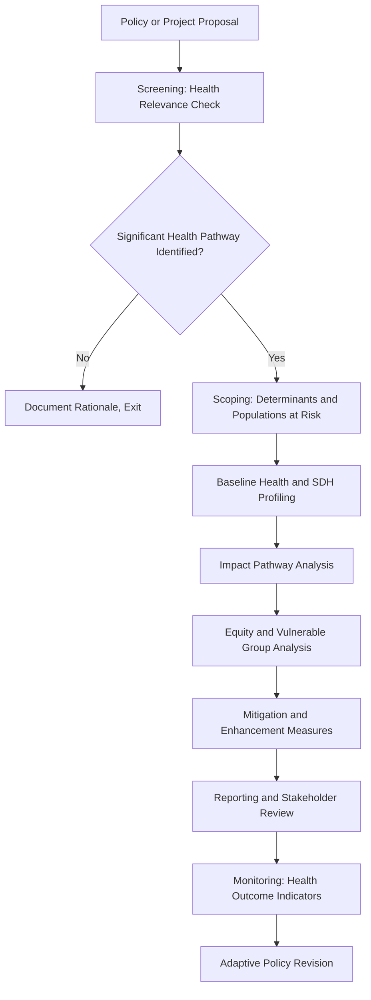

## Public health and policy planning contexts

### Overview

Public health and policy planning contexts refer to the application of Social Impact Assessment (SIA) methods to evaluate how health policies, public health interventions, and health-system infrastructure projects affect communities. This sector bridges Health Impact Assessment (HIA) and traditional SIA, focusing on how social determinants of health interact with policy decisions ranging from facility siting to national health financing reforms.

### Positioning HIA Within SIA

**Key Points**

- Health Impact Assessment (HIA) is a distinct but overlapping discipline; SIA practitioners working in public health contexts typically integrate HIA screening steps rather than replacing them.
- The WHO defines HIA as a combination of procedures, methods, and tools used to judge the potential effects of a policy, program, or project on the health of a population.
- Social determinants of health (SDH) — housing, income, education, employment, social exclusion — form the analytical bridge between SIA and HIA.

### Core Frameworks Referenced

1. **WHO Health Impact Assessment Guidance** — five-stage process: screening, scoping, appraisal, reporting, monitoring/evaluation.
2. **CDC Healthy People Social Determinants of Health Framework** — organizes determinants into five domains: economic stability, education, health/healthcare access, neighborhood/environment, social/community context.
3. **Ottawa Charter for Health Promotion** — foundational policy framework emphasizing "healthy public policy" as a determinant of health equity.
4. **Equity-focused HIA (EFHIA)** — extension of HIA explicitly disaggregating impacts by socioeconomic, racial, and gender lines.
5. **IFC Performance Standards (PS4: Community Health, Safety and Security)** — applied when private-sector projects (e.g., extractive industries) carry public health externalities.

### The Public Health SIA Process

### Screening: Determining Health Relevance

**Key Points**

- Screening tools (e.g., checklists) assess whether a policy/project is likely to have health-relevant pathways: environmental exposure, access to services, employment/income change, social cohesion disruption.
- A negative screening outcome does not exempt a project from later health monitoring; new information should trigger re-screening.

**Example**

A proposed municipal waste-transfer facility siting undergoes screening. Because it involves potential air quality and traffic-safety pathways affecting a nearby low-income residential area, it proceeds to full scoping rather than being exempted.

### Baseline Health and Social Determinants Profiling

**Key Points**

- Baseline data draws from vital statistics registries, health facility records, household health surveys, and community-reported health perceptions.
- SDH indicators typically profiled: poverty rate, unemployment, housing quality/overcrowding, food security, education attainment, access to primary care, insurance/health-financing coverage.
- Disaggregation by age, sex, disability, ethnicity, and income quintile is standard practice to reveal differential baseline vulnerability.

**Sample Baseline Indicator Set**

| Domain | Indicator | Data Source |
| --- | --- | --- |
| Economic stability | Household poverty rate | National statistics office |
| Healthcare access | Distance to nearest primary facility | GIS/facility mapping |
| Neighborhood/environment | Ambient air quality index | Environmental monitoring stations |
| Social/community context | Social cohesion/trust index | Household survey |
| Education | Health literacy rate | Household survey |

### Impact Pathway Analysis

Public health SIA models causal chains linking a policy/project to health outcomes, rather than asserting direct causation.

**Standard Pathway Categories**

- **Environmental pathway**: emissions, noise, water contamination → respiratory/other disease burden.
- **Economic pathway**: employment/income change → nutrition, housing quality, stress-related health outcomes.
- **Access pathway**: service closure/relocation → reduced healthcare utilization, delayed diagnosis.
- **Social pathway**: displacement/disruption of social networks → mental health and social isolation effects.
- **Behavioral pathway**: policy changes (e.g., alcohol/tobacco taxation) → consumption behavior change.

**[Inference]** The strength and directness of these pathways vary substantially by context and population; impact pathway diagrams should be treated as hypothesized causal models for stakeholder validation, not confirmed epidemiological findings, unless supported by dedicated epidemiological study.

### Impact Pathway Diagram (svg_diagram)

<svg xmlns="http://www.w3.org/2000/svg" viewBox="0 0 760 320">
<text x="380" y="26" text-anchor="middle" font-size="16" font-weight="bold" fill="#1a1a1a">Health Impact Pathway Model (svg_diagram)</text>
<rect x="20" y="60" width="140" height="50" rx="6" fill="#d1ecf1" stroke="#0c5460" />
<text x="90" y="90" text-anchor="middle" font-size="12" fill="#0c5460">Policy/Project</text>
<rect x="220" y="60" width="150" height="50" rx="6" fill="#d4edda" stroke="#155724" />
<text x="295" y="82" text-anchor="middle" font-size="11" fill="#155724">Social Determinant</text>
<text x="295" y="98" text-anchor="middle" font-size="11" fill="#155724">Change (e.g., income)</text>
<rect x="430" y="60" width="150" height="50" rx="6" fill="#fff3cd" stroke="#856404" />
<text x="505" y="82" text-anchor="middle" font-size="11" fill="#856404">Intermediate Outcome</text>
<text x="505" y="98" text-anchor="middle" font-size="11" fill="#856404">(e.g., housing quality)</text>
<rect x="640" y="60" width="110" height="50" rx="6" fill="#f8d7da" stroke="#721c24" />
<text x="695" y="90" text-anchor="middle" font-size="11" fill="#721c24">Health Outcome</text>
<line x1="160" y1="85" x2="215" y2="85" stroke="#333" stroke-width="2" marker-end="url(#arrow1)" />
<line x1="370" y1="85" x2="425" y2="85" stroke="#333" stroke-width="2" marker-end="url(#arrow1)" />
<line x1="580" y1="85" x2="635" y2="85" stroke="#333" stroke-width="2" marker-end="url(#arrow1)" />
<rect x="150" y="180" width="460" height="90" rx="6" fill="#f1f1f1" stroke="#666" stroke-dasharray="4,3" />
<text x="380" y="205" text-anchor="middle" font-size="12" font-weight="bold" fill="#333">Effect Modifiers (Equity Lens)</text>
<text x="380" y="228" text-anchor="middle" font-size="11" fill="#333">Income quintile · Disability status · Age · Ethnicity</text>
<text x="380" y="248" text-anchor="middle" font-size="11" fill="#333">Baseline health status · Access to care · Housing tenure</text>
<line x1="380" y1="180" x2="380" y2="115" stroke="#666" stroke-width="1.5" stroke-dasharray="3,2" />
</svg>

### Equity and Vulnerable Group Analysis

**Key Points**

- Equity-focused analysis disaggregates projected impacts by subgroup rather than reporting only population-average effects.
- Common vulnerable groups in health policy SIA: low-income households, older adults, children, people with disabilities, pregnant women, ethnic/linguistic minorities, and populations with pre-existing chronic conditions.
- Distributional analysis should identify whether a policy narrows or widens existing health inequities — a policy can be net-beneficial at the population level while worsening relative inequity.

**Example**

A national tobacco excise tax increase is projected to reduce aggregate smoking prevalence. Equity analysis reveals the tax burden falls disproportionately on lower-income smokers who are more price-sensitive but also more likely to face nicotine dependence without cessation support — prompting policymakers to pair the tax with subsidized cessation programs.

### Mitigation and Enhancement Measures

| Impact Type | Mitigation Approach |
| --- | --- |
| Reduced healthcare access due to facility relocation | Mobile health units, transport subsidies during transition |
| Air quality degradation from industrial siting | Buffer zones, emissions controls, community air monitoring |
| Income shock from policy-driven job loss | Transitional livelihood support, retraining programs |
| Increased health service demand from population influx | Phased health workforce scaling, facility capacity expansion |
| Mental health impacts from community disruption | Community-based psychosocial support integration |

### Monitoring and Evaluation Indicators

**Key Points**

- Monitoring should track both **process indicators** (e.g., service coverage rates) and **outcome indicators** (e.g., morbidity/mortality trends), since outcome changes often lag policy implementation by months or years.
- Indicator selection should align with existing national health information systems (HIS) to avoid parallel data collection burdens.

**Sample Monitoring Indicator Set**

| Indicator Type | Example |
| --- | --- |
| Process | % of target population with facility access within recommended distance |
| Process | Health worker-to-population ratio |
| Outcome | Under-5 mortality rate |
| Outcome | Self-reported health status by income quintile |
| Equity | Gap in service utilization between highest and lowest income quintiles |

### Common Pitfalls (Documented in Practice)

- **Average-outcome masking**: Reporting only aggregate health benefit projections without equity disaggregation, obscuring subgroup harm.
- **Health system capacity blind spot**: Approving population-serving projects (e.g., new housing developments) without assessing whether existing health infrastructure can absorb increased demand.
- **Siloed data**: Treating health baseline data collection as separate from broader SIA socioeconomic baseline work, causing duplicated effort and inconsistent population estimates.
- **Static baseline assumption**: Failing to re-baseline health indicators when project timelines extend significantly beyond original assessment.
- **Underweighting mental health**: Historically narrower HIA practice has focused on physical/environmental health pathways, underrepresenting mental health and social cohesion effects; more recent guidance explicitly broadens scope to include these.

### Worked Example: End-to-End Scenario

A national government proposes decentralizing primary healthcare financing to regional authorities.

1. **Screening** confirms significant health relevance due to potential service-access variation across regions.
2. **Scoping** identifies rural and low-income urban populations as most exposed to access-pathway risk.
3. **Baseline profiling** documents current facility-to-population ratios and out-of-pocket health spending by region.
4. **Impact pathway analysis** models how financing decentralization could differentially affect facility funding stability in poorer regions.
5. **Equity analysis** flags that regions with weaker local tax bases may see reduced service quality relative to wealthier regions.
6. **Mitigation** proposes a national equalization fund to offset regional financing disparities.
7. **Monitoring** tracks regional out-of-pocket spending and facility funding levels annually post-implementation.

### Related Topics

- Health Impact Assessment (HIA) five-stage methodology in depth
- Social determinants of health data integration with SIA baselines
- Equity-focused HIA (EFHIA) distributional analysis techniques
- Environmental health impact pathways (air/water quality to disease burden)
- Health system capacity assessment for population-serving infrastructure
- Mental health and psychosocial impact integration in health policy SIA
- IFC Performance Standard 4 (Community Health, Safety and Security) application