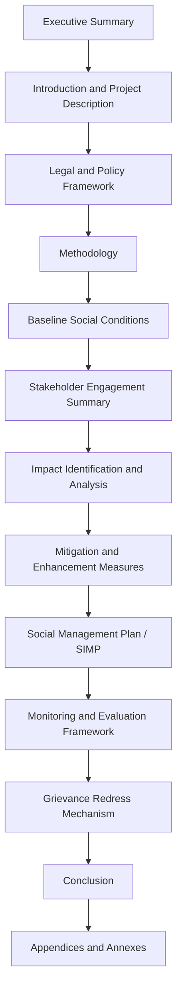

## Structuring a social impact assessment report

### Overview

Structuring a Social Impact Assessment (SIA) report concerns how findings, methods, and recommendations from the SIA process are organized into a formal document for decision-makers, affected communities, regulators, and financiers. A well-structured report ensures traceability from baseline data through impact analysis to mitigation commitments, and supports independent verification by third parties (lenders, regulators, auditors).

### Core Frameworks Referenced

1. **IAIA (International Association for Impact Assessment) SIA Guidance Documents** — recommend a logical flow from context to consequences to management.
2. **IFC Performance Standards Disclosure Requirements** — specify minimum content for Environmental and Social Impact Assessment (ESIA) reports, of which SIA is typically a component or standalone chapter.
3. **Equator Principles** — require disclosure structures compatible with independent review by financial institutions.
4. **National EIA/SIA regulatory templates** — many jurisdictions (e.g., under NEPA in the US, or national environmental acts elsewhere) mandate specific report sections by statute.

### Standard Report Structure

### Section-by-Section Content Requirements

#### Executive Summary

**Key Points**

- Written last but placed first; must be readable as a standalone document by non-specialist decision-makers.
- Summarizes project scope, key impacts (positive and negative), significant risks, and headline mitigation commitments.
- Typically capped at 2–4 pages regardless of overall report length.

#### Introduction and Project Description

**Key Points**

- States the project/policy proponent, objectives, geographic scope, and timeline.
- Describes project components with sufficient technical detail for a reader to understand pathways to social impact (e.g., land take, workforce size, construction phasing).
- Clarifies the report's regulatory purpose (e.g., submission for national permitting, lender due diligence, voluntary disclosure).

#### Legal and Policy Framework

**Key Points**

- Cites applicable national laws, international standards (IFC PS, Equator Principles, UN Guiding Principles on Business and Human Rights), and any binding lender covenants.
- Identifies gaps between national law and international standards where the higher standard should apply — a common requirement in IFC-financed projects.

#### Methodology

**Key Points**

- Documents data collection methods (surveys, focus groups, key informant interviews, secondary data review), sampling approach, and analytical frameworks used.
- States limitations transparently — data gaps, access constraints, seasonal timing effects on baseline data.
- Should be detailed enough for an independent reviewer to assess methodological rigor without needing to contact the original assessment team.

**[Inference]** Regulatory reviewers and lenders often scrutinize the methodology section most closely when validating report credibility; incomplete limitation disclosure is a commonly cited driver of report rejection or requests for supplementary work, though this varies by jurisdiction and reviewing institution.

#### Baseline Social Conditions

**Key Points**

- Presents demographic profile, livelihoods, land use/tenure, vulnerable groups, cultural heritage, and social infrastructure (schools, health facilities, water access) as they exist prior to project implementation.
- Should establish a clear baseline date/cut-off to enable before-after impact comparison.
- Disaggregation by sex, age, ethnicity, and vulnerability status is standard practice.

#### Stakeholder Engagement Summary

**Key Points**

- Documents engagement activities conducted (consultation meetings, surveys, grievance intake), participant demographics, and how input was incorporated into project design or mitigation measures.
- Should include a stakeholder analysis/mapping table distinguishing affected communities, vulnerable groups, and other interested parties.

**Sample Stakeholder Engagement Log Format**

| Date | Method | Location | Participants (n, disaggregated) | Key Issues Raised | Response/Action |
| --- | --- | --- | --- | --- | --- |
| Example row | Focus group | Community hall | 24 (14F/10M) | Concern over land compensation timeline | Compensation schedule clarified in RAP |

#### Impact Identification and Analysis

**Key Points**

- Organizes impacts by category (demographic, economic/livelihood, cultural, health, infrastructure/services, land/resettlement) and by phase (pre-construction, construction, operation, decommissioning).
- Each impact should be characterized by: nature (direct/indirect/cumulative), magnitude, duration, reversibility, likelihood, and significance rating.
- Distinguishes positive impacts (e.g., local employment) from negative impacts; avoids conflating the two to present a net-neutral picture without granularity.

**Sample Impact Significance Matrix**

| Impact | Magnitude | Likelihood | Duration | Significance |
| --- | --- | --- | --- | --- |
| Loss of agricultural land | High | High | Long-term | Major |
| Temporary construction noise | Low | High | Short-term | Minor |
| Local employment generation | Moderate | High | Medium-term | Moderate (positive) |

#### Mitigation and Enhancement Measures

**Key Points**

- Follows the mitigation hierarchy: avoid, minimize, restore/compensate, offset — applied in that priority order.
- Each measure should be linked explicitly to the impact it addresses, with a responsible party and implementation timeline.
- Enhancement measures for positive impacts (e.g., local content/procurement strategies) are distinguished from mitigation for negative impacts.

#### Social Management Plan (SIMP) / Resettlement Action Plan (where applicable)

**Key Points**

- Translates mitigation commitments into an actionable implementation plan with budget, schedule, and institutional responsibility.
- Where involuntary resettlement is triggered, this section (or a linked standalone RAP) details entitlement matrices, compensation mechanisms, and livelihood restoration strategy.

#### Monitoring and Evaluation Framework

**Key Points**

- Specifies indicators, data sources, monitoring frequency, and reporting lines for tracking both mitigation implementation and actual impact outcomes over time.
- Should distinguish compliance monitoring (are commitments being implemented) from outcome monitoring (are impacts materializing as predicted).

#### Grievance Redress Mechanism (GRM)

**Key Points**

- Describes intake channels, resolution timelines, escalation procedures, and confidentiality/anti-retaliation safeguards.
- Should be presented as accessible to all affected stakeholders regardless of literacy, language, or technology access.

#### Conclusion

**Key Points**

- Synthesizes overall social risk profile and confirms whether residual impacts (after mitigation) are considered acceptable per applicable standards.
- Does not introduce new findings not previously presented in the body of the report.

#### Appendices and Annexes

**Common Contents**

- Raw survey instruments and consent forms.
- Full stakeholder engagement logs.
- Detailed entitlement matrices and compensation schedules.
- Technical baseline data tables.
- Terms of reference for the assessment team.

### Report Structure Diagram (svg_diagram)

<svg xmlns="http://www.w3.org/2000/svg" viewBox="0 0 700 400">
<text x="350" y="26" text-anchor="middle" font-size="16" font-weight="bold" fill="#1a1a1a">SIA Report Document Architecture (svg_diagram)</text>
<rect x="40" y="50" width="620" height="40" rx="4" fill="#cce5ff" stroke="#004085" />
<text x="350" y="75" text-anchor="middle" font-size="12" fill="#004085">Executive Summary (standalone-readable)</text>
<rect x="40" y="100" width="300" height="40" rx="4" fill="#d4edda" stroke="#155724" />
<text x="190" y="125" text-anchor="middle" font-size="11" fill="#155724">Introduction / Legal Framework</text>
<rect x="360" y="100" width="300" height="40" rx="4" fill="#d4edda" stroke="#155724" />
<text x="510" y="125" text-anchor="middle" font-size="11" fill="#155724">Methodology</text>
<rect x="40" y="150" width="620" height="40" rx="4" fill="#fff3cd" stroke="#856404" />
<text x="350" y="175" text-anchor="middle" font-size="12" fill="#856404">Baseline Social Conditions + Stakeholder Engagement</text>
<rect x="40" y="200" width="620" height="40" rx="4" fill="#f8d7da" stroke="#721c24" />
<text x="350" y="225" text-anchor="middle" font-size="12" fill="#721c24">Impact Identification and Significance Analysis</text>
<rect x="40" y="250" width="300" height="40" rx="4" fill="#e2d9f3" stroke="#4b3579" />
<text x="190" y="275" text-anchor="middle" font-size="11" fill="#4b3579">Mitigation / Enhancement</text>
<rect x="360" y="250" width="300" height="40" rx="4" fill="#e2d9f3" stroke="#4b3579" />
<text x="510" y="275" text-anchor="middle" font-size="11" fill="#4b3579">Social Management Plan</text>
<rect x="40" y="300" width="300" height="40" rx="4" fill="#d1ecf1" stroke="#0c5460" />
<text x="190" y="325" text-anchor="middle" font-size="11" fill="#0c5460">Monitoring &amp; Evaluation</text>
<rect x="360" y="300" width="300" height="40" rx="4" fill="#d1ecf1" stroke="#0c5460" />
<text x="510" y="325" text-anchor="middle" font-size="11" fill="#0c5460">Grievance Redress Mechanism</text>
<rect x="40" y="350" width="620" height="35" rx="4" fill="#e9ecef" stroke="#495057" />
<text x="350" y="372" text-anchor="middle" font-size="12" fill="#495057">Conclusion + Appendices/Annexes</text>
</svg>

### Formatting and Presentation Standards

**Key Points**

- Use consistent terminology throughout (e.g., do not alternate between "affected persons" and "beneficiaries" without definitional clarity).
- Tables and maps should be numbered and cross-referenced in text, not left to stand alone without narrative interpretation.
- Technical jargon should be defined in a glossary; reports intended for public disclosure should include a plain-language summary in locally relevant languages.
- Version control (draft, revised draft, final) should be clearly marked, especially where reports undergo iterative stakeholder or regulator review cycles.

### Common Pitfalls (Documented in Practice)

- **Impact-mitigation disconnection**: Presenting impacts and mitigation measures in separate sections without explicit cross-referencing, making it difficult for reviewers to verify coverage.
- **Executive summary overreach**: Including conclusions or figures in the executive summary that are not substantiated in the report body.
- **Baseline vagueness**: Failing to specify baseline data collection dates, undermining later before-after impact verification.
- **Appendix dumping**: Relegating critical methodological details (e.g., sampling strategy) to appendices when they should be in the main body for reviewer accessibility.
- **Static reporting**: Treating the SIA report as a one-time deliverable rather than a living document updated as monitoring data and project conditions evolve.

### Next Steps

- Study IFC's Environmental and Social Review Procedures (ESRP) disclosure checklist for lender-facing reports.
- Practice drafting an impact significance rating methodology tailored to a specific sector.
- Review sample entitlement matrices used in resettlement action plans.
- Examine plain-language summary techniques for public disclosure documents.
- Explore version-control and document management practices for iterative SIA reporting cycles.