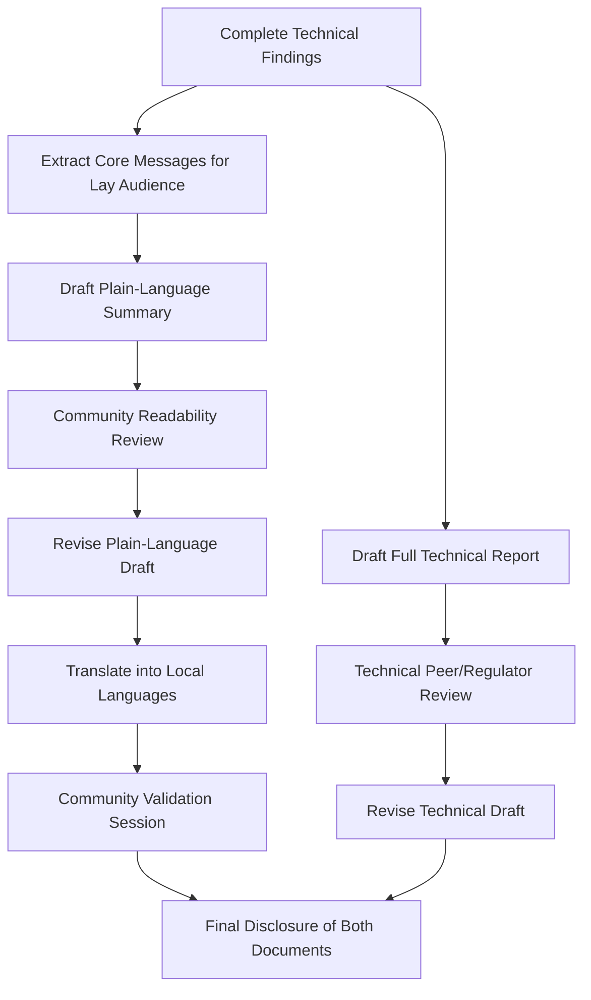

## Writing for technical and lay audiences

### Overview

Writing for technical and lay audiences addresses how Social Impact Assessment (SIA) practitioners adapt the same underlying findings into distinct communication products for different readerships: regulators and technical reviewers who require methodological rigor and precision, and affected communities and general public audiences who require clarity, accessibility, and cultural/linguistic relevance. Failure to bridge this gap is a frequently cited cause of disclosure non-compliance and community distrust.

### Why Dual-Audience Writing Is a Distinct Competency

**Key Points**

- Technical and lay documents are not simply "long version" and "short version" of the same text — they differ in structure, vocabulary, evidentiary framing, and purpose.
- Many disclosure frameworks (IFC Performance Standards, Equator Principles, national EIA regulations) explicitly require a plain-language summary as a distinct, mandatory deliverable, not an optional courtesy.
- Poorly translated technical content can create legal and reputational risk: a plain-language summary that omits material caveats present in the technical report may be seen as misleading disclosure.

### Core Frameworks Referenced

1. **Plain Language Guidelines (e.g., US Plain Writing Act principles, adapted internationally)** — favor short sentences, active voice, common vocabulary, and direct address ("you," "your community").
2. **IAIA Public Participation Guidance** — recommends information be provided in a form and language understandable to the affected public.
3. **IFC Stakeholder Engagement Good Practice Handbook** — specifies that disclosed information should be accessible, considering literacy levels, language, and cultural context.
4. **Health Literacy / Universal Design for Communication principles** — borrowed from public health communication, applied to community-facing SIA materials.

### Comparative Audience Requirements

| Dimension | Technical Report | Lay/Community Summary |
| --- | --- | --- |
| Primary purpose | Methodological verification, regulatory compliance | Informed understanding, meaningful participation |
| Vocabulary | Domain-specific terminology, defined once and used consistently | Common words, local terms where possible, minimal jargon |
| Sentence structure | Complex, qualified statements | Short, direct sentences |
| Evidentiary framing | Explicit uncertainty language, statistical qualifiers | Plain statements of what is known/unknown, avoiding false certainty |
| Visuals | Data tables, technical maps, statistical charts | Simplified graphics, icons, infographics |
| Length | Comprehensive, often 50–200+ pages | Typically 2–8 pages |
| Language | Often single working language (e.g., English) | Local/indigenous languages as appropriate |
| Distribution | Regulatory filing, lender data room | Community meetings, noticeboards, radio, local media |

### The Dual-Track Drafting Process

### Drafting Principles for Technical Audiences

**Key Points**

- State findings with appropriate epistemic precision: distinguish "measured," "estimated," "projected," and "inferred" explicitly.
- Use consistent defined terminology throughout; avoid synonyms for the same technical concept across sections.
- Support claims with citations to data sources, methodology sections, or appendix references.
- Present uncertainty and limitations transparently rather than smoothing over data gaps — reviewers and regulators specifically look for this.

**Example**

Technical: "Household income data (n=412, stratified random sample, 95% CI ±4.2%) indicate a projected 12% reduction in mean agricultural income during the two-year construction phase, attributable primarily to temporary land access restrictions."

### Drafting Principles for Lay Audiences

**Key Points**

- Lead with what matters most to the reader's daily life, not with methodology.
- Use concrete, relatable framing rather than statistical abstraction — but without omitting material uncertainty.
- Avoid passive voice and nominalizations (e.g., "mitigation implementation" → "how we will fix this").
- Use analogies, familiar units, and local reference points (e.g., "an area about the size of X local landmark" rather than raw hectares).
- Visual hierarchy matters as much as text: headings, icons, and short paragraphs support skimming and low-literacy accessibility.

**Example**

Lay equivalent: "During construction, some farming families may earn less for about two years because they'll have less access to their land. We estimate this could reduce farm income by around one-tenting for affected households. Here's what support will be available to help during that time..."

**[Inference]** Framing quantitative uncertainty in lay language (e.g., "could reduce," "around") without fully dropping the substance of statistical caveats is generally considered better practice than either omitting uncertainty entirely or reproducing full confidence-interval notation, though optimal phrasing is context- and audience-dependent.

### Translating Technical Concepts: Worked Examples

| Technical Phrase | Lay Equivalent |
| --- | --- |
| "Cumulative significant adverse impact" | "Added together with other nearby projects, this could cause a serious problem" |
| "Involuntary physical and economic displacement" | "Some people may need to move, and some may lose land they use for farming or work" |
| "Residual impact post-mitigation" | "Even after we take steps to reduce harm, some effects will likely remain" |
| "Grievance redress mechanism" | "A way for you to raise concerns or complaints and get a response" |
| "Stakeholder engagement process" | "How we talk with and listen to the community" |

### Readability and Accessibility Techniques

**Key Points**

- Readability formulas (e.g., Flesch-Kincaid) can flag overly complex sentence structures, though they should supplement, not replace, direct community feedback on comprehension.
- Visual literacy aids: icons for key concepts (compensation, timeline, contact information), color-coding for impact severity, simple maps rather than technical GIS outputs.
- Multi-modal delivery: printed summaries, community radio broadcasts, verbal presentations at meetings, and audio/video formats for low-literacy audiences.
- Back-translation (translating the local-language version back into the original language by an independent translator) helps verify that meaning was preserved.

### Consistency and Accuracy Safeguards

**Key Points**

- A traceability check should confirm every material claim in the plain-language summary is supported by, and not contradicted by, content in the full technical report.
- Material risks or negative findings should not be omitted from lay summaries even when they are less favorable — selective simplification that removes only unfavorable content undermines both credibility and regulatory compliance.
- Both documents should be version-controlled together so that updates to the technical report trigger review of the corresponding summary.

### Community Validation of Plain-Language Materials

**Key Points**

- Draft plain-language summaries should ideally be tested with a sample of the intended audience before final disclosure, checking comprehension of key messages (not just readability metrics).
- Feedback loops during validation sessions can reveal culturally specific misunderstandings (e.g., a term that translates literally but carries unintended local connotations).

**Example**

A draft summary uses the term "resettlement" which, in local translation, carries connotations associated with a prior forced eviction in the region. Community validation surfaces this concern, prompting the team to use an alternative phrase emphasizing voluntary relocation support instead.

### Dual-Audience Communication Architecture (svg_diagram)

<svg xmlns="http://www.w3.org/2000/svg" viewBox="0 0 720 300">
<text x="360" y="26" text-anchor="middle" font-size="16" font-weight="bold" fill="#1a1a1a">Shared Findings, Dual Communication Tracks (svg_diagram)</text>
<rect x="270" y="50" width="180" height="45" rx="6" fill="#e2d9f3" stroke="#4b3579" />
<text x="360" y="78" text-anchor="middle" font-size="12" fill="#4b3579">Verified SIA Findings</text>
<line x1="360" y1="95" x2="180" y2="140" stroke="#333" stroke-width="2" marker-end="url(#arrowD)" />
<line x1="360" y1="95" x2="540" y2="140" stroke="#333" stroke-width="2" marker-end="url(#arrowD)" />
<rect x="60" y="145" width="240" height="60" rx="6" fill="#cce5ff" stroke="#004085" />
<text x="180" y="170" text-anchor="middle" font-size="12" fill="#004085">Technical Report</text>
<text x="180" y="188" text-anchor="middle" font-size="10" fill="#004085">Regulators · Lenders · Reviewers</text>
<rect x="420" y="145" width="240" height="60" rx="6" fill="#d4edda" stroke="#155724" />
<text x="540" y="170" text-anchor="middle" font-size="12" fill="#155724">Plain-Language Summary</text>
<text x="540" y="188" text-anchor="middle" font-size="10" fill="#155724">Community · Local Media · Public</text>
<rect x="140" y="230" width="440" height="45" rx="6" fill="#fff3cd" stroke="#856404" />
<text x="360" y="257" text-anchor="middle" font-size="11" fill="#856404">Traceability Check: same facts, no contradictions, no omitted risks</text>
</svg>

### Common Pitfalls (Documented in Practice)

- **False reassurance**: Simplifying language in a way that inadvertently minimizes or omits genuine risks or uncertainties present in the technical findings.
- **Jargon leakage**: Reusing technical terms in lay summaries without definition, assuming familiarity that the audience does not have.
- **One-language assumption**: Producing plain-language materials only in the dominant national language when affected communities primarily use local or minority languages.
- **Static translation**: Treating translation as a one-time task rather than updating translated materials when the technical report is revised.
- **Metric-only lay summaries**: Presenting statistics in lay summaries without narrative interpretation, leaving readers unable to judge significance (e.g., stating "12% reduction" without context on what that means for a household).

### Next Steps

- Practice converting technical impact-significance tables into narrative plain-language explanations.
- Review sample plain-language summaries from IFC-financed project disclosures for structural benchmarks.
- Study back-translation methodology for verifying multilingual accuracy.
- Explore readability assessment tools and their appropriate role alongside direct community testing.
- Examine multi-modal (audio/visual) disclosure formats for low-literacy contexts.