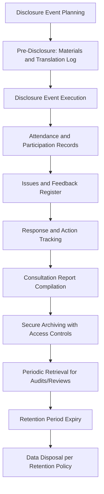

## Public disclosure and consultation record-keeping

### Overview

Public disclosure and consultation record-keeping concerns the systematic documentation of how information was shared with stakeholders and how stakeholder input was collected, tracked, and incorporated throughout the Social Impact Assessment (SIA) process. These records serve as the evidentiary backbone for demonstrating regulatory compliance, defending against future disputes, and enabling continuity when project teams change over multi-year implementation periods.

### Why Record-Keeping Is a Distinct Technical Discipline

**Key Points**

- Consultation records are not incidental meeting notes; they function as legal and audit evidence, particularly under lender frameworks (IFC, Equator Principles) and in contexts subject to litigation or independent accountability mechanism complaints (e.g., World Bank Inspection Panel, IFC Compliance Advisor Ombudsman).
- Inadequate record-keeping is one of the most common findings in independent accountability mechanism investigations, where the absence of documented consultation is treated as equivalent to consultation not having occurred.
- Records must balance completeness with participant privacy and, in sensitive contexts, personal safety.

### Core Frameworks Referenced

1. **IFC Performance Standard 1** — requires disclosure of information and documented, culturally appropriate consultation, with records maintained throughout the project cycle.
2. **Equator Principles** — require evidence of Free, Prior, and Informed Consent (FPIC) processes and stakeholder engagement documentation for higher-risk projects.
3. **World Bank Environmental and Social Framework (ESS10)** — Stakeholder Engagement and Information Disclosure, mandates a Stakeholder Engagement Plan (SEP) with documented implementation.
4. **Aarhus Convention principles** (where applicable) — access to information, public participation, and access to justice in environmental matters.
5. **Data protection regulations** (e.g., GDPR-equivalent national laws) — govern how personal data collected during consultation must be stored, secured, and eventually disposed of.

### The Record-Keeping Lifecycle

### Categories of Records to Maintain

| Record Type | Purpose | Typical Content |
| --- | --- | --- |
| Disclosure log | Evidence that information was shared | Date, materials disclosed, format, language, distribution channel, recipient list/locations |
| Attendance records | Evidence of who participated | Names or anonymized IDs, sex/age disaggregation, affiliation, signature or consent to record |
| Meeting minutes | Substantive record of proceedings | Agenda, key discussion points, questions raised, decisions/commitments made |
| Issues and feedback register | Tracks stakeholder input over time | Issue description, date raised, stakeholder category, status, resolution |
| Grievance log | Tracks formal complaints distinct from general feedback | Grievance ID, date, nature, resolution timeline, outcome |
| Photographic/audio-visual record | Supplementary evidence of events | Dated, captioned, consent-compliant media |
| Correspondence records | Formal written exchanges | Letters, emails, official notices to/from authorities and communities |

### Sample Stakeholder Engagement Log Structure

| Log ID | Date | Method | Location | Participants (n, disaggregated) | Language Used | Materials Disclosed | Key Issues Raised | Response/Action | Status |
| --- | --- | --- | --- | --- | --- | --- | --- | --- | --- |
| SEL-001 | Example | Public meeting | Community hall | 45 (28F/17M) | Local language + translation | Draft SIA summary | Concern over compensation timeline | Compensation schedule clarified | Closed |
| SEL-002 | Example | Door-to-door survey | Affected village | 60 households | Local language | Household survey form | Water access concerns | Referred to infrastructure team | Open |

### Consent and Privacy in Record-Keeping

**Key Points**

- Participants should be informed of how their data (names, statements, photos) will be used, stored, and potentially disclosed to regulators or the public, and consent should be documented, not assumed.
- In conflict-sensitive or politically sensitive contexts, personal identifiers may need to be anonymized or aggregated in publicly disclosed versions of records, while fuller detail is retained securely for internal/regulatory use only.
- Special care is required for records involving vulnerable individuals (e.g., survivors of gender-based violence disclosed during consultation) — such information should generally be excluded from general consultation records entirely and handled through separate, specialized safeguarding protocols.

**[Inference]** The appropriate level of anonymization varies significantly by context and risk profile; a blanket approach is less effective than a documented, context-specific risk assessment determining what can be safely disclosed versus what must be restricted.

### Disclosure Documentation Requirements

**Key Points**

- Each disclosure event should record: what was disclosed, in what language(s) and format(s), to whom, when, and through what channel (in-person, print, radio, online).
- Where translation was used, records should note the translator/interpreter and, where feasible, retain a copy of translated materials for later verification.
- Digital disclosure (websites, social media) should be archived with timestamps, since online content can be altered or removed after the fact.

### Feedback and Action Tracking

**Key Points**

- Every substantive issue raised during consultation should be logged with a unique identifier and tracked to resolution or documented non-action rationale.
- A closed-loop system — where stakeholders are informed of how their input was addressed — is considered good practice and should itself be documented (e.g., "feedback incorporated into RAP Section 4.2" or "not incorporated because X").
- Aggregated reporting on feedback themes (e.g., "35% of raised issues concerned compensation timing") supports both internal management and external disclosure reporting.

### Record-Keeping System Architecture (svg_diagram)

<svg xmlns="http://www.w3.org/2000/svg" viewBox="0 0 740 340">
<text x="370" y="26" text-anchor="middle" font-size="16" font-weight="bold" fill="#1a1a1a">Consultation Record-Keeping Architecture (svg_diagram)</text>
<rect x="30" y="55" width="200" height="50" rx="6" fill="#cce5ff" stroke="#004085" />
<text x="130" y="85" text-anchor="middle" font-size="11" fill="#004085">Disclosure Logs</text>
<rect x="270" y="55" width="200" height="50" rx="6" fill="#d4edda" stroke="#155724" />
<text x="370" y="80" text-anchor="middle" font-size="11" fill="#155724">Attendance &amp;</text>
<text x="370" y="95" text-anchor="middle" font-size="11" fill="#155724">Meeting Minutes</text>
<rect x="510" y="55" width="200" height="50" rx="6" fill="#fff3cd" stroke="#856404" />
<text x="610" y="80" text-anchor="middle" font-size="11" fill="#856404">Issues &amp; Grievance</text>
<text x="610" y="95" text-anchor="middle" font-size="11" fill="#856404">Registers</text>
<line x1="130" y1="105" x2="330" y2="150" stroke="#333" stroke-width="1.5" />
<line x1="370" y1="105" x2="370" y2="150" stroke="#333" stroke-width="1.5" />
<line x1="610" y1="105" x2="410" y2="150" stroke="#333" stroke-width="1.5" />
<rect x="220" y="150" width="300" height="55" rx="6" fill="#e2d9f3" stroke="#4b3579" />
<text x="370" y="172" text-anchor="middle" font-size="12" fill="#4b3579">Central Consultation Database</text>
<text x="370" y="190" text-anchor="middle" font-size="10" fill="#4b3579">Access-controlled, version-tracked</text>
<line x1="370" y1="205" x2="370" y2="240" stroke="#333" stroke-width="1.5" marker-end="url(#arrowR)" />
<rect x="90" y="245" width="180" height="50" rx="6" fill="#f8d7da" stroke="#721c24" />
<text x="180" y="272" text-anchor="middle" font-size="10" fill="#721c24">Public Disclosure Version</text>
<rect x="290" y="245" width="180" height="50" rx="6" fill="#d1ecf1" stroke="#0c5460" />
<text x="380" y="266" text-anchor="middle" font-size="10" fill="#0c5460">Regulator/Lender</text>
<text x="380" y="280" text-anchor="middle" font-size="10" fill="#0c5460">Audit Version</text>
<rect x="490" y="245" width="180" height="50" rx="6" fill="#e9ecef" stroke="#495057" />
<text x="580" y="266" text-anchor="middle" font-size="10" fill="#495057">Restricted Internal</text>
<text x="580" y="280" text-anchor="middle" font-size="10" fill="#495057">Sensitive Data Archive</text>
</svg>

### Retention and Archiving Practices

**Key Points**

- Retention periods should align with applicable legal requirements and lender covenants (which may extend beyond project completion, e.g., retention for the life of a loan plus a defined period afterward).
- Records should be stored redundantly (physical and digital where feasible), especially in contexts prone to disaster or institutional instability where single points of failure risk permanent loss.
- Access control tiers should be defined: public-facing disclosure records, restricted regulator/lender-access records, and confidential internal records containing sensitive personal data.
- Chain-of-custody documentation matters for records that may later be used as evidence in grievance escalation or accountability mechanism proceedings.

### Common Pitfalls (Documented in Practice)

- **Undocumented verbal commitments**: Making commitments during consultation meetings that are not recorded in writing, leading to later disputes over what was promised.
- **Attendance-only records**: Logging who attended without capturing substantive content of what was discussed or decided.
- **Orphaned feedback**: Recording issues raised without linking them to a tracked resolution status, making it impossible to demonstrate responsiveness later.
- **Single-custodian risk**: Storing records with only one individual or on a single unbacked device, creating institutional memory loss when staff turn over.
- **Retroactive record creation**: Reconstructing consultation records after the fact, close to a reporting deadline, rather than maintaining them contemporaneously — a practice that is difficult to defend under audit scrutiny.
- **Inconsistent identifiers**: Failing to use consistent unique IDs across disclosure logs, feedback registers, and grievance logs, making cross-referencing and audit trail reconstruction difficult.

### Worked Example: End-to-End Scenario

A infrastructure project conducts a series of community disclosure meetings ahead of construction.

1. Each meeting is assigned a unique log ID and recorded in a central disclosure log (date, location, materials, language).
2. Attendance is recorded with sex/age disaggregation and consent for photographic documentation.
3. All questions and concerns raised are entered into an issues register with individual tracking IDs.
4. A formal complaint about compensation calculation is separately logged in the grievance register with its own escalation timeline, distinct from general feedback.
5. Monthly, the project team compiles a consultation report cross-referencing disclosure logs, issues register status, and grievance resolution rates for internal management review.
6. At the project's environmental and social audit, the full record set is retrieved to demonstrate continuous, documented engagement compliant with lender requirements.

### Next Steps

- Design a standardized stakeholder engagement log template with consistent ID conventions across all logs.
- Study data protection and anonymization protocols applicable to the project's jurisdiction.
- Review sample Stakeholder Engagement Plans (SEP) under World Bank ESS10 for record-keeping requirement benchmarks.
- Examine chain-of-custody documentation standards used in accountability mechanism proceedings.
- Explore digital record management systems suited to multi-year, multi-site consultation programs.